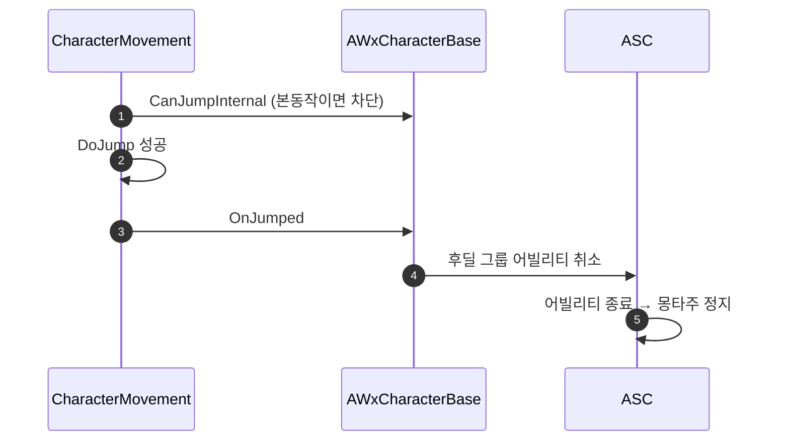

# 점프 발동 시 액션 어빌리티 캔슬

## 계획

### 목표
액션의 후딜(캔슬 가능 구간)에서 점프하면 점프는 나가지만 그 액션의 몽타주가 계속 돌아 점프 애니와 겹친다. 점프가 실제로 성립하는 순간 후딜에 든 어빌리티를 끊는다.

### 수정 범위
| 파일 | 수정할 내용 | 구분 |
|---|---|---|
| `Source/WxGame/Character/WxCharacterBase.h` | `OnJumped_Implementation` 오버라이드 선언 | 수정 |
| `Source/WxGame/Character/WxCharacterBase.cpp` | `Super` 호출 후 `Exclusive_Replaceable` 그룹 취소 | 수정 |

### 접근 방식
- **훅은 `OnJumped`**: 입력 시점은 아직 점프 성립 여부를 모른다(앉음·점프 카운트·`CanJump` 거부로 무산될 수 있다). 엔진은 실제 점프가 성공한 뒤에만 이 훅을 부르므로 "점프 발동 시"에 정확히 대응한다.
- **취소 대상은 후딜 그룹 하나**: 배타 어빌리티가 발동할 때 하는 배선을 점프에도 그대로 적용하되, 점프는 본동작을 빼앗지 않으므로 후딜만 끊는다. 본동작·반응형은 애초에 `CanJumpInternal`이 점프를 막고, 스프린트·락온 같은 독립 어빌리티는 몽타주가 없어 끊을 이유가 없다.
- **몽타주 정지는 엔진에 맡긴다**: 어빌리티가 취소되면 엔진 종료 경로가 소유 몽타주를 멈추므로 여기서 따로 건드리지 않는다.

---

## 완료

### 수정한 파일
| 파일 | 수정한 내용 | 구분 |
|---|---|---|
| `Source/WxGame/Character/WxCharacterBase.h` | `OnJumped_Implementation` 오버라이드 선언 | 수정 |
| `Source/WxGame/Character/WxCharacterBase.cpp` | 점프 성립 시 후딜 그룹 어빌리티 취소 | 수정 |

### 구현·결정과 그 이유
- **훅을 점프 성립 시점에 둔 이유**: 입력 시점에는 앉음·점프 카운트·점프 허용 판정으로 점프가 무산될 수 있어, 실제로 뛰지 않았는데 액션만 끊길 수 있다.
- **후딜 그룹만 끊은 이유**: 본동작과 반응형은 점프 허용 판정이 점프 자체를 막으므로 이 시점에 남아 있을 배타 어빌리티는 후딜뿐이고, 독립 어빌리티(스프린트·락온)는 몽타주가 없어 끊을 대상이 아니다.
- **몽타주를 직접 멈추지 않은 이유**: 취소된 어빌리티의 종료 경로가 소유 몽타주를 함께 멈춘다.
- **선언 위치**: 직접 베이스가 public에 둔 가상 함수라 접근 지정자를 그대로 따랐다.

### 계획 대비 달라진 점
- 계획대로

### 후속 과제
- PIE 실동작 확인(후딜 중 점프로 몽타주가 끊기는지, 본동작 중 점프가 여전히 막히는지) 미수행 — 컴파일까지만 검증했다.
