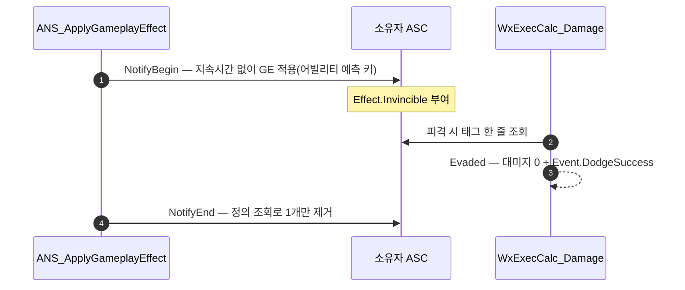

# 무적 구간을 노티파이 수명 소유 방식으로 전환

## 계획

### 목표
무적·퍼펙트가드 구간의 수명을 GE 지속시간이 아니라 애님 노티파이가 소유하게 바꾼다. 지금은 `NotifyBegin`이 구간 길이를 실시간 초로 환산해 스펙에 잠가 싣고 GE가 스스로 만료되는데, 애니메이션 시계와 GE 시계가 둘로 갈려 있어 컷신 무적은 이미 딜레이션 보정을 손으로 곱하고 있다. 시계를 하나로 합친다.

### 수정 범위
| 파일 | 수정할 내용 | 구분 |
|---|---|---|
| `WxCombat/.../AnimNotify/WxAnimNotifyState_ApplyGameplayEffect.h/.cpp` | `NotifyBegin`은 지속시간 없이 적용, `NotifyEnd` 추가해 제거. 플레이레이트 환산 삭제, 클래스 주석 교체 | 수정 |
| `WxCombat/.../Effect/WxEffect_PerfectGuard.cpp` | `HasDuration` → `Infinite` | 수정 |
| `WxCombat/Public/WxCombatLibrary.h`, `Private/WxCombatLibrary.cpp` | `ApplyEffectForDuration`을 지속시간 인자 없는 적용 함수로 교체, 짝이 되는 제거 함수 추가 | 수정 |
| `WxCombat/.../Task/WxAbilityTask_PlaySkillCutscene.h/.cpp` | 지속시간 산출·딜레이션 환산·`InvincibleHandle` 멤버 삭제, `OnDestroy`에서 정의 조회로 제거 | 수정 |

몽타주 에셋은 건드리지 않는다. 노티파이 클래스와 `EffectClass` 프로퍼티가 그대로라 트랙 배치가 보존된다.

### 접근 방식
- **수명을 노티파이가 소유한다**: 구간 시작에 지속시간 없는 GE를 걸고 구간 끝에서 걷어낸다. `TotalDuration`을 실시간으로 환산하던 블록이 통째로 사라지고, 애니메이션이 재타이밍되거나 재생 속도가 도중에 바뀌어도 구간이 타임라인을 그대로 따라간다.
- **예측 키는 유지한다**: `GC_Hit`가 대상의 `Effect.Invincible`을 보고 스스로 발행을 접는데, 회피하는 본인 화면에서 그 판단이 복제를 기다리면 무적으로 흘린 공격에 타격 연출이 새어 나온다. 몽타주를 돌리는 어빌리티의 활성화 예측 키를 실어 로컬에 그 프레임부터 태그가 있게 한다.
- **제거는 정의 조회 + 수량 1**: 예측으로 건 GE의 핸들은 서버본이 도착하면 무효해져 못 쓴다. 정의로 조회해 지우되 수량을 1로 잡아, 같은 GE를 건 다른 출처(처형의 `ActivationOwnedEffects`, 궁극기 컷신)를 남긴다. 2026-08-14에 Begin/End 짝을 기각한 근거가 "회피가 캔슬되며 늦게 도착한 `NotifyEnd`가 처형 무적을 벗긴다"였는데, 수량 제한이 그 경로를 막는다.
- **퍼펙트가드 GE를 `Infinite`로**: 지속시간을 스펙에서 덮어쓰지 않게 되므로 정의가 무한이어야 구간이 성립한다. 이 태그는 존재 여부로만 쓰여 다른 영향이 없다.

---

## 완료

### 수정한 파일
| 파일 | 수정한 내용 | 구분 |
|---|---|---|
| `WxCombat/.../AnimNotify/WxAnimNotifyState_ApplyGameplayEffect.h/.cpp` | `NotifyBegin`은 지속시간 없이 적용, `NotifyEnd` 추가해 제거. 플레이레이트 환산과 몽타주·애님인스턴스 의존 삭제, 클래스 주석 교체 | 수정 |
| `WxCombat/Public/WxCombatLibrary.h`, `Private/WxCombatLibrary.cpp` | `ApplyEffectForDuration` → `ApplyEffect`·`RemoveEffect` 짝으로 교체 | 수정 |
| `WxCombat/.../Effect/WxEffect_PerfectGuard.h/.cpp` | `HasDuration` → `Infinite`, 클래스 주석 교체 | 수정 |
| `WxCombat/.../Effect/WxEffect_Invincible.h` | 수명을 거는 쪽이 쥔다는 설명으로 클래스 주석 교체 | 수정 |
| `WxCombat/.../Task/WxAbilityTask_PlaySkillCutscene.h/.cpp` | 지속시간 산출·딜레이션 환산·`InvincibleHandle` 멤버 삭제, `OnDestroy`에서 `RemoveEffect` | 수정 |
| `WxCore/.../WxGameplayTags.h` | `Effect.Invincible`·`Effect.PerfectGuard` 주석의 수명 서술 갱신 | 수정 |

### 구현·결정과 그 이유
- **수명을 구간을 연 쪽이 쥔다**: 노티파이는 시작에 걸고 끝에서 걷어내며, 컷신 태스크는 `Activate`에서 걸고 `OnDestroy`에서 걷는다. 애니메이션 시계 하나만 남아 재타이밍은 물론 도중의 재생 속도 변화도 구간이 그대로 따라간다.
- **환산 코드가 두 군데서 사라졌다**: 노티파이의 `Montage_GetEffectivePlayRate` 나눗셈과, 컷신의 `GetDuration() * GlobalTimeDilation` 보정이 함께 없어졌다. 특히 컷신 쪽은 시퀀스가 딜레이션을 상쇄한 배속으로 도는 것과 GE가 딜레이션 걸린 월드 시간을 세는 것을 손으로 맞추던 자리였는데, 시계를 합치니 맞출 대상 자체가 없어졌다.
- **예측 키는 남겼다**: `GC_Hit`이 대상의 무적 태그를 보고 스스로 발행을 접는데, 회피하는 본인 화면에서 그 판단이 복제를 기다리면 흘린 공격에 타격 연출이 새어 나온다. 문서는 서버 권위 전용이지만 여기만 다르게 간다.
- **제거는 정의 조회에 수량 1**: 예측으로 건 GE의 핸들은 서버본이 도착하면 무효해져 못 쓴다. 수량을 1로 잡은 것이 2026-08-14에 Begin/End 짝을 기각했던 근거를 막는 부분이다 — 회피가 캔슬되며 늦게 도착한 `NotifyEnd`가 이미 걸린 처형 무적까지 벗기는 경로다. 예측을 버려도 이 의존은 남는다(문서 역시 정의 조회에 수량 1이다). 없애려면 핸들 보관이 필요한데, 노티파이 상태 객체는 몽타주 에셋에 하나뿐이라 액터별 맵을 얹어야 해서 더 나쁘다.
- **퍼펙트가드 GE를 `Infinite`로**: 지속시간을 스펙에서 덮어쓰지 않게 됐으니 정의가 무한이어야 구간이 성립한다. 이 태그는 존재 여부로만 읽혀 다른 영향이 없다.

### 계획 대비 달라진 점
- 계획대로. 다만 낡은 서술이 된 주석을 함께 고쳤다 — 두 GE의 클래스 주석과 `WxGameplayTags.h`의 두 태그 주석이 전부 지속시간 방식을 설명하고 있었다. 컷신 태스크 헤더의 `GameplayEffectTypes.h` 인클루드도 핸들 멤버와 함께 뺐다.

### 후속 과제
- **PIE 미검증(빌드까지만 확인)**: 회피 i-frame과 극한 회피, 퍼펙트 가드 창, 궁극기 컷신 무적의 길이, 그리고 회피가 처형에 캔슬되는 순간 처형 무적이 유지되는지. 마지막 항목이 이번 전환의 핵심 위험이다.
- **`NotifyEnd` 유실 시 무적이 영구화된다**: 지속시간이라는 안전망이 없어졌다. 몽타주 정지·블렌드아웃은 엔진이 `NotifyEnd`를 부르지만 애님 인스턴스 재초기화 경로는 보장이 없다. 실제로 목격되면 그때 대응한다.
