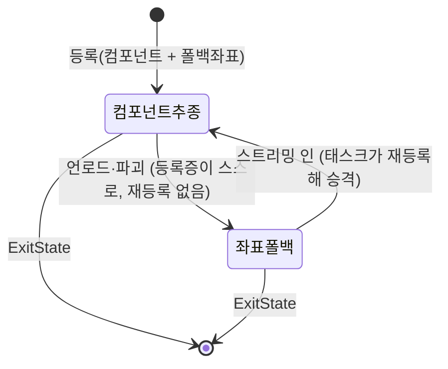

# 인디케이터 대상 소멸 시 폴백 좌표로 자가 복구

## 계획

### 목표

등록증은 "컴포넌트 추종이냐 고정 좌표냐"를 `TargetComponent == nullptr` 로 파생 판별하는데(2026-08-21 의 결정), 컴포넌트로 등록한 등록증은 폴백 좌표를 한 번도 채우지 않는다. 대상이 언로드돼 강참조가 GC 로 null 이 되면 그 등록증은 "고정 좌표형"으로 읽히고 좌표는 0 이라 마커가 월드 원점에 박히며, 태스크의 재등록 판정도 양쪽 null 을 같다고 보아 영구히 그 상태로 남는다. 모든 등록증이 언제나 폴백 좌표를 함께 들게 해서, 컴포넌트가 사라지는 순간 등록증이 스스로 좌표로 내려앉게 한다.

### 수정 범위

| 파일 | 수정할 내용 | 구분 |
|---|---|---|
| `WxUI/.../Indicator/WxIndicatorDescriptor.h·.cpp` | `TargetComponent` 를 약참조로, `Initialize` 오버로드 2개를 좌표까지 받는 1개로 통합 | 수정 |
| `WxUI/.../Indicator/WxIndicatorManagerComponent.h·.cpp` | `AddIndicator` 를 3인자 1개로 통합, `ProjectIndicator` 를 실패 없는 `void` 로, `UpdateProjections` 의 실패 분기 제거 | 수정 |
| `WxUI/.../Indicator/WxStateTreeTask_MarkIndicator.cpp` | `RefreshIndicator` 의 등록 분기를 통합 호출 한 줄로, 낡아진 주석 정정 | 수정 |

### 접근 방식

- **폴백을 시그니처로 강제한다**: 컴포넌트용·좌표용 두 오버로드를 `AddIndicator(TargetComponent, WorldLocation, WorldOffset)` 하나로 합친다. 컴포넌트가 없으면 좌표 전용 등록이다. 합치는 목적은 인자를 줄이는 게 아니라 폴백 없는 컴포넌트 등록을 부를 수 없게 만드는 것이다. 모드 플래그를 새로 두는 방향은 08-21 에 기각된 설계라 택하지 않는다.
- **약참조로 바꿔 가비지 창까지 없앤다**: 등록증은 대상을 소유하지 않는 관찰자이고 같은 파일의 다른 참조도 이미 약참조다. 덤으로 `TWeakObjectPtr::Get()` 이 가비지에 nullptr 을 돌려주므로, 가비지지만 아직 null 이 아닌 한 프레임 창이 별도 처리 없이 사라진다.
- **투영은 실패하지 않는다**: 폴백이 항상 있으니 "대상 파괴 → 표시 접기" 분기가 필요 없다. 뷰를 못 얻는 경우의 접기는 그대로 둔다.
- **승격·강등 판정은 그대로 둔다**: 「해석된 컴포넌트 ≠ 등록증의 컴포넌트」일 때만 갈아 끼우는 기존 판정이 폴백이 채워지는 순간 그대로 옳아진다.

---

## 완료

### 수정한 파일
| 파일 | 수정한 내용 | 구분 |
|---|---|---|
| `WxUI/.../Indicator/WxIndicatorDescriptor.h·.cpp` | `TargetComponent` 를 `TWeakObjectPtr` 로, `Initialize` 를 좌표까지 받는 1개로 통합, 멤버·게터 주석 갱신 | 수정 |
| `WxUI/.../Indicator/WxIndicatorManagerComponent.h·.cpp` | `AddIndicator` 를 3인자 1개로 통합·거부 가드 제거, `ProjectIndicator` 를 `void` 로, `UpdateProjections` 의 실패 분기 제거 | 수정 |
| `WxUI/.../Indicator/WxStateTreeTask_MarkIndicator.cpp` | 등록 분기를 통합 호출 한 줄로, 재등록 판정 주석 정정 | 수정 |

### 구현·결정과 그 이유

- **폴백을 시그니처로 강제했다**: 두 오버로드를 하나로 합친 목적은 인자 정리가 아니라 폴백 없는 컴포넌트 등록을 아예 부를 수 없게 만드는 것이다. 이번 버그는 그 조합이 문법적으로 가능했기 때문에 생겼고, 남겨 두면 새 호출자가 같은 함정을 다시 밟는다.
- **모드 플래그는 두지 않았다**: 리뷰 문서는 "추종형인지"를 명시 플래그로 기록하자고 제안했지만, 08-21 이 같은 사실을 두 곳에서 관리하게 된다는 이유로 이미 기각한 설계다. 폴백이 항상 채워지면 파생 판별만으로 충분해 플래그가 필요 없어진다.
- **약참조가 가비지 창까지 덮는다**: 등록증은 대상을 소유하지 않는 관찰자이므로 약참조가 옳고, 덤으로 `Get()` 이 가비지에 nullptr 을 돌려주는 덕에 "마크만 되고 아직 null 이 아닌" 프레임에도 별도 분기 없이 좌표로 내려앉는다. 종전 강참조는 참조가 끊기는 시점을 GC 의 가비지 제거 설정에 맡기고 있었다.
- **투영을 무실패로 만들었다**: 폴백이 보장되니 실패 반환이 표현할 상태가 없다. 매니저의 "대상 파괴 → 표시 접기" 분기가 사라지고, 접기는 뷰를 못 얻는 경우 한 갈래만 남았다.
- **재등록 판정은 손대지 않았다**: 「해석된 컴포넌트 ≠ 등록증의 컴포넌트」 비교는 원래 옳았고, 비교 대상이 되는 등록증이 거짓말(좌표가 0)을 하고 있던 것이 문제였다. 폴백을 채우자 같은 코드가 언로드 중 유지·스트리밍 인 시 승격을 그대로 성립시킨다.
- **파괴된 대상도 마커를 남긴다**: 이제 다음 틱을 기다리지 않고 즉시 좌표로 내려앉는다. 08-21 이 정한 정책과 같고 결과도 같아 새 정책이 아니다.

### 계획 대비 달라진 점
- 계획대로.

### 후속 과제
- **PIE 실동작 미검증**: 컴파일만 확인했다. 목표가 스트리밍 아웃될 때 마커가 원점이 아닌 기록 좌표를 가리키는지, 다시 로드될 때 튀지 않고 이어지는지는 남아 있다.
- **에셋의 좌표**: [[2026-08-24-퀘스트-폴백-좌표-파라미터화]] 에서 처리했다. 알고 보니 값이 빈 게 아니라 퀘스트가 좌표를 지정할 통로가 없어, 루트 파라미터로 노출하는 작업이 필요했다.
- **좌표 신선도**(08-21 에서 이어짐): 대상 액터를 옮기면 기록 좌표는 낡는다. 어긋남이 잦으면 등록 중 마지막 관측 위치로 폴백을 갱신하는 안을 검토한다 — 저작값의 뜻이 바뀌므로 이번엔 하지 않았다.
