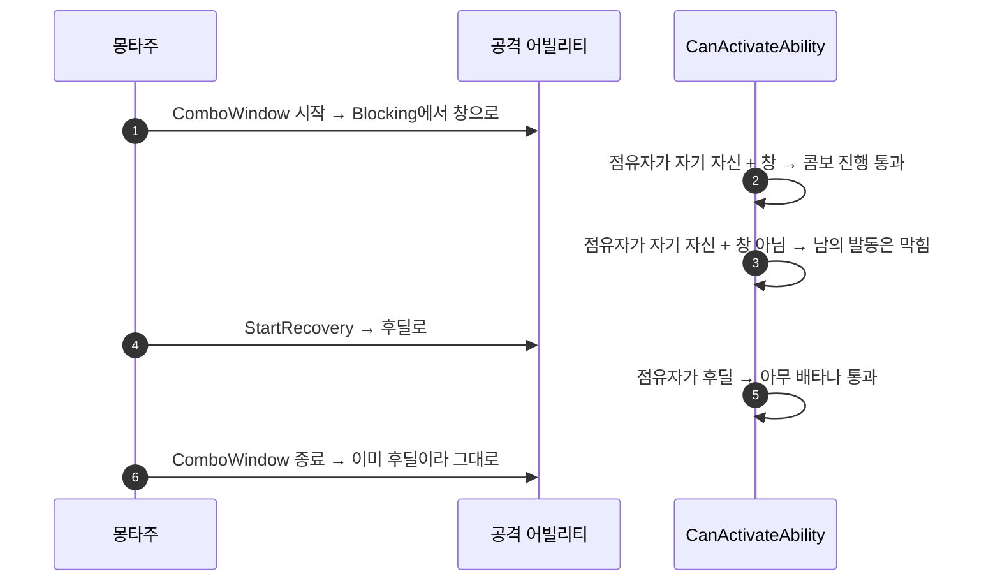

# 콤보 창과 후딜 캔슬 창 분리

## 계획

### 목표

콤보 진행 창을 후딜 캔슬 창보다 이르게 열 수 있게 한다. 08-22 `5f13671d`에서 Attack·Skill의 `CanActivateAbility` 오버라이드가 삭제되며 `State.ComboWindow` 소비자가 사라져, 지금은 `StartRecovery`가 연 후딜 하나가 두 역할을 겸한다. 그래서 콤보를 이르게 열면 회피·가드 캔슬도 같이 열려 공격의 리스크가 사라지고, 리스크를 지키면 콤보가 굼떠진다.

### 수정 범위

| 파일 | 수정할 내용 | 구분 |
|---|---|---|
| `WxAbilityBase.h` | `EWxAbilityActivationGroup`에 `Exclusive_ComboWindow` 추가, 창 전이 진입점 선언, `StartRecovery` 주석 갱신 | 수정 |
| `WxAbilityBase.cpp` | 창 전이 구현(가드 포함), `CanActivateAbility`에 자기 점유 분기 추가 | 수정 |
| `WxAbilitySystemComponent.cpp` | `FindActivationGroupBlocker`가 `Exclusive_ComboWindow`도 점유자로 셈 | 수정 |
| `WxAnimNotifyState_ComboWindow.h/.cpp` | 태그 부여 대신 소유 어빌리티의 창을 여닫도록 재작성 | 수정 |
| `WxGameplayTags.h/.cpp` | `State_ComboWindow` 제거 | 수정 |
| `WxAbility_Attack.h`, `WxAbility_Skill.h` | 낡은 콤보 서술 정정 | 수정 |
| `WxAbility_HitReact.cpp` | 사라진 분기를 근거로 든 주석 정정 | 수정 |

### 접근 방식

- **별도 축이 아니라 기존 축의 눈금으로 넣는다**: 창 상태를 태그로 따로 두면 판정 축이 둘이 된다. `ActivationGroup`은 이미 "얼마나 열려 있나"를 나타내는 런타임 상태이므로 그 사이에 눈금 하나를 끼운다. 닫힘에서 열림 순으로 `Exclusive_Blocking → Exclusive_ComboWindow → Exclusive_Recovery`가 되고, 노티파이 둘이 그 축 위의 전이점 둘이 된다.
- **판정은 점유자가 누구냐로 갈린다**: 점유자가 자기 자신이면 콤보 진행이므로 자기 그룹이 창 상태인지만 본다. 남이면 기존 `CancelAbilitiesWithTag` 판정 그대로다. 콤보 창도 점유자로 세므로 다른 어빌리티는 여전히 막힌다.
- **상태를 ASC가 아니라 어빌리티가 갖는다**: 태그 안은 창 상태를 액터 전역에 올려서, 엉뚱한 몽타주의 노티파이가 남의 창을 여는 사고가 구조적으로 가능했다(실제로 `AM_Parry`에 붙어 있다). 그룹 안에서는 그 몽타주를 소유한 어빌리티 인스턴스에 있어 샐 곳이 없다.
- **전이 가드 둘**: 창 닫힘은 현재 그룹이 창일 때만 되돌린다 — 창은 보통 후딜보다 늦게 닫히므로 무조건 되돌리면 후딜을 도로 닫는다. 창 열림은 `Exclusive_Blocking`에서만 일어나게 막는다 — 엉뚱한 배치가 `Independent` 어빌리티를 점유자로 승격시키지 않게 한다.

### 알려진 결과

- 창이 닫힌 뒤 후딜에서도 콤보는 이어진다. 그룹이 순서 축이라 후딜이 창보다 열려 있기 때문이며, 오늘 동작과 같아 회귀가 없다. 대신 "콤보는 끊되 회피는 연다"는 창 모양은 표현할 수 없다.
- `AM_Attack_H`는 `GA_Attack_Heavy`의 유일한 몽타주인데 창이 붙어 있어, 창 안 재입력이 터미널 단 순환에 걸려 같은 몽타주를 다시 재생한다. `AM_Attack_HH`·`HHH`를 연결하거나 노티파이를 걷어내는 에셋 작업이 따로 필요하다.

---

## 완료

### 수정한 파일

| 파일 | 수정한 내용 | 구분 |
|---|---|---|
| `WxAbilityBase.h` | `Exclusive_ComboWindow` 눈금 추가, 창 여닫기 진입점 선언, 세 Exclusive 값이 한 축임을 명시 | 수정 |
| `WxAbilityBase.cpp` | 창 여닫기 구현, `CanActivateAbility`에 점유자 동일성 분기 추가 | 수정 |
| `WxAbilitySystemComponent.cpp` | 점유자 판정에 콤보 창 포함 | 수정 |
| `WxAnimNotifyState_ComboWindow.h/.cpp` | ASC 태그 부여 대신 소유 어빌리티의 창을 여닫도록 재작성 | 수정 |
| `WxGameplayTags.h/.cpp` | `State_ComboWindow` 제거 | 수정 |
| `WxAbility_Attack.h`, `WxAbility_Skill.h` | 사라진 태그를 가리키던 콤보 서술 정정 | 수정 |
| `WxAbility_HitReact.cpp` | 지목이 필요한 이유를 실제 근거로 정정 | 수정 |

### 구현·결정과 그 이유

- **판정 기준을 활성 Spec이 아니라 점유자 동일성으로 잡았다**: 08-22 이전 코드는 스펙이 활성인지를 따로 물었다. 점유자가 자기 자신인지로 보면 배타 판정이 이미 찾아둔 값을 그대로 쓰므로 질문이 하나로 줄고, 콤보 진행과 남의 캔슬이 같은 문장 안에서 갈린다.
- **창 열림은 본동작에서만 허용했다**: 콤보가 없는 어빌리티의 몽타주에 노티파이가 섞여도 점유자로 승격되지 않게 한다. 실제로 패리 몽타주에 노티파이가 붙어 있어 가정이 아니라 현재 상태다.
- **창 닫힘은 아직 창일 때만 되돌린다**: 창은 후딜보다 늦게 닫히는 배치가 정상이므로, 무조건 되돌리면 이미 열린 후딜을 도로 닫는다.
- **상태를 ASC가 아니라 어빌리티가 갖게 했다**: 액터 전역 태그였을 때는 엉뚱한 몽타주가 남의 창을 여는 경로가 열려 있었다. 이제 그 몽타주를 소유한 인스턴스에만 있어 샐 곳이 없고, 공용 태그도 하나 줄었다.
- **태그·enum 변경에 마이그레이션이 필요 없음을 먼저 확인했다**: 태그 문자열을 참조하는 애셋이 없어 리다이렉트 경로가 불필요하고, `ActivationGroup`을 저장한 BP가 없어 눈금을 중간에 끼워도 안전하다.

### 계획 대비 달라진 점

- `WxAbility_Skill.h`의 "몽타주가 1개면 ComboWindow를 배치하지 않는 한 그 하나만 재생하고 종료한다"는 정정하지 않았다. 창이 소비자를 되찾으면서 원래 서술이 다시 맞는 말이 됐다.
- 나머지는 계획대로.

### 후속 과제

- **PIE 실측 미완**. 빌드만 확인했다. 평타 4단이 창 시점에 이어지는지, 회피·가드가 그 시점에는 막히고 후딜에서만 나가는지 확인이 남았다.
- `AM_Attack_L`~`LLLL`의 창 시작 지점을 `StartRecovery`보다 앞으로 옮기는 저작. 코드는 이르게 열 수 있게만 해두었고 실제 간격은 저작이 정한다.
- `AM_Attack_H`는 `GA_Attack_Heavy`의 유일한 몽타주인데 창이 붙어 있어, 창 안 재입력이 터미널 단 순환에 걸려 같은 몽타주를 다시 재생한다. `AM_Attack_HH`·`HHH`를 연결하거나 노티파이를 걷어내야 한다.
- `AM_Parry`의 창 노티파이는 승격 가드 덕에 무해하지만 오해를 부르니 정리하면 좋다.
