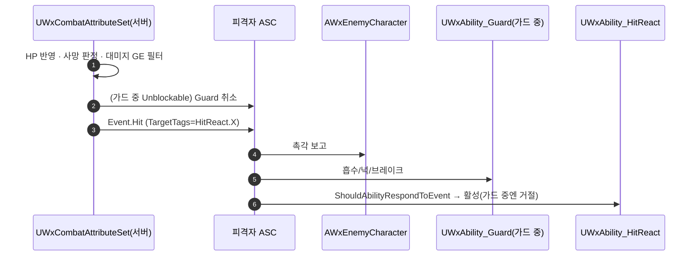

# Event.Hit 단일 피격 이벤트 + 반응 종류를 HitReact.* 페이로드 데이터로

## 계획

### 목표
"맞았다"는 신호가 셋(Event.HitReact.*·IncomingDamage 어트리뷰트 델리게이트·GameplayCue.Hit)으로 쪼개져 대미지가 실제로 들어갔다는 사실을 알리는 지점이 없고, Guard가 HitReact용 이벤트를 엿들어 가드 중 평타에 Normal을 억지로 채우는 분기까지 생겼다. 피격 이벤트를 `Event.Hit` 하나로 모으고 반응 종류는 페이로드 데이터(`HitReact.*`)로 옮긴다.

### 수정 범위
| 파일 | 수정할 내용 | 구분 |
|---|---|---|
| `Plugins/WxCore/Source/WxCore/Public/WxGameplayTags.h`·`.cpp` | `Event_Hit` 신설, `Event_HitReact*` 8종 삭제, `HitReact.{Normal,KnockBack,KnockDown,KnockUp,Parry,Finisher,Backstab}` 데이터 태그 섹션 신설 | 수정 |
| `Plugins/WxCombat/.../Attribute/WxCombatAttributeSet.cpp`·`.h` | `ProcessDamageTaken`: 가드 해제 → `Event.Hit`(TargetTags=반응 종류) 순으로 재배열, 강제 Normal·별도 반응 이벤트 삭제. `ProcessPerfectGuard`: 패리 반동을 `Event.Hit`(대미지 0)로 | 수정 |
| `Plugins/WxCombat/.../Ability/WxAbility_HitReact.cpp`·`.h` | 트리거 `Event.Hit`, `ShouldAbilityRespondToEvent`로 반응 종류 없는 히트 거절, 분기·몽타주 선택을 페이로드 태그로 | 수정 |
| `Plugins/WxCombat/.../Ability/WxAbility_Guard.cpp`·`.h` | `Event.Hit` 청취, 넉 판정을 페이로드 태그로, 핸들러 개명 | 수정 |
| `Plugins/WxCombat/.../Ability/WxAbility_Finisher.cpp`·`.h` | 짝 피격을 `Event.Hit`(대미지 0 + 반응 종류)로 | 수정 |
| `Plugins/WxCombat/.../Damage/WxDamageTableRow.h` | 반응 태그 카테고리 `HitReact` | 수정 |
| `Source/WxGame/Cheat/WxCheatManager.cpp` | 치트 대미지 반응 태그 개명 | 수정 |
| `Source/WxGame/Character/WxEnemyCharacter.cpp`·`.h` | 촉각 보고를 어트리뷰트 델리게이트에서 `Event.Hit` 구독으로, 대미지 0 무시 | 수정 |
| `Content/DesignerTables/DT_Damage.uasset` | 행 태그 `Event.HitReact.*` → `HitReact.*` 리다이렉트 리세이브 | 수정(에셋) |

### 접근 방식
- **이벤트 하나, 데이터로 분기**: 반응 종류는 히트의 속성이지 별도 사건이 아니다. 종류 없는 히트는 HitReact가 활성화 전 훅에서 거르므로 캔슬 태그·클라 RPC가 새지 않는다.
- **가드 해제 → Event.Hit 순서**: Unblockable 가드 해제를 이벤트보다 먼저 해야 Guard가 이벤트를 듣고 흡수를 트는 일이 없다. 가드 중엔 HitReact가 차단 태그로 거절되고 Guard가 같은 이벤트로 흡수/넉/브레이크를 고른다.
- **대미지 없는 반응 요청**(패리 반동·처형 짝 피격)도 같은 이벤트에 대미지 0으로 싣는다. AI는 대미지 0을 무시한다.
- **Guard 페이즈 소유는 그대로**: 페이즈가 활성 몽타주로 판별되고 인터럽트가 곧 취소라, 반응을 HitReact로 옮기면 두 어빌리티가 한 슬롯 그룹을 두고 서로 끊는다.
- **예측은 범위 밖**: 피격자 클라엔 예측 재료가 없고 HitReact는 ServerInitiated 유지.

---

## 완료

### 수정한 파일
| 파일 | 수정한 내용 | 구분 |
|---|---|---|
| `Plugins/WxCore/Source/WxCore/Public/WxGameplayTags.h`·`.cpp` | `Event_Hit` 신설, `Event_HitReact*` 8종 삭제, `HitReact`·`HitReact.{Normal,KnockBack,KnockDown,KnockUp,Parry,Finisher,Backstab}` 데이터 태그 섹션 신설 | 수정 |
| `Plugins/WxCombat/.../Attribute/WxCombatAttributeSet.cpp`·`.h` | `ProcessDamageTaken`: 반응 태그 추출 → Unblockable 가드 해제 → `Event.Hit`(TargetTags=반응) 순으로 재배열, 강제 Normal·별도 반응 이벤트 삭제. `ProcessPerfectGuard`: 패리 반동을 `Event.Hit`(대미지 0)로 | 수정 |
| `Plugins/WxCombat/.../Ability/WxAbility_HitReact.cpp`·`.h` | 트리거 `Event.Hit`, `ShouldAbilityRespondToEvent` 오버라이드, 그로기 강등·런치·회전·몽타주 선택을 페이로드 태그로 | 수정 |
| `Plugins/WxCombat/.../Ability/WxAbility_Guard.cpp`·`.h` | `Event.Hit` 청취(`HandleHit`), 넉 판정을 `TargetTags`로 | 수정 |
| `Plugins/WxCombat/.../Ability/WxAbility_Finisher.cpp`·`.h` | 짝 피격을 `Event.Hit`(대미지 0 + 반응 태그)로 | 수정 |
| `Plugins/WxCombat/.../Damage/WxDamageTableRow.h` | 반응 태그 카테고리 `HitReact` | 수정 |
| `Source/WxGame/Cheat/WxCheatManager.cpp` | 치트 대미지 반응 태그 `HitReact.Normal` | 수정 |
| `Plugins/WxAI/Source/WxAI/Public/WxAIPerceptionComponent.h`·`Private/…cpp` | `BeginPlay`에서 컨트롤러 `OnPossessedPawnChanged` 구독 + 이미 빙의된 폰 따라잡기, `EndPlay`에서 해제. 폰 ASC의 `Event.Hit` 구독을 빙의에 따라 옮기며 촉각 보고(`HandlePawnHit`), 대미지 0 무시 | 수정 |
| `Source/WxGame/Character/WxEnemyCharacter.cpp`·`.h` | 어트리뷰트 델리게이트 촉각 훅과 `InitAbilitySystem` 오버라이드 삭제 | 수정 |
| `Content/DesignerTables/DT_Damage.uasset` | 행 태그 `Event.HitReact.{Normal,KnockBack,KnockUp}` → `HitReact.*` 리다이렉트 리세이브(임시 ini는 원복) | 수정(에셋) |

### 구현·결정과 그 이유
- **거절 훅의 자리**: 활성화 전 훅은 캔슬 태그 적용과 클라 활성 RPC보다 앞에서 돌아, 평타가 진행 중인 공격을 끊거나 히트마다 RPC를 만드는 일이 없다. 실패 통지는 Verbose 로그뿐이라 부담이 없다.
- **가드 해제를 이벤트보다 앞에**: Guard가 같은 이벤트로 흡수 몽타주를 틀기 때문에, 막히지 않는 히트는 이벤트가 나가기 전에 가드를 끊어야 흡수가 먼저 튀지 않는다.
- **촉각 보고의 주체를 퍼셉션 컴포넌트로**: 구독 시점은 BeginPlay다. 배치된 폰은 컨트롤러 BeginPlay 전에 빙의돼 델리게이트만으로는 첫 폰을 놓치지만, 그 사이엔 게임플레이가 돌지 않으므로 현재 폰을 따라잡는 것으로 충분하다. 처음 골랐던 등록 시점은 에디터 월드·재등록마다 도는 데다 해제 짝(EndPlay)과 어긋나 되돌렸다. 빙의 해제 시점엔 컨트롤러의 폰 참조가 이미 바뀌어 있어, 풀어야 할 ASC를 약참조로 따로 든다.
- **대미지 0 필터**: 패리 반동·처형 짝 피격이 같은 이벤트를 쓰므로 촉각 보고에서 먼저 걸러, 컨텍스트가 비어 있는 페이로드가 가해자 조회에 닿지 않게 한다.

### 계획 대비 달라진 점
- 촉각 보고 훅을 WxGame 글루(`AWxEnemyCharacter`)에 두려던 것을 사용자 지시로 `UWxAIPerceptionComponent`로 옮겼다. 계획에서 "AI 폰의 `InitAbilitySystem`이 서버 전용"이라던 정합 논거는 빙의 델리게이트(서버에서 Possess)로 대체된다.
- `DT_Damage` 리세이브가 한 번 실패했다 — 실행 중인 에디터(`UnrealEditor-Win64-DebugGame`)가 파일을 잠가 공유 위반. 에디터가 `UnrealEditor.exe` 이름으로만 검색돼 놓친 것으로, 구성 접미사 변형까지 잡는 와일드카드 검색이 필요했다. 에디터 종료 후 재실행해 옛 문자열 0건·새 문자열 3건을 확인했고, 리다이렉트 없이 한 번 더 리세이브해도 태그가 살아남았다. 임시 ini는 원복해 커밋 상태와 같다.

### 후속 과제
- 계획의 PIE 검증 항목은 사용자가 마무리한다(컴파일·에셋 이관만 확인).
- `Event.Death`·`Groggy`·`Finisher`·`Backstab`·`Interact` 트리거 규약 정리는 별건.
