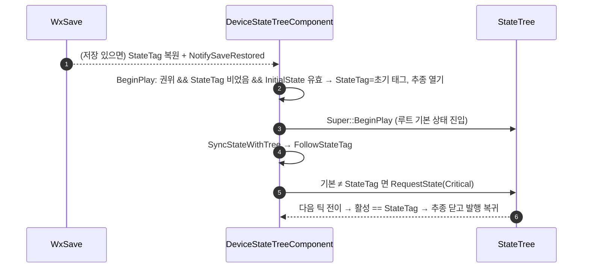

# 장치 InitialState — 저장이 없을 때의 시작 상태를 드롭다운으로 지정

## 계획

### 목표
장치 컴포넌트에 시작 상태를 인스턴스별로 고르는 드롭다운을 두고, 저장된 상태가 없을 때 그 상태로 수렴해 시작하게 한다. 같은 BP 를 배치마다 "열린 채/닫힌 채"로 다르게 시작시키기 위해서다(컴포넌트 헤더에 남아 있던 TODO 를 채운다).

### 수정 범위
| 파일 | 수정할 내용 | 구분 |
|---|---|---|
| `Plugins/WxWorld/Source/WxWorld/Private/Device/WxDeviceStateTreeComponent.h` | `InitialState`(EditAnywhere, GetOptions) 추가, 에디터 전용 옵션 함수 선언, TODO 삭제, doc-comment·플래그 주석 갱신 | 수정 |
| `Plugins/WxWorld/Source/WxWorld/Private/Device/WxDeviceStateTreeComponent.cpp` | `BeginPlay` 선두에 초기 상태 적용 분기, 옵션 함수 구현 | 수정 |

### 접근 방식
- **세이브 복원과 같은 수렴 경로 재사용**: 컴포넌트는 이미 "StateTag 가 진실이면 트리를 그 상태로 끌어온다"는 추종 기계를 갖고 있다. 초기 상태는 "저장이 없을 때 StateTag 가 취할 값"일 뿐이므로, 권위 측 BeginPlay 에서(트리 시작 전) StateTag 가 비어 있으면 초기 상태 태그를 넣고 추종을 열면 나머지는 기존 코드가 처리한다. 새 플래그·새 전이 API 없음. 월드 초기 로드 복원은 BeginPlay 전에 오므로 "BeginPlay 에 StateTag 가 비었다 = 저장 없음"이 성립한다. 클라는 건드리지 않는다.
- **드롭다운**: `FName` + `GetOptions` 메타(UE 순정 드롭다운). 항목은 ST 에셋의 상태 중 Tag 가 붙은 것의 태그 이름 — 이 컴포넌트의 상태 식별자가 Tag 이고 태그 없는 상태는 추종 불가라 시작 상태로도 의미가 없다. 엔진이 FName GetOptions 에 None 을 넣어 주지 않으므로 맨 앞에 None 을 둔다.
- **검증 실패 처리**: 에셋에 없는 태그(에셋 교체·태그 삭제)는 Warning 후 무시하고 순정 시작.
- **알려진 한계**: 스트리밍-인 복원은 BeginPlay 보다 늦어 "기본 → 초기 상태 → 저장 상태"로 한 홉 더 거칠 수 있다(초기 상태가 기본·저장 중 하나와 같으면 홉 없음). 기존 스트리밍 복원도 전이 연출을 재생하는 설계라 같은 부류. 해소는 WxSave 복원 시점 문제라 범위 밖.

---

## 완료

### 수정한 파일
| 파일 | 수정한 내용 | 구분 |
|---|---|---|
| `Plugins/WxWorld/Source/WxWorld/Private/Device/WxDeviceStateTreeComponent.h` | `InitialState`(EditAnywhere, Wx, GetOptions) 신설, 에디터 전용 옵션 함수 선언, TODO 삭제, 클래스 doc·BeginPlay·추종 플래그 주석 갱신 | 수정 |
| `Plugins/WxWorld/Source/WxWorld/Private/Device/WxDeviceStateTreeComponent.cpp` | `BeginPlay` 선두에 초기 상태 적용 분기, 옵션 함수 구현 | 수정 |

### 구현·결정과 그 이유
- **복원 경로 재사용**: 초기 상태는 "저장이 없을 때 StateTag 가 취할 값"으로만 정의했다. 권위가 트리를 열기 전에 그 값을 넣고 추종을 열면, 루트 기본 상태와 다를 때만 기존 수렴이 전이를 요청하고 같으면 아무 일도 없다. 새 플래그·전이 API 없이 끝나고, 클라는 복제만 따라간다.
- **적용 위치가 트리 시작 전인 이유**: 월드 초기 로드 복원과 같은 모양(BeginPlay 에 StateTag 가 이미 정해져 있음)을 만들어 그 뒤 로직을 한 줄도 갈라 쓰지 않기 위해서다.
- **드롭다운 값은 상태 Tag**: 이 컴포넌트의 상태 식별자·저장 키가 Tag 이고 태그 없는 상태는 추종할 수 없어 시작 상태로도 무의미하다. 엔진 FName GetOptions 는 None 을 자동으로 넣지 않아(클래스 프로퍼티만 넣음) 해제용 None 을 직접 앞세웠다.
- **에셋에 없는 태그는 Warning 후 순정 시작**: 에셋 교체·태그 삭제로 낡은 값이 남는 경우를 복원의 "찾지 못함" 경로에 섞지 않고 시작 전에 걸러, 로그가 원인을 바로 가리키게 했다.

### 계획 대비 달라진 점
- 드롭다운의 "지정 없음"을 `None` 대신 예약어 **Root** 로(사용자 요청). 기본값이 `Root` 이고 BeginPlay 는 `Root` 를 "루트 기본 상태로 시작"으로 읽는다. 상태 Tag 는 계층 이름(`Device.x.y`)이라 한 단어 `Root` 와 겹칠 일이 없다.
- 드롭다운 표시는 상태 **이름**, 저장 값은 상태 **Tag**(사용자 요청). GetOptions 를 값+표시명 쌍(`FPropertyTextFName`, CoreUObject) 반환으로 바꿨다. 상태 이름으로 저장하는 안은 검토 후 기각 — 순정 ST 는 상태를 밖에서 가리키는 수단으로 Tag 와 FGuid Id 만 주고(이름 조회 API 없음·중복 미차단), 태그는 저장 지점을 골라 붙이는 선택권까지 준다.

### 후속 과제
- 에디터·PIE 확인 미실시(빌드만 검증): 인스턴스의 StateTree 컴포넌트 > Wx > Initial State 드롭다운 항목, 세이브 없이 지정 상태로 시작하는지, 저장 후 재로드 시 저장 상태가 이기는지.
- 스트리밍-인 복원이 BeginPlay 보다 늦어 "기본 → 초기 → 저장" 한 홉이 생길 수 있음(초기 상태가 기본·저장 중 하나와 같으면 없음). 검토 결과 보류(2026-08-25): 복원을 `OnLevelBeginMakingVisible` 로 당기는 안은 컴포넌트 등록·초기화 전이라 월드 초기 로드 복원과 단계가 어긋나 기각, 복원 도착 시 대기 전이 요청을 비우는 안(`ResetTransitionRequests`)은 큐를 통째로만 비울 수 있고 타임슬라이스 로딩에선 효과가 없어 보류. 실제 플레이에서 거슬리면 재확인.
