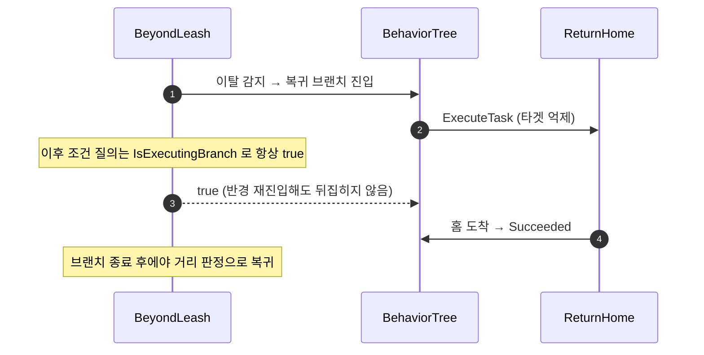

# 리시 복귀를 FlowAbortMode 비의존 구조로 재설계

## 계획

### 목표
리시 복귀의 안전성이 BT 에셋에서 데코의 `FlowAbortMode`를 Lower Priority로 골라 두었다는 사실 하나에 걸려 있다. 데코 조건이 "이탈했는가"를 답하는데 브랜치가 필요한 건 "복귀가 아직 안 끝났는가"라서, 복귀 중 반경 재진입이 조건을 뒤집고 브랜치를 떨어뜨린다. 조건의 의미를 바로잡아 어떤 abort 모드에서도 복귀가 끊기지 않게 만들고, 홈 전용으로 박힌 앵커를 키로 일반화한다.

### 수정 범위
| 파일 | 수정할 내용 | 구분 |
|---|---|---|
| `Plugins/WxAI/.../Public/WxBTDecorator_BeyondLeash.h` | `Anchor` 키 프로퍼티, `InitializeFromAsset` 선언, 클래스 주석 재작성 | 수정 |
| `Plugins/WxAI/.../Private/WxBTDecorator_BeyondLeash.cpp` | 복귀 중 참 유지 게이트, 앵커 키 해석·조회, 설명에 앵커 키 이름 | 수정 |
| `Plugins/WxAI/.../Public/WxBlackboardKeys.h` / `.cpp` | 호출자가 사라진 `GetHomeLocation` 제거 | 수정 |
| `Plugins/WxAI/.../Public/WxBTTask_ReturnHome.h` | 경계 왕복이 없는 근거를 정정(코드 무변경) | 수정 |
| `Plugins/WxAI/README.md` | 리시 모델 서술 갱신 | 수정 |

### 접근 방식
- **복귀 중에는 조건을 참으로 유지**: `CalculateRawConditionValue` 맨 앞에서 `IsExecutingBranch` 로 자기 브랜치 실행 여부를 물어 참이면 즉시 true 를 반환한다. 엔진이 `EvaluateBranch` 에서 Both 를 접을 때 쓰는 그 판정을 그대로 쓴다. 브랜치가 도는 동안 조건이 false 가 될 수 없으므로 자기중단이 구조적으로 불가능해지고, 복귀 중 재탐색이 와도 브랜치가 유지된다. 도착 판정은 `UWxBTTask_ReturnHome` 이 단독으로 소유한다.
- **앵커를 Blackboard 키로**: 엔진 `UBTDecorator_ConeCheck` 관용대로 `FBlackboardKeySelector` 를 두고 `InitializeFromAsset` 에서 해석한다. 값은 `GetLocationFromEntry` 로 읽어 Vector·Actor 키를 모두 받는다.
- **무효 앵커 가드는 엔진 순정으로**: `GetLocationFromEntry` 가 Vector 키의 `FAISystem::IsValidLocation` 검사를 통과 못 하면 false 를 돌려주므로, 미설정 앵커를 이탈로 오판하던 문제가 커스텀 가드 없이 닫힌다.
- **abort 모드 잠금은 넣지 않음**: 안전이 구조에서 나오므로 `bAllowAbort*` 로 선택지를 막을 근거가 사라진다.

---

## 완료

### 수정한 파일
| 파일 | 수정한 내용 | 구분 |
|---|---|---|
| `Plugins/WxAI/.../WxBTDecorator_BeyondLeash.h`/`.cpp` | 복귀 중 참 유지 게이트, `Anchor` 키 프로퍼티와 `InitializeFromAsset` 해석, `GetLocationFromEntry` 조회, 설명·클래스 주석 갱신 | 수정 |
| `Plugins/WxAI/.../WxBlackboardKeys.h`/`.cpp` | 호출자가 사라진 `GetHomeLocation` 제거 | 수정 |
| `Plugins/WxAI/.../WxBTTask_ReturnHome.h` | 복귀 완료 판정을 이 Task 가 단독으로 소유한다는 계약을 주석에 명시 | 수정 |
| `Plugins/WxAI/README.md` | 리시 모델·핵심 타입 서술을 앵커 키와 abort 모드 비의존으로 갱신 | 수정 |

### 구현·결정과 그 이유
- **조건의 의미를 "이탈했는가" 에서 "복귀가 아직 안 끝났는가" 로**: 데코가 답하던 질문과 브랜치가 필요로 하던 질문이 달랐던 것이 모든 취약함의 뿌리였다. 자기 브랜치 실행 중이면 즉시 참을 돌려주는 게이트 하나로 둘을 일치시켰다. 엔진이 Both 를 접을 때 쓰는 판정을 그대로 빌려 쓰므로 별도 상태나 반경 프로퍼티가 필요 없고, 브랜치가 도는 동안 폴링 엣지도 서지 않아 재평가 요청 자체가 나가지 않는다.
- **abort 모드 잠금 대신 구조로 해결**: 에디터 드롭다운을 `bAllowAbort*` 로 막는 안을 검토했으나, 조건이 복귀 중 뒤집히지 않으면 어떤 모드도 복귀를 끊을 수 없어 잠글 근거가 사라진다. 저작 제약을 늘리지 않고 문서로만 존재하던 금지 규칙을 없앴다.
- **암묵 가정 제거**: Lower Priority 에서도 복귀 중 트리 재탐색이 오면 브랜치가 떨어질 수 있었다. 지금까지 문제가 없었던 건 복귀 브랜치가 최상위 우선순위라 재탐색이 잘 오지 않았기 때문이지 설계가 막아서가 아니었다.
- **앵커 조회를 엔진 순정 경로로**: `GetLocationFromEntry` 는 Vector·Actor 키를 모두 받고 Vector 키의 유효성 검사까지 포함한다. 덕분에 앵커 일반화와, 미설정 홈을 이탈로 오판해 영구 복귀에 갇히던 문제가 커스텀 가드 없이 함께 닫혔다.
- **완료 판정 소유권을 Task 로 못박음**: 데코에 도착 반경을 새로 두면 MoveTo 의 `AcceptableRadius` 와 두 개의 진실이 생긴다. 데코는 시작만, 종료는 Task 만 정한다.

### 계획 대비 달라진 점
- 계획대로.

### 후속 과제
- **플레이 검증(사용자)**: 유인→이탈→복귀 완주→홈 도착 후 재-어그로. 이어서 데코 `FlowAbortMode` 를 **Both 로 바꿔** 같은 거동이 나오는지 확인(이번 변경의 핵심 회귀 테스트) 후 Lower Priority 로 원복.
- `Docs/Programmer/module_review_WxAI.md` 8·9번은 이 변경으로 해소됐다. 다음 `/module-review` 때 갱신된다.
