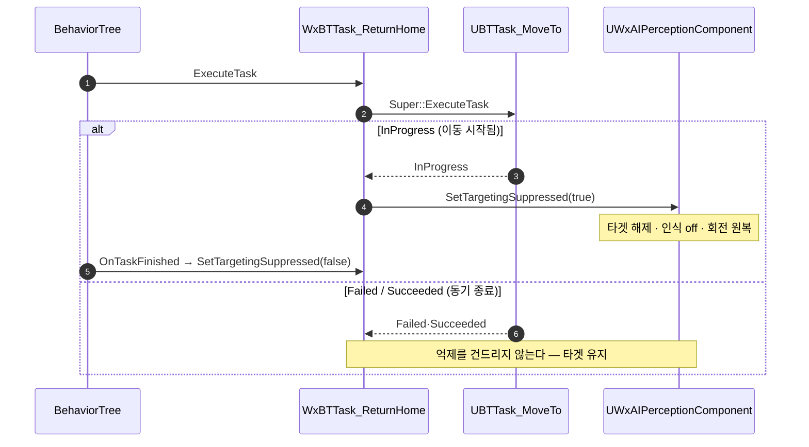

# 복귀 이동이 실제로 시작된 경우에만 타겟을 억제

## 계획

### 목표
`UWxBTTask_ReturnHome::ExecuteTask` 가 MoveTo 결과를 받기 전에 타겟팅 억제를 켜서, 경로를 못 찾아 동기 실패하는 헛발질 한 번에도 타겟·포커스·회전 모드·`State.InCombat` 이 전부 날아간다. 억제 해제 시 재획득은 지금 감지 중인 대상만 집으므로 벽 뒤로 빠진 타겟은 영구히 사라지고, 되살아나도 네임플레이트가 깜빡인다. 이동이 실제로 시작된 경우에만 억제하도록 순서를 바꾼다.

### 수정 범위
| 파일 | 수정할 내용 | 구분 |
|---|---|---|
| `Plugins/WxAI/Source/WxAI/Private/WxBTTask_ReturnHome.cpp` | `ExecuteTask` 에서 `Super::ExecuteTask` 결과를 먼저 받고 `InProgress` 일 때만 억제를 켠다. 앞단의 AIController 널 가드는 Super 가 같은 판정을 하므로 억제 분기로 흡수한다. `OnTaskFinished` 에는 비대칭이 안전한 이유만 한 줄 남긴다 | 수정 |
| `Plugins/WxAI/Source/WxAI/Public/WxBTTask_ReturnHome.h` | 클래스 주석의 "진입 시 억제" 를 "이동이 실제로 시작된 경우에만 억제" 로 정정 | 수정 |

### 접근 방식
- **결과 먼저, 억제 나중**: `InProgress` 는 "이동 요청이 살아 있고 종료가 나중에 온다"는 뜻이라 억제 수명(진입~`OnTaskFinished`)과 정확히 겹치는 유일한 결과다. `Failed`·`Succeeded` 에서는 억제를 아예 건드리지 않는다.
- **`Succeeded`(이미 홈)에도 억제하지 않는다**: 복귀 이동이 없었으니 disengage 할 대상도 없다. 이탈 판정이 참인데 MoveTo 가 이미 도착이려면 도착 반경이 리시 반경보다 큰 오설정이라 실사용에선 밟지 않는다.
- **종료 콜백은 무조건 해제 유지**: 억제 setter 가 전환에서만 동작하므로 억제한 적 없는 종료 경로에서 자동으로 no-op 이다. BT 노드 인스턴스는 이 노드를 쓰는 모든 BT 컴포넌트가 공유하므로 "내가 켰다"를 기억하는 멤버 플래그를 두면 안 된다 — 상태는 퍼셉션 한 곳에만 둔다.
- **순서를 뒤바꿔도 안전함(엔진 소스 확인 완료)**: MoveTo 가 읽는 블랙보드 키는 HomeLocation(Vector)이라 타겟과 무관하고, `AAIController::MoveTo` 는 포커스도 CMC 회전 플래그도 건드리지 않는다. 억제가 같은 프레임 안에서 몇 줄 뒤로 밀릴 뿐이고 회전은 틱에서 적용되므로 시각적 차이가 없다.

---

## 완료

### 수정한 파일
| 파일 | 수정한 내용 | 구분 |
|---|---|---|
| `Plugins/WxAI/Source/WxAI/Private/WxBTTask_ReturnHome.cpp` | `ExecuteTask` 를 "MoveTo 먼저 → `InProgress` 일 때만 억제" 순서로 바꾸고, 중복이던 앞단 AIController 널 가드를 제거. 종료 콜백에는 비대칭이 안전한 이유만 주석으로 추가 | 수정 |
| `Plugins/WxAI/Source/WxAI/Public/WxBTTask_ReturnHome.h` | 클래스 주석의 억제 시점을 "이동이 실제로 시작된 경우에만" 으로 정정 | 수정 |

### 구현·결정과 그 이유
- **`InProgress` 만 억제 대상**: 억제의 수명은 "복귀 이동이 도는 동안" 이고, 그 구간을 가리키는 결과는 `InProgress` 뿐이다. 동기로 끝나는 실패·이미도착에는 억제할 이동 자체가 없으므로 타겟·포커스·회전 모드·복제 태그를 아예 건드리지 않는다. 억제 해제 시 재획득이 현재 감지 중인 대상만 집는다는 제약은 그대로 두고, 그 재획득이 필요해지는 상황 자체를 만들지 않는 쪽으로 고쳤다.
- **앞단 널 가드 제거**: MoveTo 도 컨트롤러 없음을 같은 `Failed` 로 판정하므로 앞에서 한 번 더 볼 이유가 없다. 컨트롤러는 억제가 필요한 분기 안에서만 얻는다.
- **종료 콜백은 무조건 해제 유지**: 억제 setter 가 전환에서만 동작해 켠 적 없는 종료 경로에서 저절로 no-op 이 된다. BT 노드 인스턴스는 그 노드를 쓰는 모든 BT 컴포넌트가 공유하므로, "내가 켰다" 를 기억하는 멤버 플래그를 두면 여러 AI 가 한 값을 밟는다.
- **순서를 뒤집어도 되는지 엔진 소스로 확인**: 리뷰가 엔진 소스 없는 환경에서 작성돼 미확인으로 남겨 둔 부분이라 UE 5.8.1 을 직접 열어 대조했다. MoveTo 는 이동 목표로 HomeLocation 만 읽고 포커스도 CMC 회전 플래그도 건드리지 않으며, 동기 `Failed` 반환 경로(컨트롤러·블랙보드 없음, 요청 무효, 경로 실패로 인한 게임플레이 태스크 즉시 종료)와 이미 도착 시 `Succeeded` 반환이 모두 실재했다. 억제가 같은 프레임 안에서 몇 줄 뒤로 밀릴 뿐이고 회전은 틱에서 적용되므로 눈에 보이는 차이는 없다.

### 계획 대비 달라진 점
- 계획대로.

### 후속 과제
- 인게임 확인 미수행 — 홈이 내비메시 밖인 적을 리시 밖으로 유인해, 복귀가 실패해도 타겟·포커스·`State.InCombat` 이 유지되는지(네임플레이트가 깜빡이지 않는지) 확인 필요.
- 정상 복귀 중 시야 밖으로 빠진 타겟은 여전히 해제 시 되살아나지 않는다. 이는 "리시 밖에선 잊는다" 는 의도된 설계라 이번 범위에서 다루지 않았다.
