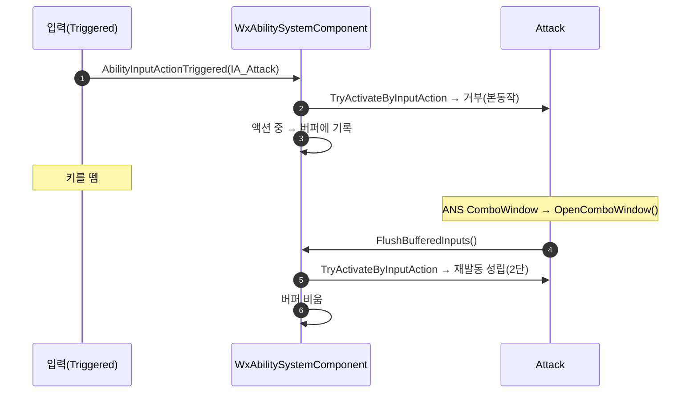

# 입력 버퍼 — 막힌 탭 입력을 기억했다가 창이 열리는 전이점에서 재생

## 계획

### 목표

어빌리티 입력은 레벨 신호(`Triggered`)라 홀드는 매 프레임 재시도해 차단이 풀리는 순간 발동하지만, 탭은 눌린 그 프레임에 막히면 유실된다 — 콤보 창 전에 누른 공격, 후딜 전에 누른 회피가 안 나간다. quodsoler 글(Try-Then-Buffer)의 요지를 우리 구조에 들인다: 액션 중에 막힌 탭을 짧은 시간 기억했다가 창이 열리는 순간 같은 발동 시도를 한다.

### 수정 범위

| 파일 | 수정할 내용 | 구분 |
|---|---|---|
| `Plugins/WxCombat/Source/WxCombat/Public/AbilitySystem/WxAbilitySystemComponent.h` · `.cpp` | 버퍼 항목·유지 시간·버퍼 배열, 발동 시도 공용 함수, 라이브 실패 시 버퍼, 재생 함수 | 수정 |
| `Plugins/WxCombat/Source/WxCombat/Public/AbilitySystem/Ability/WxAbilityBase.h` · `.cpp` | 발동 입력 버퍼 여부 bool(기본 참), 창 전이 두 곳에서 재생 호출 | 수정 |
| `.../Ability/WxAbility_Guard.cpp`, `WxAbility_Sprint.cpp`, `WxAbility_LockOn.cpp` | 홀드·토글 입력이라 버퍼 제외 | 수정 |
| `Source/WxGame/AbilitySystem/Ability/WxAbility_Interact.cpp` | 이벤트 트리거라 버퍼 제외 | 수정 |
| `Plugins/WxToolset/Source/WxToolset/Private/WxAnimMontageToolset.h` · `.cpp` | 단발 노티파이 추가 툴 | 수정 |
| `Content/AbilitySystem/Ability/AM_Dodge.uasset`, `AM_UseItem.uasset`, `AM_Interact.uasset` | StartRecovery 저작 | 저작 |

### 접근 방식

- **글의 두 노티파이 = 우리의 두 전이 함수**: 글은 게이트 ANS와 콤보 창 ANS에서 드레인한다. 우리는 콤보 창·후딜 전이가 이미 `OpenComboWindow`·`StartRecovery`로 있으므로 그 둘에서 ASC의 재생 함수를 부른다. 노티파이·태그 신설 없음.
- **게이트 = 배타 점유자가 있을 때만**: 입력을 거절한 것이 진행 중인 액션일 때만 기억한다. 유휴 중 실패(쿨다운·코스트)는 기억할 가치가 없다(글의 BufferWindow 게이트와 같은 의미).
- **같은 함수로 시도**: 라이브 입력과 재생이 같은 발동 시도 함수를 지나 둘이 다르게 동작할 수 없다. 재생은 발동 시도만 하고 InputPressed 중계는 하지 않는다.
- **성립하면 전부 폐기, 실패하면 유지**: 하나가 발동되면 쌓인 입력은 낡은 것이라 비운다(이중 실행 방지). 실패한 항목은 다음 전이점까지 남긴다 — 콤보 창은 자기 재발동만 열리므로 거기서 버리면 같이 쌓인 회피가 후딜에 못 나간다.
- **유지 시간은 실시간**: 글과 같다. 슬로우모션이 게임 시간을 늘려도 플레이어의 시계는 그대로이므로 입력이 유효한 길이는 실시간으로 잰다.
- **홀드·토글은 선언에서 파생해 제외**: 질주·락온은 Independent라 배타 게이트의 대상이 아니므로 거절 주체가 액션이 아니다 → 기억하지 않는다. 가드는 순정 `Spec.InputPressed`(키 상태)를 보고 눌려 있을 때만 시작한다 — ASC가 순정처럼 활성 여부와 무관하게 키 상태를 스펙에 남기고, 재생은 뗀 뒤라 세우지 않는다. 어빌리티별 플래그는 두지 않는다.
- **창 없는 몽타주는 저작으로**: 창이 없으면 입력이 그냥 만료된다(글과 같은 입장). 회피·아이템·상호작용 몽타주에 StartRecovery를 넣는다.

---

## 완료

### 수정한 파일
| 파일 | 수정한 내용 | 구분 |
|---|---|---|
| `Plugins/WxCombat/Source/WxCombat/Public/AbilitySystem/WxAbilitySystemComponent.h` · `.cpp` | 버퍼 항목 구조체·유지 시간·버퍼 배열, 라이브 실패 시 점유자가 있고 Independent가 아니면 버퍼, 전이점 재생 함수, 키 상태를 순정처럼 스펙에 유지 | 수정 |
| `Plugins/WxCombat/Source/WxCombat/Private/AbilitySystem/Ability/WxAbilityBase.cpp` | 콤보 창·후딜 전이 직후 재생 호출 | 수정 |
| `.../Ability/WxAbility_Guard.h` · `.cpp` | 키가 눌려 있을 때만 발동(홀드 성질을 순정 스펙 키 상태로 판정) | 수정 |
| `Content/AbilitySystem/Ability/GA_Interact.uasset` | 잘못 들어 있던 ActivationInputAction 제거 — F는 HUD 위젯이 바인딩하며 이벤트 트리거만 유효 | 저작 |
| `Plugins/WxToolset/Source/WxToolset/Private/WxAnimMontageToolset.h` · `.cpp` | 섹션 오프셋에 단발 노티파이를 추가하는 툴(트랙 자동 생성) | 수정 |
| `Content/AbilitySystem/Ability/AM_Dodge.uasset` | 8방향 섹션 각 0.5s에 StartRecovery(무적 0~0.475s 직후) | 저작 |
| `Content/AbilitySystem/Ability/AM_UseItem.uasset` | 0.35s에 StartRecovery(사용 노티파이 0.276s 뒤) | 저작 |
| `Content/AbilitySystem/Ability/AM_Interact.uasset` | 0.5s에 StartRecovery(0.817s 중) | 저작 |

### 구현·결정과 그 이유

- **첫 구현은 틱 재시도였고 같은 날 글 방식으로 뒤집었다**: 처음엔 홀드의 매 프레임 재시도를 탭에도 연장해 ASC 틱(`GetShouldTick`에 버퍼 사유 추가)에서 재시도하게 만들었다. 드레인 지점을 열거할 필요가 없고 종료·피격 종료까지 덮는 장점이 있었지만, 사용자가 ASC 틱 조작과 폴링을 꺼렸다. 엔진이 태스크 유무로 스스로 토글하는 틱이라 부수효과는 검토상 없었으나, 글 방식이면 폴링 자체가 사라지고 별도 컴포넌트를 둘 이유도 없어져 그쪽으로 갔다.
- **전이 함수가 재생을 부른다**: 창을 여는 주체가 어빌리티의 두 전이 함수이므로 거기서 ASC에 재생을 요청한다. 재발동이 같은 인스턴스를 되살리고 성립한 어빌리티가 이 인스턴스를 끊으므로, 전이 뒤에는 아무것도 쓰지 않는다. EndAbility에는 훅을 두지 않는다 — 재발동 경로 안에서 중첩 호출돼 새 인스턴스가 서기 전에 다른 입력이 끼어드는 구멍이 생긴다.
- **게이트의 "자기 활성" 조건은 넣었다가 뺐다**: 틱 재시도 설계에서는 후딜 중 같은 키 재입력이 어빌리티 종료 직후 틱에 나갔으므로, 점유자에서 빠진 후딜을 잡으려고 "매칭 어빌리티 자신이 활성"을 더했었다. 글 방식에서는 그 입력이 재발동 어빌리티면 라이브로 바로 성공하고, 비재발동이면 전이점이 이미 지나 만료만 되므로 조건이 죽었다. 사용자와 확인하고 점유자 하나로 줄였다.
- **이벤트가 아니라 입력 액션을 저장한다**: 사용자가 글처럼 GameplayEvent를 저장하는 게 낫지 않냐고 물었다. 이벤트가 주는 것은 값 저장(입력 액션 포인터도 값이다)과 페이로드(회피가 활성화 시점에 폰 입력을 읽어 지금 쓸 데가 없다)뿐이고, 전환하면 걷어냈던 입력 태그 축이 되살아나며 BP 어빌리티 전부에 트리거 저작이 필요하고, 뗌·토글 중계는 이벤트가 못 나르니 입력 액션 경로가 나란히 남는다. 기각으로 합의.
- **홀드·토글 제외는 플래그 없이 파생한다**: 처음엔 어빌리티마다 참여 bool을 두고 가드·질주·락온·상호작용에서 껐는데, 사용자가 관리 부담을 이유로 거부했다. 대신 이미 선언된 것에서 끌어냈다 — 질주·락온은 Independent라 배타 게이트의 대상이 아니므로 그 거절은 액션 때문이 아니고(락온 해제 입력이 뒤늦게 다시 켜지는 것도 여기서 막힌다), 가드는 홀드의 본래 성질대로 키가 눌려 있지 않으면 시작하지 않는다. 키 상태는 엔진 순정 `Spec.InputPressed`로, ASC가 순정 `AbilityLocalInputPressed`처럼 활성 여부와 무관하게 세우고 내리며 재생은 뗀 뒤라 세우지 않는다. 서버 스펙의 이 값은 발동 RPC가 채우므로 가드는 소유 클라에서만 본다.
- **상호작용은 에셋을 고쳤다**: `GA_Interact`에 IA가 들어 있어 F가 HUD 경로와 별개로 ASC 라우팅으로도 들어가 빈 서버 활성화를 만들고 있었다(메모리의 "어느 어빌리티 InputAction에도 넣지 말 것"과 어긋남). 비우니 라우팅 대상 자체가 아니라 제외 규칙이 필요 없다. F는 `WBP_InteractionList`가 직접 바인딩해 영향 없다.
- **회피 후딜은 무적 직후에 열었다**: 극한 회피(0.416s)와 같은 자리 감각으로 각 섹션 0.5s. 무적(0~0.475s)이 끝나자마자 회피 캔슬이 열려 회피 중 누른 공격·연속 회피가 거기서 나간다.
- **가드는 저작하지 않았다**: 가드 페이즈(GuardHit·GuardBreak)가 같은 인스턴스의 몽타주 교체라 루프에서 후딜을 열면 그룹이 Recovery로 남아 가드 브레이크 연출까지 공격·회피로 끊긴다. 페이즈 전환에서 그룹을 되돌리는 코드가 먼저다.
- **노티파이 추가 툴을 신설했다**: 툴셋에 조회·복제·저장만 있고 하나를 새로 넣는 툴이 없었다. 엔진 애님 라이브러리의 추가 절차(링크·트리거 오프셋·트랙)를 따랐다.

### 계획 대비 달라진 점

- 승인된 계획은 ASC 틱 재시도였고, 구현·빌드 뒤 사용자 요청으로 글 방식(전이점 재생)으로 교체했다. 위 「접근 방식」은 최종 형태로 다시 적었다.
- 사용자 요청으로 StartRecovery 저작을 범위에 넣었고, 그 과정에서 툴셋에 `AddNotify`가 추가됐다.
- 유지 시간의 시계를 게임 시간으로 잡았다가 사용자 결정으로 글과 같은 실시간으로 바꿨다. 내가 게임 시간을 고른 근거(히트스톱이 게임 시간을 안 늘리고 창·쿨다운이 게임 시간이라 슬로우 중 창 전에 만료될 수 있음)는 사실이지만, "플레이어의 시계는 느려지지 않는다"는 글의 원칙을 우선했다. 극한 회피 슬로우(0.4x) 중엔 버퍼가 몽타주 기준으로 짧게 느껴질 수 있다.
- `AM_UseItem.uasset`이 읽기 전용이라 첫 저장이 조용히 false였다. 속성을 풀고 재저장했다.
- 게이트의 "자기 활성" 조건과 어빌리티별 참여 bool을 사용자 확인 후 걷어냈다(위 결정 참조). 그 대신 `GA_Interact` 에셋 정리가 범위에 들어왔다.

### 후속 과제

- PIE 실측(입력은 사용자): 본동작 중 공격 탭 → 창 열리자마자 2단, 공격 중 회피 탭 → 후딜에서 회피, 회피 중 공격 탭 → 0.5s에 회피 반격(`GA_Attack_DodgeCounter`는 `Ability.Dodge` 필수·캔슬 지목 없음이라 지금까지 발동 불가였고 이 저작으로 처음 열린다; 평타·강공격은 `Ability.Dodge` 차단 태그가 있어 가로채지 않음), 아이템·상호작용 중 탭 → 각 후딜에서, 가드 탭 무반응·홀드 정상, 락온 재점등 없음, 0.4s 초과 탭 무시, 라이브 발동 뒤 이전 탭 미발화.
- 회피→회피 같은 비재발동 어빌리티의 자기 재입력은 버퍼로 이어지지 않는다 — 후딜 중 자기 재발동이 엔진에서 조용히 실패하고 종료 드레인이 없어 만료된다. 홀드는 종전처럼 몽타주 끝에서 이어진다.
- 저작한 StartRecovery는 라이브 캔슬 창이기도 하다: 회피 0.5s·아이템 0.35s·상호작용 0.5s부터 배타 액션 전부와 점프가 그 액션을 끊는다(롤 거리 단축, 회피→가드 단축, 점프 캔슬). 의도한 설계지만 처음 켜지는 동작이라 실측 대상.
- `AM_Guard` 후딜: 페이즈 전환에서 `ActivationGroup`을 되돌리는 코드와 함께 저작.
- 스틱 중립 폴백(입력 시점 방향 보존)은 라우팅에 페이로드 채널이 없어 별도 설계. 필요해지면 버퍼 항목에 입력 시점 이동 벡터를 더하는 방향.
- 새 홀드·토글 어빌리티를 만들면: 남을 막지 않으면 Independent로 두면 끝이고, 배타 홀드면 가드처럼 `CanActivateAbility`에서 `Spec.InputPressed`를 본다.
- 워킹트리의 `AM_Guard.uasset` 변경(23:33, 구조 동일·32바이트 증가)은 이 작업이 만든 것이 아니다. 커밋 전 출처 확인.
