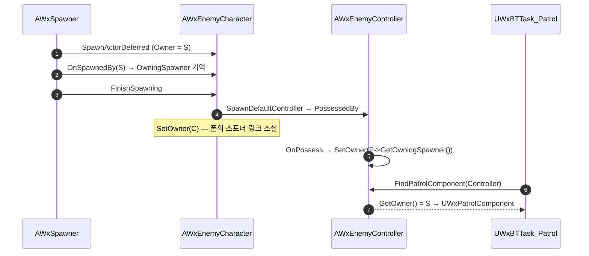

# 끊긴 스포너 링크를 컨트롤러 Owner 로 되살리기

## 계획

### 목표
스포너로 스폰된 적이 정찰 경로를 전혀 찾지 못해 정찰 브랜치가 통째로 죽어 있다. 폰→스포너 링크를 다시 걸어 정찰이 실제로 동작하게 한다.

### 수정 범위
| 파일 | 수정할 내용 | 구분 |
|---|---|---|
| `Source/WxGame/Character/WxEnemyCharacter.h/.cpp` | `GetOwningSpawner()` public getter 추가 | 수정 |
| `Source/WxGame/Controller/WxEnemyController.cpp` | `OnPossess` 에서 `SetOwner(Enemy->GetOwningSpawner())` | 수정 |
| `Plugins/WxAI/Source/WxAI/Public/WxPatrolComponent.h` | `FindPatrolComponent` 인자를 `const AController*` 로, 주석 정정 | 수정 |
| `Plugins/WxAI/Source/WxAI/Private/WxPatrolComponent.cpp` | `FindPatrolComponent` 를 컨트롤러 Owner 조회로 교체 | 수정 |
| `Plugins/WxAI/Source/WxAI/Private/WxBTTask_Patrol.cpp` | 호출부 2곳 변경, `bPatrolFinished` 주석 정정 | 수정 |

### 접근 방식
- **결함**: `AWxSpawner` 가 `SpawnActorDeferred` 로 Owner 를 자신으로 잡아도, 이어지는 `FinishSpawning` 안에서 `AutoPossessAI` 가 `SpawnDefaultController()` 를 부르고 `APawn::PossessedBy` 첫 줄 `SetOwner(NewController)` 가 Owner 를 덮어쓴다. 스포너는 attach 도 하지 않으므로 폰→스포너 링크가 전부 끊긴다(`Instigator` 는 null, `SetOwner` 가 `Children` 까지 옮김). 조회를 정교하게 만드는 것으로는 못 푼다.
- **링크를 폰이 아니라 AIController 에 건다**: 폰 Owner 는 엔진이 빙의 표현에 쓰는 자리지만, AIController 의 Owner 는 아무도 쓰지 않는다 — `SpawnDefaultController` 가 Owner 를 넣지 않고 `Possess`/`SetPawn` 도 만지지 않아 항상 null 이다. 그 빈자리에 스폰 주체를 건다.
- **조회는 한 갈래**: 정찰 경로는 항상 `AWxSpawner` 에만 붙는 전제라 컨트롤러 → 그 Owner → `FindComponentByClass` 로 끝난다. 기존 Owner·AttachParent 추측 분기는 삭제한다.
- **`PatrolTargetLocation` 은 유지**: 경로 조회와 역할이 다르다. 상속받은 `UBTTask_MoveTo` 에 이번 다리의 목표 좌표를 넘기는 유일한 통로다.

---

## 완료

### 수정한 파일
| 파일 | 수정한 내용 | 구분 |
|---|---|---|
| `Source/WxGame/Character/WxEnemyCharacter.h/.cpp` | `GetOwningSpawner()` 추가, `OnSpawnedBy` 주석에 정찰 용도 명시 | 수정 |
| `Source/WxGame/Controller/WxEnemyController.cpp` | `OnPossess` 에서 `SetOwner(Enemy->GetOwningSpawner())` | 수정 |
| `Plugins/WxAI/Source/WxAI/Public/WxPatrolComponent.h` | `FindPatrolComponent` 인자를 `const AController*` 로, 부착 위치·조회 경로 주석 정정 | 수정 |
| `Plugins/WxAI/Source/WxAI/Private/WxPatrolComponent.cpp` | `FindPatrolComponent` 를 컨트롤러 Owner 조회 3줄로 축소 | 수정 |
| `Plugins/WxAI/Source/WxAI/Private/WxBTTask_Patrol.cpp` | 호출부 2곳을 컨트롤러 인자로 변경, `bPatrolFinished` 관련 주석 2개 정정 | 수정 |

### 구현·결정과 그 이유
- **폰이 아니라 컨트롤러의 Owner 를 썼다**: 폰 Owner 는 엔진이 빙의 표현에 관리하는 자리라 덮어쓰면 규약과 싸운다. 반면 AIController 의 Owner 는 `SpawnDefaultController` 도 `Possess` 도 건드리지 않아 항상 비어 있어, 게임 측 링크를 걸기에 안전하다.
- **조회를 한 갈래로 좁혔다**: 정찰 경로는 항상 `AWxSpawner` 에만 붙는다는 규약이 정해져, 액터 자신·AttachParent 를 뒤지던 추측 분기가 전부 불필요해졌다. 조회가 3줄로 줄고 "왜 여기서 찾나"가 주석 한 줄로 설명된다.
- **`OnTaskFinished` 의 Pawn 조회를 없앴다**: 컨트롤러만 있으면 되므로 폰을 거칠 이유가 사라졌다.
- **`PatrolTargetLocation` 은 남겼다**: 경로 조회와 역할이 다르다 — 상속받은 `UBTTask_MoveTo` 에 이번 다리의 목표 좌표를 넘기는 유일한 통로다. 없애려면 `PerformMoveTask` 를 오버라이드해 엔진의 이동 요청 조립을 복제해야 해 유지비만 늘어난다.

### 계획 대비 달라진 점
- 계획대로. `bPatrolFinished` 관련 주석은 계획에 적은 1곳 외에 `OnTaskFinished` 쪽 1곳도 같은 이유로 함께 정정했다.

### 후속 과제
- 컴파일까지만 검증했다. PIE 로 스포너가 스폰한 적이 실제로 경로를 도는지, BT 디버거에서 Patrol 노드가 더 이상 즉시 `Failed` 로 떨어지지 않는지 확인 필요.
- 리뷰의 🔴 1번(억제 해제 재획득이 만료되지 않는 청각·촉각 자극을 집어 리시 복귀가 무한 오실레이션)은 그대로 남아 있다. 그게 고쳐지기 전엔 전투를 한 번 겪은 적의 정찰 복귀가 정상 동작하지 않는다.
