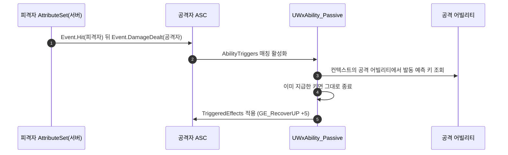

# 조립형 패시브 어빌리티 + 첫 조각: 적중 시 UP 회복

## 계획

### 목표
궁극기 자원 UP를 충전하는 경로가 하나도 없다. "적중 시 UP +5"를 되살리되 전용 어빌리티 한 건으로 만들지 않고, 패시브를 조립대로 세워 그 위에 첫 부품으로 얹는다. 다음 패시브(적중 시 MP 수급, 퍼펙트 가드 보상, 버프)는 C++ 없이 에셋 편집만으로 나오는 것이 목표다.

### 수정 범위
| 파일 | 수정할 내용 | 구분 |
|---|---|---|
| `Plugins/WxCore/.../WxGameplayTags.h`·`.cpp` | `Event.DamageDealt`(공격자 몫 적중 신호), `Ability.Passive`(식별 태그) 신설. 주인 없이 남은 `SetByCaller.Recovery.UP`·`.MP` 삭제 | 수정 |
| `Plugins/WxCombat/.../Attribute/WxCombatAttributeSet.cpp` | `ProcessDamageTaken`: 피격자 `Event.Hit` 송출 뒤 공격자 ASC로 `Event.DamageDealt` 송출 | 수정 |
| `Plugins/WxCombat/.../Ability/WxAbility_Passive.h`·`.cpp` | 조립대 어빌리티. 트리거로 활성화 → 발동당 1회 판정 → `TriggeredEffects`를 자신에게 적용 → 즉시 종료 | 신규 |

에셋 3건(`GE_RecoverUP`, `GA_Passive_UPOnHit`, `ABS_Player` 등록)은 사용자가 저작한다.

### 접근 방식
- **조립의 세 축**: 언제(엔진 순정 `AbilityTriggers`) + 무엇(`TriggeredEffects` GE 목록) + 얼마나(발동당 1회 고정 규칙). 효과를 GE 목록으로 둔 것이 확장성의 핵심이다 — GE는 엔진이 이미 갖춘 조립 단위라 어트리뷰트 가감·지속시간·태그·스택이 전부 표현되고, 새 효과에 C++가 필요 없다.
- **"때렸다" 신호를 새로 판다**: `Event.Hit`(피격자 몫)만 있고 공격자 몫이 없다. 대미지가 확정되는 유일한 지점인 피격자 어트리뷰트셋에서 공격자 ASC로 보낸다. 신호는 매 히트 사실 그대로 발행하고 횟수 제한은 듣는 쪽이 건다.
- **패시브는 순간 어빌리티**: 상주형은 그로기·사망이 `Ability` 전체를 지목해 취소하는 순간 영영 죽는다. 클라가 할 일이 없어 `ServerOnly`, 배타 점유와 무관해 `Independent`.
- **발동당 1회는 엔진 예측 키로**: 발동마다 새로 채워지는 `ActivationInfo`의 예측 키가 곧 발동 식별자다. 권위 측에 올라온 키가 없으면 GAS가 서버 키를 새로 만들어 넣으므로 스탠드얼론에서도 발동마다 다르고, 콤보 재발동도 새 키를 받는다. 어빌리티가 안 실린 적중은 키가 무효라 규칙이 저절로 무력화된다.
- **지급 조건은 "대미지가 들어갔는가" 하나**: 가드로 감소된 히트도 지급한다(기획 확정). 퍼펙트 가드·무적 회피·팀·사망 대상은 발행 지점을 지나지 않아 미지급이다.

---

## 완료

### 수정한 파일
| 파일 | 수정한 내용 | 구분 |
|---|---|---|
| `Plugins/WxCore/.../WxGameplayTags.h`·`.cpp` | `Event.DamageDealt`(공격자 몫, 규약 주석 포함)·`Ability.Passive` 신설, 주인 없던 `SetByCaller.Recovery.UP`·`.MP` 삭제 | 수정 |
| `Plugins/WxCombat/.../Attribute/WxCombatAttributeSet.cpp` | `ProcessDamageTaken`: 피격자 피격 이벤트 바로 뒤에 공격자 ASC로 같은 히트의 공격자 몫 이벤트 발행(최종 대미지·컨텍스트 동봉) | 수정 |
| `Plugins/WxCombat/.../Ability/WxAbility_Passive.h`·`.cpp` | 트리거 이벤트로 활성화해 지정 효과를 자신에게 걸고 즉시 끝나는 조립대 어빌리티. 공격 발동당 1회 게이트 포함 | 신규 |

### 구현·결정과 그 이유
- **신호와 제한의 분리**: 공격자 몫 이벤트는 히트마다 사실 그대로 나가고, 몇 번까지 받을지는 듣는 쪽이 정한다. 발행 지점에서 제한을 걸면 앞으로 붙을 다른 구독자가 조용히 히트를 놓친다.
- **조립 축을 엔진 것으로**: "언제"는 순정 트리거 필드가 이미 쥐고 있고, "무엇"은 GE 목록으로 뒀다. GE가 어트리뷰트 가감·지속시간·태그·스택을 모두 표현하므로 새 효과에 C++가 필요 없다. 트리거를 여럿 걸면 그중 아무거나 왔을 때 묶음 전체를 거는 OR로 정의했고, 계기마다 다른 효과가 필요하면 패시브를 나눈다.
- **발동 식별은 예측 키로**: 처음엔 베이스에 발동 일련번호를 두려 했으나, 권위 측에서도 올라온 키가 없으면 엔진이 서버 키를 새로 만들어 활성화 정보에 박는다는 걸 확인했다. 스탠드얼론에서도 발동마다 값이 다르고 콤보 재발동도 새 키를 받으므로 베이스를 건드릴 이유가 사라졌다. 키가 실리지 않는 트리거는 검사가 저절로 통과해 매번 지급된다 — 그래서 횟수 스위치도 두지 않았다.
- **두 효과 목록을 합치지 않은 이유**: 활성 구간 소유 효과는 베이스가 `Super` 호출 전에 무조건 적용한다. 합치면 지급을 막는 유일한 방법이 본체를 아예 돌리지 않는 것이 되고, 베이스가 활성화 시점에 할 일을 늘릴 때마다 스킵 경로만 조용히 어긋난다. 지속형 효과가 같은 프레임에 걷히는 문제도 따라온다.
- **사망 중 차단·자해 예외를 따로 짜지 않음**: 사망 어빌리티가 이미 모든 어빌리티 활성화를 막고 있고, 자해는 치트 경로뿐이다.

### 계획 대비 달라진 점
- 발동당 1회를 켜고 끄는 스위치를 없애고 고정 규칙으로 바꿨다(사용자 판단). 키가 없는 트리거에서 규칙이 스스로 무력화되므로 손해가 없다.
- 에셋 저작은 사용자가 맡기로 해 코드와 빌드까지만 했다.

### 후속 과제
- 에셋 3종(UP 회복 GE, 패시브 어빌리티 BP, 플레이어 어빌리티 세트 등록) 저작과 PIE 검증은 사용자가 이어받는다.
- 적중 시 MP 수급은 같은 신호를 그대로 쓰므로 GE 하나 추가로 가능하다. 대미지 비례 효과(흡혈)가 필요해지면 이벤트 크기를 SetByCaller로 실어 주는 통로를 그때 연다.
