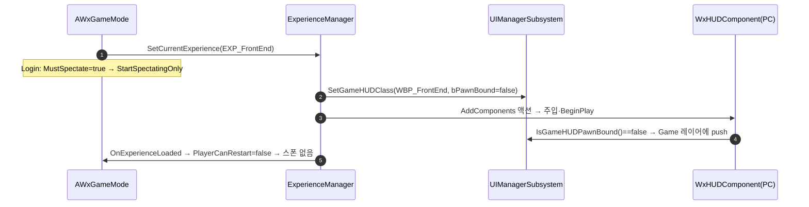

# 폰 없는 Experience 지원

## 계획

### 목표
`EXP_FrontEnd` 의 `DefaultPawnClass` 를 비워도 프론트엔드 UI 가 뜨고 에러 로그가 없도록, "플레이어 폰 없는 Experience" 를 정당한 구성으로 만든다. 플레이어는 엔진 스펙테이터 상태로 남고 HUD 는 로드 즉시 뜬다.

### 수정 범위
| 파일 | 수정할 내용 | 구분 |
|---|---|---|
| `Source/WxGame/Framework/WxExperienceDefinition.h` | `DefaultPawnClass` 툴팁에 "비우면 폰 없는 Experience" 계약 명시 | 수정 |
| `Source/WxGame/Framework/WxExperienceActionSet.h` | `GameHUDClass` 툴팁의 "빙의한" 전제 정정 | 수정 |
| `Source/WxGame/Framework/WxGameMode.h/.cpp` | 폰 클래스 미설정 Error 로그 제거, `MustSpectate` 오버라이드 신설 | 수정 |
| `Source/WxGame/Framework/WxExperienceManagerComponent.cpp` | HUD 발행에 빙의 결합 여부 동봉, 발행을 액션 활성 앞으로 이동 | 수정 |
| `Plugins/WxUI/Source/WxUI/Public|Private/System/WxUIManagerSubsystem.h/.cpp` | `SetGameHUDClass` 에 빙의 결합 인자 추가, `IsGameHUDPawnBound` | 수정 |
| `Plugins/WxUI/Source/WxUI/Public|Private/Component/WxHUDComponent.h/.cpp` | 빙의에 묶이지 않으면 BeginPlay 에서 즉시 push | 수정 |
| `Content/Framework/EXP_FrontEnd.uasset` | `DefaultPawnClass` 비움 | 데이터 |

### 접근 방식
- **폰 유무의 출처는 Experience 하나**: `DefaultPawnClass` 가 비었는지에서 GameMode 갈래와 UI 갈래를 모두 파생한다. `bStartPlayersAsSpectators` 같은 GameMode 프로퍼티를 쓰면 출처가 둘이 되므로 쓰지 않는다.
- **GameMode 는 엔진의 spectator-only 모델을 그대로 쓴다**: `MustSpectate` 가 폰 없는 Experience 면 참을 돌려, 로그인 때 엔진이 플레이어를 스펙테이터로 표시하고 이후 시작·재시작 요청을 한 술어로 거른다. PC 는 Spectating 상태에 남고, 지금처럼 Inactive 로 떨어지는 실패 경로가 사라진다.
- **UI 는 기존 발행 통로에 한 값을 더 싣는다**: Experience 파이프라인이 HUD 클래스와 함께 "빙의에 묶이는가" 를 UI 매니저에 발행한다. HUD 컴포넌트는 묶이지 않으면 BeginPlay 에서 바로 띄우고, 묶이면 지금처럼 빙의를 기다린다. WxUI 가 WxGame 을 보지 않는 방향은 유지한다.
- **발행이 주입보다 앞선다**: 컴포넌트 BeginPlay 가 확정값을 읽도록 발행 호출을 액션 활성 앞으로 옮긴다. 빙의 경로는 로드 완료 뒤라 영향이 없다.

---

## 완료

### 수정한 파일
| 파일 | 수정한 내용 | 구분 |
|---|---|---|
| `Source/WxGame/Framework/WxExperienceDefinition.h` | `DefaultPawnClass` 툴팁에 "비우면 SpectatorClass 로 빙의" 계약 명시 | 수정 |
| `Source/WxGame/Framework/WxGameMode.h/.cpp` | 폰 클래스 미설정 Error 로그 제거, 비어 있으면 `SpectatorClass` 반환 | 수정 |
| `Content/Framework/EXP_FrontEnd.uasset` | `DefaultPawnClass` 비움 (사용자) | 데이터 |
| `Content/Maps/LV_FrontEnd.umap` | `CameraActor_0` Auto Player Activation 켬 (사용자) | 데이터 |

### 구현·결정과 그 이유
- **07-30 "널 폰 = 오류" 결정을 뒤집었다**: 그때는 폰 없는 Experience 가 없어 미설정을 실수로만 봤다. 프론트엔드가 폰 없이 돌아야 하므로 빈 값을 정당한 구성으로 승격했고, 그 대가로 전투 Experience 에서 폰 클래스를 깜빡했을 때의 Error 로그는 사라진다 — 증상(캐릭터 대신 보이지 않는 스펙테이터)이 테스트에서 즉시 보이므로 감수한다.
- **빈 값은 엔진 스펙테이터 폰으로 빙의시킨다**: 폰 클래스가 비면 GameMode 의 `SpectatorClass`(기본 `ASpectatorPawn`)를 돌려준다. 빙의가 정상적으로 일어나므로 HUD 컴포넌트·UI 매니저·발행 순서를 하나도 건드리지 않고 기존 빙의 경로 그대로 프론트엔드 화면이 뜬다. "폰 클래스의 출처는 Experience 하나" 원칙에 코드 폴백이 하나 생기지만, 대상이 엔진 스펙테이터라 "비움 = 스펙테이터" 로 읽히고 캐릭터가 조용히 바뀌는 종류의 폴백은 아니다.
- **프론트엔드 위젯은 폰을 안 본다**: WBP_FrontEnd 는 뷰모델 리졸버를 쓰지 않고, 플레이어 캐릭터 리졸버는 캐스트 실패 시 null 을 돌려주므로 스펙테이터 폰이 빙의돼 있어도 안전하다. 입력 모드는 CommonUI 가 위젯의 Menu 설정으로 걸어 스펙테이터 이동 입력이 새지 않는다.

### 계획 대비 달라진 점
- **접근을 통째로 바꿨다.** 계획은 `MustSpectate` 로 플레이어를 spectator-only 로 남기고 UI 매니저에 "빙의 결합 여부" 를 발행해 HUD 컴포넌트가 BeginPlay 에서 즉시 push 하는 안이었다. 사용자 제안대로 빈 값이면 스펙테이터 폰을 스폰·빙의시키는 쪽이 같은 결과를 훨씬 적은 변경으로 얻고(WxUI 무변경, 발행 순서 이동·분할 화면 한계 소멸), 그렇게 바꿨다. 한번 작성했던 WxUI·ExperienceManager 변경은 되돌렸다.
- **빌드·PIE 검증을 하지 않았다.** 다른 두 세션이 에디터로 WxAI 작업 중이라 에디터를 닫을 수 없었고, 사용자가 직접 빌드·테스트하기로 했다.

### 후속 과제
- 검증 항목: WxEditor 빌드 통과, LV_FrontEnd PIE 에서 WBP_FrontEnd 표시·Error 로그 없음·스펙테이터 폰 빙의, 전투 맵 PIE 에서 빙의 뒤 WBP_GameHUD 표시(회귀).
- `ASpectatorPawn` 은 복제되지 않는 폰이라, 폰 없는 Experience 를 데디 서버로 돌리면 클라이언트가 폰을 못 받아 HUD 가 안 뜬다. 프론트엔드는 스탠드얼론이라 무관하며, 필요해지면 복제되는 클래스로 바꾼다.
