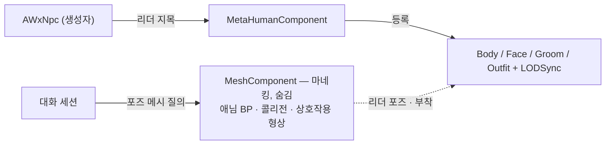

# NPC 메타휴먼 적용 — 리더 메시 지목을 오너 계약으로

## 계획

### 목표
`UWxMetaHumanComponent` 가 리더 메시를 오너의 캐릭터 계보에서만 찾는 탓에, 이미 컴포넌트가 붙어 있는 `AWxNpc` 에서는 조립이 통째로 건너뛰어진다. 리더를 오너가 지목하게 바꿔 계보 의존을 끊고, 부착물이 늘면서 깨지는 대화 포즈 대상 해석을 명시 계약으로 고친다.

### 수정 범위
| 파일 | 수정할 내용 | 구분 |
|---|---|---|
| `Source/WxGame/Character/WxMetaHumanComponent.h/.cpp` | 리더 메시 멤버(`Transient`)와 지목 진입점 추가, 캐릭터 캐스트 두 곳 제거 | 수정 |
| `Source/WxGame/Character/WxCharacterBase.cpp` | 생성자에서 캐릭터 메시를 리더로 지목 | 수정 |
| `Source/WxGame/Character/WxNpc.h/.cpp` | 생성자에서 자기 메시를 리더로 지목, 포즈 메시 오버라이드 | 수정 |
| `Plugins/WxDialogue/.../Public/WxDialogueActor.h`, `Private/WxDialogueActor.cpp` | 포즈 메시 가상 접근자 추가(기본 없음) | 수정 |
| `Plugins/WxDialogue/.../Private/WxDialogueSessionComponent.cpp` | 포즈 대상 메시를 그 접근자로 해석 | 수정 |
| `Content/WorldObject/Npc/BP_Npc.uasset` | 메타휴먼 슬롯 기입 | 수정(에셋) |

### 접근 방식
- **리더는 오너가 지목한다**: 컴포넌트가 오너 타입을 알 이유가 없다. 캐릭터든 NPC 든 자기 구동 메시를 생성자에서 넘긴다 — 엔진이 이동 컴포넌트에 갱신 대상을 물려주는 것과 같은 자리·같은 방식이다. 생성자는 CDO 뿐 아니라 모든 인스턴스에서 돌고 그때 서브오브젝트 생성이 그 인스턴스의 것을 돌려주므로, BP 파생·배치 인스턴스에서도 포인터가 자기 것으로 잡힌다. 직렬화할 값이 아니라 엔진 선례대로 트랜지언트다.
- **계보 의존 제거**: 등록·해제 두 곳의 캐스트가 사라지고 계약이 "지목받은 리더에 표시용 부착물을 조립한다" 한 문장이 된다. 지목이 없으면 지금처럼 아무것도 만들지 않아, 이 컴포넌트를 안 쓰는 액터는 무영향이다.
- **포즈 대상은 대화 액터가 답한다**: 포즈 대상이 될 수 있는 것은 대화 액터 계보뿐이다 — 상호작용 경로는 대화 컴포넌트의 오너로 들어오고, 퀘스트 트리 경로는 대상을 아예 넘기지 않는다. 그래서 계약을 그 베이스에 둔다. 기본은 "없음"(말 거는 물체는 스켈레탈 메시가 없다)이고 NPC 만 자기 리더 메시를 답한다. 소유 컴포넌트 집합에서 아무거나 뽑던 추측이 사라져 부착물이 몇 개로 늘든 무관해진다.
- **NPC 쪽 부수 조치는 없다**: 부착물은 전부 충돌 없음이라 상호작용 사거리 판정과 스캐너 오버랩에 끼어들지 않고, 리더를 숨겨도 콜리전은 그대로다. 데디케이티드 서버는 조립을 건너뛰므로 서버 판정도 종전과 같다.

### 감수하는 손실
- 리더를 숨기면 컴포넌트가 상시 포즈 갱신을 걸므로, NPC 리더도 화면 밖에서 포즈를 계속 만든다(플레이어와 같은 조건). NPC 수가 늘면 비용이 눈에 띌 수 있고 그때는 별도 과제다.
- 상호작용 사거리·감지 형상은 마네킹 피직스 애셋이라 체형이 다른 메타휴먼과 미세하게 어긋난다. 바디 포스트프로세스 보정이 평가되지 않는 것도 포함해, 캐릭터에서 이미 감수한 것과 같은 종류다.

---

## 완료

### 수정한 파일
| 파일 | 수정한 내용 | 구분 |
|---|---|---|
| `Source/WxGame/Character/WxMetaHumanComponent.h/.cpp` | 리더 메시 멤버·지목 진입점 추가, 캐릭터 캐스트 두 곳 제거, 오너 지역 변수를 실제 쓰는 자리로 이동 | 수정 |
| `Source/WxGame/Character/WxCharacterBase.cpp` | 생성자에서 캐릭터 메시를 리더로 지목 | 수정 |
| `Source/WxGame/Character/WxNpc.h/.cpp` | 생성자에서 자기 메시를 리더로 지목, 포즈 메시 오버라이드 | 수정 |
| `Plugins/WxDialogue/.../WxDialogueActor.h/.cpp` | 포즈 메시 가상 접근자 추가(기본 없음) | 수정 |
| `Plugins/WxDialogue/.../WxDialogueSessionComponent.cpp` | 포즈 대상 메시를 그 접근자로 해석 | 수정 |
| `Plugins/WxDialogue/README.md` | 새 대화 대상 확장 규약에 포즈 메시 지목 추가 | 수정 |

### 구현·결정과 그 이유
- **지목은 생성자에서**: 등록 시점에 오너에게 되묻는 방식은 오너들이 액터 말고는 공통 베이스가 없어 인터페이스를 새로 세워야 했다. 생성자는 CDO 뿐 아니라 모든 인스턴스에서 돌고 그때 서브오브젝트 생성이 그 인스턴스의 것을 돌려주므로, 지목 시점으로 가장 이르고 확실하다. 엔진이 이동 컴포넌트에 갱신 대상을 물려주는 자리와 같다.
- **트랜지언트가 안전한 근거를 엔진에서 확인**: 프로퍼티 초기화가 아키타입에서 값을 복사할 때 트랜지언트이면서 인스턴스 참조인 프로퍼티는 건너뛴다. BP 파생은 아키타입이 곧 자기 CDO 라 복사 단계 자체가 생략되기도 한다. 어느 경로든 생성자가 넣은 인스턴스 자기 포인터가 살아남는다.
- **해제 조건을 리더 포인터로**: 표시를 되돌리는 조건이 "바디를 만들었다"에서 "바디를 만들었고 리더를 안다"로 한 겹 늘었지만, 오너 계보를 다시 캐스팅하던 코드가 통째로 사라져 순증은 없다.
- **포즈 계약은 대화 액터 베이스에**: 세션이 소유 컴포넌트 집합에서 스켈레탈 메시를 아무거나 뽑던 자리다. 집합이 정렬을 보장하지 않아 부착물이 늘면 어느 것이 뽑힐지 알 수 없었고, 마침 메타휴먼이 셋을 더한다. 대상 진입점이 대화 정의의 오너 아니면 아예 없음 둘뿐이라, 계약을 그 베이스에 두면 추측 없이 닫힌다.
- **추측 폴백을 남기지 않음**: 계보 밖 액터를 위한 옛 탐색을 남겨 두면 같은 모호함이 그대로 남는다. 대상이 될 수 있는 경로를 다 확인했으므로 지웠다.

### 계획 대비 달라진 점
- **에셋 작업 미착수**: NPC 메타휴먼 폴더가 빈 디렉터리뿐이라 어셈블 산출물이 없다. 슬롯에 넣을 대상이 없어 BP 기입과 PIE 확인을 하지 못했다. 코드 경로는 열렸고 빌드까지 마쳤다.

### 검증 결과
- WxEditor(Development) 빌드 성공(경고 0).
- PIE 실동작은 에셋이 준비된 뒤로 미뤘다.

### 후속 과제
- NPC 메타휴먼 어셈블 → BP_Npc 슬롯 기입 → PIE 로 외형·LOD·상호작용·대사 포즈 확인, 그리고 BP_Player 회귀 확인.
- 리더를 숨기면 상시 포즈 갱신이 걸리므로, 월드에 NPC 가 늘면 비용을 다시 본다.
