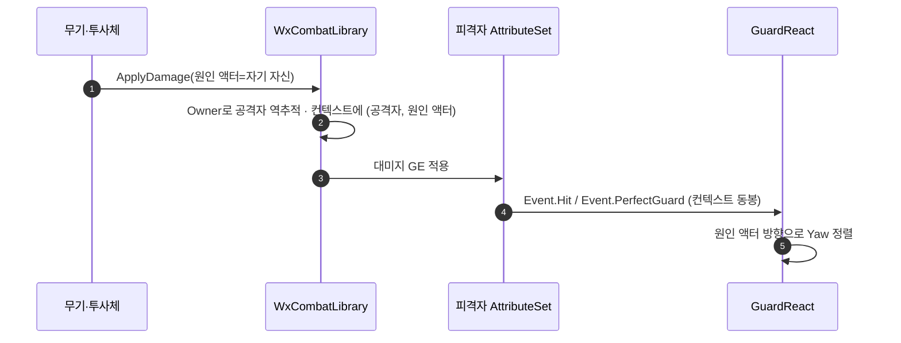

# 가드 리액션이 공격 원인 액터를 쳐다보게

## 계획

### 목표

가드 흡수 연출이 막은 방향과 어긋나는 것을 없앤다. 옆·뒤에서 온 공격을 막아도 원래 보던 방향 그대로 자세를 취하는데, 가드 리액션 발동 시 공격을 낸 액터 쪽으로 Yaw를 맞춘다. 쳐다볼 대상이 무기 스윙이면 무기, 투사체면 투사체가 되도록 대미지 파이프라인이 진짜 원인 액터를 싣게 하는 것이 앞선 절반이다.

### 수정 범위

| 파일 | 수정할 내용 | 구분 |
|---|---|---|
| `Plugins/WxCombat/.../WxCombatLibrary.h` · `.cpp` | `ApplyDamage`의 첫 인자를 공격자 ASC → 원인 액터로 교체. 공격자 ASC는 안에서 역추적하고, 컨텍스트에 `AddInstigator(공격자, 원인 액터)` | 수정 |
| `Plugins/WxCombat/.../Weapon/WxWeaponBase.cpp` | `ProcessHit`이 무기 자신을 넘긴다 (ASC 조회 제거) | 수정 |
| `Plugins/WxCombat/.../Weapon/WxProjectileBase.cpp` | 오버랩 히트가 투사체 자신을 넘긴다 | 수정 |
| `Plugins/WxCombat/.../Ability/WxAbility_Finisher.cpp` | 아바타를 넘긴다 (무기·투사체 액터가 없는 경로) | 수정 |
| `Plugins/WxCombat/.../Cue/WxCueNotify_Hit.cpp` | 카메라 셰이크 대상 판별을 원인 액터 → Instigator로 교체 | 수정 |
| `Plugins/WxCombat/.../Attribute/WxCombatAttributeSet.cpp` | `ProcessPerfectGuard`가 보내는 `Event.PerfectGuard`에 `ContextHandle`을 싣는다 | 수정 |
| `Plugins/WxCombat/.../Ability/WxAbility_GuardReact.cpp` | `ActivateAbility`에서 원인 액터를 향해 Yaw 회전 | 수정 |

에셋·데이터 변경 없음.

### 접근 방식

- **대미지 진입점이 받는 것을 "누가 때렸나"에서 "무엇이 때렸나"로 바꾼다**: 대미지 단일 진입점의 첫 인자를 공격자 ASC 대신 원인 액터로 받고, 공격자는 그 액터에서 역추적한다. 원인 액터 자신이 ASC를 가지면 그것이 공격자(처형처럼 무기 액터를 들고 있지 않은 경로, 나중에 맨손 타격이 생겨도 같은 갈래), 없으면 `Owner`가 공격자다 — 무기는 캐릭터에 부착될 때, 투사체는 스폰될 때 각각 Owner가 아바타로 세워진다. 인자를 늘리지 않고, 무기·투사체 호출부가 직접 하던 ASC 조회도 사라지며, 원인 액터와 공격자 ASC가 어긋나게 넘어오는 경우 자체가 없어진다. ASC가 캐릭터 서브오브젝트라 이 역추적은 지금 코드가 쓰던 ASC 소유 액터와 같은 곳으로 수렴한다.

- **원인 액터를 폰으로 가정하던 유일한 곳을 정리한다**: 히트 큐가 원인 액터를 폰으로 캐스팅해 카메라 셰이크를 공격자에게 보낼지 피격자에게 보낼지 가른다. 원인 액터가 무기·투사체가 되면 그 캐스팅이 실패하므로, 공격자를 뜻하는 Instigator로 바꾼다. 원인 액터를 읽는 곳은 이 한 곳뿐임을 확인했다.

- **퍼펙트 가드 이벤트에도 컨텍스트를 싣는다**: 피격 이벤트는 이미 컨텍스트를 싣지만 퍼펙트 가드 이벤트는 가해자·대상만 채운다. 같은 대미지 스펙의 컨텍스트를 실어 네 갈래(가드 피격·넉 계열·가드 브레이크·퍼펙트 가드)가 모두 같은 방식으로 원인 액터를 집게 한다.

- **원인 액터 → Instigator 폴백**: 회전 대상은 컨텍스트의 원인 액터로 집고, 널이면 이벤트의 Instigator로 떨어진다. 폴백은 방어가 아니라 실제 경로다 — 투사체는 히트 직후 스스로 파괴되는데, 소유 클라는 트리거 RPC를 나중에 받으므로 그때 원인 액터 참조가 널로 풀릴 수 있다. 그 경우 공격자를 쳐다본다.

- **회전 시점은 커밋·몽타주가 모두 선 뒤**: 어느 하나라도 실패해 곧장 끝나면 연출 없이 방향만 홱 바뀐 캐릭터가 남는다. 피격 리액션이 넉업·회전을 커밋 뒤로 미룬 것과 같은 이유다. 슬로우타임보다는 앞에 둔다.

- **Yaw만 건드린다**: 아바타의 현재 회전에서 Yaw만 방향 벡터의 것으로 바꾼다. 수평 성분이 0에 가까우면(원인 액터가 바로 위·아래이거나 같은 자리 — 자해 치트 등) 회전하지 않는다.

- **머신**: 서버와 소유 클라 양쪽에서 활성화되는 어빌리티라 회전도 양쪽에서 로컬로 일어나고, 시뮬레이티드 프록시에는 서버 회전이 복제된다. 별도 처리 없음.

---

## 완료

### 수정한 파일

| 파일 | 수정한 내용 | 구분 |
|---|---|---|
| `Plugins/WxCombat/.../WxCombatLibrary.h` · `.cpp` | `ApplyDamage`가 ASC 둘 대신 액터 둘(원인 액터·대상)을 받는다. 공격자를 역추적하고 컨텍스트에 (공격자, 원인 액터)를 싣는다. 역추적 계약을 헤더 주석에 명시 | 수정 |
| `Plugins/WxCombat/.../Weapon/WxWeaponBase.cpp` | 무기 자신과 피격 액터를 넘기고, 직접 하던 ASC 조회와 그 인클루드를 걷어냄 | 수정 |
| `Plugins/WxCombat/.../Weapon/WxProjectileBase.cpp` | 투사체 자신과 피격 액터를 넘김 | 수정 |
| `Plugins/WxCombat/.../Ability/WxAbility_Finisher.cpp` | 아바타와 대상 액터를 넘기고 ASC 조회를 걷어냄 | 수정 |
| `Plugins/WxCombat/.../Cue/WxCueNotify_Hit.cpp` | 카메라 셰이크 대상 판별을 원인 액터 → Instigator로 교체 | 수정 |
| `Plugins/WxCombat/.../Attribute/WxCombatAttributeSet.cpp` | 퍼펙트 가드 이벤트에 컨텍스트 동봉 | 수정 |
| `Plugins/WxCombat/.../Ability/WxAbility_GuardReact.cpp` | 발동 시 원인 액터 방향으로 Yaw 정렬 | 수정 |

### 구현·결정과 그 이유

- **인자를 늘리는 대신 첫 인자의 의미를 바꿨다**: 원인 액터를 따로 받으면 호출부가 공격자 ASC와 원인 액터를 각각 넘기게 되어 둘이 어긋난 조합이 가능해진다. 원인 액터 하나만 받고 공격자를 역추적하면 그 조합 자체가 성립하지 않고, 무기·투사체 호출부가 직접 하던 ASC 조회도 없어진다. ASC가 캐릭터 서브오브젝트라 역추적 결과는 지금까지 쓰던 ASC 소유 액터와 같은 액터로 수렴한다.

- **역추적을 두 갈래로 둔 이유**: 무기·투사체는 자기 ASC가 없어 Owner가 공격자이고, 캐릭터가 직접 낸 히트(처형, 앞으로 생길 맨손 타격)는 자기 자신이 공격자다. 한 갈래로만 쓰면 후자에서 컨트롤러·플레이어스테이트를 공격자로 잡게 된다.

- **처형의 널 검사를 ASC에서 아바타로 옮겼다**: 넘기는 것이 액터가 됐으니 검사 대상도 그것이어야 한다. 아바타가 없으면 ASC도 없으므로 걸러내는 범위는 같다.

- **카메라 셰이크 판별을 Instigator로**: 원인 액터가 무기·투사체가 되면 폰 캐스팅이 실패해 공격자 화면이 흔들리지 않는다. 공격자를 뜻하는 자리는 이제 Instigator뿐이다. 원인 액터를 읽는 곳은 코드 전체에서 이 한 곳뿐이었다.

- **퍼펙트 가드 이벤트에 컨텍스트를 실었다**: 이것이 없으면 네 갈래 중 퍼펙트 가드만 원인 액터를 집지 못해, 같은 자리에서 폴백으로 공격자를 보게 된다. 요청대로 이벤트가 원인 액터를 전달하게 맞췄다.

- **부착된 원인 액터는 공격자로 대체한다**: 근접 무기는 손에 들려 스윙으로 몸 밖에 나가 있어 그 위치가 팔이 뻗은 방향일 뿐이라, 그쪽을 보면 패링 자세가 공격자에서 비껴간다. 원인 액터가 공격자에게 부착돼 있으면 공격자를 보고, 떨어져 날아온 것(투사체)만 자기 위치를 방향으로 쓴다. 부착 여부로 가르면 나중에 폭발물·함정 같은 원인 액터가 생겨도 손볼 것이 없다. 타입 검사(투사체만 통과)는 머신 간 결과가 확실하다는 이점이 있지만 그때마다 조건을 늘려야 해 택하지 않았다.

- **폴백은 남겼다**: 투사체는 히트 직후 스스로 파괴되므로, 트리거 RPC를 나중에 받는 소유 클라에서는 참조가 널로 풀릴 수 있다. 방어가 아니라 실제로 밟는 경로이며, 위 부착 판정과 한 식으로 합쳐졌다.

- **대상 인자도 액터로**: 원인 액터만 액터로 받으면 인자의 층이 어긋난다. 대상은 그 액터의 ASC 한 단계라 새로 감출 계약도 없어 함께 액터로 내렸고, ASC 해석은 전부 라이브러리 안에서 끝난다. 무기와 처형은 조회 줄이 사라졌고, 투사체만 회피 연출 판정에 대상 ASC가 필요해 자기 조회를 그대로 들고 있다.

- **두 액터 인자의 const가 다르다**: 원인 액터는 컨텍스트에 실려 나가므로 비const여야 하고, 대상은 ASC를 찾는 데만 쓰여 const로 받는다. 처형이 대상을 `TWeakObjectPtr<const AActor>`로 들고 있어 이 비대칭이 오히려 호출부를 그대로 두게 해 준다.

- **검증**: WxEditor(Development) 빌드 성공.

### 계획 대비 달라진 점

- **대상 인자도 ASC → 액터로 바꿨다**: 계획에는 원인 액터만 있었는데, 구현 뒤 인자 층을 맞추자는 요청을 받아 이어서 진행했다.

### 후속 과제

- **미검증**: PIE 실동작. 네 갈래(가드 피격·넉 계열·가드 브레이크·퍼펙트 가드)에서 흡수 자세가 공격 쪽을 보는지, 투사체를 가드로 받을 때 날아온 방향을 보는지, 그리고 원인 액터 변경의 유일한 파급인 공격자 화면 히트 카메라 셰이크가 그대로인지.
- **부착 복제 타이밍**: 소유 클라에서 무기 부착이 아직 도착하지 않은 순간에 리액션이 뜨면 그 머신만 무기를 볼 수 있다. 무기는 전투 한참 전에 붙으므로 실제로 걸릴 일은 없다고 본다.
- **주인 없는 원인 액터**: ASC도 없고 Owner도 공격자가 아닌 액터(함정 등)가 나중에 생기면 공격자를 찾지 못해 대미지가 조용히 들어가지 않는다. 계약을 헤더 주석에 남겼다.
- **이동 중 회전 복귀**: 이동 입력이 있는 동안에는 CMC가 다음 틱에 다시 이동 방향으로 돌린다. 피격 리액션이 안고 있는 것과 같은 보류 사안이라 손대지 않았다.
