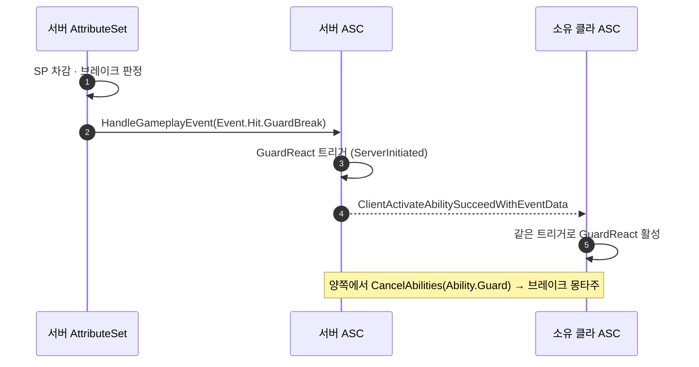

# 가드 리액션을 ServerInitiated 어빌리티로 분리

## 계획

### 목표

가드 페이즈 전환(GuardHitReact·GuardKnockback·GuardBreak·PerfectGuard)이 서버 로컬 게임플레이 이벤트에만 실려 소유 클라이언트에 닿지 않는 문제를 없앤다. 리액션 페이즈만 ServerInitiated 어빌리티로 떼어내 엔진의 트리거 복제 경로(`ClientActivateAbilitySucceedWithEventData`)에 태우고, `UWxAbility_Guard`는 가드 홀드 상태(Effect.Guard + 자세 몽타주)만 소유하게 한다.

### 수정 범위

| 파일 | 수정할 내용 | 구분 |
|---|---|---|
| `Plugins/WxCore/.../WxGameplayTags.h` · `.cpp` | `Event_Hit_GuardBreak`, `Ability_GuardReact` 추가 | 수정 |
| `Plugins/WxCombat/.../Ability/WxAbility_GuardReact.h` · `.cpp` | 가드 리액션 어빌리티 신설 (ServerInitiated·Reaction) | 신규 |
| `Plugins/WxCombat/.../Ability/WxAbility_Guard.h` · `.cpp` | 리액션 페이즈·이벤트 청취·SP 조회 제거, 홀드 상태만 남김 | 수정 |
| `Plugins/WxCombat/.../Attribute/WxCombatAttributeSet.cpp` | `ProcessDamageTaken`에서 가드 브레이크를 판정해 반응 태그를 교체 | 수정 |

`UWxAbility_HitReact`와 `ProcessPerfectGuard`는 손대지 않는다.

### 접근 방식

- **판정은 서버에서 끝내고 결과를 이벤트 태그로 보낸다**: 트리거 RPC는 어트리뷰트 프로퍼티 복제보다 먼저 도착하므로, 클라가 `GetSP()`로 브레이크를 다시 판정하면 서버와 갈린다. `ProcessDamageTaken`이 SP 고갈을 판정해 반응 태그를 `Event.Hit.GuardBreak`로 바꾼다.

- **트리거 계층으로 라우팅을 가른다**: GuardReact는 부모 `Event.Hit` 하나만, HitReact는 지금처럼 자식들만 등록한다. `HandleGameplayEvent`가 부모 사슬을 훑으므로 두 어빌리티 모두 후보로 오르지만, `ActivationRequiredTags = Ability.Guard` ↔ `ActivationBlockedTags = Effect.Guard`가 배타라 한 히트에 하나만 성립한다. 한 어빌리티가 조상마다 중복 발화하는 일도 없다.

- **몽타주 소유권**: 리액션이 슬롯을 가져가면 Guard의 몽타주 태스크가 Interrupted를 받는데, `Ability.GuardReact`가 붙어 있으면 종료하지 않는다. 리액션 종료(태그 제거)를 받아 자세 몽타주를 다시 틀거나, 키를 뗐으면 그때 종료한다.

- **브레이크**: GuardReact가 `CancelAbilities({Ability.Guard})`로 Guard를 끊는다. GuardReact는 서버·소유 클라 양쪽에서 활성화되므로 취소도 양쪽 로컬에서 일어나고, Effect.Guard 해제는 서버 Guard의 `EndAbility`가 하며 클라에는 GE 복제로 도착한다.

### 에디터 수동 작업

1. `Content/AbilitySystem/Ability/GA_GuardReact` 생성 (부모 `WxAbility_GuardReact`)
2. `GA_Guard`의 가드 리액션 몽타주 4개와 슬로우타임 값 2개를 `GA_GuardReact`로 이관
3. `GA_Guard`가 든 어빌리티 셋(`ABS_Player` 등)에 `GA_GuardReact` 추가

---

## 완료

### 수정한 파일

| 파일 | 수정한 내용 | 구분 |
|---|---|---|
| `Plugins/WxCore/.../WxGameplayTags.h` · `.cpp` | `Event_Hit_GuardBreak`, `Ability_GuardReact` 추가. `Effect_Guard` 주석을 새 해제 경로에 맞게 정정 | 수정 |
| `Plugins/WxCombat/.../Ability/WxAbility_GuardReact.h` · `.cpp` | 가드 리액션 어빌리티 신설 | 신규 |
| `Plugins/WxCombat/.../Ability/WxAbility_Guard.h` · `.cpp` | 리액션 몽타주 4개·슬로우타임 값·이벤트 청취·SP 조회 제거. 슬롯 양보와 자세 복귀 추가 | 수정 |
| `Plugins/WxCombat/.../Ability/WxAbility_HitReact.h` · `.cpp` | 차단 태그를 `Effect.Guard` → `Ability.Guard`로 교체, 주석 정정 | 수정 |
| `Plugins/WxCombat/.../Attribute/WxCombatAttributeSet.cpp` | `ProcessDamageTaken`이 가드 브레이크를 판정해 반응 태그를 교체 | 수정 |

### 구현·결정과 그 이유

- **트리거 등록을 부모 하나로**: GuardReact는 `Event.Hit` 부모만, HitReact는 지금처럼 자식만 등록한다. 한 어빌리티가 조상마다 중복 발화하는 것을 피하면서, 반응 태그가 빈 평타(부모 그대로 오는 히트)도 가드에서는 흡수 연출이 나가야 하기 때문이다. 두 어빌리티가 같은 히트에 후보로 오르지만 `Ability.Guard` 요구 ↔ `Effect.Guard` 차단이 배타라 하나만 성립한다.

- **게이트를 `Effect.Guard`가 아니라 `Ability.Guard`로**: 복제 GE 태그가 아니라 로컬 어빌리티 상태라 클라에서 확실하고, 가드가 끝난 뒤 Effect.Guard만 남는 구간에서 오발동하지 않는다.

- **브레이크에서 GE를 직접 걷지 않고 가드를 취소**: `RemoveActiveEffectsWithTags`로 남의 GE 수명에 손대는 대신 소유자인 가드 어빌리티를 끊는다. GuardReact는 서버·소유 클라 양쪽에서 활성화되므로 취소도 양쪽 로컬에서 일어나고, 실제 GE 해제는 서버 가드의 `EndAbility`가 하며 클라에는 복제로 수렴한다.

- **자세 복귀 리스너를 활성화가 아니라 인터럽트 지점에서 건다**: `UAbilityTask_WaitGameplayTagRemoved`는 태스크를 걸 때 태그가 없으면 즉시 해제로 발화한다. 리액션이 자세를 밀어낸 그 시점에 걸어야 그 오발화를 피한다. 연속 피격은 리액션이 스스로 재발동하며 밀어내기를 되풀이하므로 한 번 쓰고 그 지점에서 다시 건다.

- **브레이크 판정을 대미지 파이프라인에서 끝냄**: 어빌리티 트리거는 RPC라 어트리뷰트 프로퍼티 복제보다 먼저 도착한다. 클라가 `GetSP()`로 다시 판정하면 차감 전 값을 읽어 서버는 브레이크, 클라는 피격 리액션으로 갈린다.

- **브레이크 판정 조건을 `Ability.Guard`로 (자체 점검에서 수정)**: 처음엔 `Effect.Guard`로 판정했는데, 그것을 소비하는 GuardReact는 `Ability.Guard`를 요구한다. 두 조건이 어긋나는 상태(ANS 등이 Effect.Guard만 붙이는 경우)에서는 아무도 받지 않는 `Event.Hit.GuardBreak`가 나가 대상이 반응을 통째로 잃는다. 발행 조건을 소비 조건에 맞췄다.

- **반응 라우팅 조건을 `Ability.Guard`로 통일**: HitReact의 차단 태그, GuardReact의 요구 태그, 브레이크 판정, 막을 수 없는 히트의 가드 취소를 모두 같은 태그로 맞췄다. 서로 다른 태그를 보면 어긋난 상태에서 둘 다 거부되는 히트(반응 없이 지나감)나 취소를 건너뛴 흡수 연출이 나온다. `WxEffect_Guard`는 가드의 `ActivationOwnedEffects` 한 곳에서만 적용되므로(에셋 참조도 없음) 차단 범위 자체는 달라지지 않는다.
  - 처음엔 "복제 GE인 `Effect.Guard`가 클라에 ½RTT 남아 리액션이 갈린다"를 근거로 삼았는데, 코드 리뷰에서 반증됐다. `ClientActivateAbilitySucceedWithEventData_Implementation`은 ServerInitiated 어빌리티에 `CallActivateAbility`를 직접 부르므로 소유 클라는 태그 요건을 아예 평가하지 않는다 — 라우팅은 100% 서버 판정이다. 근거를 정정해 주석에 반영했다.

- **브레이크의 가드 취소를 커밋·몽타주보다 앞으로 (코드 리뷰 반영)**: 뒤에 두면 커밋 실패나 몽타주 미지정으로 가드가 살아남는데, 그 상태는 SP가 0인 채 `WxEffect_RegenSP`가 `Effect.Guard`에 막혀 회복도 안 되고 HitReact도 차단돼 영구 무적 가드가 된다. 실패해도 가드는 걷히는 쪽으로 순서를 뒤집었다. 슬로우타임은 반대로 몽타주가 실제로 걸린 뒤로 내렸다.

- **SP 순서 의존을 주석으로 복원 (코드 리뷰 반영)**: `GetSP()`가 차감된 값인 것은 `WxExecCalc_Damage`가 SP 모디파이어를 IncomingDamage보다 앞에 싣기 때문이다. 그 사실을 적어 둔 유일한 주석이 삭제된 `HandleHit`에 있었다.

- **복귀 대기를 `InputReleased`에서도 건다 (자체 점검에서 수정)**: 인터럽트 지점에서만 걸면, 리액션 몽타주가 자세 몽타주를 밀어내지 않는 경우(슬롯이 다를 때) 리액션 중에 뗀 가드 키가 영영 반영되지 않고 가드가 고착된다. 두 진입점이 겹쳐도 핸들러가 같은 프레임에 두 번 도는 것뿐이라 무해하다.

### 계획 대비 달라진 점

- 계획대로. 다만 `PerfectGuardSlowTime*` 두 값은 `GA_Guard`에서 오버라이드된 적이 없어(에셋에 속성명 자체가 없음) 이관할 것이 없다 — 새 클래스의 C++ 기본값(0.4 / 0.4)이 그대로 쓰인다.

### 후속 과제

- **에디터 수동 작업**(이것을 해야 동작한다):
  1. `Content/AbilitySystem/Ability/GA_GuardReact` 생성 — 부모 클래스 `WxAbility_GuardReact`
  2. 몽타주 지정: GuardHitReact=`AM_GuardHit`, GuardKnockback=`AM_GuardKnockback`, GuardBreak=`AM_GuardBreak`, PerfectGuard=`AM_Parry` (`GA_Guard`가 물고 있던 것과 동일)
  3. `GA_Guard`가 든 어빌리티 셋(`ABS_Player`)에 `GA_GuardReact` 추가. `GA_Guard`에는 `AM_Guard`만 남는다
- **미검증**: 전용 서버 PIE(Play As Client, 2 players)에서의 실동작. 리슨서버 호스트는 로컬 조종이라 원래 버그가 드러나지 않으므로 그 구성으로 봐야 한다.
- 의도한 동작 변화 두 가지: 리액션 중에 뗀 가드 키는 리액션이 끝나는 시점에 반영된다(연속 피격이면 다음 히트의 재발동 경계). 퍼펙트 가드 뒤 가드가 한 번 끝났다 재발동하지 않고 이어져, 그때의 코스트 재커밋이 사라진다.
- **남는 부작용**: (1) GuardReact에 `Event.Hit` 자식 트리거를 나중에 추가하면 부모와 겹쳐 이중 발화한다 — 부모 하나만 두는 제약이 주석에만 남는다. (2) 소유 클라가 가드 종료를 먼저 예측한 순간에 서버 트리거가 도착하면 `ActivationRequiredTags`에 걸려 그 리액션만 조용히 누락된다(로그는 Verbose). (3) 퍼펙트 가드가 리액션 재생 중에 오면 이제 몽타주를 갈아탄다 — 이전엔 슬로우타임만 주고 유지했다. 퍼펙트 가드 윈도우 ANS가 몽타주 인터럽트에서 NotifyEnd로 닫히므로 실질 도달 불가로 본다. (4) 어빌리티 셋 배선을 빠뜨리면 가드 피격 반응이 통째로 사라진다 — 이전엔 Guard가 직접 처리해 이런 실패 모드가 없었다.
- **가드 반격은 여전히 미구현**: `UWxAbility_Attack`에 `CancelAbilitiesWithTag`가 없고 `AM_Guard`에 StartRecovery 노티파이도 없어 가드 중 공격이 발동하지 못한다(헤더 주석을 실제에 맞게 정정했다). 구현할 때는 Guard와 GuardReact 두 점유자를 모두 뚫어야 한다.
- **MaxSP가 0인 아바타**: `GetSP() <= 0.f` 판정이라 가드가 첫 피격에 깨진다. 이전 코드와 같은 조건을 옮긴 것이라 회귀는 아니지만 남아 있는 함정이다.
- **코드 리뷰에서 나온, 아직 안 고친 것**
  - 퍼펙트 가드 슬로우모션이 짧아질 수 있다. 태스크가 장수 어빌리티(Guard)에서 매 히트 재발동·블렌드아웃 종료되는 GuardReact로 옮겨져, 0.4초가 지나기 전에 다음 히트가 오면 `OnDestroy`가 딜레이션을 조기에 걷는다. 제대로 고치려면 슬로우타임의 소유를 어빌리티 밖으로 빼야 해서 이번 변경 범위를 넘는다.
  - `AM_GuardHit`의 `WxAnimNotifyState_ApplyGameplayEffect`(WxEffect_PerfectGuard)가 소유 클라에서 적용되지 않는다. ServerInitiated 활성화 키는 `bIsServerInitiated`라 `IsValidForMorePrediction()`이 false이고, `HasNetworkAuthorityToApplyGameplayEffect`가 거부한다. 패링 판정은 서버 ExecCalc가 하므로 실판정에는 영향이 없고 클라 태그만 복제로 늦게 온다.
  - `AM_Parry`의 `WxAnimNotifyState_ComboWindow`가 무조건 no-op이 됐다(`OpenComboWindow`는 Exclusive_Blocking에서만 전이). 다만 이전에도 콤보 창은 자기 재발동만 통과시키는데 Guard는 `bRetriggerInstancedAbility`가 꺼져 있어 실질 효과가 없었다.
  - 브레이크 연출은 후속 히트의 HitReact에 잘릴 수 있다. 분리 이전에도 같았다(가드가 깨진 뒤에는 차단 태그가 사라진다).
  - `bIsKnockHit` 판정이 "Normal이 아니면 전부 넉"이라 Parry·Finisher·Backstab도 GuardKnockback으로 간다. 기존 `HandleHit`에서 그대로 옮겨 온 식이다.
