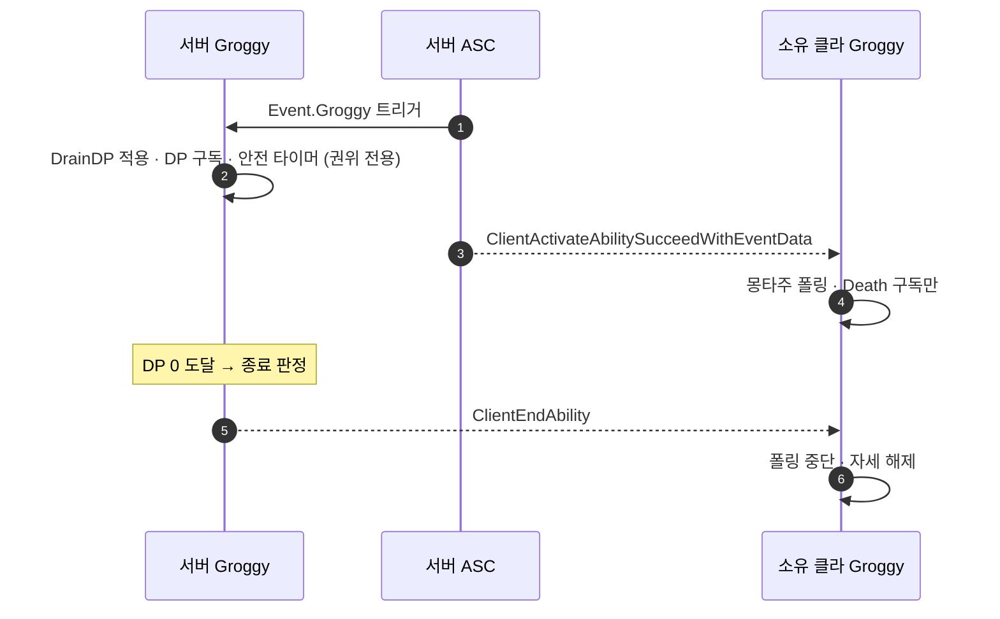

# 그로기 어빌리티를 서버 권위로

## 계획

### 목표

`UWxAbility_Groggy` 의 종료 판정이 서버와 소유 클라에서 각각 돌아 두 쪽 그로기 상태가 ½RTT 어긋나는 문제를 없앤다. 이 창에 넉업이 들어오면 `UWxAbility_HitReact` 의 강등 판정이 갈려 `LaunchCharacter` 가 한쪽에서만 실행되고, 서버 보정으로 캐릭터가 튄다. 판정을 서버에만 두고 클라 인스턴스는 연출만 맡게 한다.

### 수정 범위

| 파일 | 수정할 내용 | 구분 |
|---|---|---|
| `Plugins/WxCombat/.../Ability/WxAbility_Groggy.cpp` | 생성자에 `NetSecurityPolicy = ServerOnly`. `ActivateAbility` 의 DP 구독·DrainDP 적용·안전 타이머를 `ActorInfo->IsNetAuthority()` 블록으로 묶음 | 수정 |
| `Plugins/WxCombat/.../Ability/WxAbility_Groggy.h` | 판정 주체(서버)와 클라 인스턴스 역할(연출)을 주석에 명시 | 수정 |

`WxAbility_HitReact` · `WxCombatAttributeSet` 은 손대지 않는다 — 이 변경으로 강등 발산이 해소되므로 강등 로직을 대미지 파이프라인으로 옮길 필요가 없다.

### 접근 방식

경계를 **"서버가 보낸 신호는 따르되, 복제된 값으로 다시 판정하지는 않는다"** 로 긋는다.

- **서버만**: DP 구독(종료 판정), DrainDP 적용, 안전 타이머(ResetDP). 클라→서버 종료 RPC는 `NetSecurityPolicy = ServerOnly` 로 막는다.
- **양쪽 유지**: 몽타주 폴링·`StopMontageIfCurrent`(연출), `Ability.Death` 구독. Death 태그는 클라가 파생시킨 값이 아니라 ServerInitiated 어빌리티가 보낸 신호이고, Groggy가 `Reaction` 그룹이라 `CanBeCanceled()` 가 false여서 Death의 `CancelAbilitiesWithTag` 로는 끊기지 않는다 — 클라에서도 폴러가 시체에 자세를 덮는 것을 막아야 한다.
- **`NetExecutionPolicy` 는 `ServerInitiated` 유지**: 엔진은 `IsLocallyControlled()` 인 액터에 복제 몽타주를 적용하지 않으므로(`AbilitySystemComponent_Abilities.cpp:3303`), `ServerOnly` 로 내리면 그로기 당한 플레이어 본인 화면에만 자세가 안 나온다. GuardReact를 뗀 것과 같은 이유다.
- **AI Brain 게이트는 넣지 않는다**: `Cast<AAIController>` 가 클라에서 이미 널로 걸러진다.

확인한 사실 — 진입은 이미 서버 권위이고(`WxCombatAttributeSet::PostAttributeChange` 가 비권위 early-return, 엔진도 클라의 ServerInitiated 활성화를 거부), DrainDP·ResetDP 적용은 클라에서 이미 no-op이다(`HasAuthorityOrPredictionKey` false). 즉 **클라는 드레인 없이 판정만 따라 하고 있었다.** 서버 종료는 `ClientEndAbility` 로 전달되며 활성화 RPC와 같은 신뢰 채널이라 순서가 보존된다.

---

## 완료

### 수정한 파일
| 파일 | 수정한 내용 | 구분 |
|---|---|---|
| `Plugins/WxCombat/.../Ability/WxAbility_Groggy.cpp` | `NetSecurityPolicy = ServerOnly` 추가. DP 구독·DrainDP 적용·안전 타이머를 `IsNetAuthority()` 블록으로 묶고, 몽타주 폴링 타이머는 그 밖으로 빼서 양쪽에 남김 | 수정 |
| `Plugins/WxCombat/.../Ability/WxAbility_Groggy.h` | 클래스·`HandleDPChanged`·`HandleGroggySafetyTimeout` 주석에 판정 주체가 서버임을 명시 | 수정 |

### 구현·결정과 그 이유

- **`NetExecutionPolicy`는 `ServerInitiated` 유지**: 엔진이 `IsLocallyControlled()`인 액터에는 복제 몽타주를 적용하지 않으므로(`OnRep_ReplicatedAnimMontage`), `ServerOnly`로 내리면 그로기 당한 플레이어 본인 화면에만 자세가 안 나온다. AI만 테스트하면 놓치는 함정이다.

- **권위 경계를 "서버가 보낸 신호는 따르되 복제 값으로 다시 판정하지 않는다"로 그음**: 종료 판정은 서버만 하고, 클라는 `ClientEndAbility`를 받아 끝낸다. 반면 `Ability.Death` 구독은 양쪽에 남겼다 — 그 태그도 ServerInitiated 어빌리티가 보낸 신호이고, Groggy가 `Reaction` 그룹이라 사망의 `CancelAbilitiesWithTag`로는 끊기지 않아 클라 폴러를 멈출 것이 따로 필요하다.

- **`NetSecurityPolicy = ServerOnly` 병행**: 게이트만 넣으면 클라 쪽 `EndAbility`가 여전히 `ServerEndAbility` RPC를 보내 서버 인스턴스를 끝낼 수 있다. 이 정책이 그 요청을 서버에서 무시하게 하고, 클라에서 RPC 송신 자체도 건너뛰게 한다.

- **DrainDP·ResetDP에 별도 게이트를 넣지 않고 권위 블록 안으로 옮긴 것**: 두 호출은 `HasAuthorityOrPredictionKey`가 false라 클라에서 이미 no-op이었다. 즉 클라는 드레인 없이 종료 판정만 따라 하고 있었고, 그게 발산의 정체였다.

- **AI Brain 정지/재개는 게이트하지 않음**: `Cast<AAIController>`가 클라에서 널로 걸러지므로 엔진이 하는 판정을 중복 구현하는 셈이다.

### 계획 대비 달라진 점
계획대로. (`UWorld*`를 권위 블록 밖으로 호이스트해 폴링 타이머와 안전 타이머가 같은 포인터를 쓰게 한 것이 유일한 형태상 차이다.)

### 후속 과제
- 리슨 서버 2인 PIE 검증 미실시: 그로기 해제 순간에 넉업을 맞혀 캐릭터 튐이 사라졌는지, 클라 본인 화면에 그로기 자세가 그대로 나오는지 확인 필요.
- 서버가 그로기를 끝낸 뒤 `ClientEndAbility`가 닿기까지 ½RTT 동안 클라 폴러가 자세를 한 번 더 밀어 넣을 수 있다. 시각 지연일 뿐 이동 상태는 갈리지 않으며, 없애려면 클라에 종료 판정을 되돌려줘야 해 목적과 상충한다.
