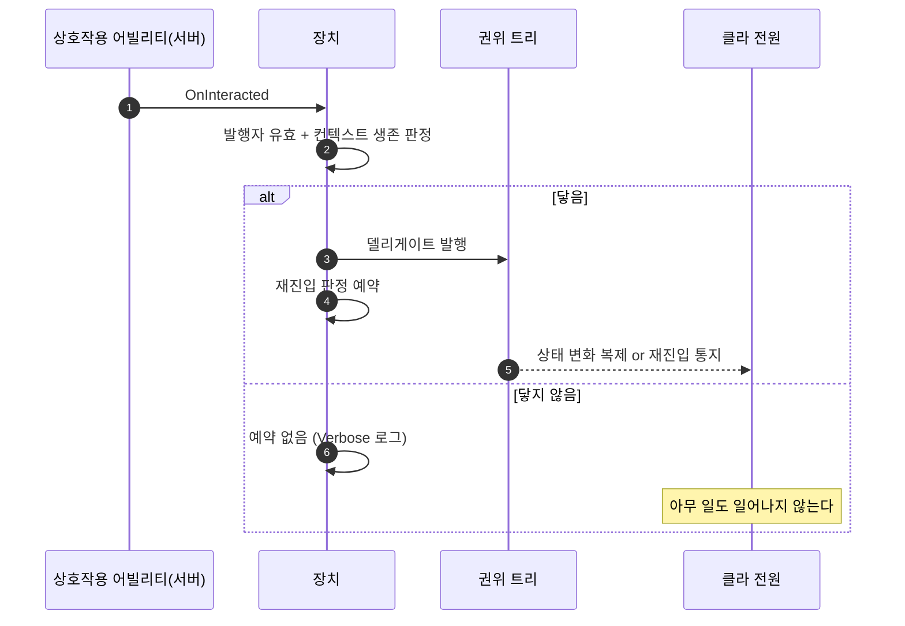

# 상호작용 발행 결과로 재진입 판정 가르기

## 계획

### 목표

트리에 닿지 않은 상호작용이 누를 때마다 클라 전원에 헛재진입 연출(몽타주·사운드·나이아가라·레벨시퀀스)을 일으킨다. 재진입 판정 예약을 「발행이 트리에 실제로 닿았는가」로 가른다. `module_review_WxWorld.md` 발견 1(🟡).

### 수정 범위

| 파일 | 수정할 내용 | 구분 |
|---|---|---|
| `Plugins/WxWorld/.../Public/Device/WxDevice.h` | `BroadcastInteractionDelegate()` 반환형을 bool 로 바꾸고 그 뜻을 doc-comment 로 | 수정 |
| `Plugins/WxWorld/.../Private/Device/WxDevice.cpp` | 무효 발행자는 조기 false, 그 밖은 엔진 발행 결과를 그대로 반환. `OnInteracted` 는 발행을 먼저 하고 닿았을 때만 재진입 판정을 예약(닿지 않으면 Verbose 로그) | 수정 |

### 접근 방식

- **오판의 자리**: 지금은 재진입 판정 플래그를 먼저 세우고 그 뒤에 발행한다. 발행이 버려져도 플래그는 남아, 다음 권위 틱이 「상태가 안 바뀐 재진입」으로 읽고 전 피어에 재진입을 쏜다. 닿지 않는 경로는 둘 — 남의 트리가 켜 준 빈 바인딩(자기 트리가 발행 자리를 연 적이 없다), 그리고 그 상태를 떠난 뒤에도 남아 있는 낡은 실행 컨텍스트(끌 때 바인딩을 비우지 않는 설계다).

- **판정 근거를 발행 결과로**: 이벤트 경로는 「지금 듣고 있는가」를 가릴 자리가 없어 플래그를 아예 걸지 않기로 했었다(2026-08-21 레버 작업). 상호작용 경로에는 그 자리가 있다 — 발행 결과다. 엔진은 컨텍스트가 죽었거나 캡처한 상태가 더 이상 활성이 아니면 거짓을 답한다. 다만 발행자가 무효하면 「듣는 이가 없으니 오류 아님」으로 참을 답하고 즉시 돌아가므로, 빈 바인딩은 우리가 먼저 가른다. 발행자 GUID 는 그것을 지목하는 전이가 있을 때만 컴파일이 부여하니, 발행자 유효성은 곧 「이 상태에 이 상호작용을 듣는 저작이 있는가」다.

- **순서를 뒤집어도 안전한 근거**: 프로젝트에는 ST 델리게이트 리스너가 하나도 없고 전이만 발행자를 지목한다. 전이는 다음 틱의 전이 처리에서 평가되므로, 발행이 그 자리에서 트리를 진행시키는 일은 없다. 당사자 대입은 발행보다 앞에 그대로 둔다.

### 하지 않는 것

- **활성 판정에 바인딩 유효성 추가**(리뷰의 「최소 조치」 대안): 회귀다. 상호작용 통보는 장치 바인딩과 무관하게 어빌리티가 퀘스트 대기 쪽으로도 흘리므로, 자기 바인딩 없이 '상호작용 대기' 대상으로만 쓰이는 장치가 스캔 후보에서 통째로 빠진다.
- **재진입을 엔진에서 정밀 관측**: 전이 적용 직전 콜백이 정확한 신호지만, 컴포넌트가 자기 실행 확장을 시작 경로에 하드코딩해 넣어 갈아끼우려면 그 경로를 통째로 재구현해야 한다. 순정 이탈 대비 이득이 없다.
- **잔여 오차**: 발행이 닿았는데 전이 조건이 거짓이면 여전히 상태가 안 바뀐 채 재진입 통지가 나간다. 「발행 자리가 열려 있는가」는 현행 설계가 이미 택한 눈금이고, 더 정밀한 관측은 위 항목대로 막혀 있다. 이번 범위 밖.

---

## 완료

### 수정한 파일

| 파일 | 수정한 내용 | 구분 |
|---|---|---|
| `Plugins/WxWorld/.../Public/Device/WxDevice.h` | `BroadcastInteractionDelegate()` 를 bool 로, 그 답이 무엇인지 doc-comment | 수정 |
| `Plugins/WxWorld/.../Private/Device/WxDevice.cpp` | 무효 발행자 조기 false + 엔진 발행 결과 반환, `OnInteracted` 이 발행 결과로 재진입 예약을 가름(닿지 않으면 Verbose 로그), `WxWorldModule.h` 포함 | 수정 |
| `Plugins/WxWorld/.../Private/Device/WxDeviceStateTreeComponent.h` | `NotifyInteractionPending` 계약과 대기 플래그 서술을 「발행이 닿았을 때만」으로 정정 | 수정 |

### 구현·결정과 그 이유

- **판정 근거를 발행 결과로 바꿨다**: 이벤트 경로가 이 플래그를 포기한 이유는 「지금 듣고 있는가」를 가릴 자리가 없어서였다. 상호작용 경로에는 그 자리가 있었는데 쓰지 않고 있었다. 순서를 뒤집어 발행부터 하고 그 답으로 예약 여부를 가르니, 리뷰가 짚은 두 경로(빈 바인딩·떠난 상태의 낡은 컨텍스트)가 한 판정에 함께 걸린다.

- **엔진 답만으로는 부족했다**: 발행자가 무효할 때 엔진은 「듣는 이가 없으니 오류 아님」으로 참을 답하고 즉시 돌아간다. 그 참을 그대로 쓰면 빈 바인딩이 여전히 새므로 발행자 유효성을 먼저 본다. 발행자 ID 는 그것을 지목하는 전이가 있을 때만 컴파일이 부여하니, 이 검사는 우연한 널 가드가 아니라 「이 상태가 상호작용을 듣는가」와 같은 뜻이다.

- **활성 판정은 건드리지 않았다**: 리뷰가 대안으로 제시한 「빈 바인딩 장치를 상호작용 후보에서 빼기」는 회귀다. 상호작용 통보는 장치 바인딩과 무관하게 어빌리티가 퀘스트 대기 쪽으로도 흘리므로, 자기 바인딩 없이 '상호작용 대기' 대상으로만 쓰이는 장치가 스캔에서 통째로 빠진다.

- **Verbose 로그를 남겼다**: 이 경로의 증상은 「눌렀는데 아무 일도 없다」뿐이라 원인을 가릴 단서가 없다. 정상 저작(퀘스트 대기 전용 장치)에서도 매번 지나가는 자리라 경고가 아닌 Verbose 로 둔다.

### 계획 대비 달라진 점

- 컴포넌트 헤더의 `NotifyInteractionPending` 계약 주석이 「발행 직전에 걸어 둔다」로 옛 순서를 서술하고 있어 함께 정정했다. 대기 플래그 설명도 「상호작용을 받았지만」에서 「발행이 닿았지만」으로 좁혔다.
- 그 밖에는 계획대로.

### 후속 과제

- 인게임 실측 미완(빌드 확인까지). `LogWxWorld` Verbose 로 (1) 자기 바인딩이 있는 체크포인트 재입력 시 재진입 통지가 그대로인지, (2) 남의 트리로만 켜 둔 장치에서 통지가 사라졌는지 확인한다.
- 발행이 닿았는데 전이 조건이 거짓이면 여전히 헛재진입이 나간다. 그보다 정밀한 관측은 전이 적용 직전 콜백뿐인데 컴포넌트가 자기 실행 확장을 하드코딩해 갈아끼울 자리가 없다.
