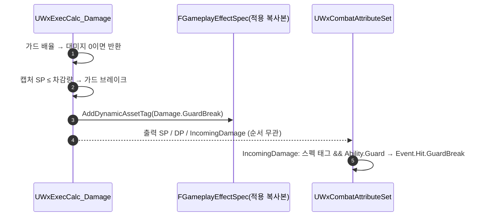

# 가드 브레이크 판정을 ExecCalc → 스펙 태그로 이관

## 계획

### 목표
가드 브레이크 판정이 대미지 ExecCalc의 출력 모디파이어 나열 순서(SP가 IncomingDamage보다 앞)에 암묵적으로 묶여 있다(module_review_WxCombat #2). 두 출력 줄을 바꾸면 가드가 영영 안 깨지는 무증상 회귀가 나므로, 판정을 순서에서 떼어낸다.

### 수정 범위
| 파일 | 수정할 내용 | 구분 |
|---|---|---|
| `Plugins/WxCore/Source/WxCore/Public/WxGameplayTags.h`·`Private/WxGameplayTags.cpp` | `Damage.GuardBreak` 네이티브 태그 신설 | 수정 |
| `Plugins/WxCombat/.../Effect/WxEffect_Damage.h`·`.cpp` | SP 캡처 등록, 가드 브레이크 판정을 ExecCalc에서 내려 스펙 동적 애셋 태그로 기록, 순서 의존 주석 정정 | 수정 |
| `Plugins/WxCombat/.../Attribute/WxCombatAttributeSet.h`·`.cpp` | `ProcessDamageTaken`이 스펙 태그를 읽어 라우팅, 순서 의존 주석 삭제 | 수정 |

### 접근 방식
- **판정은 입력을 다 쥔 곳에서**: "이 히트로 가드가 깨졌는가"는 차감 전 SP와 차감량이 있어야 내릴 수 있는데, 소비 지점은 차감 후 상태만 본다. ExecCalc가 캡처한 SP로 판정하고 결과를 남긴다. SP는 0 아래로 클램프되므로 차감 후 0 이하 ⇔ 차감 전 SP ≤ 차감량.
- **운반은 스펙 동적 애셋 태그**: 반응 태그(`Event.Hit.*`)와 `Damage.CanGuard`가 이미 지나는 통로다. Instant GE의 스펙은 적용마다 만드는 복사본이고 ExecCalc가 손대는 스펙과 훅의 스펙이 같은 복사본이라, 컨텍스트처럼 여러 GE가 공유해 지워야 하는 함정도, 직렬화도 없다. 쓰기는 엔진이 ExecCalc에 열어 둔 non-const 접근자를 쓴다.
- **소비 지점의 Ability.Guard 검사는 유지**: 가드 히트가 SP를 비우면서 DP도 채우면 그로기가 먼저 가드를 끊는다. 브레이크를 받아 줄 어빌리티가 Ability.Guard를 요구하므로, 이미 끊겼으면 일반 반응으로 보내야 반응이 하나는 뜬다. 순서로 판정을 만드는 게 아니라 수신자 유무를 보는 라우팅.
- **범위 밖**: DP→IncomingDamage 순서(그로기 진입이 피격 이벤트보다 앞서야 함)는 상태 발행 뒤 이벤트라는 자연스러운 순서라 그대로 두고 주석만 좁힌다. 크리 플래그를 같은 길로 옮기는 것도 별건.

---

## 완료

### 수정한 파일
| 파일 | 수정한 내용 | 구분 |
|---|---|---|
| `Plugins/WxCore/Source/WxCore/Public/WxGameplayTags.h`·`Private/WxGameplayTags.cpp` | `Damage.GuardBreak` 네이티브 태그 신설(`Damage.Critical` 옆) | 수정 |
| `Plugins/WxCombat/.../Effect/WxEffect_Damage.cpp` | 생성자에 SP 캡처 등록. 가드 히트 분기에서 캡처 SP ≤ 차감량이면 스펙에 `Damage.GuardBreak` 부착. DP 모디파이어 앞 순서 주석 | 수정 |
| `Plugins/WxCombat/.../Effect/WxEffect_Damage.h` | 클래스 주석 — 순서에 기대는 것은 DP뿐, 가드 브레이크는 여기서 판정해 스펙 태그로 | 수정 |
| `Plugins/WxCombat/.../Attribute/WxCombatAttributeSet.cpp` | `ProcessDamageTaken`이 스펙 태그 && Ability.Guard로 라우팅. 순서 의존 설명 삭제 | 수정 |
| `Plugins/WxCombat/.../Attribute/WxCombatAttributeSet.h` | `ProcessDamageTaken` 주석 정정(DP만 확정 전제) | 수정 |

### 구현·결정과 그 이유
- **판정을 ExecCalc로**: 차감 전 SP와 차감량을 모두 쥔 곳은 ExecCalc뿐이다. 소비 지점은 차감 후 값만 보므로, 거기서 판정하려면 "SP가 먼저 적용됐다"는 순서 전제가 필요했고 그 전제는 주석으로만 지켜졌다. 판정을 입력이 있는 곳으로 옮기면 출력 모디파이어 순서는 이 판정과 무관해진다.
- **운반은 컨텍스트가 아니라 스펙 태그**: 처음 안은 크리처럼 컨텍스트 플래그였으나, 컨텍스트는 대미지 GE와 부가 GE들이 공유해 판정 시작마다 지워야 하고 클라에 실려 가 직렬화까지 붙는다. Instant GE의 스펙은 적용마다 만드는 복사본이고 ExecCalc가 손대는 스펙과 훅의 스펙이 같은 복사본이라, 지울 것도 보낼 것도 없다. 반응 태그와 `Damage.CanGuard`가 이미 지나는 통로이기도 하다.
- **스펙 쓰기는 엔진이 열어 둔 non-const 접근자**: ExecCalc 파라미터가 제공하는 것이라 `const_cast`가 없다. 동적 애셋 태그는 캡처 소스 태그에도 들어가므로 대미지 GE에 얹힌 히트 큐의 소스 태그에 `Damage.GuardBreak`가 함께 실린다 — 무해하고, 큐에서 브레이크 연출을 가를 때 쓸 수 있다.
- **SP는 캡처 정의로 읽음**: 캡처 정의는 이미 있었고 등록만 빠져 있었다. 등록 없이 읽으면 조용히 false를 돌려주므로 생성자 등록이 필수. DEF를 읽는 방식과 같다.
- **판정 조건은 Effect.Guard 기반 가드 히트**: SP 차감이 나가는 조건이 곧 브레이크의 전제. 현행의 Ability.Guard 조건과는 가드 어빌리티가 두 태그를 함께 붙였다 떼므로 동치.
- **소비 지점의 Ability.Guard 검사는 남김**: 가드 히트가 SP를 비우면서 DP도 채우면 그로기가 먼저 가드를 끊는다. 브레이크를 받아 줄 어빌리티가 Ability.Guard를 요구하고 HitReact는 GuardBreak를 트리거에 안 올렸으므로, 검사를 빼면 이 경우 반응이 하나도 안 뜬다. 순서로 판정을 만드는 게 아니라 수신자 유무를 보는 라우팅.

### 계획 대비 달라진 점
- 계획대로.

### 후속 과제
- PIE 미검증(빌드만). ① 가드 연타로 SP가 0에 닿는 그 히트에서 GuardBreak ② 가드 히트가 그로기까지 같이 띄우면 일반(강등) 반응 ③ 가드 중 가드 불가 히트 → 가드 취소 후 일반 반응 ④ 크리 플로터 변화 없음.
- DP→IncomingDamage 순서 의존(그로기 진입이 피격 이벤트보다 앞서야 함)은 그대로다. 상태를 발행한 뒤 이벤트를 내는 자연스러운 순서라 두었고 주석으로 좁혀 명시했다.
- 크리 플래그도 같은 길(스펙 태그)로 옮기면 `FWxCombatEffectContext`에 남는 필드가 없어져 커스텀 컨텍스트·전역 등록을 걷어낼 수 있다. 별건.
