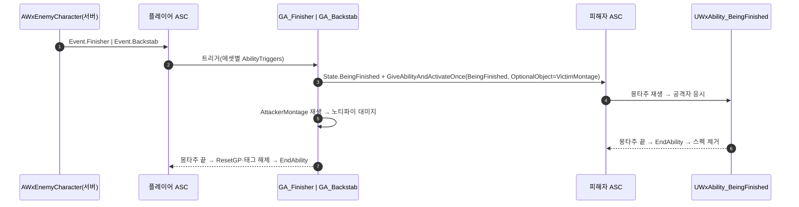

# 처형 짝 피격을 피해자 일회성 어빌리티 부여로 전환 — Event.Hit.Finisher/Backstab 제거

## 계획

### 목표
짝 피격이 상시 부여된 HitReact를 `Event.Hit.Finisher/Backstab`으로 깨우는 구조를, 처형 어빌리티가 피해자에게 "처형 당하기" 어빌리티를 부여하며 즉시 발동시키는 구조(`GiveAbilityAndActivateOnce`)로 바꾼다. 태그 둘과 HitReact의 처형 갈래가 사라지고, 앞잡/뒤잡은 태그 대신 어빌리티 에셋 둘로 가른다.

### 수정 범위
| 파일 | 수정할 내용 | 구분 |
|---|---|---|
| `Plugins/WxCore/Source/WxCore/Public/WxGameplayTags.h`·`Private/WxGameplayTags.cpp` | `Event_Hit_Finisher`·`Event_Hit_Backstab` 삭제, `Event_Hit` 주석 정정, `Event_Finisher`/`Event_Backstab` 주석 | 수정 |
| `Plugins/WxCombat/.../Ability/WxAbility_Finisher.h`·`.cpp` | 트리거 등록 삭제, `AttackerMontage`/`VictimMontage`, 변형 분기 삭제, 권위 블록에서 피해자에 BeingFinished 부여 | 수정 |
| `Plugins/WxCombat/.../Ability/WxAbility_BeingFinished.h`·`.cpp` | 처형 당하기 일회성 어빌리티 | 신규 |
| `Plugins/WxCombat/.../Ability/WxAbility_HitReact.h`·`.cpp` | Finisher/Backstab 트리거·필드·분기 삭제 | 수정 |
| `Content/AbilitySystem/Ability/GA_Finisher.uasset` | 몽타주 쌍 재지정, `AbilityTriggers=[Event.Finisher]` | 수정(에셋) |
| `Content/AbilitySystem/Ability/GA_Backstab.uasset` | 뒤잡 에셋, `AbilityTriggers=[Event.Backstab]` | 신규(에셋) |
| `Content/Character/Player/ABS_Player.uasset` | `GA_Backstab` 부여 추가 | 수정(에셋) |
| `Content/AbilitySystem/Ability/GA_HitReact.uasset` | 삭제 필드 값 정리 리세이브 | 수정(에셋) |

### 접근 방식
- **주는 쪽이 부여하고 끝나면 스스로 걷힌다**: 처형 어빌리티가 권위에서 피해자 ASC에 `GiveAbilityAndActivateOnce`로 스펙을 넣으며 발동시키고, 몽타주 종료로 어빌리티가 끝나면 엔진이 `RemoveAfterActivation`으로 스펙을 지운다. 피해자에게 상시 부여된 수신 어빌리티가 필요 없어 이벤트 태그도 필요 없다.
- **몽타주는 이벤트 페이로드로**: 짝 몽타주는 공격자 에셋이 쌍으로 소유하고 `OptionalObject`에 실어 보낸다. 피해자 어빌리티는 BP 없이 C++ 클래스 하나다.
- **변형은 에셋**: 클래스는 몽타주 한 쌍만 갖고, 앞잡·뒤잡 에셋이 각자 `AbilityTriggers`로 상호작용 이벤트를 지정한다. `AWxEnemyCharacter`는 손대지 않으므로 `Event.Finisher`/`Event.Backstab`은 남는다.
- **권위 블록 안에서만 부여**: 클라 인스턴스에서 부르면 엔진이 거부하며 Error를 남긴다. 피해자는 소유 클라가 없어 몽타주는 복제로 퍼진다 — 지금 HitReact와 같은 경로.

---

## 완료

### 수정한 파일
| 파일 | 수정한 내용 | 구분 |
|---|---|---|
| `Plugins/WxCore/Source/WxCore/Public/WxGameplayTags.h`·`Private/WxGameplayTags.cpp` | `Event_Hit_Finisher`·`Event_Hit_Backstab` 삭제, `Event_Hit` 주석 정정, `Event_Finisher`/`Event_Backstab`에 수신 규약 주석 | 수정 |
| `Plugins/WxCombat/.../Ability/WxAbility_Finisher.h`·`.cpp` | 트리거 등록 삭제, `AttackerMontage`/`VictimMontage`, 변형 분기 삭제, 권위 블록에서 피해자에 BeingFinished 부여(`OptionalObject`=짝 몽타주), 낡은 주석(ResetDP·HitReact 짝 피격) 정정 | 수정 |
| `Plugins/WxCombat/.../Ability/WxAbility_BeingFinished.h`·`.cpp` | 처형 당하기 일회성 어빌리티(ServerInitiated·Reaction, 페이로드 몽타주 재생 후 공격자 응시) | 신규 |
| `Plugins/WxCombat/.../Ability/WxAbility_HitReact.h`·`.cpp` | Finisher/Backstab 트리거·필드·분기 삭제 | 수정 |
| `Content/AbilitySystem/Ability/GA_Finisher.uasset` | `AttackerMontage=AM_Finisher`, `VictimMontage=AM_HitReact_Finisher`, `AbilityTriggers=[Event.Finisher]` | 수정(에셋) |
| `Content/AbilitySystem/Ability/GA_Backstab.uasset` | 부모 `WxAbility_Finisher`, `AM_BackstabFinisher`/`AM_HitReact_Finisher`, `AbilityTriggers=[Event.Backstab]` | 신규(에셋) |
| `Content/Character/Player/ABS_Player.uasset` | `GrantedAbilities`에 `GA_Backstab` 추가 | 수정(에셋) |
| `Content/AbilitySystem/Ability/GA_HitReact.uasset` | 삭제된 두 필드 값 정리 리세이브 | 수정(에셋) |

### 구현·결정과 그 이유
- **부여 주체가 처형 어빌리티**: 피해자에게 상시 부여된 수신 어빌리티도, 그걸 깨울 이벤트 태그도 필요 없어진다. 종료 시 스펙 제거는 엔진이 하므로 정리 코드가 없다.
- **몽타주를 이벤트 페이로드로**: 피해자 어빌리티가 BP 없이 클래스 하나로 끝나고, 짝 몽타주는 공격자 에셋이 쌍으로 갖는다. `OptionalObject`가 const라 상호작용 어빌리티와 같은 방식으로 벗긴다.
- **변형을 에셋으로**: 트리거 태그를 생성자가 아니라 각 BP가 지정한다(Passive와 같은 방식). 적 캐릭터를 손대지 않으므로 `Event.Finisher`/`Event.Backstab`은 남고, 대신 C++ 어빌리티 코드는 이 둘을 더 이상 참조하지 않는다.
- **권위 블록 안에서만 부여**: 클라 인스턴스에서 부르면 엔진이 Error 로그를 남기며 거부한다.
- **Reaction 그룹**: 그로기의 전체 취소 지목에 끊기지 않고, 그로기 폴러는 재생 중인 몽타주가 있으면 손대지 않으므로 겹침이 현행과 같이 성립한다.

### 계획 대비 달라진 점
- 계획대로. GA_HitReact는 dirty가 아니라 첫 저장이 건너뛰어져, 기존 값을 되써서 dirty로 만든 뒤 재저장했다.

### 후속 과제
- PIE 실동작은 사용자가 확인: 앞잡/뒤잡 몽타주 쌍 동시 시작, 종료 후 그로기 해제·프롬프트 복구, 처형 뒤 적 ASC에 BeingFinished 스펙이 남지 않는지, 로그에 `LogAbilitySystem` Error가 없는지.
- `Event.Finisher`/`Event.Backstab` 제거는 `AWxEnemyCharacter` 수정이 전제라 이번 범위 밖.
