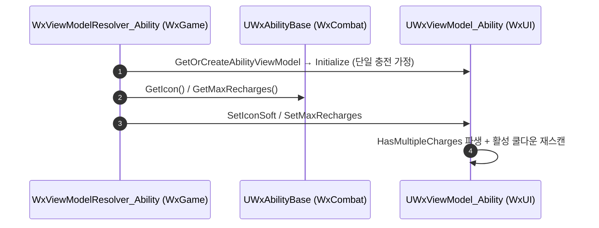

# 쿨다운 GE 런타임 인스턴스 제거 (어빌리티 CDO 오염 해소)

## 계획

### 목표
`UWxAbilityBase::GetCooldownGameplayEffect()`가 어빌리티 CDO를 Outer 삼아 만들던 쿨다운 GE 인스턴스를 없앤다. 그 인스턴스의 유일한 쓸모였던 최대 충전 수 전달은 아이콘과 같은 리졸버 주입 경로로 옮긴다.

### 수정 범위
| 파일 | 수정할 내용 | 구분 |
|---|---|---|
| `Plugins/WxCombat/.../Public/AbilitySystem/Ability/WxAbilityBase.h` | `CooldownEffect` 멤버·`UWxEffect_Cooldown` 전방선언 제거, `GetMaxRecharges()` 선언 추가 | 수정 |
| `Plugins/WxCombat/.../Private/AbilitySystem/Ability/WxAbilityBase.cpp` | `GetCooldownGameplayEffect()`의 `NewObject` 제거, `GetMaxRecharges()` 정의 추가, `CheckCooldown`이 그것을 쓰도록 | 수정 |
| `Source/WxGame/MVVM/WxViewModelResolver_Ability.h`, `.cpp` | 아이콘 주입 옆에 최대 충전 수 주입 추가(캐스트 1회로 통합), 클래스 주석 반영 | 수정 |
| `Plugins/WxUI/.../Public/MVVM/WxViewModel_Ability.h`, `.cpp` | `Initialize`의 `StackLimitCount` 읽기 제거, `SetMaxRecharges`를 주입 진입점으로 | 수정 |

### 접근 방식
- **GE 인스턴스 삭제**: `ApplyCooldown`이 `GetClass()`로 스펙을 다시 만들어 CDO를 쓰므로 인스턴스에 써 넣은 `StackLimitCount`는 게임플레이에 도달한 적이 없다. `GetCooldownGameplayEffect()`는 "쿨다운 없는 어빌리티면 nullptr" 게이트만 남기고 나머지는 `Super`(공유 CDO)로 돌려준다.

- **최대 충전 수는 리졸버가 주입**: `WxUI`가 `WxCombat`을 볼 수 없어 엔진 타입 필드에 값을 얹어 건네던 것이 인스턴스가 필요했던 진짜 이유다. 양쪽을 다 보는 `WxGame` 리졸버가 아이콘과 함께 밀어 넣으면 모듈 DAG를 지키면서 통로가 사라진다. 어빌리티 쪽에는 `GetMaxRecharges()`를 `GetIcon()` 옆에 둔다 — 충전 개념은 테이블 경로에서만 성립하므로 커스텀 쿨다운 GE 경로는 1을 낸다.

- **주입 시점 정합**: 뷰모델은 `Initialize`가 끝난 뒤에야 값을 받으므로, `SetMaxRecharges`가 최대치 세팅 → `HasMultipleCharges` 파생 → 만충 가정 → 돌고 있는 쿨다운 재스캔까지 한 묶음으로 처리한다. `Initialize`는 이 setter를 1로 한 번 부르는 것으로 기존의 3연속 setter와 말미의 초기 스캔을 대신한다.

---

## 완료

### 수정한 파일
| 파일 | 수정한 내용 | 구분 |
|---|---|---|
| `Plugins/WxCombat/.../Public/AbilitySystem/Ability/WxAbilityBase.h` | `CooldownEffect` 멤버와 전방선언 삭제, `GetMaxRecharges()` 선언을 `GetIcon()` 옆에 추가 | 수정 |
| `Plugins/WxCombat/.../Private/AbilitySystem/Ability/WxAbilityBase.cpp` | `GetCooldownGameplayEffect()`가 인스턴스 대신 공유 CDO를 돌려주도록, `GetMaxRecharges()` 정의 추가, `CheckCooldown`이 그것을 쓰도록 | 수정 |
| `Source/WxGame/MVVM/WxViewModelResolver_Ability.h`, `.cpp` | 아이콘 주입과 최대 충전 수 주입을 캐스트 한 번으로 묶음, 클래스 주석 반영 | 수정 |
| `Plugins/WxUI/.../Public/MVVM/WxViewModel_Ability.h`, `.cpp` | `Initialize`의 `StackLimitCount` 읽기 제거, `SetMaxRecharges`를 주입 진입점으로, `SeedActiveCooldown` 삭제, `EnsureCooldownTicker` → `StartCooldownTicker` 개명 | 수정 |

### 구현·결정과 그 이유
- **인스턴스를 없애도 게임플레이가 그대로인 근거**: 쿨다운 적용은 GE의 클래스로 스펙을 다시 만들어 CDO를 쓰므로, 인스턴스에 써 넣던 최대 충전 수는 애초에 게임플레이에 도달한 적이 없다. 남는 소비자는 뷰모델뿐이었다.

- **주입 경로를 아이콘에 합류시킴**: UI 플러그인이 전투 플러그인을 못 보는 것이 인스턴스가 생긴 진짜 이유였고, 그 벽은 이미 아이콘이 리졸버 주입으로 넘고 있었다. 같은 자리에 태우면 모듈 DAG를 건드리지 않고 통로가 사라진다. 어빌리티 쪽 조회 함수는 커스텀 쿨다운 GE 경로에서 1을 낸다 — 그 경로는 엔진 순정 태그 판정으로 돌아 충전이 여러 개일 수 없다.

- **최대치 세팅이 충전 표시까지 책임짐**: 뷰모델은 최대치를 초기화가 끝난 뒤에야 받으므로, 값만 갈아 끼우면 초기화 때 단일 충전 기준으로 센 충전 수가 그대로 남는다. 세터가 파생값과 재계산까지 한 묶음으로 처리해 늦게 도착하는 값이 스스로 정합을 맞추게 했다.

- **`SeedActiveCooldown` 제거**: 호출자가 하나로 줄어든 데다, 이름이 하는 일을 알려주지 않고 티커 콜백에 가짜 델타타임을 넘겨 그 반환값을 다른 뜻으로 겸해 쓰는 구조라 읽기 어려웠다. 세터 안에 풀어쓰고 이유를 주석으로 남겼다.

### 계획 대비 달라진 점
- `SeedActiveCooldown` 인라인은 계획에 없었다. 구현 중 지적을 받아, 호출자가 하나로 줄어든 김에 함께 걷어냈다.
- 티커 등록 함수의 개명도 계획에 없었다. `Ensure`가 하는 일을 알려주지 않는다는 지적에 따라 `Start`로 바꿨다 — 함수 자체는 호출자가 둘이고 중복 등록 금지라는 실제 불변식을 감싸므로 남겼다.

### 후속 과제
- 에디터 실행 검증은 아직이다. 다중 충전 어빌리티의 HUD가 만충으로 뜨는지, 발동마다 하나씩 줄고 직렬로 회복되는지, 쿨다운 도중 위젯이 새로 생겨도 충전 수가 맞는지 확인이 남았다.
