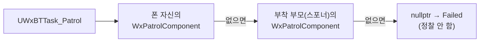

# 정찰 경로 조회를 부착 부모 하나로 고정

## 계획

### 목표
`UWxBTTask_Patrol::ExecuteTask` 가 항상 실패한다. 직접 원인인 `return` 누락은 이미 잡혔고, 그 뒤에 남은 구조 문제 — 뒤집힌 탐색 순서, 널 가드 부재, 폰을 따라 움직이는 경로 — 를 정리해 스포너로 스폰되지 않은 적도 정찰하게 한다.

### 수정 범위
| 파일 | 수정할 내용 | 구분 |
|---|---|---|
| `Plugins/WxAI/Source/WxAI/Public/WxPatrolComponent.h` | `FindPatrolComponent` 인자를 `const APawn*` 로, `BeginPlay` 오버라이드 추가, 클래스 주석 정정 | 수정 |
| `Plugins/WxAI/Source/WxAI/Private/WxPatrolComponent.cpp` | 재귀 탐색을 후보 둘로 교체, `BeginPlay` 에서 월드 고정, 불필요한 include 삭제 | 수정 |
| `Plugins/WxAI/Source/WxAI/Public/WxBTTask_Patrol.h` | 조회 규칙 주석 정정 | 수정 |
| `Plugins/WxAI/Source/WxAI/Private/WxBTTask_Patrol.cpp` | 호출부 2곳을 폰 인자로 | 수정 |
| `Source/WxGame/Character/WxEnemyCharacter.h/.cpp` | `OnSpawnedBy` 의 부착에 근거 주석 | 수정 |
| `Plugins/WxWorld/Source/WxWorld/Private/Spawnable/WxSpawner.cpp` | 부착 정책 주석에 적 예외 명시 | 수정 |

### 접근 방식
- **부착은 유지한다**: 폰→스포너 링크를 만드는 다른 수단(블랙보드 파이프, 컨트롤러 `Owner`, 런타임 복사, 클래스 이동)은 각각 사실인 척하는 키·엔진 필드 오용·데이터 이중화·모듈 경계 훼손이라는 대가가 있다. 부착만이 월드 아웃라이너에서 소유 관계가 그대로 보인다 — 계약을 코드 밖에서 확인할 수 있는 유일한 안이다.
- **탐색을 후보 둘로 고정한다**: 폰 자신 → 없으면 부착 부모. 순서를 뒤집으면서 "스포너에 부착된 폰은 자기 경로를 가질 수 없다"는 제약도 함께 풀린다. 재귀와 `AAIController` 분기는 삭제한다.
- **경로를 게임 시작 시 월드에 고정한다**: 직접 배치 적은 컴포넌트가 폰 루트에 부착되므로, 그대로 두면 폰이 걸음을 떼는 순간 스플라인 포인트의 월드 좌표가 끌려간다. 에디터에서는 상대 부착을 유지해 액터를 옮기면 경로도 따라오게 둔다.
- **대가를 기록으로 남긴다**: 루트 부착은 이동 복제를 `AttachmentReplication` 경로로 옮긴다. 멀티플레이가 실검증 전이라 지금은 이론적 비용이지만, `WxSpawner` 의 "부착하지 않는다" 결정을 적에 한해 뒤집는 것이므로 양쪽 주석이 서로 모순되지 않게 맞춘다.

---

## 완료

### 수정한 파일
| 파일 | 수정한 내용 | 구분 |
|---|---|---|
| `Plugins/WxAI/Source/WxAI/Public/WxPatrolComponent.h` | `FindPatrolComponent` 인자를 `const APawn*` 로, 부착 위치·전제 주석 정정 | 수정 |
| `Plugins/WxAI/Source/WxAI/Private/WxPatrolComponent.cpp` | 재귀·컨트롤러 분기 삭제, 부착 부모 조회 두 줄로 축소 | 수정 |
| `Plugins/WxAI/Source/WxAI/Public/WxBTTask_Patrol.h` | 조회 규칙 주석 정정 | 수정 |
| `Plugins/WxAI/Source/WxAI/Private/WxBTTask_Patrol.cpp` | 호출부 2곳을 폰 인자로 | 수정 |
| `Source/WxGame/Character/WxEnemyCharacter.h/.cpp` | 부착 근거·대가 주석 | 수정 |
| `Plugins/WxWorld/Source/WxWorld/Private/Spawnable/WxSpawner.cpp` | 부착 정책 주석에 적 예외 명시 | 수정 |

### 구현·결정과 그 이유
- **부착을 남기고 탐색을 줄였다**: 폰에서 스포너로 가는 링크는 어떤 형태로든 필요했다. 블랙보드 키는 어떤 데코레이터도 보지 않는 데이터 파이프라 사실인 척하는 계약이 늘고, 컨트롤러 `Owner` 는 엔진 필드에 게임 의미를 얹으며, 스폰 시 복사는 경로를 두 벌로 만든다. 부착만이 아웃라이너에서 소유 관계가 그대로 보여, 계약을 코드 밖에서 확인할 수 있다.
- **조회를 부착 부모 하나로 고정했다**: 처음엔 폰 자신도 후보로 뒀다가 걷어냈다. 실사용을 확인하니 `WxPatrolComponent` 가 붙은 에셋은 `LV_DevCombat` 의 스포너 인스턴스 하나뿐이라, 폰 쪽 후보는 쓰이지도 않으면서 우선순위라는 암묵 규칙만 만들고 있었다. 직접 배치한 적도 경로를 그린 액터에 부착하면 같은 규칙으로 정찰하므로 표현력을 잃지 않는다.
- **경로 월드 고정을 넣었다가 지웠다**: 폰 루트에 딸린 경로가 걸음마다 끌려가는 문제였는데, 경로가 폰에 붙는 경우 자체가 사라져 불필요해졌다. 대신 "경로를 든 액터는 런타임에 움직이지 않는다"를 클래스 주석의 전제로 남겼다.
- **부착의 대가를 양쪽 주석에 남겼다**: 루트 부착은 이동 복제를 `AttachmentReplication` 경로로 옮긴다. `WxSpawner` 의 "부착하지 않는다" 결정을 적에 한해 뒤집은 것이라, 두 파일이 서로 모순돼 보이지 않도록 예외를 명시했다.

### 계획 대비 달라진 점
- 계획에 있던 "탐색 순서 뒤집기"는 착수 전에 이미 반영돼 있어 그 위에 이어 작업했다.
- 계획은 후보를 둘(폰 자신 → 부착 부모)로 뒀지만, 구현 후 실사용 조사로 폰 후보가 쓰이지 않음이 드러나 하나로 줄였다. `UWxPatrolComponent::BeginPlay` 의 월드 고정도 함께 사라졌다.

### 후속 과제
- 컴파일까지만 검증했다. PIE 로 스포너 스폰 적이 정찰하는지, 경로를 그린 액터에 부착한 직접 배치 적도 같은 규칙으로 도는지 확인이 남았다.
- 부착이 `ACharacter` 의 기반 이동 복제와 겹치는 조합은 검증된 적이 없다. 멀티플레이를 실검증할 때 이 지점을 다시 봐야 한다.
