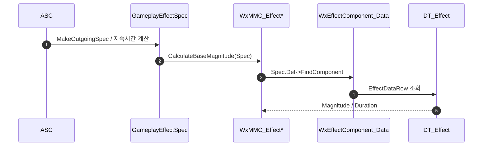

# GE 수치를 데이터테이블에서 읽기

## 계획

### 목표
어빌리티가 `FWxAbilityTableRow`(DT_Ability)에서 쿨다운·코스트·아이콘을 읽듯이, GE도 지속시간·모디파이어 크기·아이콘을 디자이너 테이블에서 읽을 수 있게 한다. 지금은 `UWxEffect_Exceed`처럼 수치가 생성자 리터럴로 박혀 있다.

### 수정 범위
| 파일 | 수정할 내용 | 구분 |
|---|---|---|
| `Plugins/WxCombat/.../Public/AbilitySystem/Effect/WxEffectTableRow.h` | `FWxEffectTableRow` — Magnitude·Duration·Icon 세 칼럼 | 신규 |
| `Plugins/WxCombat/.../Public/AbilitySystem/Effect/WxEffectComponent_Data.h` | `UWxEffectComponent_Data`(행 핸들 보관)와 MMC 2종 선언 | 신규 |
| `Plugins/WxCombat/.../Private/AbilitySystem/Effect/WxEffectComponent_Data.cpp` | 행 조회와 MMC 계산 | 신규 |

### 접근 방식
- **컴포넌트는 지목만, 값은 MMC가 꺼낸다**: GEComponent에는 스펙이 만들어지기 전에 값을 주입할 훅이 없다 — 적용 뒤에 오는 콜백이거나 스펙이 const다. 그래서 `WxEffect_Cost`와 같은 구조를 쓴다. 컴포넌트는 "어느 행을 볼지"만 들고, 크기·지속시간은 계산 시점에 MMC가 GE 정의에서 컴포넌트를 찾아 행에서 읽는다.
- **MMC를 둘로 쪼갠다**: MMC 지정이 클래스 단위라 한 클래스로 두 값을 구분해 낼 수 없다. Cost가 자원별로 파생 클래스를 나눈 것과 같은 이유다.
- **라이브 상태를 보지 않는다**: 어트리뷰트 캡처가 없어 엔진이 적용 도중 지속시간을 여러 번 재계산해도 같은 값이 나온다.
- **아이콘 소비처는 이번에 건드리지 않는다**: 버프 HUD는 WxUI의 `UWxEffectComponent_UIData`에서 아이콘을 읽고 WxUI는 WxCombat을 못 보므로, 행의 Icon은 아직 HUD에 닿지 않는다. 출처를 합치려면 행과 컴포넌트를 WxCore로 올려야 해서 별건으로 남긴다.

---

## 완료

### 수정한 파일
| 파일 | 수정한 내용 | 구분 |
|---|---|---|
| `Plugins/WxCombat/.../Public/AbilitySystem/Effect/WxEffectTableRow.h` | `FWxEffectTableRow` — Magnitude·Duration | 신규 |
| `Plugins/WxCombat/.../Public/AbilitySystem/Effect/WxEffectComponent_Data.h` | 행을 지목하는 GE 컴포넌트와 MMC 2종 선언 | 신규 |
| `Plugins/WxCombat/.../Private/AbilitySystem/Effect/WxEffectComponent_Data.cpp` | 행 조회, MMC 계산 | 신규 |

### 구현·결정과 그 이유
- **컴포넌트는 지목만 하고 값은 MMC가 꺼낸다**: 엔진이 스펙을 만들고 지속시간을 계산하는 시점보다 컴포넌트 콜백이 늦다. 적용 통지는 이미 적용된 뒤에 오고, 적용 가부를 묻는 자리는 스펙이 const라 값을 실을 수 없다. 어빌리티 코스트가 이미 같은 이유로 MMC를 쓰고 있어 구조를 그대로 따랐다.
- **행 조회 진입점을 정적 함수로 뒀다**: MMC 둘 다 "GE 정의에서 컴포넌트를 찾아 행을 읽는" 같은 일을 하고, 앞으로 행을 읽을 쪽도 같은 경로를 탄다.
- **행이 없을 때 0을 돌려주고 경고하지 않는다**: 컴포넌트를 붙이고 MMC를 지정하는 것이 저작 계약이라, 어겼을 때 지속시간 0이나 크기 0으로 곧바로 드러난다.

### 계획 대비 달라진 점
- **Icon 칼럼을 뺐다**: 아이콘을 읽는 곳은 버프 HUD 하나뿐인데 그건 WxUI에 있고, WxUI는 WxCombat을 볼 수 없다. 닿게 하려면 행을 WxCore로 올리거나(파운데이션에 GAS 의존이 붙는다) WxGame이 뷰모델에 밀어 넣는 자리를 새로 만들어야 해서, 표시 데이터는 판단을 미루고 이 표는 전투 수치만 담기로 했다.

### 후속 과제
- DT_Effect 에셋 생성과 첫 사용처 전환(Exceed의 6초·1.2배). unreal-mcp 연결이 끊겨 있어 이번엔 못 만들었다.
- 효과 아이콘을 표로 옮길지는 보류. 지금대로 `UWxEffectComponent_UIData`(WxUI)가 이름·아이콘을 들고 있다. 옮긴다면 표시용 표를 WxUI가 따로 소유하고 그 컴포넌트가 행을 지목하는 형태가 구조 비용이 0이다.
