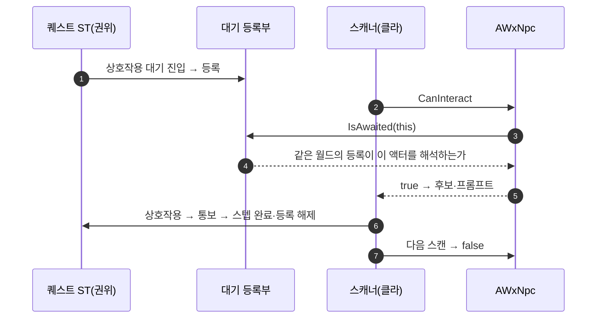

# 상호작용 토글 세터 제거 — NPC 상호작용을 퀘스트 대기에서 파생

## 계획

### 목표
`IWxInteractable`에서 켜짐 상태를 밖에서 밀어 넣는 `SetInteractionEnabled`를 없앤다. 유일한 호출자인 '상호작용 켜기' 태스크의 Actor 갈래가 실제로 여닫는 것은 퀘스트가 지목한 NPC뿐이고, NPC가 말을 걸 수 있어야 하는 순간은 곧 "어떤 퀘스트 스텝이 그 NPC의 상호작용을 기다리는 동안"이다. 그 사실을 이미 들고 있는 대기 등록부를 `CanInteract`가 묻게 해 세터·플래그·Actor 갈래·에셋 노드를 함께 걷어낸다.

### 수정 범위
| 파일 | 수정할 내용 | 구분 |
|---|---|---|
| `Plugins/WxWorld/.../StateTreeTask/WxStateTreeWaitRegistry.h` | 살아 있는 등록 중 술어가 맞는 것이 있는지 답하는 const 조회 추가 | 수정 |
| `Plugins/WxWorld/.../Interaction/WxStateTreeTask_WaitForInteraction.h` · `.cpp` | 통보의 짝인 정적 조회 `IsAwaited(Target)` 추가 | 수정 |
| `Source/WxGame/Character/WxNpc.h` · `.cpp` | `CanInteract`를 그 조회로 답하게 오버라이드 | 수정 |
| `Plugins/WxCore/.../WxInteractable.h` · `.cpp` | `SetInteractionEnabled` 삭제, 계약 doc에 파생 원칙 명시 | 수정 |
| `Plugins/WxDialogue/.../WxDialogueActor.h` · `.cpp` | 켜짐 플래그와 두 오버라이드 삭제(기본 true) | 수정 |
| `Plugins/WxWorld/.../Device/WxDevice.h` · `.cpp` | 세터 오버라이드 삭제, 자기 트리만 세팅하는 플래그는 유지 | 수정 |
| `Plugins/WxWorld/.../Interaction/WxStateTreeTask_EnableInteraction.h` · `.cpp` | Actor 갈래(대상 모드 enum·로케이터·틱·재적용) 삭제, 장치 전용으로 doc 재작성 | 수정 |
| `Plugins/WxWorld/README.md` | 태스크 설명 정정 | 문서 |
| `Content/Quest/Steps/ST_QuestStep_InteractTarget` | '상호작용 켜기' 노드 제거 (MCP) | 수정(에셋) |
| `Content/Quest/ST_Quest_Main1` · `ST_Quest_Main2` | NPC를 지목한 끄기 노드 각 1개 제거 (MCP) | 수정(에셋) |

### 접근 방식
- **파생의 원천은 대기 등록부**: 통보(`NotifyInteracted`)와 대칭인 조회를 둔다 — 같은 등록부, 같은 술어(통보 액터를 컨텍스트로 로케이터를 해석해 항등 비교), 같은 월드 좁히기(PIE 서버·클라 분리). 등록부는 권위 측에만 있으므로 "서버가 곧 클라" 전제는 지금의 비복제 플래그와 동일하다.
- **규칙은 `AWxNpc`에**: WxDialogue는 WxWorld를 볼 수 없으니 두 도메인이 만나는 게임 모듈의 합성 클래스가 답한다. 대화 액터 베이스는 규칙 없이 기본 true 로 둔다.
- **태스크는 장치 자기 갈래만 남긴다**: 08-14 통합으로 들어온 Actor 파생을 걷어내는 것이지 태스크를 쪼개는 것이 아니다. 노드 타입·표시명은 그대로라 장치 에셋(Button·CheckPoint·TreasureChest)은 사라진 필드만 떨어지고 동작이 같다. 남의 장치를 잠그는 길은 종전대로 '이벤트 보내기', NPC는 '상호작용 대기'가 곧 열기다.
- **에셋은 코드 뒤에**: 코드→빌드→에디터 기동→MCP 편집. 배열 축소 함정을 피해 태스크 배열을 비운 뒤 남길 노드를 원래 iD·전체 데이터로 재기입하고, 잔존 바인딩·컴파일 로그·저장 실기록을 재조회로 확인한다.

---

## 완료

### 수정한 파일
| 파일 | 수정한 내용 | 구분 |
|---|---|---|
| `Plugins/WxWorld/.../StateTreeTask/WxStateTreeWaitRegistry.h` | 술어에 오너 대신 통보 주인공을 넘기도록 바꾸고, 살아 있는 등록 중 맞는 것이 있는지 답하는 const 조회 추가 | 수정 |
| `Plugins/WxWorld/.../Interaction/WxStateTreeTask_WaitForInteraction.h` · `.cpp` | 조회 `IsAwaited` 추가, 통보·조회가 공유하는 정적 술어 하나로 정리, 통보 인자 const 화 | 수정 |
| `Source/WxGame/Character/WxNpc.h` · `.cpp` | `CanInteract`를 대기 조회로 답하게 오버라이드 | 수정 |
| `Plugins/WxCore/.../WxInteractable.h` · `.cpp` | `SetInteractionEnabled` 삭제, 계약 doc에 파생 원칙 | 수정 |
| `Plugins/WxDialogue/.../WxDialogueActor.h` · `.cpp` | 켜짐 플래그와 두 오버라이드 삭제 | 수정 |
| `Plugins/WxWorld/.../Device/WxDevice.h` · `.cpp` | 세터 오버라이드 삭제, 바인딩 보존 주석 정정 | 수정 |
| `Plugins/WxWorld/.../Interaction/WxStateTreeTask_EnableInteraction.h` · `.cpp` | Actor 갈래(대상 모드·로케이터·틱·재적용) 삭제, 틱 끔, 장치 전용 doc | 수정 |
| `Plugins/WxWorld/README.md` | 태스크 설명 정정 | 문서 |
| `Content/Quest/Steps/ST_QuestStep_InteractTarget` | 켜기 노드 제거(태스크 4→3, 바인딩 4개 보존) (MCP) | 수정(에셋) |
| `Content/Quest/ST_Quest_Main1` · `ST_Quest_Main2` | 끄기 노드만 들고 있던 `InProgress/Cleanup` 상태째 제거(자식 4→3) (MCP) | 수정(에셋) |

### 구현·결정과 그 이유
- **파생의 원천은 대기 등록부**: NPC가 말을 걸 수 있는 순간은 퀘스트 스텝이 그 NPC의 상호작용을 기다리는 동안뿐이고, 그 사실은 등록부가 이미 들고 있다. 통보와 같은 술어·같은 월드 좁히기로 조회하므로 표시(클라 스캔)와 발동(서버 검증)이 같은 답을 받는다. 배치된 NPC 전부가 기본 열림이었고 스텝의 켜기는 무동작, 끄기만 실제로 작동하던 상태라, 이 규칙이 08-03 의도("퀘스트 전엔 잠김")를 오히려 정확히 구현한다.
- **람다도 const_cast도 없이**(사용자 지적으로 재작성): 엔진의 액터 로케이터 해석이 컨텍스트로 레벨 자체를 받아 준다(`Cast<ULevel>` 우선). const 액터에서도 소속 레벨은 비-const로 얻을 수 있고, 종전 컨텍스트(액터의 바깥 레벨)와 같은 레벨이라 해석 경로가 동일하다. 등록부의 남은 사용자가 이 태스크뿐이라(스포너 처치 대기는 폴링으로 전환됨) 술어에 오너 대신 통보 주인공을 넘기게 바꿔, 통보와 조회가 캡처 없는 정적 함수 하나를 공유한다.
- **규칙은 `AWxNpc`에**: WxDialogue는 WxWorld를 볼 수 없으니 두 도메인이 만나는 게임 모듈의 합성 클래스가 답한다. 대화 액터 베이스는 규칙 없이 기본 true.
- **Cleanup 상태째 제거**: Main1·Main2의 끄기 노드는 Step1 뒤에 끼운 상태의 유일한 태스크였다. 노드만 빼면 빈 상태가 저작 의도를 흐리고, 어떤 전이도 그 상태를 ID로 지목하지 않아(Step1→NextState) 상태째 뺐다. 스텝 완료 후 NPC가 닫히는 것은 대기 해제로 저절로 성립한다.
- **에셋 편집은 비운 뒤 원래 iD로 재기입**: 배열 축소가 남는 원소를 비우는 함정을 피했고, 루트 파라미터→노드 바인딩 4개가 그대로 살아남았다.

### 계획 대비 달라진 점
- `IsAwaited`를 람다·`const_cast` 없이 다시 썼다(사용자 지적). 그 과정에서 등록부 술어 시그니처가 `(Payload, Subject)`로 바뀌고 `NotifyInteracted` 인자가 const가 됐다.
- Main1·Main2는 노드가 아니라 `Cleanup` 상태째 제거했다.
- `run-editor`의 종료 단계가 같은 머신에서 헤드리스 에디터를 반복 실행하던 다른 세션(Codex)의 인스턴스를 두 번 죽였고, 제 에디터도 사라졌다. 이후 종료 없이 띄우고 MCP 직결로 편집했다. 리팩터 후 빌드는 그 세션이 먼저 돌려 두어 up to date였다.

### 검증
- `WxEditor(Development)` 빌드 `Result: Succeeded`, 에디터 기동 후 `LogWxWorld` 경고 0.
- 세 에셋 `CompileStateTree` + `LogStateTreeEditor` 신규 `succeeded` 엔트리, 저장 후 `is_dirty=false`, `git status` M 3건, 디스크에 제거한 태스크·enum·상태 이름 문자열 0건.
- 저장 후 재조회: 스텝 태스크 3개(iD·타입 보존)·바인딩 4개, Main1·Main2 `InProgress` 자식 Step1·2·3.

### 후속 과제
- PIE 미검증(사용자): 퀘스트 전 NPC 프롬프트 없음 → 스텝 진입 시 노출 → 상호작용으로 스텝 완료 → 이후 사라짐. 버튼·상자·체크포인트는 종전과 동일해야 한다.
- 퀘스트와 무관한 상시 대화 NPC는 이 규칙으로 표현되지 않는다. 필요해지면 그때 넓힌다.
- 등록부 템플릿의 사용자가 하나뿐이 되어 템플릿일 이유가 약해졌다 — 다음에 손댈 때 평범한 구조체로 내려도 된다.
- 작업 트리에 다른 세션의 미커밋 변경(WxUI·WxAI·WxSave 등)이 섞여 있어 커밋 시 파일을 골라야 한다.
