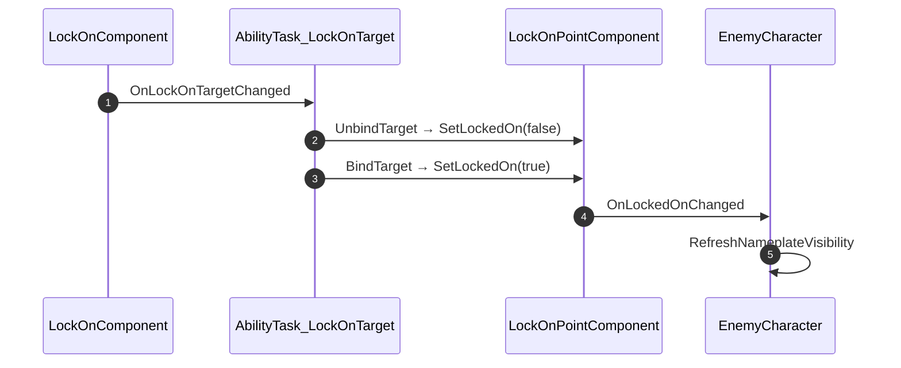

# 락온한 적의 네임플레이트 표시 복구

## 계획

### 목표
플레이어가 락온한 적의 네임플레이트가 뜨지 않는다. `State.InCombat`·`State.LockedOn` 태그를 `bHasAITarget`으로 통합할 때 락온 쪽 표시 조건이 대체 없이 사라진 탓이다. 락온을 표시 조건으로 되살리되, 제거된 태그는 부활시키지 않는다.

### 수정 범위
| 파일 | 수정할 내용 | 구분 |
|---|---|---|
| `Plugins/WxCombat/.../Public/Targeting/WxLockOnPointComponent.h` | `FWxOnLockedOnChanged` 델리게이트, `SetLockedOn()`·`IsLockedOn()` 선언, `bLockedOn` 멤버 | 수정 |
| `Plugins/WxCombat/.../Private/Targeting/WxLockOnPointComponent.cpp` | 값이 바뀔 때만 방송하는 세터, 액터의 지점을 훑는 질의 구현 | 수정 |
| `Plugins/WxCombat/.../Private/AbilitySystem/Task/WxAbilityTask_LockOnCamera.cpp` | `BindTarget()`에서 대상 지점에 켜고 `UnbindTarget()`에서 끈다 | 수정 |
| `Source/WxGame/Character/WxEnemyCharacter.h` | `HandleLockedOnChanged(bool)` 선언 | 수정 |
| `Source/WxGame/Character/WxEnemyCharacter.cpp` | `BeginPlay()`에서 지점 델리게이트 구독, 표시 조건에 락온 항 추가 | 수정 |

WxCore 태그 추가 없음. 신규 클래스·인터페이스 없음.

### 접근 방식
- **피대상 표시 상태를 락온 지점 컴포넌트가 갖는다**: 락온 대상이 될 수 있는 유일한 컴포넌트이고 짝이 되는 질의(`CanBeLockedOn()`)도 이미 거기 있다. 상태가 그 컴포넌트와 수명을 공유해 회수 누락이 원천적으로 없다 — 태그안은 ASC(액터)에 붙어 부위만 파괴돼도 소유 액터를 캐시해 거둬야 했다.
- **켜고 끄는 주체는 락온 태스크**: 로컬 조작 플레이어에게만 생성되고 레티클이라는 동일 성격의 개인 표시물을 이미 `BindTarget()`/`UnbindTarget()` 쌍으로 붙였다 뗀다. 같은 수명에 두면 한쪽만 남는 상태가 구조적으로 막힌다. 복제하지 않으므로 남이 락온한 적이 내 화면에 뜨지도 않는다.
- **적은 자기 지점만 구독한다**: 플레이어를 역참조하지 않아 빙의 전환·리스폰마다 재바인딩할 일이 없다. 표시 조건은 `생존 && (bHasAITarget || 락온됨)`이 된다.

---

## 완료

### 수정한 파일
| 파일 | 수정한 내용 | 구분 |
|---|---|---|
| `Plugins/WxCombat/.../Public/Targeting/WxLockOnPointComponent.h` | `FWxOnLockedOnChanged` 델리게이트, `SetLockedOn()`·`IsLockedOn()`·액터 단위 질의, `bLockedOn` 추가 | 수정 |
| `Plugins/WxCombat/.../Private/Targeting/WxLockOnPointComponent.cpp` | 값이 바뀔 때만 방송하는 세터, 액터의 지점을 훑는 질의 구현 | 수정 |
| `Plugins/WxCombat/.../Private/AbilitySystem/Task/WxAbilityTask_LockOnCamera.cpp` | `BindTarget()`에서 켜고 `UnbindTarget()`에서 끈다 | 수정 |
| `Source/WxGame/Character/WxEnemyCharacter.h` | `HandleLockedOnChanged(bool)` 선언 | 수정 |
| `Source/WxGame/Character/WxEnemyCharacter.cpp` | `BeginPlay()`에서 자기 지점을 전부 구독, 표시 조건에 락온 항 추가 | 수정 |

### 구현·결정과 그 이유
- **태그를 되살리지 않았다**: `State.*`는 이미 한 번 정리가 끝난 구역이라 전역 네임스페이스에 항목을 되돌리는 대신, 상태가 붙을 자리가 정확한 락온 지점 컴포넌트에 뒀다. 타입이 있어 디테일 패널에서 값이 그대로 보이고, 어디서 켜지고 꺼지는지가 세터 호출 두 곳으로 좁혀진다.
- **회수를 걱정하지 않아도 되는 구조**: 표시 상태가 지점 컴포넌트와 수명을 공유하므로, 부위만 파괴돼 약참조가 풀린 경우엔 끌 상태 자체가 사라진다. 태그안이라면 액터 ASC에 남아 캐시한 소유 액터로 따로 거둬야 했던 지점이다.
- **켜고 끄기는 레티클 옆에 뒀다**: 둘 다 로컬 플레이어에게만 존재하는 개인 표시물이라 생성·파괴 지점을 나란히 두면 한쪽만 남는 상태가 구조적으로 막힌다. 해제 시점의 대상 참조가 아직 이전 지점을 가리키는 덕에 대상 전환도 추가 상태 없이 정확히 넘어간다.
- **적은 자기 지점만 본다**: 플레이어를 역참조하지 않아 빙의 전환·리스폰마다 재바인딩할 일이 없다. 자기 소유 컴포넌트 구독이라 해제 코드도 두지 않았다.
- **질의는 액터 단위로 올렸다**: 표시가 묻는 것은 "이 적이 잡혔나"이지 "이 부위가 잡혔나"가 아니다. 지점 하나만 보면 부위가 늘어난 순간 다른 부위를 잡았을 때 조용히 표시가 빠진다. 액터의 지점을 훑는 질의를 지점 클래스의 기존 액터 단위 정적 함수들 옆에 두고, 적은 자기 지점을 전부 구독한다.
- **사망 우선은 그대로**: 락온 중 죽어도 숨김이 이긴다. 사망은 락온 해제 폴링보다 먼저 표시를 끈다.
- **검증**: UE 5.8 `WxEditor Win64 Development` 빌드가 `Result: Succeeded`로 끝났다.

### 계획 대비 달라진 점
- 계획대로.

### 후속 과제
- 인게임 실측 미실시. 미인지 적 락온 시 표시, 해제 시 원복, 대상 전환(A→B) 시 이전 대상 잔존 여부를 확인해야 한다.
- 표시 상태는 복제하지 않아 서버에서는 늘 꺼져 있다. 표시 밖의 판정이 이 값을 읽으면 서버와 갈린다.
- 구독은 `BeginPlay` 한 번뿐이라, 그 뒤에 붙인 지점은 표시를 갱신하지 못한다. 지금은 전부 생성 시점에 존재한다.
- 로컬 플레이어가 둘 이상이면(스플릿스크린) 참조 카운트가 없어 한 명의 해제가 다른 한 명의 표시를 끈다.
