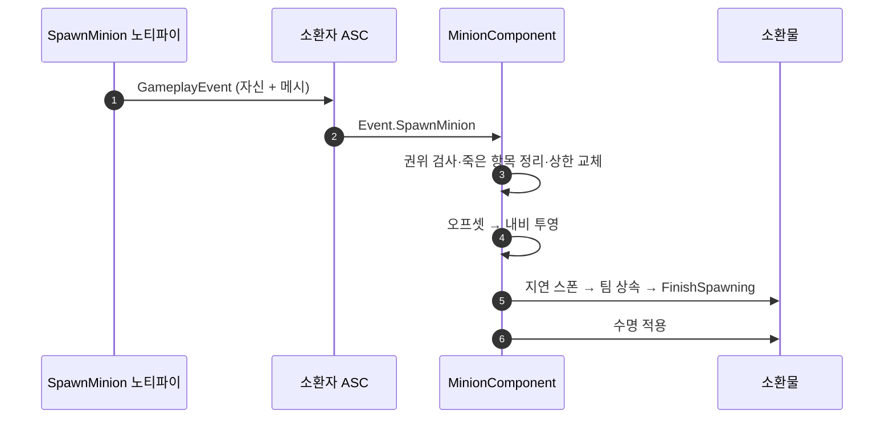

# 소환수 컴포넌트 (GameplayEvent → Minion 스폰)

## 계획

### 목표
백지화해 둔 소환을 투사체와 같은 패턴으로 다시 세운다. 몽타주 노티파이가 소환물 데이터를 실은 GameplayEvent를 쏘고, 캐릭터에 붙은 컴포넌트가 그것을 받아 서버 권위로 스폰·수명 관리를 맡는다. 용어는 소환수와 설치물을 함께 덮는 Minion으로 통일한다.

### 수정 범위
| 파일 | 수정할 내용 | 구분 |
|---|---|---|
| `Plugins/WxCore/.../WxGameplayTags.{h,cpp}` | `Event.SpawnMinion` 네이티브 태그 추가 | 수정 |
| `Plugins/WxCombat/.../AnimNotify/WxAnimNotify_SpawnMinion.{h,cpp}` | 소환물 클래스·오프셋·수명을 실어 이벤트만 발행하는 노티파이 | 신규 |
| `Plugins/WxCombat/.../Minion/WxMinionComponent.{h,cpp}` | 이벤트 구독, 서버 권위 스폰, 활성 소환물 상한·정리 | 신규 |
| `Source/WxGame/Character/WxCharacterBase.{h,cpp}` | `MinionComponent` 기본 서브오브젝트 부착, 행동트리 에셋·접근자 승격 | 수정 |
| `Source/WxGame/Character/WxMinion.{h,cpp}` | 테스트용 소환수 폰 | 신규 |
| `Source/WxGame/Character/WxEnemyCharacter.{h,cpp}` | 행동트리 에셋·접근자를 베이스로 넘김 | 수정 |
| `Source/WxGame/Controller/WxEnemyController.cpp` | 행동트리 실행·사망 구독을 베이스 캐릭터 기준으로 넓힘 | 수정 |

### 접근 방식
- **데이터는 노티파이가 소유**: 어빌리티가 소환물 종류를 모르게 해 몽타주 편집만으로 교체된다. 투사체 경로와 같은 계약이다.
- **소켓 대신 액터 로컬 오프셋 + 내비 투영**: 폰은 바닥과 내비메시 위에 서야 AI가 움직인다. 설치물에도 걸을 수 있는 지면이 놓고 싶은 자리라 해롭지 않다.
- **팀은 지연 스폰으로 BeginPlay 전에 심는다**: 팀은 EditDefaultsOnly 복제 값이라 FinishSpawning 전에 넣어야 최초 복제값부터 옳고 첫 프레임의 인지·대미지 판정이 어긋나지 않는다. 플러그인 경계 때문에 엔진 팀 인터페이스로만 다루고, 팀이 없는 설치물은 그냥 건너뛴다.
- **생존 감시는 델리게이트 대신 조회**: 죽어도 액터가 시체로 남는 프로젝트라 즉시 정리할 이유가 없고, 배열이 필요해지는 시점은 다음 소환뿐이다. 스폰할 때 죽은 항목을 걷어내면 소환물마다 붙던 델리게이트와 해제 경로가 통째로 사라진다.
- **AI 빙의는 순정에 맡긴다**: 소환수 BP의 AutoPossessAI로 충분하고, 폰이 아닌 설치물은 이 단계가 자연히 비어 있다.
- **상한 초과는 가장 오래된 것 교체**: 재시전하면 갈아치우는 감각이 자연스럽고, 상한이 1일 때 "안 나온다"보다 덜 답답하다.
- **이벤트 하나에 하나**: 여럿이 필요하면 노티파이를 여러 개 배치한다. 개수 파라미터를 두면 한 지점에 겹쳐 스폰하는 문제를 컴포넌트가 떠안는다.

---

## 완료

### 수정한 파일
| 파일 | 수정한 내용 | 구분 |
|---|---|---|
| `Plugins/WxCore/.../WxGameplayTags.{h,cpp}` | `Event.SpawnMinion` 네이티브 태그 추가 | 수정 |
| `Plugins/WxCombat/.../AnimNotify/WxAnimNotify_SpawnMinion.{h,cpp}` | 소환물 클래스·오프셋·수명을 실어 이벤트만 발행 | 신규 |
| `Plugins/WxCombat/.../Minion/WxMinionComponent.{h,cpp}` | 이벤트 구독, 서버 권위 스폰, 상한·수명·정리 | 신규 |
| `Source/WxGame/Character/WxCharacterBase.{h,cpp}` | `MinionComponent` 부착, 행동트리 에셋·접근자 승격 | 수정 |
| `Source/WxGame/Character/WxMinion.{h,cpp}` | 소환수 폰. 스폰 자동 빙의만 켠다 | 신규 |
| `Source/WxGame/Character/WxEnemyCharacter.{h,cpp}` | 행동트리 에셋·접근자를 베이스로 넘김 | 수정 |
| `Source/WxGame/Controller/WxEnemyController.cpp` | 행동트리 실행·사망 구독을 베이스 캐릭터 기준으로 넓힘 | 수정 |

### 구현·결정과 그 이유
- **소환수는 에너미를 상속하지 않는다**: 처음엔 AI 배선을 그대로 쓰려고 에너미 캐릭터를 이었지만, 그러면 아군 소환수가 처형 대상이 되고 처치 보상·스포너 훅까지 딸려온다. 실제로 에너미에만 묶여 있던 것은 행동트리 에셋 한 쌍뿐이라, 그것을 베이스로 올리고 컨트롤러가 베이스 기준으로 트리를 돌리게 하니 소환수는 베이스 직속으로 설 수 있었다. 락온 포인트·네임플레이트·상호작용은 자연히 빠진다.
- **사망 구독도 베이스로**: 죽으면 트리를 멈추는 처리는 에너미만의 것이 아니라 AI가 모는 폰 전부의 것이다. 타겟 유무(네임플레이트·뒤잡 판정)만 에너미에 남겼다.
- **소환수가 켜는 것은 자동 빙의뿐**: 엔진 기본은 배치된 폰만 빙의해, 스폰으로만 태어나는 소환수는 이 한 줄이 없으면 컨트롤러도 어빌리티 부여도 받지 못한다.
- **팀 기본값은 손대지 않는다**: 소환수의 팀은 늘 소환자에게서 오므로 클래스 기본값이 의미를 갖지 않는다.

### 계획 대비 달라진 점
- 계획에 없던 `AWxMinion`과 그것을 세우기 위한 행동트리 승격·컨트롤러 확장이 추가됐다. 테스트용 소환수 요청을 받아 진행했고, 에너미 상속 대신 베이스 직속으로 세우는 쪽을 택했다.

### 후속 과제
- `BP_Minion`(메시·애님BP·AbilitySet·행동트리)과 소환 몽타주 노티파이 저작, PIE 검증.
- `AWxEnemyController`가 아군 소환수도 몬다. 이름이 실제 역할보다 좁아졌으니 `AWxAIController` 개명을 검토한다.
