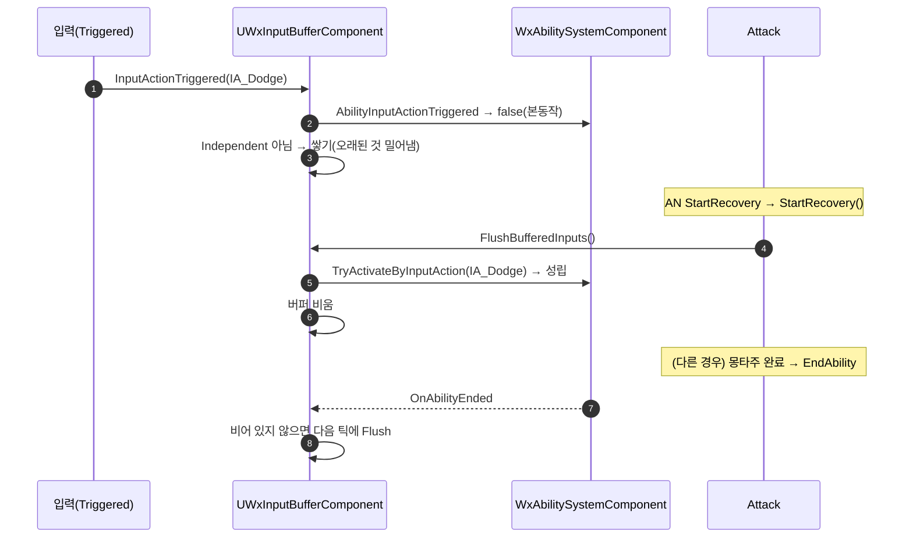

# 선입력을 ASC에서 독립 — UWxInputBufferComponent

## 계획

### 목표
ASC가 쥐고 있던 입력 버퍼(저장·만료·재생)를 플레이어 캐릭터의 액터 컴포넌트로 옮기고, 규칙을 다시 정한다 — 키 입력의 발동 시도가 실패하면 쌓고(Pending), 어빌리티 종료·후딜 시작(·콤보 창)에서 재시도하며, 유지 시간 0.4초·최대 n개(기본 1, 오래된 것부터 밀어냄)는 컴포넌트 속성으로 둔다.

### 수정 범위
| 파일 | 수정할 내용 | 구분 |
|---|---|---|
| `Plugins/WxCombat/.../AbilitySystem/WxInputBufferComponent.h/.cpp` | 버퍼 항목·배열·`BufferDuration`·`MaxBufferedInputs`, 라이브 입력 진입, 재생, ASC `OnAbilityEnded` 구독(다음 틱 재생), `FindComponent` | 신규 |
| `Plugins/WxCombat/.../AbilitySystem/WxAbilitySystemComponent.h/.cpp` | 버퍼 항목·배열·유지 시간·재생 함수 삭제. `AbilityInputActionTriggered`가 발동 성립을 bool로 반환, `TryActivateByInputAction` public | 수정 |
| `Plugins/WxCombat/.../Ability/WxAbilityBase.cpp` | 콤보 창·후딜 전이 직후 재생 호출을 아바타의 컴포넌트로 | 수정 |
| `Source/WxGame/Character/WxPlayerCharacter.h/.cpp` | 생성자에서 컴포넌트 생성, Triggered를 컴포넌트로 넘김(Released는 ASC 그대로) | 수정 |
| `Plugins/WxCombat/README.md` | ASC 책임에서 버퍼 제거, 핵심 타입에 컴포넌트 추가 | 수정 |

### 접근 방식
- **ASC는 라우팅, 컴포넌트는 버퍼**: ASC는 매칭 스펙의 키 상태·발동 시도·InputPressed 중계까지만 하고 성립 여부를 돌려준다. 버퍼 여부 판단·저장·만료·재생은 컴포넌트가 한다.
- **쌓는 조건**: 라이브 발동이 실패했고, 그 IA를 가진 어빌리티 중 Independent가 아닌 것이 있을 때. Independent(질주·락온)는 거절 주체가 액션이 아니고, 락온 해제 입력을 쌓으면 그 종료가 재시도 지점이 되어 다시 켜지므로 제외를 유지한다. 종전의 점유자 게이트는 뺀다(실패면 쌓는다는 규칙 그대로, 유휴 중 실패는 만료로 사라진다). IA로 라우팅되지 않는 이벤트 트리거 어빌리티는 이 경로에 오지 않는다.
- **성립하면 비운다**: 라이브든 재생이든 발동이 성립하면 쌓인 입력은 낡은 것이라 전부 버린다. 재생이 실패한 항목은 남긴다.
- **밀어내기**: 같은 IA는 기존 항목을 빼고 뒤에 다시 넣는다(홀드는 매 프레임 갱신). 개수가 상한이면 앞부터 뺀다. 시각은 실시간.
- **재시도 지점**: 후딜 시작·콤보 창은 노티파이에서 오는 호출이라 즉시 재생한다. 종료 통지(`OnAbilityEnded`)는 재발동 경로(이전 인스턴스 종료 → 새 활성화)와 취소 경로 안에서 동기로 오므로 그 자리에서 재생하면 새 인스턴스가 서기 전에 끼어들거나 같은 인스턴스가 이중 활성화된다 — 버퍼가 비어 있지 않을 때만 다음 틱으로 미룬다.

---

## 완료

### 수정한 파일
| 파일 | 수정한 내용 | 구분 |
|---|---|---|
| `Plugins/WxCombat/.../AbilitySystem/WxInputBufferComponent.h/.cpp` | 버퍼 항목·배열, `BufferDuration`(0.4, 실시간)·`MaxBufferedInputs`(1), `InputActionTriggered`(ASC 시도 → 성립 시 비움, 실패 시 Independent 제외하고 같은 IA 제거·앞부터 밀어내고 추가), `FlushBufferedInputs`(만료 폐기·오래된 순 재생·성립 시 비움), `OnAbilityEnded` 구독은 버퍼가 비어 있지 않을 때만 다음 틱 재생 | 신규 |
| `Plugins/WxCombat/.../AbilitySystem/WxAbilitySystemComponent.h/.cpp` | 버퍼 항목·배열·유지 시간·재생 함수·점유자 게이트 삭제. `AbilityInputActionTriggered`가 발동 성립을 bool로 반환, `TryActivateByInputAction` public(정의 순서도 헤더에 맞춤). 쓰지 않게 된 `Engine/World.h` include 제거 | 수정 |
| `Plugins/WxCombat/.../Ability/WxAbilityBase.cpp` | 콤보 창·후딜 전이 직후 아바타에서 `FindComponentByClass`로 컴포넌트를 찾아 재생 | 수정 |
| `Source/WxGame/Character/WxPlayerCharacter.h/.cpp` | 생성자에서 `InputBufferComponent` 생성, Triggered는 컴포넌트로, Released는 ASC 그대로 | 수정 |
| `Plugins/WxCombat/README.md` | ASC 책임에서 버퍼 제거, 핵심 타입에 컴포넌트 추가 | 수정 |

### 구현·결정과 그 이유
- **ASC는 성립 여부만 돌려준다**: 라우팅(키 상태·발동 시도·InputPressed 중계)은 스펙을 만지는 일이라 ASC에 남기고, 그 결과를 bool로 받은 컴포넌트가 기억할지 정한다. 어느 쪽도 상대의 상태를 들여다보지 않는다.
- **Independent 제외는 컴포넌트가 스펙을 훑어 판정**: ASC에 버퍼 정책용 질의를 두지 않으려고, 컴포넌트가 활성 가능 스펙에서 같은 IA를 가진 CDO의 그룹을 직접 본다. 락온 해제 입력을 기억하면 그 종료가 재시도 지점이 되어 다시 켜지므로 이 제외는 필수다.
- **점유자 게이트 제거**: "실패하면 쌓는다"는 규칙 그대로. 유휴 중 쿨다운·코스트 실패도 쌓이지만 재시도가 실패하면 남았다가 만료로 사라진다.
- **종료 시 재생은 다음 틱**: 종료 통지가 재발동 경로(이전 인스턴스 종료 → 같은 인스턴스 재활성화)와 취소 경로(`PreActivate`) 안에서 동기로 오는 것을 엔진 코드로 확인했다. 그 자리에서 재생하면 같은 인스턴스가 이중 활성화되거나, 새 어빌리티의 `ActionPhase`가 아직 직전 활성화 값이라 점유 판정이 뚫린다. 후딜·콤보 창 재생은 노티파이에서 오므로 종전처럼 즉시.
- **전이점에서 컴포넌트를 찾는 방식**: 아바타 액터에서 `FindComponentByClass`를 직접 부른다. 정적 `FindComponent` 래퍼는 두지 않는다(사용자 지시 — 락온 컴포넌트의 것도 없앨 예정). AI 캐릭터는 컴포넌트가 없어 조용히 지나간다.
- **컴포넌트는 플레이어 캐릭터에만**: 입력을 받는 액터가 플레이어뿐이라 `AWxCharacterBase`가 아닌 `AWxPlayerCharacter` 생성자에서 만든다.
- **홀드의 반복 진입은 새 입력이 아니다(점검 후 수정)**: 가드(Down)·강공격(Hold 반복)·궁극기(트리거 없음)는 쥔 동안 매 프레임 들어오는데, 매 프레임 뒤로 옮겨 넣으면 n=1에서 그 뒤에 누른 탭을 밀어낸다(가드를 쥔 채 회피 탭 → 후딜 전 가드를 떼면 둘 다 안 나감). ASC가 키 상태를 세우기 전에 순정 `Spec.InputPressed`를 읽어 이미 서 있으면 반복 진입으로 보고, 버퍼에 있으면 자리를 지킨 채 나이만 갱신하고(나이는 종전처럼 뗀 뒤부터) 없으면 다시 넣지 않는다. 플래그 없이 엔진 상태에서 파생했다.
- **Independent의 성립은 버퍼를 비우지 않는다(점검 후 수정)**: 비우는 목적은 같은 액션이 두 번 나가는 걸 막는 것이라, 액션 슬롯을 쓰지 않는 질주·락온의 성립은 관여하지 않는다. 쌓지 않는 쪽과 대칭이다.

### 계획 대비 달라진 점
- 계획의 정적 `FindComponent`는 사용자 지시로 빼고 `FindComponentByClass` 직접 호출로 바꿨다.

### 후속 과제
- PIE 실측(입력은 사용자): 본동작 중 공격 탭 → 콤보 창에서 2단, 공격 중 회피 탭 → 후딜에서 회피, 피격 중 공격 탭 → 피격 종료 다음 틱에 공격, 0.4초 넘긴 탭 무시, 두 키 연달아 → 마지막 것만(n=1), 락온 해제 시 재점등 없음, 가드 탭 무반응·홀드 정상. `BP_Player`의 `InputBufferComponent`에서 `BufferDuration`·`MaxBufferedInputs` 편집 확인.
- ASC에서 `InputBufferDuration`이 사라져 BP에 저장돼 있던 값은 로드 시 버려진다. 값을 바꿔 쓰고 있었다면 컴포넌트 쪽에 다시 적는다.
- 종료 시 재생이 한 틱 뒤다. 그 틱에서는 타이머가 입력 처리보다 먼저 돌아 재생이 라이브 입력에 앞선다(둘 다 같은 발동 시도라 결과는 한 번만 성립).
- `MaxBufferedInputs`가 0이면 빈 배열 `RemoveAt(0)`으로 터진다. 에디터는 `ClampMin=1`로 막혀 있고 코드로 0을 넣는 경로는 없어 가드를 두지 않았다.

---

# 후속: 정적 `FindComponent` 래퍼 전부 제거

사용자 지시로 `UWxLockOnComponent`·`UWxFinisherDamageComponent`·`UWxItemUseComponent`의 정적 `FindComponent(const AActor*)`를 지우고, 호출부 열 곳(`WxAbility_LockOn.cpp` 셋, `WxAbilityTask_LockOnCamera.cpp`, `WxRootMotionModifier_SnapToTarget.cpp`, `WxProjectileBase.cpp`, `WxAbility_Finisher.cpp` 둘, `WxAbility_UseItem.cpp` 둘)이 액터에서 `FindComponentByClass`를 직접 부른다. 액터가 null일 수 있는 곳만 삼항으로 걸렀고, 이미 null을 거른 곳은 바로 부른다. 투사체의 지역 변수는 `AActor::Instigator` 멤버를 가리지 않게 `InstigatorPawn`으로 뒀다. 동작 변화 없음, 빌드 통과.
