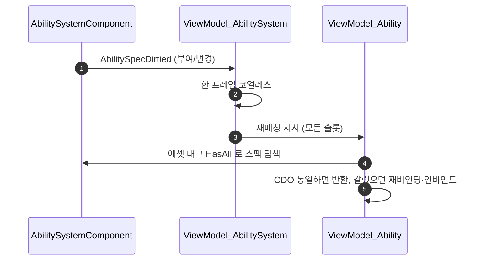

# 스킬 슬롯 뷰모델 어빌리티 추종

## 계획

### 목표
스킬이 게임 중간에 바뀌어도(변신·교체·봉인) 스킬바 슬롯이 따라가게 한다. 지금은 리졸버가 위젯 초기화 때 한 번만 돌고 뷰모델이 매칭된 어빌리티 CDO를 키로 캐시돼, 어빌리티가 갈리면 슬롯이 사라진 옛 어빌리티를 계속 보거나 부여 전이었으면 영영 빈 채로 남는다.

### 수정 범위
| 파일 | 수정할 내용 | 구분 |
|---|---|---|
| `Plugins/WxCore/Source/WxCore/Public/WxUIData.h` | `GetMaxRecharges()` 선언(기본 구현), 계약 주석 확장 | 수정 |
| `Plugins/WxCore/Source/WxCore/Private/WxUIData.cpp` | 기본 구현 정의 | 신규 |
| `Plugins/WxCombat/.../Ability/WxAbilityBase.h`, `.cpp` | `GetMaxRecharges()`를 IWxUIData 블록의 override로 이동 | 수정 |
| `Plugins/WxUI/.../MVVM/WxViewModel_Ability.h`, `.cpp` | 요청 태그 보유, 재바인딩·언바인드 경로, 어빌리티별 구독 해제 분리, 최대 충전 수 자체 조회 | 수정 |
| `Plugins/WxUI/.../MVVM/WxViewModel_AbilitySystem.h`, `.cpp` | 공유 키를 태그 컨테이너 정확 일치로, `AbilitySpecDirtiedCallbacks` 구독과 한 프레임 코얼레스, 전 슬롯 재매칭 | 수정 |
| `Source/WxGame/MVVM/WxViewModelResolver_Ability.h`, `.cpp` | 앞단 가드, 최대 충전 수 주입 제거, include·주석 정리 | 수정 |
| `Source/WxGame/Cheat/WxCheatManager.h`, `.cpp` | 검증용 치트 `WxToggleAbility` | 수정 |

### 접근 방식

- **슬롯이 뷰모델의 정체성이 된다**: 뷰모델이 어빌리티 CDO 대신 요청 태그 컨테이너를 쥐고, 어빌리티 탐색을 자기 안에서 한다. 매칭이 없어도 뷰모델은 살아 있고, 매칭이 갈리면 옛 어빌리티 구독을 풀고 표시 필드를 통째로 다시 세운다. 위젯이 보는 인스턴스는 그대로라 위젯 에셋을 건드릴 일이 없다.

- **슬롯 키는 어빌리티 에셋 태그 그대로**: 새 태그 축을 만들지 않는다. 리졸버가 이미 든 `AbilityTags`와 `GetAssetTags().HasAll()` 매칭이 그 자리다. 교체로 들어오는 어빌리티가 그 슬롯의 에셋 태그를 달면 슬롯 표를 따로 저작할 필요가 없다.

- **공유 키는 태그 컨테이너 정확 일치**: 지금 CDO를 키로 삼은 이유는 요청 태그를 포함 관계로 조회하면 넓은 질의가 먼저 만들어진 뷰모델을 주워 생성 순서에 따라 결과가 갈리기 때문인데, 정확 일치는 그 문제가 없다.

- **부여 변화는 엔진 순정 델리게이트로**: `AbilitySpecDirtiedCallbacks`를 구독해 한 프레임 모은 뒤 슬롯 전부에 재매칭을 지시한다. 전부를 훑으므로 교체("제거 후 부여")의 마지막 부여 신호 하나로 사라진 슬롯까지 정리된다. 이 신호는 오써리티에서만 뜨고 제거 단독은 잡지 못하는데, 둘 다 실사용에서 걸리지 않아 배선을 늘리지 않고 주석으로 못박는다. 필요해지면 `UWxAbilitySystemComponent`가 `OnGiveAbility`/`OnRemoveAbility`로 발행하는 길로 넓힌다.

- **최대 충전 수는 계약으로**: 어빌리티가 갈리면 리졸버가 다시 주입할 수 없으므로 뷰모델이 스스로 읽어야 한다. `IWxUIData`에 기본 구현 1을 둔 `GetMaxRecharges()`를 더해 GE 쪽 구현체는 손대지 않는다.

---

## 완료

### 수정한 파일
| 파일 | 수정한 내용 | 구분 |
|---|---|---|
| `Plugins/WxCore/Source/WxCore/Public/WxUIData.h` | `GetMaxRecharges()` 추가, 계약 설명에 충전 칸 수 포함 | 수정 |
| `Plugins/WxCore/Source/WxCore/Private/WxUIData.cpp` | 기본 구현(1) | 신규 |
| `Plugins/WxCombat/.../Ability/WxAbilityBase.h` | `GetMaxRecharges()`를 IWxUIData 블록의 override로 이동 | 수정 |
| `Plugins/WxUI/.../MVVM/WxViewModel_Ability.h`, `.cpp` | 슬롯 태그로 초기화, `RefreshBoundAbility`·`StopCooldownTicker`·`UnbindCostAttributes` 추가, `GetBoundAbility` 제거, `SetMaxRecharges` 순수 세터화 | 수정 |
| `Plugins/WxUI/.../MVVM/WxViewModel_AbilitySystem.h`, `.cpp` | 공유 키를 태그 컨테이너 정확 일치로, `AbilitySpecDirtiedCallbacks` 구독과 프레임 코얼레스 재매칭 | 수정 |
| `Source/WxGame/MVVM/WxViewModelResolver_Ability.h`, `.cpp` | 앞단 가드, 최대 충전 수 주입 제거, include·주석 정리 | 수정 |
| `Source/WxGame/Cheat/WxCheatManager.h`, `.cpp` | 검증용 `WxToggleAbility` | 수정 |

### 구현·결정과 그 이유

- **슬롯이 정체성이 됐다**: 뷰모델이 어빌리티 CDO 대신 슬롯 태그를 쥐고 어빌리티를 스스로 찾는다. 매칭이 갈리면 옛 어빌리티에 매달린 코스트 구독과 쿨다운 티커를 끊고 표시를 다시 세우며, 매칭이 사라지면 필드를 비운다. 위젯이 보는 인스턴스는 그대로라 위젯 에셋은 하나도 건드리지 않았다.

- **공유 키는 태그 컨테이너 정확 일치**: 종전에 CDO를 키로 삼은 이유는 포함 관계 조회가 생성 순서에 따라 결과를 갈랐기 때문인데, 정확 일치는 그 문제가 없어 키를 슬롯 쪽으로 옮길 수 있었다.

- **부여 감지는 엔진 순정 델리게이트로**: `AbilitySpecDirtiedCallbacks`를 프레임당 한 번으로 모아 슬롯 전부를 훑는다. 이 신호는 오써리티에서만 뜨고 제거 단독은 잡지 못하지만, 교체는 반드시 부여로 끝나고 훑는 대상이 전체라 비게 된 슬롯까지 같이 정리된다. 넷 정확성이 필요해지면 `UWxAbilitySystemComponent`가 `OnGiveAbility`/`OnRemoveAbility`로 발행하는 길이 있고, 그 두 훅이 서버·클라 양쪽에서 도는 것은 엔진 소스로 확인했다.

- **최대 충전 수는 계약으로**: 어빌리티가 갈리면 리졸버가 다시 주입할 수 없다. 기본 구현을 둔 덕에 GE 쪽 구현체는 손대지 않았다.

- **세터가 세터가 됐다**: `SetMaxRecharges`가 현재 충전을 덮고 쿨다운 티커까지 걷어차던 것은 리졸버가 뒤늦게 주입하던 시절의 흔적이다. 순서를 뷰모델이 쥐게 되면서 그 부수효과를 걷었고, 같은 어빌리티를 보는 두 번째 위젯이 붙을 때 충전 수가 한 번 튀던 것도 사라졌다.

- **비용 반영을 구독보다 앞에 뒀다**: 코스트가 없는 어빌리티로 갈아탔을 때 옛 수치가 남지 않게, 구독 여부와 무관하게 먼저 값을 넣는다.

### 계획 대비 달라진 점
- 쿨다운 GE 적용 구독을 어빌리티별에서 ASC 단위 1회로 올렸다. 어빌리티가 갈려도 같은 ASC에서 오는 신호라 붙였다 뗐다 할 이유가 없고, 거르는 일은 핸들러가 이미 쿨다운 태그로 하고 있었다.

### 후속 과제
- **PIE 미검증**. 빌드만 확인했다. 스킬바 4슬롯의 표시와 `WxToggleAbility Ability.Skill.1` 로 슬롯이 비었다 돌아오는지, 쿨다운 도중 교체가 옛 값을 물고 오지 않는지는 아직 안 봤다.
- 리졸버가 이제 WxCombat을 전혀 참조하지 않는다. `UWxViewModelResolver_Attribute`처럼 `WxViewModel_Ability.h`로 내려 WxUI에 합칠 수 있으나, `WBP_Ability`·`WBP_PlayerSkills`가 옛 클래스 경로를 물고 있어 CoreRedirects와 에셋 재저장이 필요하므로 별건으로 둔다.
- 순수 클라이언트에서의 부여 추종은 멀티 정책이 정해질 때까지 보류.
