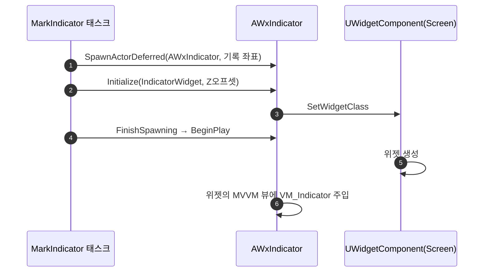

# 인디케이터 — 노드 지정을 액터 클래스에서 위젯 클래스로

## 계획

### 목표
`FWxStateTreeTask_MarkIndicator` 가 스폰할 `AWxIndicator` BP 서브클래스 대신 표시할 위젯 클래스를 직접 고르게 바꾼다. 아무 위젯이나 꽂히지 않도록 인디케이터 위젯 표식 인터페이스를 두고 픽커를 좁힌다.

### 수정 범위
| 파일 | 수정할 내용 | 구분 |
|---|---|---|
| `Plugins/WxUI/Source/WxUI/Public/Indicator/WxIndicatorWidget.h` | `IWxIndicatorWidget` — 인디케이터 위젯 표식 인터페이스 | 신규 |
| `.../Public/Indicator/WxStateTreeTask_MarkIndicator.h` `.../Private/Indicator/WxStateTreeTask_MarkIndicator.cpp` | `IndicatorClass` → `IndicatorWidget`(위젯 클래스, `MustImplement`), 스폰 대상을 `AWxIndicator` 고정 + 지연 스폰 | 수정 |
| `.../Public/Indicator/WxIndicator.h` `.../Private/Indicator/WxIndicator.cpp` | `Initialize` 가 위젯 클래스도 받아 위젯 컴포넌트에 꽂음, 클래스 주석·경고 문구 정정 | 수정 |
| `Plugins/WxUI/README.md` | 확장 포인트에 인디케이터 위젯 저작 규약 한 줄 추가 | 수정 |

### 접근 방식
- **표식 인터페이스는 함수 없는 마커로 둔다**: 위젯이 값을 받는 경로는 `UWxViewModel_Indicator` 를 MVVM 뷰에 밀어 넣는 것 하나뿐이라 인터페이스가 함수를 들 이유가 없다. `Blueprintable` 로 두면 WBP 가 클래스 세팅에서 구현을 선언하고, 노드 픽커는 `MustImplement` 로 좁혀진다. 함수가 없으므로 cpp 는 두지 않는다(`IWxUIData` 선례).
- **위젯 클래스는 지연 스폰으로 BeginPlay 앞에 넣는다**: 위젯 컴포넌트는 자기 BeginPlay 에서 위젯을 만들고 액터 BeginPlay 가 그 위젯에 뷰모델을 묶는다. 일반 스폰 뒤에 클래스를 꽂으면 위젯이 바인딩보다 늦게 태어나 값이 들어가지 않는다.
- **액터는 파생 없이 그대로 스폰한다**: 표시 저작이 전부 위젯으로 옮겨가므로 중간 BP 서브클래스가 필요 없다. 위젯 부재 경고도 노드 지정을 가리키도록 고친다.
- **여백(`ScreenMargin`)은 그대로 둔다**: BP 저작 자리가 사라지지만 지금 값으로 충분하고 노드 파라미터를 늘릴 만한 값이 아니다.

---

## 완료

### 수정한 파일
| 파일 | 수정한 내용 | 구분 |
|---|---|---|
| `Plugins/WxUI/Source/WxUI/Public/Indicator/WxIndicatorWidget.h` | `IWxIndicatorWidget` — 함수 없는 표식 인터페이스 | 신규 |
| `.../Public/Indicator/WxStateTreeTask_MarkIndicator.h` `.../Private/Indicator/WxStateTreeTask_MarkIndicator.cpp` | 파라미터를 `IndicatorWidget`(위젯 클래스, `MustImplement`)로 교체, `AWxIndicator` 지연 스폰 후 위젯 클래스 주입 | 수정 |
| `.../Public/Indicator/WxIndicator.h` `.../Private/Indicator/WxIndicator.cpp` | `Initialize` 가 위젯 클래스도 받아 위젯 컴포넌트에 꽂음, 클래스 주석·위젯 부재 경고 문구 정정 | 수정 |
| `Plugins/WxUI/README.md` | 확장 포인트에 인디케이터 위젯 저작 규약 추가 | 수정 |

### 구현·결정과 그 이유
- **표식 인터페이스에 함수를 두지 않았다**: 위젯이 값을 받는 경로는 인디케이터 액터가 뷰모델을 MVVM 뷰에 밀어 넣는 것 하나뿐이라 구현할 계약이 없다. 인터페이스의 목적은 노드 픽커를 좁히는 것 하나이고, `Blueprintable` 이라 WBP 가 클래스 세팅에서 구현만 선언하면 된다. 함수가 없어 cpp 도 두지 않았다.
- **지연 스폰으로 위젯 클래스를 BeginPlay 앞에 넣는다**: 위젯 컴포넌트는 자기 BeginPlay 에서 위젯을 만들고 액터 BeginPlay 가 곧바로 그 위젯에 뷰모델을 묶는다. 일반 스폰 뒤에 클래스를 꽂으면 위젯이 바인딩보다 늦게 태어나 값이 영영 들어가지 않는다.
- **액터 파생을 없앴다**: 표시 저작이 전부 위젯으로 옮겨가 중간 BP 서브클래스가 할 일이 남지 않았다. 노드는 `AWxIndicator` 를 그대로 스폰하고, 위젯 부재 경고도 액터 클래스 이름 대신 노드 지정을 가리킨다.
- **위젯 헤더는 cpp 에서만 포함한다**: 헤더는 전방 선언으로 두되, `TSubclassOf` 의 유효성 검사(`operator*`)가 완전한 타입을 요구해 태스크 cpp 에 `UserWidget.h` 를 포함했다.

### 계획 대비 달라진 점
- 계획대로.

### 후속 과제
- 에셋 작업이 남았다(이번 세션 unreal-mcp 연결 실패로 미실시): `WBP_QuestIndicator` 에 `IWxIndicatorWidget` 구현 선언 추가, 퀘스트 ST 노드의 인디케이터 위젯 지정.
- 런타임 확인 미실시(빌드 검증만). 위 에셋 작업 뒤 PIE 로 ① 위젯 표시와 뷰모델 값 유입, ② 화면 밖·카메라 뒤 클램프, ③ 상태 이탈 시 파기.
