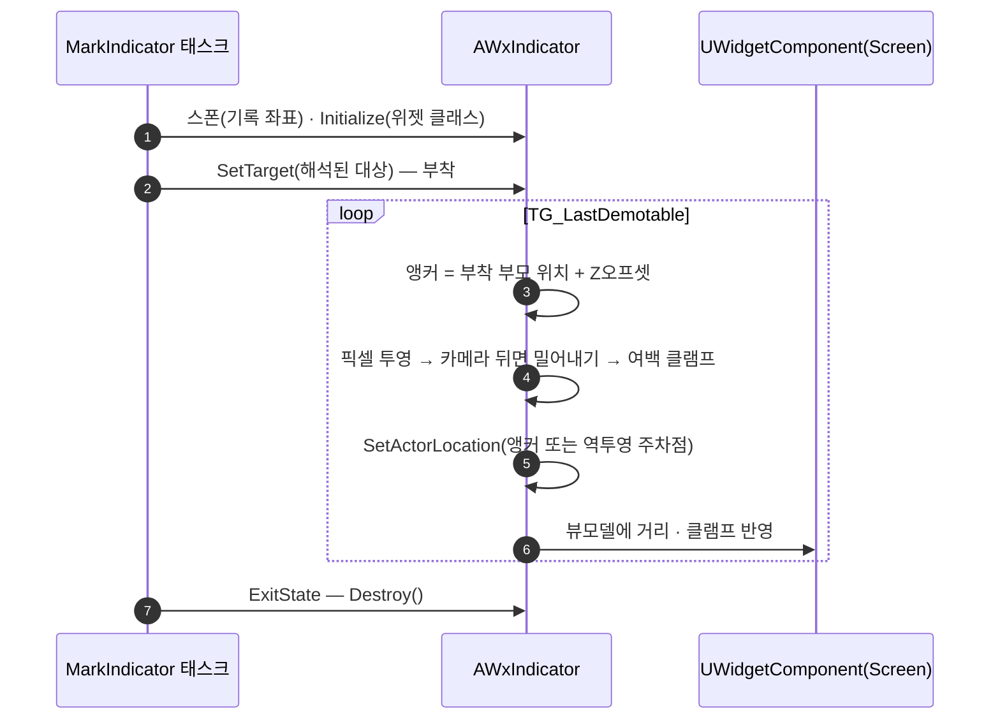

# 인디케이터 — HUD 레이어 제거, 위젯 컴포넌트 방식으로 전환

## 계획

### 목표
인디케이터 전용 HUD 표시 레이어(매니저 컴포넌트 · 등록증 · 슬롯 뷰모델 리졸버 · HUD 에 미리 배치한 슬롯 위젯)를 걷어내고, 대상에 부착되는 스크린 스페이스 위젯 컴포넌트로 바꾼다. 대상이 화면 밖이거나 카메라 뒤일 때도 화면 가장자리에 여백을 두고 방향을 가리키게 유지한다.

### 수정 범위
| 파일 | 수정할 내용 | 구분 |
|---|---|---|
| `Plugins/WxUI/Source/WxUI/Public/Indicator/WxIndicator.h` `.../Private/Indicator/WxIndicator.cpp` | `AWxIndicator` 신설 — 위젯 컴포넌트를 루트로 들고 매 틱 투영·클램프해 스스로 주차 | 신규 |
| `.../Public/Indicator/WxIndicatorManagerComponent.h` `.../Private/Indicator/WxIndicatorManagerComponent.cpp` | 매니저 컴포넌트 제거 | 삭제 |
| `.../Public/Indicator/WxIndicatorDescriptor.h` `.../Private/Indicator/WxIndicatorDescriptor.cpp` | 등록증 제거 | 삭제 |
| `.../Public/MVVM/WxViewModel_Indicator.h` `.../Private/MVVM/WxViewModel_Indicator.cpp` | 매니저 구독·슬롯·리졸버 제거, 표시 필드를 거리·클램프 2개로 축소 | 수정 |
| `.../Public/Indicator/WxStateTreeTask_MarkIndicator.h` `.../Private/Indicator/WxStateTreeTask_MarkIndicator.cpp` | 등록증 발급 → 인디케이터 액터 스폰·부착·파기, 스폰할 액터 클래스 필드 추가 | 수정 |

### 접근 방식

- **대상 액터가 아니라 얇은 액터에 싣는다**: 대상이 월드 파티션으로 언로드된 동안에도 기록 좌표를 가리키는 기존 동작을 지켜야 한다(마커가 가장 필요한 때가 목표가 멀어 스트리밍되지 않은 때다). 대상 액터에 컴포넌트를 직접 붙이면 대상과 함께 사라지므로, 인디케이터를 독립 액터로 두고 대상이 로드돼 있을 때만 부착한다.

- **원하는 화면 좌표로 투영되는 월드 지점에 주차한다**: 엔진의 스크린 스페이스 위젯 레이어는 카메라 뒤 대상을 숨기고(`FSceneView::ProjectWorldToScreen` 실패), `ModifyProjectedLocalPosition` 훅도 투영 성공 시에만 불려 등 뒤 대상을 가장자리로 끌어올 수 없다. 그래서 클램프한 화면 좌표를 역투영한 광선 위, 실제 대상 거리 지점에 액터를 옮긴다 — 엔진이 그대로 그 좌표에 그리고 Z 정렬도 유지된다.

- **앵커는 부착 부모에서 다시 구한다**: 액터 트랜스폼이 표시 위치 전용 스크래치가 되므로 대상 위치를 거기서 읽을 수 없다. 부착 중이면 매 틱 마지막 앵커를 갱신해 두어, 대상 파괴로 엔진이 부착을 풀 때(KeepWorldTransform) 주차 좌표가 앵커로 굳는 것을 막는다.

- **표시 저작은 인디케이터 BP 한 곳에**: 위젯 클래스는 프로젝트 세팅이 아니라 `AWxIndicator` BP 서브클래스의 위젯 컴포넌트에 저작하고, 아이콘 등 표시 내용도 그 위젯이 들고 있는다. ST 노드는 스폰할 인디케이터 클래스만 지정한다.

---

## 완료

### 수정한 파일
| 파일 | 수정한 내용 | 구분 |
|---|---|---|
| `Plugins/WxUI/Source/WxUI/Public/Indicator/WxIndicator.h` `.../Private/Indicator/WxIndicator.cpp` | `AWxIndicator` — 위젯 컴포넌트를 루트로 들고 매 틱 앵커 투영·가장자리 클램프·주차, 뷰모델 바인딩 | 신규 |
| `.../Public/Indicator/WxIndicatorManagerComponent.h` `.../Private/Indicator/WxIndicatorManagerComponent.cpp` | 매니저 컴포넌트 제거 | 삭제 |
| `.../Public/Indicator/WxIndicatorDescriptor.h` `.../Private/Indicator/WxIndicatorDescriptor.cpp` | 등록증 제거 | 삭제 |
| `.../Public/MVVM/WxViewModel_Indicator.h` `.../Private/MVVM/WxViewModel_Indicator.cpp` | 매니저 구독·슬롯·리졸버 제거, `DistanceMeters`·`bClamped` 와 `SetProjection` 만 남김 | 수정 |
| `.../Public/Indicator/WxStateTreeTask_MarkIndicator.h` `.../Private/Indicator/WxStateTreeTask_MarkIndicator.cpp` | 등록증 발급 → 인디케이터 액터 스폰·부착·파기, `IndicatorClass` 필드 추가 | 수정 |
| `Plugins/WxUI/README.md` | 삭제된 매니저 컴포넌트를 가리키던 항목을 `AWxIndicator` 로 교체 | 수정 |

### 구현·결정과 그 이유
- **인디케이터를 독립 액터로 두고 대상에는 부착만 한다**: 대상 액터에 위젯 컴포넌트를 직접 붙이면 스트리밍 아웃과 함께 사라져, 기록 좌표를 가리키는 기존 동작이 무너진다. 목표가 멀어 아직 로드되지 않은 때가 마커가 가장 필요한 때다.
- **화면 좌표를 역투영해 액터를 주차한다**: 엔진 스크린 스페이스 레이어는 카메라 뒤 대상을 아예 숨기고(`FSceneView::ProjectWorldToScreen` 실패) 투영 후 보정 훅(`ModifyProjectedLocalPosition`)도 그때는 부르지 않아, 등 뒤 목표를 가장자리로 끌어올 방법이 없다. 그래서 당긴 화면 좌표로 투영되는 월드 지점을 역으로 구해 그리로 옮긴다. 실제 대상 거리에 놓아 위젯 간 앞뒤 정렬도 유지된다.
- **앵커를 별도 필드로 붙든다**: 루트 트랜스폼이 표시 위치 전용이 되므로 대상 위치를 거기서 읽을 수 없다. 대상이 파괴되면 엔진이 부착을 풀며 루트를 주차 좌표에 남기는데(`USceneComponent::OnComponentDestroyed` 의 타 액터 자식 분리), 그 값을 앵커로 삼으면 마커가 엉뚱한 곳에 굳는다.
- **클램프 계산을 슬레이트가 아닌 픽셀 공간으로 옮김**: 역투영(`DeprojectScreenToWorld`)과 엔진 레이어의 투영이 모두 constrained view rect 픽셀 좌표를 쓴다. 여백만 뷰포트 스케일로 환산해 저작 단위(슬레이트)를 유지했다.
- **부착 여부가 곧 재해석 신호**: 태스크는 `HasTarget()` 이 false 일 때만 `SyncFind` 를 돌린다. 정상 표시 중 해석 비용이 0이고, 스트리밍 아웃으로 부착이 풀리면 자동으로 재시도가 재개된다.
- **표시 저작을 인디케이터 BP 한 곳으로**: 위젯 클래스·아이콘은 `AWxIndicator` BP 서브클래스의 위젯 컴포넌트가 들고, ST 노드는 그 클래스만 지정한다. 프로젝트 세팅 같은 전역 지정 자리를 두지 않았다.

### 계획 대비 달라진 점
- 위젯 클래스를 `UWxUIDeveloperSettings::IndicatorWidgetClass` 로 두려던 계획을 접고, ST 노드의 `IndicatorClass`(스폰할 `AWxIndicator` BP)로 바꿨다. 아이콘까지 그 BP 의 위젯이 들고 있게 하려는 사용자 요청.

### 후속 과제
- 에셋 정리가 남았다: `WBP_GameHUD` 의 인디케이터 슬롯 위젯 제거, `WBP_QuestIndicator` 의 리졸버 바인딩 제거(뷰모델은 액터가 주입), `WAS_CoreGameplay` 의 `WxIndicatorManagerComponent` 주입 제거, `AWxIndicator` BP 서브클래스 작성 후 퀘스트 ST 노드에 지정.
- 런타임 확인 미실시(빌드 검증만). ① 화면 안/밖/카메라 뒤 각각의 표시 위치, ② 대상 스트리밍 아웃·인 왕복 시 기록 좌표 잔류와 재부착, ③ 상태 이탈 시 액터 파기.

### 리뷰 반영 (동일 작업 후속)
`/code-review` 결과 14건 중 6건을 수정했다.

- **빈 로케이터에서 조기 반환**: 경고만 남기고 스폰까지 진행해, 대상 미지정 노드가 월드 원점에 마커를 띄우고 있었다(기존 동작은 표시 없음).
- **`GetPixelPoint` 에 뷰 크기 전달**: 엔진은 카메라 뒤 좌표를 중심이 아니라 `ViewRect.Max` 의 절반 기준으로 뒤집는다. 뷰 원점이 (0,0) 이 아닌 경우(레터박스 등) 접힌 좌표가 `ViewRect.Min` 만큼 어긋난다. 삭제된 매니저는 alloted size 를 넘겨 이를 피하고 있었는데 이관하며 빠뜨렸다. 좌표계를 뷰 기준으로 통일하고 역투영에서만 원점을 되돌린다.
- **정확히 등 뒤일 때의 퇴화 방향 처리**: 접힌 좌표가 중심에 얹히면 정규화가 0 벡터가 되어 클램프가 걸리지 않고, 카메라 뒤에 주차돼 위젯이 사라진다. 아래 방향으로 대체한다.
- **`SetViewModelByClass` 실패 로그**: 위젯은 뜨고 값만 안 들어오는 실패라 로그가 없으면 원인을 짚을 수 없다. 실패 시 뷰모델을 들지 않아 매 틱 빈 푸시도 하지 않는다.
- **데디 서버 스폰 차단**: 그릴 화면이 없는 머신에서 틱만 도는 액터가 생겼다. 삭제된 매니저의 `IsLocalController()` 게이트에 해당하는 자리다.
- **`SetTarget` 주석 정정**: null 이면 부착을 푼다고 적었으나 `AActor::AttachToActor` 는 null 부모에서 노옵이다. 호출부가 없으므로 계약을 실제 동작에 맞춰 고쳤다.

기각: 실패한 스폰 재시도(영구 실패에 매 틱 재시도가 더 나쁨), `EnterState` 의 고아 액터 방어(ST 가 Enter/Exit 짝을 보장, 기존 코드도 동일), `Initialize` 를 BeginPlay 앞으로(ZOffset 은 BP 노출이 없어 첫 틱 전에만 있으면 됨), 가시성 플래그 전용 소유(대안인 `bHiddenInGame` 은 스크린 스페이스 부착 판정에 걸리지 않음), VP 행렬 중복 계산(인디케이터 1~2개 규모), 헬퍼 배치 관련 스타일 2건.
