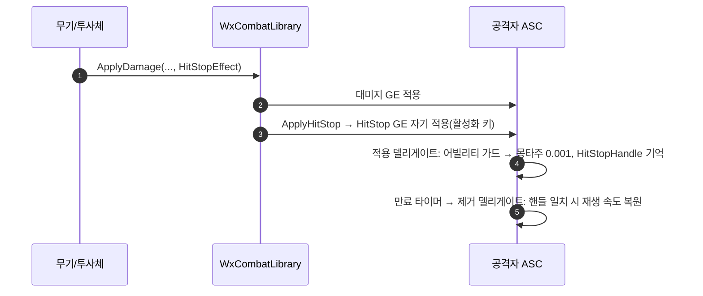
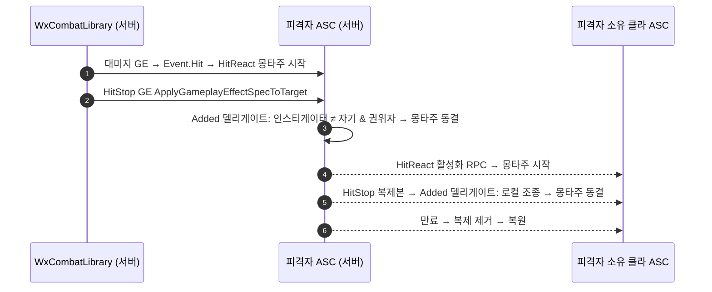
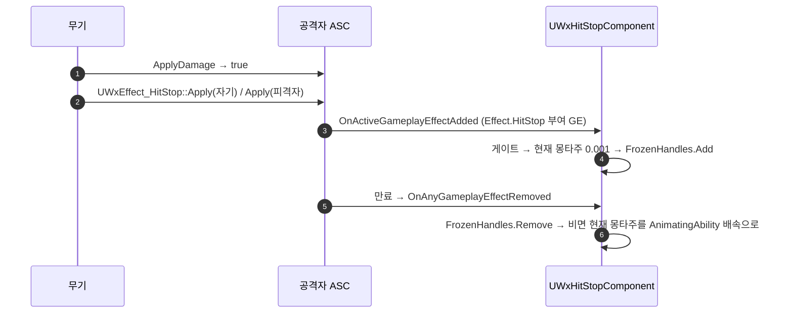

# 히트스톱 GE 분리

## 계획

### 목표
타이머로 구현된 역경직(히트스톱)을 `UWxEffect_HitStop` GE로 옮겨 기획자가 `DT_Effect`의 Duration으로 타격감을 조정하게 하고, 무기와 투사체가 각자 GE 클래스를 들게 한다.

### 수정 범위
| 파일 | 수정할 내용 | 구분 |
|---|---|---|
| `Plugins/WxCombat/.../Effect/WxEffect_HitStop.h/.cpp` | 비중첩 HasDuration GE. `UWxMMC_EffectDuration`으로 표 Duration을 읽고 `UWxEffectComponent_Table`을 부착 | 신규 |
| `Plugins/WxCombat/.../WxAbilitySystemComponent.h/.cpp` | `ApplyHitStop`·타이머 제거. GE 적용/제거 델리게이트로 몽타주 동결·복원, `HitStopHandle`로 마지막 인스턴스만 복원 | 수정 |
| `Plugins/WxCombat/.../WxCombatLibrary.h/.cpp` | `ApplyDamage` 인자 `float` → `TSubclassOf<UWxEffect_HitStop>`. `ApplyHitStop(Source, Effect)` 신설 | 수정 |
| `Plugins/WxCombat/.../Weapon/WxWeaponBase.h/.cpp` | `HitStopDuration` → `HitStopEffect` 클래스 필드 | 수정 |
| `Plugins/WxCombat/.../Weapon/WxProjectileBase.h/.cpp` | `HitStopEffect` 필드 추가. 서버는 `ApplyDamage`로, 클라는 권위 검사 앞에서 로컬로 히트스톱 적용 | 수정 |
| `Plugins/WxCombat/.../Finisher/WxFinisherDamageComponent.cpp` | `ApplyDamage` 호출 인자 정리 | 수정 |
| `Plugins/WxCombat/README.md` | 데이터 주도 GE 목록에 히트스톱 추가 | 수정 |

### 접근 방식
- **GE 인스턴스 = 타이머**: 적중마다 별도 인스턴스를 어빌리티 활성화 예측 키로 자기 ASC에 건다. 예측 인스턴스도 로컬 만료 타이머가 걸리고 제거 델리게이트는 게이트 없이 불리므로, 소유 클라도 종료를 스스로 처리한다.
- **복제본 거르기**: 복제본은 컨텍스트의 `AbilityInstanceNotReplicated`가 비어, 기존 "몽타주를 쥔 어빌리티와 같을 때만" 가드가 그대로 걸러낸다. 같은 가드가 패리 반응 양보도 맡는다.
- **연타**: 새 인스턴스가 `HitStopHandle`을 덮어써 마지막 인스턴스의 만료만 복원한다.
- **투사체**: 대미지가 서버 전용이고 서버가 얼린 재생 속도는 소유 클라 몽타주에 복제되지 않으므로, 임팩트 이펙트처럼 클라도 로컬로 건다.

---

## 완료

### 수정한 파일
| 파일 | 수정한 내용 | 구분 |
|---|---|---|
| `Plugins/WxCombat/.../Effect/WxEffect_HitStop.h/.cpp` | HasDuration, `UWxMMC_EffectDuration` 지속시간, `UWxEffectComponent_Table` 부착. 태그·모디파이어·스택 없음 | 신규 |
| `Plugins/WxCombat/.../WxAbilitySystemComponent.h/.cpp` | `ApplyHitStop`·타이머 제거. 생성자에서 GE 적용/제거 델리게이트 바인딩, `HandleGameplayEffectAppliedToSelf`/`HandleGameplayEffectRemoved`, `HitStopHandle` | 수정 |
| `Plugins/WxCombat/.../WxCombatLibrary.h/.cpp` | `ApplyDamage` 마지막 인자 `TSubclassOf<UWxEffect_HitStop>`. `ApplyHitStop(Source, Effect)` 신설 | 수정 |
| `Plugins/WxCombat/.../Weapon/WxWeaponBase.h/.cpp` | `HitStopDuration` → `HitStopEffect` | 수정 |
| `Plugins/WxCombat/.../Weapon/WxProjectileBase.h/.cpp` | `HitStopEffect` 추가. 서버는 `ApplyDamage`, 클라는 권위 검사 앞에서 `ApplyHitStop` | 수정 |
| `Plugins/WxCombat/.../Finisher/WxFinisherDamageComponent.cpp` | `ApplyDamage` 호출 인자 정리 | 수정 |
| `Plugins/WxCombat/README.md` | 데이터 주도 GE 목록·히트스톱 규약 한 줄 | 수정 |

### 구현·결정과 그 이유
- **적용 델리게이트는 `OnGameplayEffectAppliedDelegateToSelf`**: 로컬 적용(서버·예측 클라)에만 불리고 복제본에는 불리지 않는다. 복제본은 어차피 컨텍스트의 어빌리티 인스턴스가 비어 가드에 걸리지만, 애초에 오지 않는 쪽이 낫다.
- **제거는 컨테이너 전체 델리게이트 + 핸들 비교**: 핸들 단위 `OnGameplayEffectRemoved_InfoDelegate`는 스코프 락 중 보류된 추가를 못 찾을 수 있다. 복제본 핸들은 수신 시 새로 발급되므로 로컬 핸들과 겹치지 않는다.
- **비중첩 인스턴스**: 중첩 GE의 갱신은 소유 클라의 로컬 키에서 타이머를 세우지 않고, 태그가 있으면 서버 복제본 수신 뒤 로컬 태그 제거가 억제된다. 인스턴스마다 자기 타이머를 갖게 해 두 함정을 모두 피했다.
- **Duration 0 은 스펙 단계에서 차단**: 엔진이 0을 0.1초로 올리며 Error 로그를 남기므로, 표에서 0을 "역경직 없음"으로 쓸 수 있게 먼저 거른다.
- **투사체 클라 로컬 적용**: `OnRep_ReplicatedAnimMontage`는 로컬 조종 액터에 재생 속도를 적용하지 않아, 서버만 걸면 소유 클라가 히트스톱을 못 본다. 임팩트 이펙트와 같은 자리에서 로컬로 건다.

### 계획 대비 달라진 점
- 계획대로

### 후속 과제
- 콘텐츠 연결(에디터): `DT_Effect`에 히트스톱 행(Duration, 아이콘 없음), `UWxEffect_HitStop` 파생 `GE_HitStop_*` 생성 후 `EffectData` 행 지정, `BP_Katana`·`BP_MinionKatana`·`BP_Projectile`의 `HitStopEffect` 지정. 지정 전까지는 역경직 없음(기존 0.15 기본값 소실).
- PIE 확인: 단타·연타 복원, 패리 양보, 리슨서버 2인에서 상대 화면 정지, 투사체 소유 클라 정지.
- 알려진 한계: 키 ack가 첫 적중 뒤 Duration 안에 도착하면 예측 인스턴스가 조기 제거되어 히트스톱이 짧아진다(복원 방향). 적중마다 GE 인스턴스 복제·`ForceNetUpdate` 비용.

---

# 후속: 히트스톱을 피격자에게도 건다 — 무기는 공격자+피격자, 투사체는 피격자만

## 계획

### 목표
피격자는 히트스톱을 받은 적이 없고, 투사체는 발사 몽타주가 끝난 뒤 맞아 공격자 쪽이 거의 걸리지 않는다. 투사체는 피격자에게만, 무기는 공격자와 피격자 양쪽에 같은 `HitStopEffect`를 건다.

### 수정 범위
| 파일 | 수정할 내용 | 구분 |
|---|---|---|
| `Plugins/WxCombat/.../WxCombatLibrary.h/.cpp` | `ApplyDamage`에 `TargetHitStopEffect` 인자 추가, 대미지 GE 뒤 피격자 ASC에 적용. 공개 `ApplyHitStop` 제거(호출부가 하나뿐) | 수정 |
| `Plugins/WxCombat/.../WxAbilitySystemComponent.h/.cpp` | 적용 델리게이트를 `OnActiveGameplayEffectAddedDelegateToSelf`로 교체. 컨텍스트 인스티게이터가 자기면 공격자 가드, 아니면 권위자·로컬 조종자 가드 | 수정 |
| `Plugins/WxCombat/.../Weapon/WxWeaponBase.h/.cpp` | `ApplyDamage`에 `HitStopEffect`를 양쪽 인자로 전달 | 수정 |
| `Plugins/WxCombat/.../Weapon/WxProjectileBase.h/.cpp` | 클라 로컬 히트스톱 분기 삭제, 서버는 피격자 인자로만 전달 | 수정 |
| `Plugins/WxCombat/README.md` | 히트스톱 규약 서술 갱신 | 수정 |

### 접근 방식
- **피격자 쪽 적용 시점**: 대미지 GE 실행 안에서 `Event.Hit`가 동기로 나가 HitReact가 서버에서 즉시 몽타주를 튼다. 대미지 GE 뒤에 피격자에게 걸면 막 시작된 반응 몽타주가 얼려진다. 면역 등으로 대미지 GE가 안 걸렸으면 피격자 쪽은 걸지 않는다.
- **ASC 분기**: 컨텍스트 인스티게이터 ASC가 자기면 공격자 쪽(기존 어빌리티 인스턴스 가드, 복제본 자연 배제). 아니면 피격자 쪽으로, 권위자이거나 로컬 조종 중일 때만 얼린다 — 몽타주 복제와 같은 규칙(시뮬 프록시는 복제로 본다).
- **플레이어 피격자의 소유 클라**: 서버가 얼린 재생 속도는 로컬 조종 액터에 복제되지 않으므로, `OnActiveGameplayEffectAddedDelegateToSelf`로 복제본 도착을 신호 삼아 스스로 얼리고 복제 제거로 되돌린다. 복제본 컨텍스트는 NetSerialize 로드 시 인스티게이터 ASC가 복원된다.
- **복원 속도**: 스펙의 어빌리티가 아니라 자기 AnimatingAbility에서 읽는다. 공격자 쪽은 가드에 의해 둘이 같아 동작 불변.

---

## 완료

### 수정한 파일
| 파일 | 수정한 내용 | 구분 |
|---|---|---|
| `Plugins/WxCombat/.../WxCombatLibrary.h/.cpp` | `ApplyDamage(..., HitStopEffect, TargetHitStopEffect)`. 대미지 GE 뒤 공격자 쪽은 자기에게, 피격자 쪽은 대미지가 걸렸을 때만 피격자 ASC에 같은 컨텍스트·예측 키로 적용. 공개 `ApplyHitStop` 제거 | 수정 |
| `Plugins/WxCombat/.../WxAbilitySystemComponent.h/.cpp` | `HandleActiveGameplayEffectAdded`로 개명하고 `OnActiveGameplayEffectAddedDelegateToSelf`에 바인딩. 인스티게이터가 자기면 공격자 가드, 아니면 권위자·로컬 조종자 가드. 복원 속도는 자기 AnimatingAbility에서. 동결도 AnimInstance에 직접 | 수정 |
| `Plugins/WxCombat/.../Weapon/WxWeaponBase.h/.cpp` | `HitStopEffect`를 양쪽 인자로 전달, 필드 주석 | 수정 |
| `Plugins/WxCombat/.../Weapon/WxProjectileBase.h/.cpp` | 클라 로컬 히트스톱 분기 삭제, 서버는 피격자 인자로만 전달, 필드 주석 | 수정 |
| `Plugins/WxCombat/README.md` | 히트스톱 규약: 무기는 양쪽, 투사체는 피격자 | 수정 |

### 구현·결정과 그 이유
- **적용 델리게이트를 `OnActiveGameplayEffectAddedDelegateToSelf`로 교체**: 플레이어 피격자의 소유 클라에는 복제본만 도착하는데 `OnGameplayEffectAppliedDelegateToSelf`는 복제본에 불리지 않는다. 공격자 쪽 복제본은 어빌리티 인스턴스 가드가 그대로 걸러내므로 교체해도 중복 동결은 없다.
- **분기 기준은 컨텍스트 인스티게이터 ASC**: 무기·투사체 모두 자기 자신을 맞출 수 없어 "인스티게이터 == 자기"가 곧 공격자 쪽이다. 복제본도 NetSerialize 로드 시 인스티게이터 ASC가 복원되어 같은 기준으로 갈린다.
- **피격자 쪽 가드는 몽타주 복제 규칙과 동일**: 권위자와 로컬 조종자만 재생 속도를 직접 만진다. Full 복제 모드(적)의 복제본이 다른 클라의 시뮬 프록시에 도착해도, 무기 공격자 클라가 예측 키로 건 피격자 인스턴스도 여기서 걸러진다.
- **동결을 `CurrentMontageSetPlayRate` 대신 AnimInstance에 직접**: 그 함수는 클라에서 `ServerCurrentMontageSetPlayRate` RPC를 보내는데, 피격자 클라는 서버보다 RTT/2 늦게 얼리므로 RTT가 Duration보다 길면 서버가 이미 되돌린 몽타주를 RPC가 다시 얼려 영구히 굳는다. 복원은 원래 직접 호출이었고, 서버 값은 매 틱 `AnimMontage_UpdateReplicatedData`가 복제 데이터로 옮기므로 시뮬 프록시 표시에 차이 없다.
- **피격자 쪽은 `bDamageApplied` 게이트**: 면역 등으로 대미지 GE가 안 걸린 히트에 피격자의 무관한 몽타주를 얼리지 않는다. 공격자 쪽은 기존대로 가두지 않는다(맞았다는 입력 자체가 역경직 사유).

### 계획 대비 달라진 점
- 동결 호출을 AnimInstance 직접 호출로 바꿨다 — 구현 중 `CurrentMontageSetPlayRate`의 클라→서버 RPC가 피격자 경로에서 영구 동결을 만들 수 있음을 확인.

### 후속 과제
- 콘텐츠 연결은 앞 절과 동일(`GE_HitStop_*`, `BP_Katana`·`BP_MinionKatana`·`BP_Projectile`).
- PIE 확인: 무기 적중 시 공격자·피격 AI 동시 정지, 투사체는 피격자만, 리슨서버 2인에서 맞은 클라 플레이어 본인 화면 정지.
- 알려진 한계: 플레이어 피격자 클라에서 반응 어빌리티 RPC보다 GE 복제가 먼저 오면(비정상 순서) 몽타주가 없어 그 히트는 얼리지 않고 넘어간다. 퍼펙트가드로 막힌 히트도 대미지 GE는 걸리므로 방어자 몽타주가 잠깐 멈춘다.

---

# 후속: 히트스톱을 라이브러리·ASC에서 독립 — GE는 태그만, 액터 컴포넌트가 얼린다

## 계획

### 목표
`ApplyDamage`의 히트스톱 인자와 ASC의 동결·복원 핸들러·상태를 걷어낸다. GE는 `Effect.HitStop` 태그를 표 Duration만큼 부여하는 것이 전부이고, 반응은 캐릭터에 붙는 `UWxHitStopComponent`가 맡는다. 얼어 있는 동안의 재적중은 마지막 적중 기준으로 얼어 있어야 한다.

### 수정 범위
| 파일 | 수정할 내용 | 구분 |
|---|---|---|
| `Plugins/WxCore/.../WxGameplayTags.h/.cpp` | `Effect_HitStop`("Effect.HitStop") | 수정 |
| `Plugins/WxCombat/.../Effect/WxEffect_HitStop.h/.cpp` | `UTargetTagsGameplayEffectComponent`로 태그 부여. 정적 `Apply(EffectClass, Source, Target)` — 컨텍스트·활성화 예측 키 구성, Duration ≤ 0 스킵(라이브러리 블록 이관) | 수정 |
| `Plugins/WxCombat/.../AbilitySystem/WxHitStopComponent.h/.cpp` | ASC의 활성 GE 추가·제거 델리게이트 구독. 태그 부여 GE만 게이트 뒤 동결, `FrozenHandles`가 비는 순간 복원 | 신규 |
| `Source/WxGame/Character/WxCharacterBase.h/.cpp` | 생성자에서 `UWxHitStopComponent` 생성 | 수정 |
| `Plugins/WxCombat/.../WxCombatLibrary.h/.cpp` | `ApplyDamage` 히트스톱 인자·블록·주석 삭제 | 수정 |
| `Plugins/WxCombat/.../WxAbilitySystemComponent.h/.cpp` | 히트스톱 핸들러·멤버·바인딩 삭제 | 수정 |
| `Plugins/WxCombat/.../Weapon/WxWeaponBase.cpp`, `WxProjectileBase.cpp` | `ApplyDamage`가 참일 때 `UWxEffect_HitStop::Apply` 호출(무기는 자기·피격자, 투사체는 피격자) | 수정 |
| `Plugins/WxCombat/README.md` | ASC 책임에서 히트스톱 제거, 규약·핵심 타입 갱신 | 수정 |

### 접근 방식
- **복원 판정은 태그 개수가 아니라 얼린 인스턴스 집합**: 소유 클라에서는 예측 인스턴스와 서버 복제본이 공존하며 태그를 둘 다 부여한다(`PostReplicatedAdd`는 큐만 억제). 태그가 0이 되는 시점은 Duration + RTT라 공격자 본인 화면이 더 오래 얼고 몽타주가 서버보다 뒤처진다. 컴포넌트는 기존 ASC 게이트(복제본·패리 양보, 피격자 쪽은 권위자·로컬 조종자)를 통과해 실제로 얼린 핸들만 집합에 넣고, 집합이 비는 마지막 만료가 복원한다.
- **마지막 적중 기준**: 재적중도 게이트를 통과하면 그때의 현재 몽타주를 다시 얼리고 집합에 든다. 같은 Duration의 연타는 정확히 마지막 적중 + Duration에 풀린다.
- **복원 값은 저장하지 않는다**: 그 순간의 현재 몽타주를 그 순간의 AnimatingAbility 배속으로 되돌린다. 프로젝트에서 배속을 만지는 코드는 히트스톱뿐이라 남의 값을 덮지 않는다.
- **공격자 쪽도 대미지 적용 성공에 가둔다**: 호출부가 `ApplyDamage` 반환값 하나로 양쪽을 정한다.

---

## 완료

### 수정한 파일
| 파일 | 수정한 내용 | 구분 |
|---|---|---|
| `Plugins/WxCore/.../WxGameplayTags.h/.cpp` | `Effect_HitStop`("Effect.HitStop") | 수정 |
| `Plugins/WxCombat/.../Effect/WxEffect_HitStop.h/.cpp` | `UTargetTagsGameplayEffectComponent`로 태그 부여. 정적 `Apply(EffectClass, Source, Target)` — 컨텍스트에 AnimatingAbility, 있으면 그 활성화 예측 키, Duration ≤ 0 스킵 | 수정 |
| `Plugins/WxCombat/.../AbilitySystem/WxHitStopComponent.h/.cpp` | `BeginPlay`/`EndPlay`에서 소유자 ASC의 활성 GE 추가·제거 델리게이트 구독·해제. 태그 부여 GE만 게이트 뒤 0.001로 동결하고 `FrozenHandles`에 기록, 마지막 핸들이 빠질 때 현재 몽타주를 AnimatingAbility 배속(없으면 ASC의 ASPD 배속)으로 복원 | 신규 |
| `Source/WxGame/Character/WxCharacterBase.h/.cpp` | `HitStopComponent` 멤버·생성자 생성 | 수정 |
| `Plugins/WxCombat/.../WxCombatLibrary.h/.cpp` | `ApplyDamage(Causer, Target, DamageTableRow, HitResult)`. 히트스톱 인자·블록·전방선언·include·주석 삭제 | 수정 |
| `Plugins/WxCombat/.../WxAbilitySystemComponent.h/.cpp` | 히트스톱 핸들러 2개·멤버 3개·생성자 바인딩·include 삭제 | 수정 |
| `Plugins/WxCombat/.../Weapon/WxWeaponBase.cpp`, `WxProjectileBase.cpp` | `ApplyDamage`가 참일 때 `UWxEffect_HitStop::Apply`(무기는 자기·피격자, 투사체는 피격자) | 수정 |
| `Plugins/WxCombat/README.md` | ASC 책임에서 히트스톱 제거, 핵심 타입 표에 `UWxHitStopComponent`, 규약 갱신 | 수정 |

### 구현·결정과 그 이유
- **복원 판정은 태그 개수가 아니라 얼린 핸들 집합**: 소유 클라에서는 예측 인스턴스와 서버 복제본이 공존하며 둘 다 태그를 부여한다(`PostReplicatedAdd`는 GameplayCue만 억제). 태그로 풀면 공격자 본인 화면이 RTT만큼 더 얼고 몽타주가 서버보다 뒤처진다. 기존 ASC 게이트를 그대로 옮겨 실제로 얼린 인스턴스만 세면 정확히 Duration에 풀린다.
- **컴포넌트는 캐릭터 생성자에서 생성**: ASC를 가진 액터는 `AWxCharacterBase`뿐이라 BP 배선 없이 모든 캐릭터에 붙는다. 어빌리티(패시브)로 만들면 끝나지 않는 리스너에 발동 그룹·취소·AbilitySet 부여가 따라붙어 컴포넌트를 택했다.
- **복원 값을 저장하지 않음**: 프로젝트에서 몽타주 배속을 만지는 코드는 히트스톱뿐이라, 복원 시점의 현재 몽타주를 현재 AnimatingAbility 배속으로 되돌리면 얼린 뒤 몽타주가 바뀐 경우(피격 등)에도 새 몽타주는 이미 제 배속이라 무해하다.
- **`Apply`는 AnimatingAbility가 없어도 건다**: 투사체는 발사 몽타주가 끝난 뒤 맞아 공격자에게 몽타주가 없다. 이때 키 없이 서버 권위로만 걸리며, 피격자 쪽 게이트(권위자·로컬 조종자)는 인스티게이터 어빌리티를 보지 않아 정상 동작한다.
- **공격자 쪽도 `ApplyDamage` 성공에 가둠**: 호출부가 반환값 하나로 양쪽을 결정한다. 대미지 GE가 안 걸린 히트에 공격자만 얼던 동작은 사라졌다.

### 계획 대비 달라진 점
- `Apply`가 AnimatingAbility 없음을 실패로 보지 않도록 바꿨다 — 투사체 피격자 쪽이 기존처럼 걸리려면 필요했다(이전 라이브러리도 피격자 쪽은 어빌리티를 요구하지 않았다).

### 후속 과제
- 콘텐츠 연결은 앞 절과 동일(`GE_HitStop_*`, `BP_Katana`·`BP_MinionKatana`·`BP_Projectile`). 기존 `GE_HitStop_*` BP는 부모 CDO에서 태그 컴포넌트를 물려받으므로 재저장만 하면 된다.
- PIE 확인: 연타 시 마지막 적중 뒤 Duration에 풀림, 리슨서버 2인에서 공격자 본인 화면의 정지가 Duration보다 길지 않음.
- 알려진 한계: Duration이 다른 히트스톱이 겹치면 남은 시간이 긴 쪽이 이긴다(나중 적중이 더 짧아도 앞선 만료까지). `AWxCharacterBase` 외 액터가 ASC를 갖게 되면 컴포넌트를 함께 붙여야 한다.

---

# 후속: 히트스톱 Duration을 표 대신 무기·투사체 멤버로 — GE는 SetByCaller.Duration으로 받는다

## 계획

### 목표
히트스톱 GE를 `DT_Effect`로 관리하지 않는다. 무기·투사체 액터의 `HitStopDuration` 멤버로 입력받아 `SetByCaller.Duration`으로 GE에 싣는다. GE에 남는 저작 데이터가 없으므로 BP의 `HitStopEffect` 클래스 선택 필드도 지우고 `Apply`가 네이티브 클래스를 쓴다.

### 수정 범위
| 파일 | 수정할 내용 | 구분 |
|---|---|---|
| `Plugins/WxCombat/.../Effect/WxEffect_HitStop.h/.cpp` | 표 컴포넌트·`UWxMMC_EffectDuration` 제거, `DurationMagnitude`를 `SetByCaller.Duration`으로. `Apply(float Duration, Source, Target)` — Duration ≤ 0 조기 반환, `StaticClass()` 스펙에 `SetSetByCallerMagnitude` | 수정 |
| `Plugins/WxCombat/.../Weapon/WxWeaponBase.h`, `WxProjectileBase.h` | `HitStopEffect` → `float HitStopDuration = 0.15f`(무기는 HEAD 선언 복원) | 수정 |
| `Plugins/WxCombat/.../Weapon/WxWeaponBase.cpp`, `WxProjectileBase.cpp` | `Apply` 인자를 `HitStopDuration`으로 | 수정 |
| `Plugins/WxCore/.../WxGameplayTags.h` | `Effect_HitStop`·`SetByCaller_Duration` 주석 갱신 | 수정 |
| `Plugins/WxCombat/README.md` | 데이터 주도 GE 목록에서 히트스톱 제거, 히트스톱 규약 갱신 | 수정 |

### 접근 방식
- **SetByCaller**: `SetByCaller.Duration` 태그와 그것을 `DurationMagnitude`로 쓰는 패턴이 이미 있다(`WxEffect_NoCooldown`, `WxEffect_InfiniteMP`). GE 에셋을 열면 Duration이 호출자 몫임이 보인다. `Spec->SetDuration(값, true)`로 덮는 방식은 에셋에 의미 없는 0이 남고 잠금 플래그에 기댄다.
- **0 검사는 인자로**: `MakeOutgoingSpec` 직후의 `GetDuration()`은 미설정 SetByCaller의 자리값 1.0이다(`AttemptCalculateDurationRelatedMagnitude`). 적용 시점에 `ApplyGameplayEffectSpec`이 SetByCaller를 다시 읽어 실제 Duration이 된다.
- **`HitStopEffect` 삭제**: 용도가 고정된 GE는 네이티브 `StaticClass()`로 거는 것이 프로젝트 관행(Guard·Invincible·SuperArmor·MoveSpeedScale)이고, `GE_HitStop_*` 에셋은 만들어진 적 없다.
- 무기의 `HitStopDuration`은 HEAD 선언과 같은 이름·지정자라 무기 BP에 저장돼 있던 값이 로드 시 돌아온다.

---

## 완료

### 수정한 파일
| 파일 | 수정한 내용 | 구분 |
|---|---|---|
| `Plugins/WxCombat/.../Effect/WxEffect_HitStop.h/.cpp` | `DurationMagnitude = FSetByCallerFloat{SetByCaller.Duration}`, 표 컴포넌트·MMC·include 제거. `Apply(float Duration, Source, Target)` — `Duration <= 0` 조기 반환, `StaticClass()` 스펙에 `SetSetByCallerMagnitude` 뒤 적용. 스펙 `GetDuration()` 검사 삭제 | 수정 |
| `Plugins/WxCombat/.../Weapon/WxWeaponBase.h`, `WxProjectileBase.h` | `HitStopEffect`·전방선언 삭제, `float HitStopDuration = 0.15f`(무기는 HEAD 선언·지정자 그대로, 투사체는 `EditAnywhere "Wx|Projectile|Damage"`) | 수정 |
| `Plugins/WxCombat/.../Weapon/WxWeaponBase.cpp`, `WxProjectileBase.cpp` | `Apply` 인자를 `HitStopDuration`으로 | 수정 |
| `Plugins/WxCore/.../WxGameplayTags.h` | `Effect_HitStop`·`SetByCaller_Duration` 주석 갱신 | 수정 |
| `Plugins/WxCombat/README.md` | 데이터 주도 GE 목록에서 히트스톱 제거, 히트스톱 규약을 `HitStopDuration` + SetByCaller로 | 수정 |

### 구현·결정과 그 이유
- **SetByCaller.Duration 재사용**: 같은 태그를 `DurationMagnitude`로 쓰는 GE가 이미 둘 있어 신규 태그 없이 같은 양식을 따랐다. SetByCaller 맵은 스펙 단위라 NoCooldown·InfiniteMP와 간섭하지 않는다.
- **0 검사는 인자로**: `MakeOutgoingSpec` 직후 `GetDuration()`은 미설정 SetByCaller의 자리값 1.0이고, 실제 Duration은 `ApplyGameplayEffectSpec`이 적용 시점에 SetByCaller를 다시 읽어 정한다(UE 5.8 `GameplayEffect.cpp:4429`). 예측 인스턴스는 같은 스펙으로, 복제본은 `Spec.Duration` 복제로 만료가 일치한다.
- **`HitStopEffect` 삭제**: GE에 남는 저작 데이터가 없어 클래스 선택은 답이 하나뿐인 필드였다. 용도 고정 GE를 `StaticClass()`로 거는 프로젝트 관행과 같다.
- **무기 기본값 0.15f**: HEAD가 표로 옮기기 전에 쓰던 값이며, 이름·지정자가 같아 무기 BP에 저장된 값이 로드 시 그대로 돌아온다. 투사체는 이전에 히트스톱이 없었으므로 무기와 같은 값으로 시작한다.

### 계획 대비 달라진 점
- 없음.

### 후속 과제
- 콘텐츠: 무기·투사체 BP에서 `HitStopDuration` 확인·조정. 앞 절의 `DT_Effect` 행·`GE_HitStop_*` 생성 과제는 폐기.
- PIE 확인은 앞 절과 같다(연타 시 마지막 적중 뒤 Duration에 풀림, 리슨서버 2인에서 공격자 본인 화면 정지가 Duration보다 길지 않음). `HitStopDuration = 0`이면 GE가 걸리지 않고 로그 에러도 없어야 한다.
