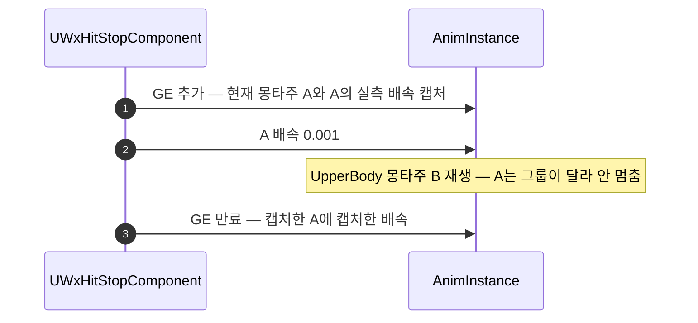
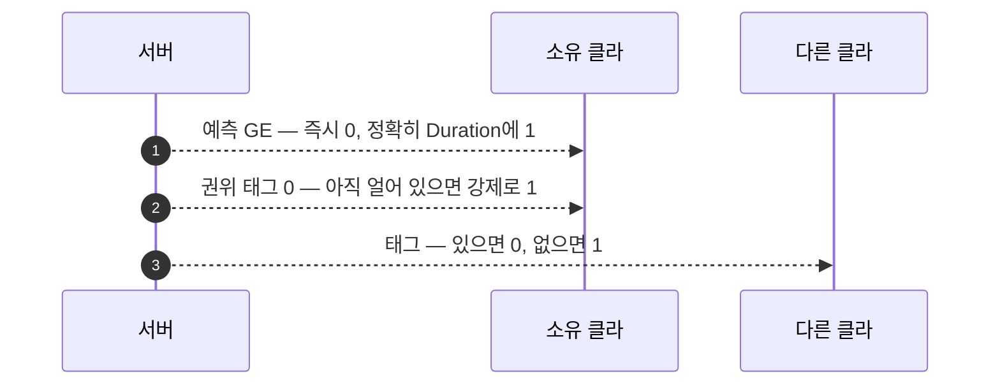

# 히트스톱: 얼린 그 몽타주를 그때의 배속으로 되돌린다

## 계획

### 목표
전투 중 간헐적으로 몽타주가 0.001 배속에 영구히 갇힌다. `UWxHitStopComponent`가 얼린 대상도 되돌릴 값도 기억하지 않고 복원 시점에 다시 묻기 때문이다. 동결 때 캡처해 두고 그 몽타주에 그 배속으로 되돌린다.

### 수정 범위
| 파일 | 수정할 내용 | 구분 |
|---|---|---|
| `Plugins/WxCombat/.../Public/AbilitySystem/WxHitStopComponent.h` | `FrozenMontage`·`ResumePlayRate` 멤버 추가, 클래스 주석 갱신 | 수정 |
| `Plugins/WxCombat/.../Private/AbilitySystem/WxHitStopComponent.cpp` | 동결 시 대상 몽타주와 실측 배속을 캡처, 복원은 캡처한 몽타주에 캡처한 배속을 건다. 어빌리티 배속 조회 삭제 | 수정 |

### 접근 방식

**결함 1 — 얼린 대상을 안 기억한다.** 보통은 새 몽타주가 `Montage_Play` → `StopAllMontagesByGroupName`으로 앞의 것을 멈춰 줘 얼린 인스턴스가 블렌드아웃으로 사라지지만, 정지는 슬롯 그룹 단위다. 이 프로젝트는 전투 몽타주 전부가 `DefaultSlot`이고 `AM_UseItem`·`AM_Interact`가 `UpperBody`다. 적중 직후 0.1초 안에 아이템을 쓰면 공격 몽타주는 멈추지 않은 채 ASC의 현재 몽타주만 갈아치워지고, 복원은 아이템 몽타주에 배속을 걸고 끝난다. 공격 몽타주는 0.001인 채로 남는다. 복원의 `if (!Montage) return;`도 같은 구멍이다 — `FAnimMontageInstance::Stop`이 `ActiveMontagesMap`에서 즉시 빼므로 정지 직후엔 현재 몽타주가 비어 아무것도 되돌리지 않고 나간다.

**결함 2 — 되돌릴 배속을 복원 시점에 되묻는다.** `GetAnimatingAbility()`의 배속을 읽는데 그때는 주인이 바뀌어 있을 수 있다. 이 프로젝트는 배속이 일부러 두 갈래다 — 공격·스킬·패턴·궁극기·아이템 사용은 ASPD를 반영하고, 피격·가드·회피·처형은 길이가 곧 연출 규칙이라 1.0 고정이다. `UWxEffect_Exceed`가 6초간 ASPD를 20% 올리므로 두 값이 실제로 갈린다. ASPD 1.2로 돌던 공격 몽타주를 얼린 뒤 피격이 끼어들면 복원이 1.0을 공격 몽타주에 건다. 어빌리티가 끝나 null이면 `FMath::Max(ASPD, 0.001f)`로 떨어지는데 하한이 하필 동결값과 같다.

- **얼린 대상을 기억한다**: 동결 직전에 `FrozenMontage`(약참조)를 잡고, 복원은 현재 몽타주를 다시 묻지 않고 여기에 건다. 그새 정지됐으면 `Montage_SetPlayRate`가 조용히 아무것도 안 하므로 안전하고, 남의 몽타주 배속을 덮을 일도 없어진다.

- **되돌릴 값은 실측한다**: `Montage_GetPlayRate`로 얼리기 직전의 실제 배속을 담는다. 어빌리티에게 되묻지 않으니 주인이 바뀌거나 사라진 경우가 아예 없어지고, `GetAnimatingAbility()`·`UWxAbilityBase` 조회가 컴포넌트에서 빠진다.

- **재적중은 캡처한 몽타주와 같은지로 가른다**: 같으면 캡처를 그대로 두고 핸들만 더한다 — 이미 0.001이라 다시 실측하면 그 값을 원래 배속으로 저장한다. 다르면 앞서 얼린 것을 제 배속으로 돌려놓고 새로 캡처한다 — 그러지 않으면 앞의 것이 되돌릴 사람 없이 남는다.

- **`FrozenHandles`는 그대로 둔다**: 마지막 만료가 복원한다는 규칙과 소유 클라의 예측·복제 인스턴스 공존 처리가 여기 걸려 있고 이번 결함과는 무관하다. 집합이 0이 되어야 복원된다는 구조는 남지만, GAS의 제거 브로드캐스트가 모든 경로에서 무조건 나가고 추가 쪽 필터는 덜 담기만 하므로 대칭이다.

- **동결 범위는 넓히지 않는다**: 지금처럼 ASC의 현재 몽타주 하나만 얼린다. 활성 몽타주 전부를 한 배속으로 되돌리는 방식은 배속이 갈리는 설계와 충돌하고, 동결 중에 시작된 몽타주까지 덮어 피격 경직 길이를 망가뜨린다. 일시정지로 배속 보존을 노리는 방식은 `Montage_Resume(nullptr)`이 `IsActive()`를 요구해 자기가 멈춘 것을 못 깨우고, `WxStateTreeTask_PlayInteractorMontage`가 `Montage_IsPlaying`으로 완료를 판정해 연출이 조기 종료된다.

---

## 완료

### 수정한 파일
| 파일 | 수정한 내용 | 구분 |
|---|---|---|
| `Plugins/WxCombat/.../Public/AbilitySystem/WxHitStopComponent.h` | `FrozenMontage`·`ResumePlayRate` 멤버, `UAnimMontage` 전방 선언, 캡처 이유를 클래스 주석에 한 줄 | 수정 |
| `Plugins/WxCombat/.../Private/AbilitySystem/WxHitStopComponent.cpp` | 동결 시 대상 몽타주와 실측 배속 캡처(대상이 바뀌면 앞의 것 먼저 복원), 복원은 캡처한 몽타주에 캡처한 배속. 어빌리티 배속 조회와 `WxAbilityBase.h` include 삭제 | 수정 |

### 구현·결정과 그 이유

- **복원은 캡처한 몽타주에 건다**: 결함의 핵심이 "얼린 것과 되돌리는 것이 다를 수 있다"이므로, 복원에서 현재 몽타주를 다시 묻는 것을 없앴다. 그 몽타주가 그새 정지됐으면 활성 목록에서 빠져 `Montage_SetPlayRate`가 조용히 아무 일도 하지 않으므로 별도 검사가 필요 없고, 얼린 적 없는 몽타주의 배속을 덮는 경로도 함께 사라진다.

- **되돌릴 값은 어빌리티가 아니라 실측에서 얻는다**: 복원 시점의 `GetAnimatingAbility()`는 이미 다른 어빌리티이거나 없을 수 있어 남의 배속을 준다. 특히 없을 때 떨어지는 `FMath::Max(ASPD, 0.001f)`는 하한이 동결값과 같아, 복원이 곧 재동결이 되는 경로였다. 얼리기 직전 값을 그대로 담으면 이 판단 자체가 없어진다. 실측 시점의 조회는 `GetCurrentMontage()`가 방금 통과시킨 것과 같은 활성 목록 조회라 실패할 수 없다.

- **재적중은 대상이 같은지로 가른다**: 같은 몽타주면 이미 0.001이라 다시 실측하면 그 값을 원래 배속으로 굳힌다. 다른 몽타주면 앞서 얼린 쪽이 되돌릴 사람 없이 남으므로 넘어가기 전에 풀어 준다. 같은 슬롯 그룹의 평범한 전환에서는 앞의 것이 이미 정지돼 조용한 무동작이라 기존 동작이 그대로다.

- **동결 범위는 그대로 하나만**: 활성 몽타주 전부를 한 배속으로 되돌리는 방식은 이 프로젝트와 맞지 않는다. 피격·가드·회피·처형은 길이가 곧 연출 규칙이라 1.0 고정이고 공격·스킬은 ASPD를 따르는데, `UWxEffect_Exceed`가 6초간 ASPD를 20% 올려 두 값이 실제로 갈린다. 게다가 동결 중에 시작된 몽타주까지 도장을 찍어 피격 경직 길이를 망가뜨린다. 일시정지로 배속 보존을 노리는 안도 막혔다 — `Montage_Resume(nullptr)`이 `IsActive()`를 요구해 자기가 멈춘 것을 못 깨우고, `WxStateTreeTask_PlayInteractorMontage`가 `Montage_IsPlaying`으로 완료를 판정해 연출이 조기 종료된다.

- **`FrozenHandles`는 손대지 않았다**: 마지막 만료가 복원한다는 규칙과 소유 클라의 예측·복제 인스턴스 공존 처리가 여기 걸려 있다. 집합이 0이 되어야 복원된다는 구조는 남지만, GAS는 만료·명시적 제거·예측 기각·복제 제거·ASC 해체 전 경로에서 제거를 무조건 브로드캐스트하고 추가 쪽 필터는 덜 담기만 하므로 대칭이다.

### 계획 대비 달라진 점
- 계획대로.

### 후속 과제
- PIE에서 영구 동결이 사라진 것을 확인했다.
- 상체 슬롯(`UpperBody`)이 히트스톱에 같이 멈추지 않는 연출 한계는 그대로 남았다. ASC 타이머 시절부터의 성질이고 영구 동결과는 별개 사안이라 이번 범위에서 뺐다. → 아래 후속에서 처리.

---

# 후속: 활성 몽타주 전부를 각자의 배속으로 얼리고 되돌린다

## 계획

### 목표
동결 범위가 `GetCurrentMontage()` 하나뿐이라, 슬롯 그룹이 다른 몽타주가 같이 살아 있으면 그중 하나만 멈춘다. 활성 몽타주 전부를 각자의 실측 배속과 함께 얼리고 되돌린다.

### 수정 범위
| 파일 | 수정할 내용 | 구분 |
|---|---|---|
| `Plugins/WxCombat/.../Public/AbilitySystem/WxHitStopComponent.h` | `FrozenMontage`·`ResumePlayRate`를 `FrozenPlayRates` 맵으로 교체, 복원 헬퍼 선언, 클래스 주석 갱신 | 수정 |
| `Plugins/WxCombat/.../Private/AbilitySystem/WxHitStopComponent.cpp` | 동결은 활성 인스턴스 전부를 기록한 뒤 일괄 정지, 복원은 기록한 값으로 각각 되돌린다 | 수정 |

### 접근 방식
- **기록은 `AnimInstance->MontageInstances` 순회로**: public 배열이고 인스턴스마다 `Montage`와 `GetPlayRate()`를 준다. 누가 재생했든 잡히고 배속이 실측이라 어떤 장부도 신뢰하지 않는다. `IsActive()`가 `IsValid() && !IsStopped()`라 이미 정지돼 블렌드아웃 중인 인스턴스는 자연히 빠진다. 어빌리티를 훑는 안은 기각했다 — `ActiveMontage`는 `UWxAbilityBase::PlayMontage`를 거칠 때만 채워지는데 `UWxAbility_Groggy`가 `ASC->PlayMontage`를 직접 부르고 `WxStateTreeTask_PlayInteractorMontage`는 GAS 밖에서 재생해, 그로기 적이 안 얼어 회귀가 된다.

- **동결은 `Montage_SetPlayRate(nullptr, 0.001f)`**: 널 인자가 곧 "활성 인스턴스 전부"이고 그 필터가 기록 루프의 `IsActive()`와 같다.

- **키는 에셋, 값은 배속**: `Montage_SetPlayRate`가 에셋으로만 인스턴스를 찾으므로 캐시도 같은 단위여야 한다. 인스턴스 포인터는 종료 시 삭제돼 프레임을 넘길 수 없다.

- **복원 시 널 키는 건너뛴다**: 널을 넘기면 "전부에 이 값"이 되어 GC된 항목 하나가 모든 배속을 덮는다. 같은 가드가 두 호출부에서 어긋나면 안 되므로 복원은 private 헬퍼 하나로 둔다.

- **재적중은 먼저 전부 복원한 뒤 다시 기록한다**: 얼어 있는 상태에서 실측하면 0.001을 원래 배속으로 굳힌다. 복원을 앞에 두면 참값이 잡히고 동결 중 새로 시작한 몽타주도 같은 흐름에 들어와, 앞 절의 "같은 몽타주인지" 분기가 흡수돼 사라진다.

---

## 완료

### 수정한 파일
| 파일 | 수정한 내용 | 구분 |
|---|---|---|
| `Plugins/WxCombat/.../Public/AbilitySystem/WxHitStopComponent.h` | `FrozenMontage`·`ResumePlayRate` → `TMap<TWeakObjectPtr<UAnimMontage>, float> FrozenPlayRates`, `RestoreFrozenMontages` 선언, `UAnimInstance` 전방 선언, 클래스 주석에 그룹 사유 한 줄 | 수정 |
| `Plugins/WxCombat/.../Private/AbilitySystem/WxHitStopComponent.cpp` | 동결은 선복원 후 활성 인스턴스 전부 기록 → `Montage_SetPlayRate(nullptr, 0.001f)`. 만료 복원과 재적중 갱신이 `RestoreFrozenMontages` 공유 | 수정 |

### 구현·결정과 그 이유

- **조회 대상은 몽타주 인스턴스**: 어빌리티를 훑는 안은 `ActiveMontage`가 `UWxAbilityBase::PlayMontage`를 거칠 때만 채워진다는 전제 위에 서는데, `UWxAbility_Groggy`가 `ASC->PlayMontage`를 직접 부르고 `WxStateTreeTask_PlayInteractorMontage`는 GAS 밖에서 재생한다. 그로기 적이 안 얼어 회귀가 됐을 것이다. 인스턴스를 훑으면 재생 주체를 묻지 않고 배속도 실측이라 어떤 장부에도 기대지 않는다.

- **동결은 널 인자 한 번, 복원은 항목별 루프**: `Montage_SetPlayRate`의 널 인자가 곧 활성 인스턴스 전부이고 그 필터가 기록 루프의 `IsActive()`와 같아, 기록한 집합과 얼린 집합이 정확히 일치한다. 복원은 반대로 널을 넘기면 "전부에 이 값"이 되어 GC된 항목 하나가 남의 배속을 덮으므로 널 키를 건너뛴다.

- **캐시 키는 에셋**: 재생 속도 API가 에셋으로만 인스턴스를 찾으므로 캐시도 같은 단위여야 짝이 맞는다. 인스턴스 포인터는 종료 시 삭제돼 프레임을 넘겨 들고 있을 수 없다.

- **재적중은 선복원 뒤 재기록**: 얼어 있는 상태에서 실측하면 0.001이 원래 배속으로 굳는다. 복원을 앞에 두니 참값이 잡히고 동결 중 새로 시작한 몽타주도 같은 흐름에 들어와, 앞 절에서 넣었던 "같은 몽타주인지" 분기가 통째로 사라졌다.

- **복원을 헬퍼로 뺀 이유**: 두 호출부가 같은 널 가드를 공유해야 하고, 한쪽만 어긋나면 모든 몽타주 배속을 덮는 사고가 된다. 반복이 짧더라도 갈라지면 안 되는 종류라 한 곳에 뒀다.

- **발동 게이트는 그대로 `GetCurrentMontage()`**: "어빌리티 몽타주가 돌 때만 건다"는 기존 규칙을 유지했다. 판정 대상과 동결 대상이 달라져 읽는 사람이 걸릴 지점이라 한 줄 남겼다.

- **상호작용 연출은 안 끊긴다**: `WxStateTreeTask_PlayInteractorMontage`가 `Montage_IsPlaying`으로 완료를 판정하는데, 배속 0.001은 `bPlaying`을 건드리지 않아 계속 Running이다. 앞서 일시정지 방식이 기각된 이유가 이것이었다.

### 계획 대비 달라진 점
- 계획대로.

### 후속 과제
- PIE 미확인. 컴파일까지만 봤다. 아이템 사용 중 적중 시 상체도 멈추는지, 그로기 적이 얼었다 정상 복귀하는지, 연타 중 새로 시작한 몽타주도 제 배속으로 돌아오는지, 장치 상호작용 연출이 조기 종료되지 않는지 확인이 필요하다.
- 이 절의 기록·복원 구조는 아래 후속에서 걷힌다. 남의 화면에서는 여전히 상체가 안 멈추는 것이 그 계기다.

---

# 후속: 몽타주 배속 대신 메시 애님 스케일로 — 예측은 유지, 권위 태그는 안전망

## 계획

### 목표
몽타주 배속을 덮어쓰고 되돌리는 구조 자체를 걷는다. `GlobalAnimRateScale` 한 값으로 내려 복원 목표를 상수 1로 만들고, 남의 화면에서도 멈추게 한다.

### 수정 범위
| 파일 | 수정할 내용 | 구분 |
|---|---|---|
| `Plugins/WxCombat/.../Public/AbilitySystem/WxHitStopComponent.h` | `FrozenPlayRates`·복원 헬퍼 삭제, `FrozenHandles`만 남김. 태그 핸들러와 스케일 반영 함수 선언, 클래스 주석 재작성 | 수정 |
| `Plugins/WxCombat/.../Private/AbilitySystem/WxHitStopComponent.cpp` | 몽타주 기록·복원 삭제, `Effect.HitStop` 태그 이벤트 구독 추가, 세 진입점이 상태에서 스케일을 다시 계산 | 수정 |
| `Plugins/WxCombat/.../Public/.../WxAbility_HitReact.h` `.cpp`, `WxAbility_GuardReact.h` `.cpp` | `IsDataValid`에 반응 몽타주 BlendIn 0 검사 추가 | 수정 |
| 콘텐츠: 반응 계열 몽타주 | BlendIn 0으로 조정 | 수정 |

### 접근 방식
- **한 층 아래로**: `GlobalAnimRateScale`은 그 메시의 모든 애님 인스턴스 업데이트 DeltaTime에 곱해진다. 몽타주보다 아래라 슬롯 그룹·재생 주체·몽타주 교체를 보지 않고, 기본값 1이며 프로젝트 어디서도 쓰지 않아 복원 목표가 상수다.

- **스케일은 상태에서 매번 다시 계산한다**: 토글하지 않는다. 세 진입점(GE 추가·제거·태그 변화)이 같은 함수를 불러 0 또는 1을 대입하므로 짝이 필요 없고, 이벤트를 놓쳐도 다음에 수렴한다.

- **예측이 이긴다**: 권위자·소유 클라는 `FrozenHandles`로 판정한다. 공격자 게이트가 복제본을 걸러내(복제본 컨텍스트엔 비복제 어빌리티 인스턴스가 없다) 예측 인스턴스만 세므로 본인 화면이 정확히 Duration에 풀리고, 예측 키가 기각되면 GAS가 예측 GE를 제거해 그대로 롤백된다. 태그로 다시 얼리지는 않는다 — 그러면 RTT만큼 더 얼어붙는다.

- **권위 태그는 푸는 방향으로만**: 태그 카운트가 0인데 아직 얼어 있으면 무조건 1로 되돌린다. "핸들 집합이 안 비면 영구 동결"이라는 마지막 구멍이 이 한 줄로 닫힌다. 시뮬 프록시는 로컬 인스턴스가 없어 태그가 유일한 신호이므로 얼리는 방향도 태그가 맡는다.

- **BlendIn 0 규약**: 블렌드 가중치도 같은 DeltaTime을 써서 스케일 0이면 함께 멈춘다. 반응 몽타주가 가중치 0으로 시작한 직후 얼면 충격 포즈가 아니라 직전 포즈가 붙잡히므로, 반응 계열은 BlendIn을 0으로 두고 `IsDataValid`로 강제한다.

---

## 완료

### 수정한 파일
| 파일 | 수정한 내용 | 구분 |
|---|---|---|
| `Plugins/WxCombat/.../AbilitySystem/WxHitStopComponent.h` `.cpp` | 몽타주 기록·복원 전부 삭제. `Effect.HitStop` 태그 이벤트 구독 추가, 세 진입점이 `RefreshAnimRateScale`로 메시의 `GlobalAnimRateScale`을 다시 정한다. 피격자 쪽 권위·로컬 게이트와 몽타주 존재 게이트 삭제 | 수정 |
| `Plugins/WxCombat/.../Ability/WxAbilityBase.h` `.cpp` | 에디터 전용 `ValidateInstantBlendIn` 추가, `Animation/AnimMontage.h` include | 수정 |
| `Plugins/WxCombat/.../Ability/WxAbility_HitReact.h` `.cpp`, `WxAbility_GuardReact.h` `.cpp` | `IsDataValid`에서 자기 반응 몽타주들의 BlendIn 검사 | 수정 |

### 구현·결정과 그 이유

- **한 층 아래로 내렸다**: `GlobalAnimRateScale`은 몽타주보다 아래에서 DeltaTime에 곱해지므로 슬롯 그룹·재생 주체·몽타주 교체를 보지 않는다. 되돌릴 값이 상수 1이라 무엇을 얼렸는지 기억할 이유가 사라졌고, 그 기억이 어긋나서 생기던 결함 종류 자체가 없어졌다. 몽타주 순회, 배속 맵, 널 키 가드, 복원 헬퍼가 전부 걷혔다.

- **토글이 아니라 대입이다**: 세 진입점이 같은 함수를 불러 현재 상태로 0 또는 1을 정한다. 짝을 맞출 필요가 없어 이벤트를 놓쳐도 다음 호출에서 참값으로 돌아온다.

- **예측이 이기고 권위가 뒤를 받친다**: 로컬 인스턴스를 받는 머신은 `FrozenHandles`로 판정해 본인 화면이 정확히 지속시간에 풀린다. 태그로 얼리면 예측 인스턴스와 복제본이 겹쳐 RTT만큼 더 멈춘다. 반대로 태그가 걷혔는데 아직 세워져 있으면 어느 머신에서든 되돌리므로, 핸들 집합이 새더라도 영구 정지로 가지 않는다. 시뮬 프록시는 인스턴스가 오지 않아 태그가 유일한 신호이며, 이 덕에 다른 클라에서도 상체까지 멈춘다.

- **0을 그대로 쓴다**: 0.001은 `FMontageSubStepper`가 `IsNearlyZero(PlayRate)`에서 진행을 포기하는 것을 피하려던 우회였다. DeltaTime 배율에는 그 판정이 없고 엔진이 `DeltaTime == 0`을 상정한 경로를 갖고 있다.

- **게이트 둘을 뺐다**: 피격자 쪽 권위·로컬 조종자 게이트는 프록시도 얼려야 하므로 필요가 없어졌다. 몽타주 존재 게이트는 스케일이 몽타주를 보지 않아 의미가 없고, 몽타주 없이 맞아도 로코모션이 멈추는 쪽이 타격감에 맞다.

- **BlendIn 0을 데이터 검증으로 묶었다**: 블렌드 가중치도 같은 DeltaTime을 쓰므로 반응 몽타주가 가중치 0으로 시작한 직후 얼면 충격 포즈가 아니라 직전 포즈가 붙잡힌다. 규약만 두면 조용히 되돌아가므로 반응 어빌리티의 `IsDataValid`가 에디터에서 잡게 했다. 검사 자체는 베이스의 정적 함수 하나로 두어 두 클래스가 같은 문구를 쓰게 했다.

- **노티파이는 안전하다**: 애니메이션 델타가 0이어도 `FAnimMontageInstance::Advance`가 `DeltaTime == 0`일 때 같은 위치로 `HandleEvents`를 돌려 활성 스테이트를 유지한다(엔진이 TimeDilation 0을 겨냥해 넣은 처리다). 위치가 안 움직이니 경계를 넘지 않아 조기 End도 없다. 프로젝트에는 인게임에서 `NotifyTick`을 쓰는 스테이트가 없다 — `CameraMove`만 Tick을 구현했고 내용이 에디터 프리뷰 전용이다.

- **무기 판정 창은 히트스톱과 무관하게 계속 돈다**: `WxAnimNotifyState_WeaponAttack`은 창을 열고 닫기만 하고 실제 스윕은 `AWxWeaponBase::Tick`(액터 틱)에서 돈다. 애님 스케일이 이 경로를 건드리지 않으므로, 얼어 있는 동안 새 적이 칼날에 들어오면 여전히 맞고 정지가 연장된다.

### 계획 대비 달라진 점
- 계획대로.

### 후속 과제
- **콘텐츠 작업이 남았다**: 반응 계열 몽타주의 BlendIn을 0으로 조정해야 한다. 지금은 데이터 검증이 에러로 잡아 줄 뿐이다.
- PIE 미확인. 충격 포즈로 멈추는지, 상체까지 멈추는지, 연타 복원, 그로기 적, 장치 상호작용 연출 확인이 필요하다.
- 메타휴먼 Face는 `SetAnimInstanceClass`로 자기 AnimBP를 돌려 리더 포즈를 따르지 않으므로 얼굴만 계속 움직인다. 이전에도 그랬으나 몸이 로코모션까지 멈추면서 대비가 커진다 — 소유 액터의 스켈레탈 메시 전부에 같은 스케일을 걸면 해결된다.
- 리슨 서버 2인 미확인. 상대 캐릭터가 상체까지 멈추는지, 공격자 본인 화면의 정지가 지속시간보다 길어지지 않는지.
- 패리 시 공격자가 몽타주를 양보하던 가드는 그대로 무력하다 — `Apply`가 호출 시점의 AnimatingAbility를 쓰기 때문이며 이번 변경 이전부터 그랬다.
