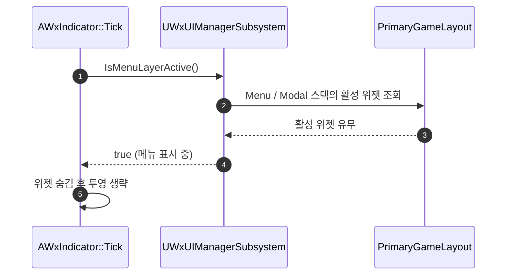

# 인디케이터를 메뉴 레이어 위에 겹치지 않게 숨김

## 계획

### 목표

`AWxIndicator` 는 스크린 스페이스 위젯이라 뷰포트에 직접 붙어, 레이어 스택 위에 뜬 인벤토리·메인메뉴·팝업을 뚫고 겹쳐 보인다. 메뉴가 화면을 차지한 동안에는 인디케이터가 스스로 숨게 한다.

"메뉴 레이어" 는 `UI.Layer.Menu`(인벤토리·메인메뉴·사망화면) 와 `UI.Layer.Modal`(확인 팝업) 로 본다. `UI.Layer.GameMenu` 는 아이템 획득 알림 등 화면을 덮지 않는 자리라 제외하고, `UI.Layer.Game` 은 HUD·대화창이라 제외한다.

### 수정 범위

| 파일 | 수정할 내용 | 구분 |
|---|---|---|
| `Plugins/WxUI/Source/WxUI/Public/System/WxUIManagerSubsystem.h` | `IsMenuLayerActive()` 공개 질의 + `HasActiveWidgetInLayer()` 비공개 헬퍼 선언 | 수정 |
| `Plugins/WxUI/Source/WxUI/Private/System/WxUIManagerSubsystem.cpp` | 위 두 함수 구현 | 수정 |
| `Plugins/WxUI/Source/WxUI/Private/Indicator/WxIndicator.cpp` | `UpdateProjection()` 선두에서 메뉴 활성 시 숨기고 조기 반환, 생성자에서 일시정지 중 틱 허용 | 수정 |

### 접근 방식

- **판정은 UI 서브시스템이 소유**: 어떤 레이어가 "메뉴" 인지는 UI 정책이므로 `IsMenuLayerActive()` 한 곳에만 둔다. 기존 `WantsGamePause()` 와 같이 레이어 스택의 `GetActiveWidget()` 을 보되, 스택에 위젯이 하나뿐일 때 비활성화 후에도 반환되는 문제를 `IsActivated()` 로 거른다. 레이어가 둘뿐이라 배열·루프 없이 명시적으로 확인한다.
- **표시 여부는 인디케이터가 매 틱 조회**: 뷰 확보 실패 시 이미 같은 자리에서 숨고 있으므로 조건 하나를 더한다. 상태 캐시나 델리게이트 구독 수명을 새로 만들지 않는다.
- **일시정지 대응**: `bPauseGame` 메뉴가 뜨면 월드가 정지해 액터 틱이 멈추고, 스크린 스페이스 위젯의 화면 부착 해제도 `UWidgetComponent::TickComponent` 에서만 처리되므로 인디케이터가 메뉴 위에 남는다. 액터 틱과 위젯 컴포넌트 틱 모두 `bTickEvenWhenPaused` 를 켠다.

---

## 완료

### 수정한 파일

| 파일 | 수정한 내용 | 구분 |
|---|---|---|
| `Plugins/WxUI/Source/WxUI/Public/System/WxUIManagerSubsystem.h` | `IsMenuLayerActive()` 공개, `HasActiveWidgetInLayer()` 비공개 선언 | 수정 |
| `Plugins/WxUI/Source/WxUI/Private/System/WxUIManagerSubsystem.cpp` | 두 함수 구현 | 수정 |
| `Plugins/WxUI/Source/WxUI/Public/Indicator/WxIndicator.h` | `UpdateProjection()` 주석에 메뉴 숨김 조건 반영 | 수정 |
| `Plugins/WxUI/Source/WxUI/Private/Indicator/WxIndicator.cpp` | 메뉴 활성 시 위젯 숨기고 조기 반환, 액터·위젯 컴포넌트 틱을 정지 중에도 허용 | 수정 |

### 구현·결정과 그 이유

- **"메뉴" 정의를 서브시스템에 둠**: 어떤 레이어가 화면을 덮는지는 UI 정책이라 표시 주체마다 흩어지면 판정이 갈린다. 인디케이터는 `IsMenuLayerActive()` 결과만 본다.
- **일시정지 중 틱 허용**: 정지시키는 메뉴에서는 액터 틱이 멈춰 숨기 판정 자체가 돌지 못하고, 스크린 스페이스 위젯을 화면에서 떼는 일도 `UWidgetComponent::TickComponent` 안에서만 일어난다. 둘 다 켜야 정지 메뉴에서도 사라진다. 숨은 뒤에는 조기 반환이라 정지 중 비용은 질의 한 번이다.
- **조기 반환 위치**: 투영 계산 앞에 두어 메뉴가 떠 있는 동안은 역투영·뷰모델 갱신까지 통째로 건너뛴다.

### 계획 대비 달라진 점

계획대로.

### 후속 과제

- 네임플레이트(`UWxNameplateComponent`)도 같은 층에 그려져 메뉴 위에 겹친다. 필요해지면 같은 질의를 재사용한다.
- 인게임 확인은 미실시(컴파일까지 검증).
