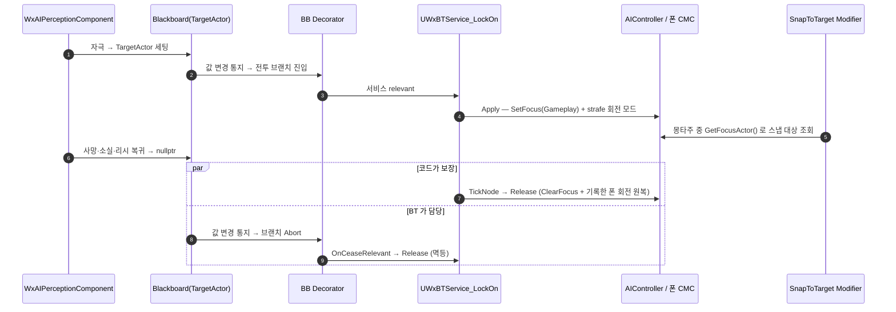

# 전투 타겟 지정을 BT 서비스로 이관

## 계획

### 목표

퍼셉션이 소유하던 컨트롤러 포커스·폰 회전 모드를 신규 `UWxBTService_LockOn` 으로 옮겨, 전투 대상의 적용·해제를 한 클래스가 소유하게 한다. 퍼셉션은 Blackboard `TargetActor` 발행까지만 맡아 둘이 충돌할 여지를 없앤다. 덤으로 적 몽타주의 `SnapToTarget` 이 전투 대상을 따르게 해 "전투 대상" 이 세 군데에서 각자 정해지던 상태를 정리한다.

`Docs/Programmer/module_review_WxAI.md` 1번 이슈(해제 책임이 `SetTargetActor(nullptr)`·`HandlePossessedPawnChanged`·`EndPlay` 세 경로로 갈라지고 그중 `EndPlay` 는 회전 모드를 되돌리지 않음)를 해소한다.

### 수정 범위

| 파일 | 수정할 내용 | 구분 |
|---|---|---|
| `Plugins/WxAI/Source/WxAI/Public/WxBTService_LockOn.h` | `UBTService` 직접 상속. `FWxLockOnMemory`(적용한 폰), `GetInstanceMemorySize`, `TickNode`/`OnCeaseRelevant`/`GetStaticDescription` 선언 | 신규 |
| `Plugins/WxAI/Source/WxAI/Private/WxBTService_LockOn.cpp` | `Apply`/`Release` 헬퍼와 이를 부르는 틱 동기화·이탈 마감. 회전 모드 원복은 CMC 아키타입 기본값에서 읽는다 | 신규 |
| `Plugins/WxAI/Source/WxAI/Private/WxAIPerceptionComponent.cpp` | `SetStrafeRotation` 삭제, `SetTargetActor` 의 포커스·회전 블록 삭제, `HandlePossessedPawnChanged` 축소 | 수정 |
| `Plugins/WxAI/Source/WxAI/Public/WxAIPerceptionComponent.h` | `SetStrafeRotation` 선언 삭제, 주석에서 포커스·회전 서술 제거 | 수정 |
| `Plugins/WxCombat/Source/WxCombat/Private/Targeting/WxRootMotionModifier_SnapToTarget.cpp` | 락온 다음 순위로 `AIController->GetFocusActor()` 조회 추가 | 수정 |
| `Plugins/WxAI/Source/WxAI/Public/WxBTTask_Wander.h` | "회전 모드는 퍼셉션이 발행한다" 주석 정정 | 수정 |
| `Plugins/WxAI/README.md` | 책임 표·핵심 타입 표에서 퍼셉션의 포커스·회전 항목을 새 서비스로 이동 | 수정 |

### 접근 방식

- **서비스로 만든다**: Task 는 시퀀스 한 칸을 차지하고 끝나 SimpleParallel 없이는 브랜치 수명을 점유할 수 없다. 브랜치 수명에 붙는 것은 aux 노드뿐이고 그중 "실행" 역할은 Service 다. 엔진 `UBTService_DefaultFocus` 와 같은 구조에 strafe 회전 모드를 얹는다.
- **`Apply`/`Release` 한 쌍만 둔다**: `TickNode`(0.1초 간격)가 BB `TargetActor`·현재 폰을 읽어 적용 상태를 맞추고, `OnCeaseRelevant` 가 최종 마감한다. `Release` 는 멱등이라 두 지점에서 불러도 안전하며 원복 코드는 한 곳에만 있다.
- **관찰자 대신 폴링**: BB 알림 자체는 파괴로 비워진 값까지 정상적으로 나가지만, 그 알림이 브랜치를 접느냐는 게이트 데코레이터의 `Observer aborts` 설정에 달려 있다. 폴링은 그 저작 의존을 없애고 대상 교체·폰 교체까지 같은 코드로 흡수한다. `UWxBTDecorator_BeyondLeash` 가 같은 이유로 이미 쓰는 방식이다.
- **원복 대상 폰을 노드 메모리에 기록한다**: `AAIController::OnUnPossess` 는 `SetPawn(NULL)` 을 먼저 하고 그 뒤에 BT 를 멈추므로, `OnCeaseRelevant` 시점의 `GetPawn()` 은 이미 비어 있다.
- **포커스 우선순위는 `Gameplay`(2) 유지**: `Default`(0) 로 낮추면 PathFollowing 이 이동 중 세우는 `Move`(1) 포커스에 밀려 MoveTo 도중 전투 대상을 놓친다.

---

## 완료

### 수정한 파일

| 파일 | 수정한 내용 | 구분 |
|---|---|---|
| `Plugins/WxAI/Source/WxAI/Public/WxBTService_LockOn.h` | 서비스 선언과 `FWxLockOnMemory` | 신규 |
| `Plugins/WxAI/Source/WxAI/Private/WxBTService_LockOn.cpp` | `ApplyLockOn`/`ReleaseLockOn` 와 이를 부르는 `OnBecomeRelevant`/`TickNode`/`OnCeaseRelevant` | 신규 |
| `Plugins/WxAI/Source/WxAI/Private/WxAIPerceptionComponent.cpp` | `SetStrafeRotation` 삭제, `SetTargetActor` 의 포커스·회전 블록 삭제, `HandlePossessedPawnChanged` 축소, Character/CMC include 제거 | 수정 |
| `Plugins/WxAI/Source/WxAI/Public/WxAIPerceptionComponent.h` | `SetStrafeRotation` 선언 삭제, 클래스 주석에 소유권 경계 명시 | 수정 |
| `Plugins/WxCombat/Source/WxCombat/Private/Targeting/WxRootMotionModifier_SnapToTarget.cpp` | 락온 다음 순위로 `AIController->GetFocusActor()` 조회, `OwnerPawn` 을 함수 앞으로 끌어올림 | 수정 |
| `Plugins/WxCombat/Source/WxCombat/Public/Targeting/WxRootMotionModifier_SnapToTarget.h` | 클래스 주석의 대상 선택 순서 갱신 | 수정 |
| `Plugins/WxAI/Source/WxAI/Public/WxBTTask_Wander.h` | 회전 모드 발행자 주석 정정 | 수정 |
| `Plugins/WxAI/README.md` | 책임·핵심 타입·읽기 순서에 새 서비스 반영 | 수정 |

### 구현·결정과 그 이유

- **Task 가 아니라 Service 로 만들었다**: 애초 요청은 `BTT_FocusTarget` 이었지만, Task 는 시퀀스 한 칸을 차지하고 끝나 SimpleParallel 없이는 브랜치 수명을 점유할 수 없다. 패러럴은 쓰지 않기로 해, 브랜치 수명에 붙으면서 "실행" 역할인 Service 를 택했다.
- **관찰자 대신 폴링**: Blackboard 알림은 파괴로 비워진 값까지 정상적으로 나가지만(엔진 `SetWeakObjectInMemory` 가 `IsValid`/`IsStale`/원시 필드를 함께 비교한다), 그 알림이 브랜치를 접느냐는 게이트 데코레이터의 `Observer aborts` 저작 값에 달려 있다. 해제를 코드로 보장하려면 서비스가 자기 상태를 스스로 봐야 한다. 대상 교체·폰 교체도 같은 코드가 흡수한다.
- **`Release` 를 멱등으로 두고 두 지점에서 부른다**: 틱 동기화와 브랜치 이탈이 같은 함수를 부르므로, 호출 지점이 둘이어도 판정·원복 코드는 한 곳뿐이다. 리뷰가 지적한 "경로마다 다른 해제" 와는 성격이 다르다.
- **원복 대상 폰을 노드 메모리에 기록**: `AAIController::OnUnPossess` 는 `SetPawn(NULL)` 을 먼저 하고 그 뒤에 BT 를 멈춘다. 해제 시점의 `GetPawn()` 은 이미 비어 있어, 기록해 두지 않으면 놓아주는 폰이 strafe 로 굳는다. 퍼셉션이 `HandlePossessedPawnChanged(OldPawn)` 라는 별도 경로로 우회하던 것이 이 함정이었고, 이제 한 지점에서 처리된다.
- **진입 적용은 `bCallTickOnSearchStart` 가 아니라 `OnBecomeRelevant` 가 한다** (코드 리뷰 반영): `UBTCompositeNode::OnNodeActivation` 은 aux 노드 Add 를 큐에 넣기만 하고 곧바로 `NotifyParentActivation` → 탐색 시작 틱을 돌린다. 그 틱은 등록이 커밋되기 전이라 (a) 뒤늦게 오는 `OnBecomeRelevant` 가 방금 쓴 적용 기록을 지우고, (b) 탐색이 폐기되면 `bApplyAuxNodesFromFailedSearches` 가 기본 false 라 `OnCeaseRelevant` 조차 오지 않는다. 두 경우 모두 포커스·strafe 가 해제 경로 없이 고착된다. 진입·틱이 같은 `SyncLockOn` 을 타게 해 한 번에 해소했다.
- **포커스 우선순위는 `Gameplay`(2) 유지**: `Default`(0) 로 낮추면 PathFollowing 이 이동 중 세우는 `Move`(1) 포커스에 밀려 MoveTo 도중 전투 대상을 놓친다. 현행 퍼셉션과 같은 값이라 동작 변화도 없다.
- **노드 메모리를 `InitializeNodeMemory`/`CleanupNodeMemory` 로 구성한다** (리뷰 반영): `TWeakObjectPtr` 는 POD 가 아니라 zeroed 바이트에 기대면 안 된다. 지금은 `UE_WEAKOBJECTPTR_ZEROINIT_FIX` 덕에 우연히 맞지만, 엔진 관례대로 placement-new 를 태워 전제를 없앴다.
- **`ReleaseLockOn` 이 컨트롤러를 선택 인자로 받는다** (리뷰 반영): 포커스 해제만 컨트롤러가 필요하고 회전 모드 원복은 기록한 폰만 있으면 된다. 컨트롤러가 이미 사라진 경로에서 폰이 strafe 로 남지 않게 갈랐다.
- **`GetStaticDescription` 대신 `GetStaticServiceDescription` 을 오버라이드** (리뷰 반영): 최상위를 덮으면 엔진이 붙이는 노드 타입명과 틱 주기 표시가 사라진다. 폴링 주기가 이 노드 설계의 핵심이라 그래프에 보여야 한다.
- **재타겟 시 회전 모드를 왕복시키지 않는다** (리뷰 반영): `SetFocus` 가 같은 우선순위를 먼저 비우므로, 폰이 그대로면 해제 없이 대상만 갈아 끼운다.

### 계획 대비 달라진 점

- 계획서에는 없던 `WxRootMotionModifier_SnapToTarget.h` 클래스 주석도 함께 고쳤다 — 대상 선택 순서가 바뀌어 기존 서술이 어긋났다.
- 계획의 "브랜치 진입 첫 프레임 적용" 을 `bCallTickOnSearchStart` 로 구현했다가, 코드 리뷰에서 aux 노드 등록 순서 문제가 드러나 `OnBecomeRelevant` 적용으로 바꿨다(위 참조). 진입 즉시 적용이라는 결과는 계획대로다.
- 클래스 이름을 `UWxBTService_FocusTarget` 에서 `UWxBTService_LockOn` 으로 바꿨다(사용자 요청). BT 에셋 배선 전이라 참조가 코드에만 있어 비용이 없었다. WxCombat 의 플레이어 락온(`UWxLockOnComponent`)과 이름이 겹치므로, 별개 구현이라는 점을 클래스 주석과 README 에 적어 뒀다.

### 후속 과제

- **BT 에셋 배선(미완)**: `Content/AI/BT_Enemy`·`BT_Gunman`·`BT_Minion`·`BT_Sandbag` 중 전투 브랜치를 가진 트리에 `Lock On` 서비스를 얹어야 한다. `.uasset` 이라 코드로 못 하고 `unreal-mcp` 도 연결 실패 상태였다. 배선 전까지는 적이 타겟을 바라보지 않는다.
- **PIE 검증(미완)**: 감지 시 strafe, 리시 복귀·타겟 사망·타겟 폰 파괴·자신의 사망/빙의 해제 각각에서 회전 모드가 아키타입 기본값으로 복귀하는지, 적 몽타주 `SnapToTarget` 이 BB 타겟을 향하는지 확인이 남았다.
- 게이트 데코레이터의 `Observer aborts` 값은 포커스 해제에는 영향이 없지만(서비스가 보장), 전투 브랜치를 얼마나 빨리 떠나는지는 그 값이 정한다. 지금 저작 값이 의도대로인지는 별건으로 확인할 여지가 있다.
