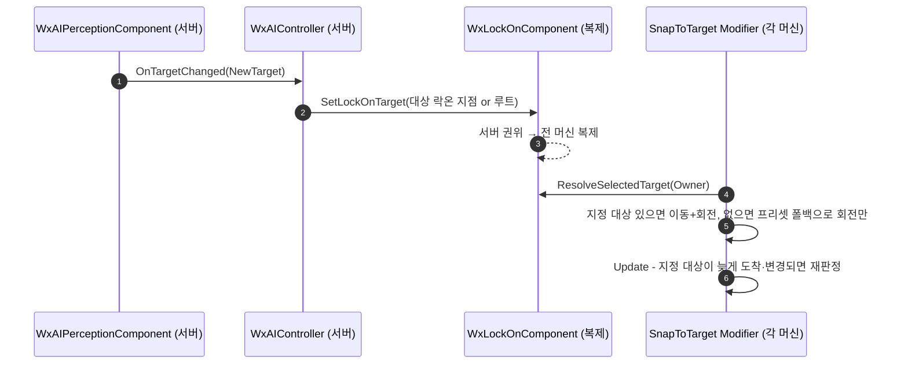

# SnapToTarget: AI 워프 대상을 복제되는 단일 값으로 통일

## 계획

### 목표

`UWxRootMotionModifier_SnapToTarget` 이 AI 의 워프 대상을 서버 전용 `AAIController::GetFocusActor()` 로 집어, 클라이언트의 시뮬레이티드 프록시는 프리셋 폴백을 타고 서로 다른 적을 향해 루트 모션을 보정한다. "이 폰이 지금 겨누는 대상" 을 전 머신이 같은 값으로 읽게 만든다. 권위 값이 없는 클라는 로컬 폴백으로 선처리하되 권위 값이 도착하면 그쪽으로 수렴한다.

### 수정 범위

| 파일 | 수정할 내용 | 구분 |
|---|---|---|
| `Source/WxGame/Character/WxCharacterBase.h/.cpp` | `LockOnComponent` 를 베이스로 승격하고 접근자 공개 | 수정 |
| `Source/WxGame/Character/WxPlayerCharacter.h/.cpp` | 자기 `LockOnComponent` 선언·생성 제거 | 수정 |
| `Source/WxGame/Character/WxEnemyCharacter.h/.cpp` | 복제 필드 `bHasAITarget` 과 전용 통지 경로 제거, 네임플레이트를 락온 대상 변경 구독으로 전환 | 수정 |
| `Source/WxGame/Controller/WxAIController.cpp` | AI 타겟 변경·빙의 수명주기에서 락온 대상을 세팅 | 수정 |
| `Source/WxGame/MVVM/WxViewModel_BossCharacter.h/.cpp` | 구독 대상을 락온 대상 변경으로 교체 | 수정 |
| `Plugins/WxCombat/.../Targeting/WxLockOnComponent.h/.cpp` | `ResolveSelectedTarget` static 조회 추가, 클래스 주석 갱신 | 수정 |
| `Plugins/WxCombat/.../Targeting/WxRootMotionModifier_SnapToTarget.h/.cpp` | 컨트롤러 포커스·`IsPlayerControlled` 분기 제거, 이동 워프 조건 재정의, `Update` 수렴 경로 추가 | 수정 |
| `Plugins/WxCombat/.../Targeting/WxTargetingFilterTask_SelectedTarget.h/.cpp` | 서버 전용 Blackboard 분기와 `BlackboardTargetKey` 제거 | 수정 |

### 접근 방식

- **대상 통일**: AI 의 대상도 이미 서버 권위로 복제되는 `UWxLockOnComponent` 에 실어 플레이어 락온과 한 값으로 합친다. 새 인터페이스·새 복제 필드 없이 서버 전용 폴백 3곳과 복제 bool 1개가 사라진다.
- **공급**: `AWxCharacterBase` 가 락온 컴포넌트를 갖고, 플레이어는 락온 어빌리티가, AI 는 `AWxAIController` 가 퍼셉션 타겟 변경 시점에 채운다. 조준 지점은 대상의 락온 지점, 없으면 루트 컴포넌트.
- **소비**: 모디파이어와 타겟팅 필터가 같은 조회(`ResolveSelectedTarget`) 하나만 본다.
- **선처리와 수렴**: 이동 워프는 지정 대상이 있고 프리셋 범위 안일 때만 건다(아니면 자기 워프 타겟을 지워 엔진이 모디파이어를 끈다). 회전 워프는 프리셋 폴백까지 허용해 권위 값이 없는 클라도 일단 돈다. `Update` 에서 지정 대상이 늦게 도착하거나 바뀌면 대상 판정을 다시 돌려 워프 타겟을 옮긴다. 이동 워프를 창 중간에 되살리지는 않는다 — 남은 시간에 거리를 메우느라 튀고, 시뮬 프록시 위치는 이동 복제가 잡는다.

---

## 완료

### 수정한 파일

| 파일 | 수정한 내용 | 구분 |
|---|---|---|
| `Source/WxGame/Character/WxCharacterBase.h/.cpp` | `LockOnComponent` 를 베이스 디폴트 서브오브젝트로 만들고 `GetLockOnComponent()` 공개 | 수정 |
| `Source/WxGame/Character/WxPlayerCharacter.h/.cpp` | 자기 `LockOnComponent` 선언·생성 제거, 남은 널검사 정리 | 수정 |
| `Source/WxGame/Character/WxEnemyCharacter.h/.cpp` | `bHasAITarget` 복제 필드·OnRep·전용 델리게이트·`GetLifetimeReplicatedProps` 제거, `HasAITarget()` 을 락온 대상에서 파생, 네임플레이트를 `OnLockOnTargetChanged` 구독으로 전환 | 수정 |
| `Source/WxGame/Controller/WxAIController.cpp` | 퍼셉션 타겟 변경·빙의 수명주기에서 락온 대상을 세팅(지점 없으면 루트) | 수정 |
| `Source/WxGame/MVVM/WxViewModel_BossCharacter.h/.cpp` | 구독 대상을 보스의 `OnLockOnTargetChanged` 로 교체 | 수정 |
| `Plugins/WxCombat/.../Targeting/WxLockOnComponent.h/.cpp` | `ResolveSelectedTarget` static 조회 추가, 클래스 주석 갱신 | 수정 |
| `Plugins/WxCombat/.../Targeting/WxRootMotionModifier_SnapToTarget.h/.cpp` | 컨트롤러 포커스·`IsPlayerControlled` 분기 삭제, 대상 판정을 `ApplySnapTarget()` 으로 모으고 `Update` 수렴 경로 추가 | 수정 |
| `Plugins/WxCombat/.../Targeting/WxTargetingFilterTask_SelectedTarget.h/.cpp` | 서버 전용 Blackboard 분기와 `BlackboardTargetKey` 제거 | 수정 |
| `Plugins/WxCombat/.../Targeting/WxLockOnPointComponent.h`, `Plugins/WxAI/.../WxBTService_LockOn.h` | 변경으로 어긋난 주석 정정 | 수정 |

### 구현·결정과 그 이유

- **새 계약 대신 기존 복제 컴포넌트 재사용**: WxCombat 은 WxGame 을 볼 수 없어 AI 대상을 넘기려면 WxCore 인터페이스나 새 복제 필드가 필요했는데, `UWxLockOnComponent` 가 이미 "겨누는 대상" 을 서버 권위로 복제하고 있었다. 여기에 AI 대상을 실으니 새 계층 없이 서버 전용 폴백 3곳(모디파이어·필터·`bHasAITarget` 공급)이 한꺼번에 사라졌다.
- **`bWarpTranslation` 을 런타임에 뒤집지 않는다**: 저작 의도를 덮어쓰면 나중에 되돌릴 근거가 없어진다. 조건이 안 서면 자기 워프 타겟을 지워 부모가 modifier 를 끄게 했다 — 이미 "대상 없음" 경로가 쓰던 관용이라 상태가 하나 줄었다.
- **이동은 권위 대상에만, 회전은 폴백까지**: 프리셋 폴백은 머신마다 갈릴 수 있어 위치를 옮기면 곧바로 디싱크가 된다. 회전은 갈려도 회전 복제가 흡수하고, 권위 값이 없는 클라가 아무 데나 보고 있는 것보다 낫다.
- **이동 워프는 창 도중에 되살리지 않는다**: SkewWarp 은 남은 시간에 남은 거리를 반드시 메우는 마감형이라 중간에 켜면 그 프레임에 튄다. 시뮬 프록시 위치는 어차피 이동 복제가 잡는다.
- **AI 조준 지점은 루트 전용**: 처음엔 락온 지점을 먼저 찾고 없으면 루트로 떨어뜨렸는데, `ResolveLockOnTarget` 이 "지점이 없다" 와 "지점이 조건에 걸렸다" 를 똑같이 null 로 돌려줘 폴백이 `LockOnRequirements` 를 우회한다. 그 조건은 플레이어 락온 전용 게이트이고 AI 가 겨누는 액터(플레이어)에는 지점 자체가 없어 폴백이 정상 경로였으므로, 루트만 쓰도록 정리해 조준 지점 규칙이 두 벌로 갈리는 것도 막았다.
- **네임플레이트 상태를 저장하지 않는다**: `bHasAITarget` 은 복제 대상 하나로 파생되는 값이라 별도 복제 bool 을 유지할 이유가 없어졌다.

### 계획 대비 달라진 점

계획대로. 부수로 `WxBTService_LockOn`·`WxLockOnPointComponent` 의 주석이 변경과 어긋나 함께 정정했다.

코드 리뷰에서 나온 지적 넷을 반영했다.

- **수렴 경로가 이동 워프까지 재등록하던 회귀**: `Update` 의 재조준에 역할 구분이 없어, 몽타주 도중 락온을 먼 적으로 바꾸면 부모가 남은 프레임에 그 거리를 메우며 캐릭터가 튀었다. "이동은 진입 시 정한 대상을 끝까지" 라는 설계와 코드가 어긋난 것이라 회전 역할에만 수렴을 허용하도록 고쳤다.
- **쓸 수 없는 프리셋 쿼리**: 이동 역할이 지정 대상 없이도 쿼리를 끝낸 뒤에야 버렸다. 게이트를 쿼리 앞으로 올리고, 지정 대상을 아는 회전 역할은 폴백이 필요 없으므로 아예 건너뛴다.
- **AI 조준 지점**: 위 "구현·결정" 항목 참조.
- **인코딩**: 편집 스크립트가 BOM 없던 파일 10개에 BOM 을 붙이고 두 파일의 줄바꿈을 LF 로 바꿔 놓았다. 손댄 17개 파일 전부를 HEAD 의 BOM 상태와 리포 관행(CRLF)에 맞춰 되돌렸다.

### 후속 과제

- **AI 투사체 조준 변화(의도적)**: AI 폰이 락온 컴포넌트를 갖게 되면서 `AWxProjectileBase::BeginPlay` 의 조준·호밍 경로를 타게 된다. 폰 정면이 아니라 대상을 겨누므로 명중률이 올라간다 — 밸런스 확인이 필요하면 이 지점을 본다.
- **네임플레이트가 릴러번시에 의존**: `HasAITarget()` 이 복제 bool 에서 컴포넌트 참조로 바뀌어, 적은 보이는데 그 적의 타겟이 내 컬 거리 밖이면 네임플레이트가 잠시 뜨지 않는다. 참조가 해소되면 RepNotify 가 다시 불려 복구되고, bool 을 남기면 파생 가능한 상태를 이중으로 드는 셈이라 그대로 뒀다.
  반대 방향도 있다 — 클라에서 대상 액터가 릴러번시를 잃어 파괴되면 `HasAITarget()` 은 곧바로 false 를 답하지만 세터를 거치지 않아 통지가 없어 네임플레이트가 켜진 채 남는다. 그 순간 서버는 여전히 그 대상과 싸우는 중이므로 화면 결과는 오히려 서버 진실과 맞고, 맞추려면 폴링을 새로 들여야 해서 통지 공백만 주석에 남겼다.
- **PIE 검증 미완**: 컴파일까지 확인했다. 리슨 서버 2 클라이언트에서 (1) 적 공격이 양쪽에서 같은 대상을 향하는지, (2) 네임플레이트·보스 표시·백스탭 프롬프트 회귀가 없는지, (3) 플레이어 락온 유무에 따른 스냅이 이전과 같은지 확인이 남았다.
