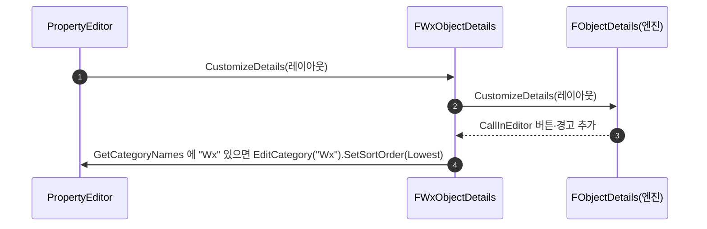

# 디테일 패널에서 Wx 카테고리를 최상단에 표시

## 계획

### 목표
프로젝트 전역에서 `Category = "Wx"` / `"Wx|Ability"` 처럼 `Wx` 루트 카테고리를 쓰는 UPROPERTY 가 375줄(124파일)인데, 디테일 패널에서는 엔진 기본 규칙대로 섞여 나온다. 모든 오브젝트(액터·컴포넌트·BP 클래스 디폴트·데이터 에셋)의 디테일 패널에서 `Wx` 카테고리(하위 `Wx|…` 포함)를 Transform 보다도 위인 최상단에 고정한다.

### 수정 범위
| 파일 | 수정할 내용 | 구분 |
|---|---|---|
| `Source/WxEditor/WxObjectDetails.h` | `FWxObjectDetails : IDetailCustomization`. 원본 팩토리를 델리게이트 페이로드로 받는 `MakeInstance`, `CustomizeDetails` 두 오버로드·`PendingDelete` 를 내부 인스턴스로 전달, private `MoveWxCategoryToTop` | 신규 |
| `Source/WxEditor/WxObjectDetails.cpp` | 위 구현. `GetCategoryNames` 에 `Wx` 가 있으면 `EditCategory(Wx).SetSortOrder(Lowest)` | 신규 |
| `Source/WxEditor/WxEditor.h` | 복원용 멤버 `FDetailLayoutCallback EngineObjectLayout` | 수정 |
| `Source/WxEditor/WxEditor.cpp` | `StartupModule`: `DetailCustomizations` 로드 보장 → 기존 `"Object"` 콜백 보관 → 데코레이터 등록(원본 `Order` 유지). `ShutdownModule`: 원본 콜백 재등록 | 수정 |
| `Plugins/WxCombat/.../Ability/WxAbilityBase.h` | `PrioritizeCategories = ("Wx")` 제거 — 소비처가 디테일 카테고리 순서뿐이라 본 변경으로 대체됨 | 수정 |

### 접근 방식
- **`"Object"` 클래스 커스터마이제이션 하나로 전역 적용**: `DetailLayoutHelpers::QueryCustomDetailLayout` 은 기본 클래스의 모든 부모(프로퍼티가 없어도 `UObject` 까지)에 등록된 커스터마이제이션을 실행한다. 구조체 루트 뷰는 클래스 사슬이 없어 대상 아님(허용).
- **엔진 `FObjectDetails` 를 덮어쓰지 않고 감싼다**: `RegisterCustomClassLayout` 은 `TMap::Add` 라 같은 이름 재등록은 교체다. 엔진 `DetailCustomizations` 가 `"Object"` 에 등록한 `FObjectDetails` 는 CallInEditor 버튼·Experimental 경고를 담당하므로, 모듈 시작 시 기존 콜백을 꺼내 안에 품고 `OptionalOrder` 로 실행 순서를 유지한다. 종료 시 원본을 복원한다.
- **정렬은 `EditCategory` + `SetSortOrder`**: `SortCategories(TFunction)` 를 하나라도 등록하면 엔진이 단순·고급전용 카테고리 두 목록을 합쳐 정렬해 고급 전용 카테고리가 맨 아래 모이던 배치가 깨지므로 배제. `EditCategory` 는 이미 커스텀 맵에 있는 카테고리의 정렬값을 갱신하지 않으므로 반환된 빌더에 `TNumericLimits<int32>::Lowest()` 를 직접 지정한다(엔진 정렬값은 `ECategoryPriority*1000+순번 ≥ 0`). 이름이 없으면 건너뛰어 빈 카테고리를 만들지 않는다.
- **하위 카테고리는 자동으로 따라온다**: 일반 디테일 패널에서 `Wx|Ability` 는 부모 `Wx` 카테고리 안에 중첩 렌더링되고, 하위만 있는 클래스라도 부모 `Wx` 가 기본 맵에 존재한다. 하위 카테고리 자체를 `EditCategory` 하면 최상위로 튀어나오므로 건드리지 않는다.

---

## 완료

### 수정한 파일
| 파일 | 수정한 내용 | 구분 |
|---|---|---|
| `Source/WxEditor/WxObjectDetails.h` | `FWxObjectDetails : IDetailCustomization` 선언. 원본 팩토리를 받는 `MakeInstance`, `CustomizeDetails` 두 오버로드·`PendingDelete` 전달, `MoveWxCategoryToTop` | 신규 |
| `Source/WxEditor/WxObjectDetails.cpp` | 내부 인스턴스 먼저 호출 → `GetCategoryNames` 에 `Wx` 가 있으면 `EditCategory(Wx).SetSortOrder(1)` | 신규 |
| `Source/WxEditor/WxEditor.h` | 복원용 `FDetailLayoutCallback EngineObjectLayout` 멤버 | 수정 |
| `Source/WxEditor/WxEditor.cpp` | `StartupModule`: `DetailCustomizations` 로드 보장 → `"Object"` 원본 콜백 보관 → 데코레이터 등록(원본 `Order` 유지). `ShutdownModule`: 원본 재등록(없었으면 해제) | 수정 |
| `Plugins/WxCombat/.../Ability/WxAbilityBase.h` | `PrioritizeCategories = ("Wx")` 제거 | 수정 |

### 구현·결정과 그 이유
- **`"Object"` 한 곳 등록**: 부모 사슬을 전부 질의하는 엔진 동작 덕에 오브젝트 루트의 모든 디테일 레이아웃을 한 등록으로 덮는다. 클래스마다 `PrioritizeCategories` 를 붙이는 방식은 누락 위험이 있고 Transform·Important 우선순위 카테고리를 넘지 못한다.
- **원본 체인 유지**: 같은 이름 재등록은 교체이므로, 엔진 `FObjectDetails` 를 잃지 않으려면 감싸는 수밖에 없다. 실행 순서까지 원본 `Order` 로 맞춰 다른 클래스 커스터마이제이션과의 상대 순서를 바꾸지 않는다. 클래스 이름은 엔진 등록과 같은 리터럴 `"Object"` 를 써 종료 시 `UObject::StaticClass()` 의존을 피했다.
- **`SortCategories` 배제**: 정렬 함수가 하나라도 있으면 엔진이 단순·고급전용 카테고리를 합쳐 정렬해 고급 전용 카테고리가 맨 아래 모이던 배치가 전역으로 깨진다. `EditCategory` 경로는 이 부작용이 없다.
- **정렬값 직접 지정, 값은 1**: `EditCategory` 는 이미 커스텀 맵에 있는 카테고리의 정렬값을 갱신하지 않으므로(예: 앞선 커스터마이제이션이 `Wx` 를 먼저 편집), 반환 빌더에 직접 넣는다. 엔진은 커스터마이제이션이 끝난 뒤 Favorites 카테고리를 정렬값 0 으로 만들고(`SDetailsViewBase::UpdateSinglePropertyMap`), 나머지는 `ECategoryPriority*1000+순번`(Transform 은 1000 이상)이므로 1 이면 사용자가 핀한 Favorites 바로 다음, Transform 앞이다.
- **하위 카테고리 무개입**: `Wx|Ability` 는 부모 `Wx` 안에 중첩 렌더링되고 부모 카테고리가 항상 기본 맵에 존재하므로 부모만 옮긴다. 하위를 `EditCategory` 하면 최상위로 튀어나온다.
- **빈 카테고리 방지**: `GetCategoryNames` 에 `Wx` 가 없으면 건너뛴다. 빈 카테고리는 렌더링 시 숨겨지긴 하지만 만들 이유가 없다.

### 계획 대비 달라진 점
- 정렬값을 계획의 `TNumericLimits<int32>::Lowest()` 에서 1 로 변경. 리뷰에서 엔진 Favorites 카테고리(정렬값 0, 커스터마이제이션 이후 생성)보다 위로 올라가는 문제를 발견했고, 사용자 핀 항목이 `Wx` 아래로 밀리면 안 되므로 Favorites 다음으로 조정했다.
- 그 외 계획대로. 빌드(WxEditor Development) 에러·경고 없음.

### 후속 과제
- 에디터 육안 확인: Wx 액터 디테일에서 `Wx` 가 Transform 위 첫 카테고리인지, `Wx|Attributes|Vital` 만 가진 클래스에서도 `Wx` 가 최상단인지, CallInEditor 버튼이 여전히 보이는지.
- 카테고리 노드를 만들지 않는 뷰(단일 프로퍼티 위젯·프로퍼티 테이블)와 구조체 루트 뷰(데이터 테이블 행)는 미적용. 필요해지면 별도 검토.
- 제3자 플러그인이 `"Object"` 를 나중에 재등록하면 체인이 끊긴다. 현재 엔진·프로젝트에서 그런 등록은 없음.
