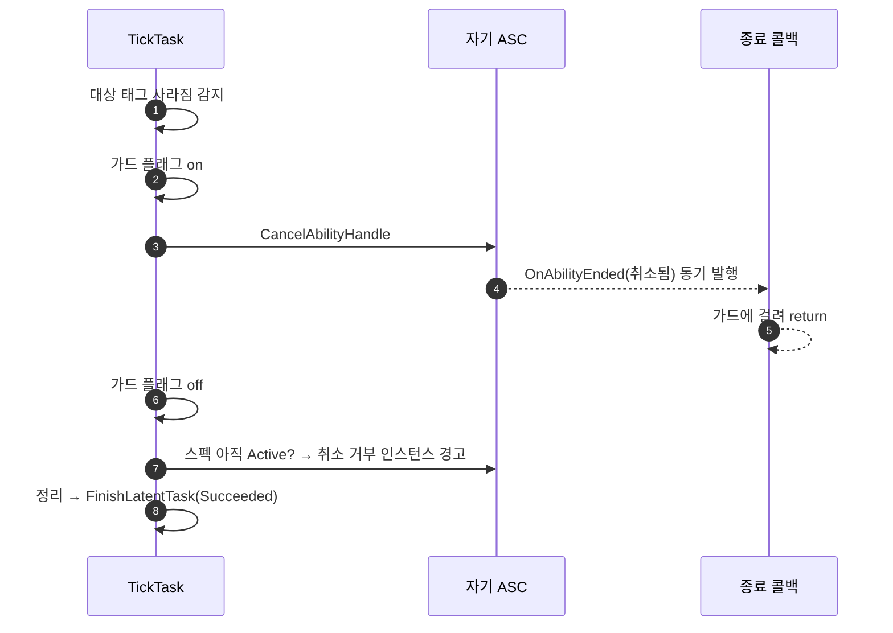

# MirrorAbility — 대상을 따라 놓는 마감을 Succeeded 로, 취소 거부도 같은 자리에서 경고

## 계획

### 목표
`Docs/Programmer/module_review_WxAI.md` 의 1번·3번 항목을 해결한다. 둘 다 미러 태스크가 대상을 따라 어빌리티를 놓는 해제 경로 한 곳의 문제다.

대상이 식별 태그를 놓으면 태스크는 자기 어빌리티를 취소하고, 뒤따르는 종료 통지가 태스크를 마감하게 둔다. 그런데 엔진은 취소로 끝난 어빌리티의 통지에 항상 "취소됨" 을 실어 보내고, 종료 콜백은 그것을 무조건 Failed 로 읽는다. "끝까지 따라했다" 는 성공 경로가 트리에는 실패로 나간다(1번). 같은 경로에 abort 쪽에는 있는 취소 거부 경고가 없어, 취소를 거부하는 어빌리티를 따라하면 매 틱 취소가 조용히 재호출된다(3번).

### 수정 범위
| 파일 | 수정할 내용 | 구분 |
|---|---|---|
| `Plugins/WxAI/Source/WxAI/Private/WxBTTask_MirrorAbility.cpp` | `TickTask` 해제 경로를 `AbortTask` 와 같은 골격으로: 가드 플래그 안에서 취소 → 살아남은 스펙에서 취소 거부 확인·경고 → 정리 후 Succeeded 로 마감. 나머지 함수는 플래그 개명만 | 수정 |
| `Plugins/WxAI/Source/WxAI/Public/WxBTTask_MirrorAbility.h` | `bIsRequestingAbort` → `bIsRequestingCancel` 개명과 주석 정정, 클래스 주석에 결과 계약 한 줄 | 수정 |

리뷰 문서는 건드리지 않는다(다음 `/module-review` 가 갱신). 2번(중복)·4번(NodeName)은 범위 밖.

### 접근 방식
- **근본 원인은 통지가 사유를 모른다는 것**: 종료 통지는 "취소됐다" 만 알고 누가 왜 취소했는지는 모른다. 태스크가 스스로 건 취소(대상 추종 종료)와 밖에서 걸린 취소(피격·사망 등)는 통지 위에서 구별할 수 없다. 그 차이를 아는 유일한 자리는 취소를 호출한 쪽이므로, 마감은 취소를 건 그 자리가 한다 — abort 가 이미 그렇게 하고 있다.
- **해제 마감을 TickTask 가 직접 한다**: 취소 호출 앞뒤로 가드 플래그를 세워 동기 종료 콜백이 태스크를 마감하지 못하게 막고, 호출이 끝나면 정리 후 Succeeded 로 마감한다. 그러면 종료 콜백은 태스크가 걸지 않은 종료만 받게 되어 "자연 종료 = Succeeded, 밖에서 끊김 = Failed" 라는 기존 매핑이 그대로 정직해진다. 콜백 쪽은 고칠 것이 없다.
- **새 플래그를 만들지 않고 있는 플래그를 넓힌다**: 리뷰는 해제 전용 플래그를 제안했지만, 기존 abort 플래그가 이미 "내가 건 취소 호출 안이다" 를 뜻하고 이번 경로도 정확히 그 뜻이다. abort 전용이 아니게 되므로 이름만 취소 일반으로 고친다.
- **취소 거부 경고는 같은 자리에 놓인다**: 취소 후에도 스펙이 살아 있으면 인스턴스를 돌며 거부를 찾아 abort 와 같은 문구로 경고한다. 태스크가 그 자리에서 마감되므로 다음 틱에 다시 취소를 걸 일이 없고, 경고는 한 번만 찍힌다. 헬퍼로 빼지 않고 풀어쓴다.
- **거부해도 결과는 Succeeded**: 대상은 이미 놓았고 따라 놓으라는 요청까지 마쳤으니 미러의 일은 끝났다. 어빌리티는 자기 선언대로 혼자 계속 돌고, 그 조합이 저작 실수라는 것은 경고가 말한다. 해제 경로의 결과를 하나로 유지한다.
- **미뤄진 종료를 기다리는 분기는 두지 않는다**: abort 는 취소가 스코프 락에 미뤄진 경우 통지를 기다리지만, 틱에는 그 경우가 없다. UE 5.8 에서 어빌리티의 스코프 락을 올리는 곳은 GE 를 대상에 적용하는 함수 하나뿐이고, BT 틱이 그 안에 중첩될 수 없다. 틱에서 건 취소는 동기 종료되거나 거부되거나 둘 중 하나라 두 경우 모두 즉시 마감하면 된다.
- **ASC 가 사라진 경우는 Failed 로 마감**: 기존 코드는 ASC 가 없으면 아무것도 안 하고 매 틱 조용히 돌았다. 같은 자리에서 정리 후 Failed 로 마감해 태스크가 걸려 있지 않게 한다.

---

## 완료

### 수정한 파일
| 파일 | 수정한 내용 | 구분 |
|---|---|---|
| `Plugins/WxAI/Source/WxAI/Private/WxBTTask_MirrorAbility.cpp` | `TickTask` 해제 경로가 가드 플래그 안에서 취소하고, 살아남은 스펙의 취소 거부를 한 번 경고한 뒤 정리·Succeeded 로 마감. 종료 콜백의 가드 주석 정정, 플래그 개명 | 수정 |
| `Plugins/WxAI/Source/WxAI/Public/WxBTTask_MirrorAbility.h` | 플래그 개명·주석 정정, 클래스 주석에 결과 계약(따라 놓으면 Succeeded, 밖에서 끊기면 Failed, 취소 거부는 경고) | 수정 |

### 구현·결정과 그 이유
- **마감 주체를 통지에서 호출자로 옮겼다**: 통지는 "취소됐다" 만 알고 사유를 모른다. 태스크가 스스로 건 취소를 성공으로 읽으려면 그 사실을 아는 자리, 즉 취소를 호출한 틱이 마감해야 한다. abort 가 이미 같은 구조라 새 패턴이 아니다. 직전 도플갱어 워크로그는 "해제는 뒤따르는 통지가 마감하게 둔다" 고 정했는데, 바로 그 구조가 이 버그의 원인이라 뒤집었다.
- **플래그를 새로 만들지 않았다**: 리뷰가 제안한 해제 전용 플래그 대신 기존 abort 가드 플래그를 취소 일반으로 넓혀 개명만 했다. 두 경로가 같은 뜻("내가 건 취소 호출 안") 이라 하나로 충분하고, 종료 콜백은 태스크가 걸지 않은 종료만 받게 되어 기존 매핑이 그대로 맞는다.
- **거부해도 Succeeded**: 대상이 놓았고 따라 놓으라는 요청까지 마쳤으니 미러의 일은 끝났다. 어빌리티가 혼자 계속 도는 것은 저작 실수이고 경고가 그것을 말한다. 해제 경로의 결과를 둘로 가르지 않았다.
- **미뤄진 종료 대기는 두지 않았다**: 틱에서 건 취소가 스코프 락에 미뤄질 경로가 엔진에 없음을 확인했다(락을 올리는 곳은 GE 를 대상에 적용하는 함수 하나뿐이고 BT 틱이 그 안에 중첩될 수 없다). abort 와 달리 기다릴 이유가 없어 분기를 줄였다.

### 계획 대비 달라진 점
- 계획대로.

### 검증
- WxEditor(Development) 빌드 `Result: Succeeded`. 수정한 cpp 재컴파일과 WxAI 링크까지 통과.
- PIE 실측은 미실시(이 세션에서 unreal-mcp 미연결).

### 후속 과제
- PIE 확인: 주인이 가드를 놓을 때 도플갱어의 미러 브랜치가 Succeeded 로 빠져 트리가 곧장 루트로 돌아오는지, 피격으로 끊기면 Failed 로 추종 브랜치에 내려가는지.
- `Docs/Programmer/module_review_WxAI.md` 1·3번 항목은 다음 `/module-review` 실행이 갱신한다.
