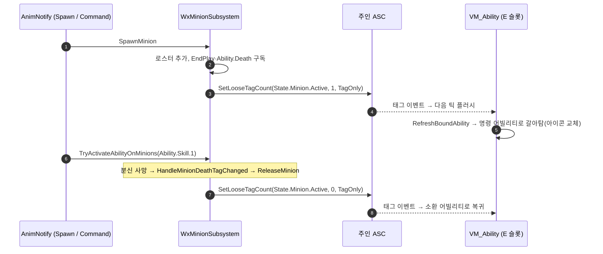

# 분신 소환·명령 슬롯 분기

## 계획

### 목표
E 슬롯 하나가 분신이 없으면 소환, 있으면 명령이 되게 하고, 두 경우의 슬롯 아이콘이 따라 바뀌게 한다. 같은 InputAction에 소환·명령 두 어빌리티를 함께 달고 `State.Minion.Active` 태그로 배타적으로 가른다.

### 수정 범위
| 파일 | 수정할 내용 | 구분 |
|---|---|---|
| `Plugins/WxCore/Source/WxCore/{Public,Private}/WxGameplayTags.{h,cpp}` | `State.Minion.Active` 네이티브 태그 선언 | 수정 |
| `Plugins/WxCombat/Source/WxCombat/{Public,Private}/Minion/WxMinionSubsystem.{h,cpp}` | 로스터 변화를 소환물 EndPlay·사망 태그 구독으로 즉시 반영하고 주인 ASC에 복제 loose 태그를 올리고 내린다. 진입 시 훑던 지연 정리 삭제 | 수정 |
| `Plugins/WxCombat/Source/WxCombat/{Public,Private}/AnimNotify/WxAnimNotify_CommandMinion.{h,cpp}` | 명령 몽타주 노티파이. 어빌리티 태그 하나를 들고 서브시스템의 명령 진입점을 직접 호출 | 신규 |
| `Plugins/WxUI/Source/WxUI/{Public,Private}/MVVM/WxViewModel_Ability.{h,cpp}` | 같은 슬롯 태그 후보가 여럿이면 발동 태그 요건을 만족하는 쪽을 물고, 태그 변경 플러시에서 재매칭 | 수정 |
| `Plugins/WxCombat/README.md` | 서브시스템 행에 태그 발행, 확장 포인트에 명령 노티파이 | 수정 |

### 접근 방식
- **상태는 태그로, 발행자는 서브시스템**: 로스터는 서버에만 있으므로 "분신이 살아 있다"는 사실을 주인 ASC에 복제 loose 태그(0/1)로 발행한다. 클라이언트는 이 태그로 소환·명령 중 어느 쪽을 예측 발동할지 고르고, UI도 같은 태그를 본다. 무태그 조회는 WxUI가 WxCombat의 분신 개념을 알아야 해 DAG에 걸려 기각했다.
- **로스터 정리를 지연에서 즉시로**: 태그를 즉시 내리려면 빠지는 순간을 알아야 하므로, 소환물을 올릴 때 EndPlay와 사망 태그 이벤트를 구독한다. 태그 이벤트는 어느 ASC에서 왔는지 주지 않아 델리게이트 페이로드로 소환물을 실어 보낸다(람다 없이). 진입 시 훑어 지우던 지연 정리는 같은 사실을 두 경로가 관리하지 않도록 삭제한다.
- **교체 소환은 한 번에 반영**: 상한 초과 교체는 로스터에서 먼저 내린 뒤 파괴하고, 태그는 소환 끝에서 한 번만 발행한다. 한 프레임에 1→0→1로 튀지 않고, 파괴가 동기 호출하는 EndPlay 핸들러가 순회와 겹치지 않는다. 주인이 끝날 때는 로스터를 통째로 걷고 소환물을 파괴하되 태그는 만지지 않는다.
- **명령은 소환과 대칭**: 명령 노티파이도 소환 노티파이처럼 서브시스템을 직접 부르고, 권위 판정은 서브시스템이 한다. 분신에게 시킬 어빌리티 태그는 노티파이 에셋에 적으므로(잠정 `Ability.Skill.1`) 나중에 바꿔도 코드는 그대로다.
- **어빌리티는 에셋으로만**: 소환 어빌리티에 차단 태그, 새 명령 어빌리티에 필요 태그를 달아 같은 InputAction을 나눈다. 입력 라우팅은 같은 IA를 공유하는 스펙을 순회해 첫 성립에서 끊으므로 막힌 쪽은 떨어지고 열린 쪽이 나간다. 쿨다운 GE는 둘 다 같은 것이라 한 슬롯의 쿨다운으로 공유된다. 아이콘은 어빌리티마다 DT_Ability 행에 있으므로 어빌리티가 갈리면 따라 갈린다. 기존 GA_Skill_1은 부여 순서상 항상 이기므로 플레이어 세트에서 뺀다.
- **슬롯 뷰모델은 요건 만족 쪽을 문다**: 같은 에셋 태그 후보를 돌며 지금 발동 태그 요건을 만족하는 첫 후보를 물고, 하나도 없으면 첫 후보. 태그 변경 플러시에서 물고 있는 어빌리티부터 다시 고르면 아이콘·이름·쿨다운·비용 바인딩이 기존 경로로 통째로 갈린다.

---

## 완료

### 수정한 파일
| 파일 | 수정한 내용 | 구분 |
|---|---|---|
| `Plugins/WxCore/Source/WxCore/{Public,Private}/WxGameplayTags.{h,cpp}` | `State.Minion.Active` 네이티브 태그 | 수정 |
| `Plugins/WxCombat/Source/WxCombat/{Public,Private}/Minion/WxMinionSubsystem.{h,cpp}` | 소환물 EndPlay·사망 태그 구독으로 로스터를 즉시 내리고 주인 ASC에 복제 loose 태그를 발행. 진입 시 훑던 지연 정리 삭제 | 수정 |
| `Plugins/WxCombat/Source/WxCombat/{Public,Private}/AnimNotify/WxAnimNotify_CommandMinion.{h,cpp}` | 어빌리티 태그 하나로 서브시스템의 명령 진입점을 부르는 몽타주 노티파이 | 신규 |
| `Plugins/WxUI/Source/WxUI/{Public,Private}/MVVM/WxViewModel_Ability.{h,cpp}` | 같은 슬롯 태그 후보 중 발동 태그 요건을 만족하는 쪽을 물고, 태그 플러시에서 재매칭 | 수정 |
| `Plugins/WxCombat/README.md` | 서브시스템 행·확장 포인트 갱신 | 수정 |

### 구현·결정과 그 이유
- **복제 loose 태그, 값은 유무(0/1)**: 로스터는 서버에만 있는데 클라이언트는 어느 어빌리티를 예측 발동할지 골라야 하고 UI도 같은 신호를 봐야 한다. 분신 수가 아니라 유무만 필요하므로 카운트를 0/1로 세팅한다.
- **사망은 태그 이벤트, 파괴는 EndPlay로 즉시 내림**: 진입 시 훑던 지연 정리는 태그를 늦게 내려 슬롯이 명령 아이콘에 머문다. 태그 이벤트는 발신 ASC를 주지 않으므로 구독할 때 소환물을 델리게이트 페이로드로 실어 람다 없이 식별한다. 해제 함수 하나가 로스터 제거·구독 해제·주인 반환을 맡고 태그 마감은 호출자가 한다.
- **교체 소환은 내린 뒤 파괴, 태그는 끝에서 한 번**: 파괴가 EndPlay를 동기 호출하므로 로스터에서 먼저 빼야 핸들러가 순회와 겹치지 않고, 태그도 1→0→1로 튀지 않는다.
- **뷰모델은 엔진 공개 판정을 그대로**: 후보 중 발동 태그 요건을 만족하는 첫 후보를 물고, 모두 막혀 있으면 첫 후보. 태그 플러시에서 물고 있는 어빌리티부터 다시 고르므로 아이콘·쿨다운·비용 바인딩은 기존 교체 경로가 갈아 끼운다. WxUI는 분신 개념을 모른 채 태그만 본다.
- **명령 노티파이는 소환과 대칭**: 서브시스템을 직접 부르고 권위 판정은 서브시스템에 둔다. 시킬 어빌리티 태그는 에셋 값이라 코드 변경 없이 바꾼다.

### 계획 대비 달라진 점
- 스폰 실패 경로에서 태그를 한 번 마감하는 분기를 더했다. 교체로 옛 소환물을 이미 내린 뒤 스폰이 실패하면 로스터는 비었는데 태그가 남기 때문이다. 그 외는 계획대로.

### 후속 과제
- 에셋 작업(MCP 미연결로 미착수): `GA_Skill_SpawnMinion`의 ActivationBlockedTags에 `State.Minion.Active`; `GA_Skill_CommandMinion`(WxAbility_Skill) 신설 — ActivationRequiredTags `State.Minion.Active`, ComboMontages에 `AM_Skill_CommandMinion`(CommandMinion 노티파이, AbilityTag=`Ability.Skill.1`), DT_Ability에 명령 아이콘 행; `ABS_Player`에서 `GA_Skill_1`을 빼고 둘을 넣는다(남기면 부여 순서상 항상 이겨 소환이 안 나간다).
- PIE 검증: E → 소환·아이콘 교체 → E → 분신이 Skill.1 발동 → 분신 처치 → 즉시 소환 아이콘 복귀 → 재소환. 상한 교체 시 아이콘 깜빡임 없음. 주인 제거 시 소환물 파괴.
- 소환·명령이 둘 다 막힌 동안은 첫 후보(소환) 아이콘으로 떨어진다. 거슬리면 "마지막으로 만족했던 후보 유지"로 바꿀 수 있다.
