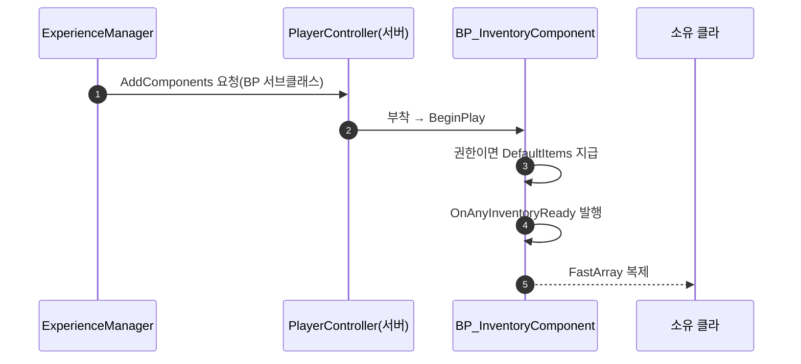

# 시작 아이템 지급을 인벤토리 컴포넌트 자체 지급으로 전환

## 계획

### 목표
시작 아이템 지급이 GameMode 에 얹혀 있어 인벤토리의 시작 상태가 외부 호출에 의존한다. GameMode 에서 인벤토리 지식을 전부 걷어내고, 인벤토리 컴포넌트가 자기 시작 아이템을 BeginPlay 에서 스스로 지급하게 한다. 목록은 컴포넌트의 BP 서브클래스가 갖고 Experience 의 주입 설정이 그 서브클래스를 지목한다.

### 수정 범위
| 파일 | 수정할 내용 | 구분 |
|---|---|---|
| `Plugins/WxInventory/.../Inventory/WxInventoryComponent.h` | `DefaultItems` 프로퍼티 추가, 클래스 주석에 자체 지급 반영 | 수정 |
| `Plugins/WxInventory/.../Inventory/WxInventoryComponent.cpp` | `BeginPlay` 에 권한 게이트 지급 추가(Ready 발행 앞) | 수정 |
| `Source/WxGame/Framework/WxGameMode.h/.cpp` | `PostLogin`·`GrantDefaultInventory`·인벤토리/액션셋 include 제거, 주석 갱신 | 수정 |
| `Source/WxGame/Framework/WxExperienceActionSet.h` | `DefaultInventoryItems` 와 전용 include 제거 | 수정 |
| `Source/WxGame/README.md`, `Plugins/WxInventory/README.md` | GameMode 역할에서 지급 제거, 인벤토리 규약에 시작 아이템 추가 | 수정 |
| `Content/Item/BP_InventoryComponent.uasset` | 부모 `UWxInventoryComponent`, `DefaultItems = [DA_Potion ×1]` | 신규(에디터) |
| `Content/Framework/WAS_CoreGameplay.uasset` | AddComponents 엔트리를 BP 서브클래스로 교체, 재저장 | 수정(에디터) |

### 접근 방식
- **컴포넌트 자체 지급**: BeginPlay 에서 소유 액터가 권한이면 목록을 지급하고 그 뒤에 도착 신호를 발행한다. HUD 뷰모델은 도착 시점의 전체 갱신으로 시작 아이템까지 한 번에 읽는다.
- **중복·누락이 없는 이유**: 주입 컴포넌트는 부착 즉시 BeginPlay 된다. 로드 전 접속자는 로드 완료 시 이미 BeginPlay 한 PC 에 붙으며 엔진이 그 자리에서 컴포넌트 BeginPlay 를 호출하고, 로드 후 접속자는 PC 초기화에서 붙어 PC BeginPlay 가 돌린다. 인스턴스당 1회이므로 두 시점을 GameMode 가 나눠 처리하던 구조가 필요 없다. 클라의 복제 인스턴스는 권한 게이트로 건너뛰고, 복제 등록 전 지급은 ReadyForReplication 의 back-fill 이 받는다.
- **목록은 BP 서브클래스**: 시작 아이템은 콘텐츠를 지목하므로 C++ 기본값에 둘 수 없다. 07-27 에 컴포넌트에서 목록을 뺀 이유는 주입되는 C++ 클래스를 설정할 수 없어서였는데, 서브클래스를 주입하면 그 제약이 사라진다. Experience 별 시작 구성은 서브클래스 선택으로 갈린다.
- **버린 대안**: WxInventory 에 Lyra 식 지급 액션을 신설하면 새 클래스와 GameFeatures 의존이 생기고 AddComponents 와의 액션 순서 의존이 남는다.

---

## 완료

### 수정한 파일
| 파일 | 수정한 내용 | 구분 |
|---|---|---|
| `Plugins/WxInventory/.../Inventory/WxInventoryComponent.h` | `DefaultItems`(EditDefaultsOnly, private) 추가, 클래스 주석에 자체 지급 반영 | 수정 |
| `Plugins/WxInventory/.../Inventory/WxInventoryComponent.cpp` | `BeginPlay` 에서 권한이면 `GrantItems(DefaultItems)` 후 Ready 발행 | 수정 |
| `Source/WxGame/Framework/WxGameMode.h/.cpp` | `PostLogin` 오버라이드·`GrantDefaultInventory`·인벤토리/액션셋 include 제거, 주석 갱신 | 수정 |
| `Source/WxGame/Framework/WxExperienceActionSet.h` | `DefaultInventoryItems` 와 전용 include 제거 | 수정 |
| `Source/WxGame/README.md`, `Plugins/WxInventory/README.md` | GameMode 역할에서 지급 삭제, 인벤토리 규약에 시작 아이템 항목 추가 | 수정 |
| `Content/Item/BP_InventoryComponent.uasset` | 부모 `UWxInventoryComponent`, `DefaultItems = [DA_Potion ×1]` | 신규 |
| `Content/Framework/WAS_CombatCore.uasset` | AddComponents 엔트리를 `BP_InventoryComponent_C` 로 교체. 사용자가 같은 에디터에서 `WAS_CoreGameplay` → `WAS_CombatCore` 로 이름을 바꾸면서 새 파일에 이 수정이 실려 저장됨 | 수정(새 이름) |

### 구현·결정과 그 이유
- **지급을 Ready 발행 앞에 둔다**: 도착 신호를 받은 뷰모델이 전체 갱신 한 번으로 시작 아이템까지 읽도록 했다. 뒤에 두면 슬롯 변경 이벤트로 따로 흘러 들어가 초기화 경로가 둘이 된다.
- **목록은 private 프로퍼티**: 읽는 코드가 컴포넌트 자신뿐이라 접근자를 두지 않았다. 에디터 편집은 private 이어도 된다.
- **완료 콜백 인자를 이름 없이 남김**: 대기 접속자 스폰만 남아 Experience 를 더 쓰지 않지만, 델리게이트 시그니처라 인자 자체는 유지해야 한다.
- **BP 서브클래스는 게임 콘텐츠(`/Game/Item`)에**: 플러그인 콘텐츠에 두면 플러그인이 게임 에셋(DA_Potion)을 역참조하게 된다.

### 계획 대비 달라진 점
- **저장이 이름 변경에 실려 갔다**: 같은 머신의 다른 세션이 띄운 DebugGame 에디터(PID 24232)가 `WAS_CoreGameplay.uasset` 파일 핸들을 쥐고 있어(그 인스턴스에서 에셋을 로드한 링커가 파일을 열어 둠) 내 에디터의 SavePackage 가 원본 파일 이동 단계에서 실패했다. 다른 세션 에디터는 종료하지 않는다는 규칙에 따라 기다리는 사이, 사용자가 내 에디터에서 에셋을 `WAS_CombatCore` 로 이름 변경해 새 파일에 수정본이 저장됐다. 옛 파일은 잠금 탓에 지워지지 않았고 `EXP_Combat` 도 아직 옛 이름을 가리킨다.
- **MCP 포트 분리**: 기본 8000 포트를 다른 세션 에디터가 쓰고 있어 내 에디터는 `-ModelContextProtocolPort=8001` 로 띄웠다. 처음 8000 으로 만든 BP 는 그 인스턴스에서 즉시 삭제(미저장 상태)했다.

### 검증
- WxEditor Development 빌드 `Result: Succeeded`, 경고 없음.
- PIE(LV_DevCombat, EXP_Combat): PlayerController 의 인벤토리 컴포넌트가 `BP_InventoryComponent_C` 하나뿐이고, HUD 퀵슬롯(Z)에 포션이 3충전으로 표시됨(에디터 캡처). 인벤토리·Experience 관련 에러 로그 없음.

### 후속 과제
- **이름 변경 마무리(사용자 진행 중)**: `EXP_Combat.ActionSets` 를 `WAS_CombatCore` 로 재지정하고 옛 `WAS_CoreGameplay.uasset` 을 지워야 한다. 그 전까지 `EXP_Combat` 은 옛 액션셋(C++ 클래스 주입)을 써서 시작 포션이 지급되지 않는다.
- 로드 전/후 두 접속 시점의 멀티 경로는 엔진 부착 즉시 BeginPlay 근거로 갈음했고 2인 PIE 로는 확인하지 않았다.
- **같은 날 대체됨**: BP 서브클래스 없이 가기 위해 지급을 WxInventory 의 GameFeatureAction 으로 옮겼다 — `2026-09-05-시작아이템-지급-액션.md`. 컴포넌트의 `DefaultItems` 와 BP 는 그때 제거됐다.
