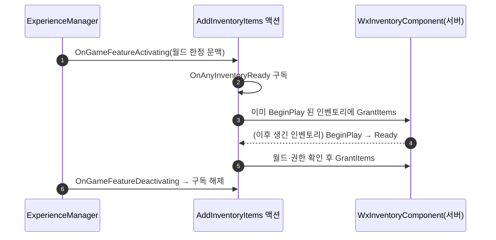

# 시작 아이템 지급을 인벤토리 GameFeatureAction 으로 전환

## 계획

### 목표
같은 날 도입한 "컴포넌트 BP 서브클래스 자체 지급" 방식은 BP 에셋 하나를 요구한다. BP 없이 가려면 목록을 컴포넌트가 아니라 Experience 액션셋 안의 액션 인스턴스가 갖게 한다. WxInventory 에 지급 액션을 두어 인벤토리가 자기 시작 지급 코드를 소유하고, 데이터는 Experience 구성으로 돌아온다. GameMode 는 계속 인벤토리를 모른다.

### 수정 범위
| 파일 | 수정할 내용 | 구분 |
|---|---|---|
| `Plugins/WxInventory/.../Inventory/WxGameFeatureAction_AddInventoryItems.h/.cpp` | 활성 시 기존 인벤토리 즉시 지급 + 도착 신호 구독, 비활성 시 구독 해제 | 신규 |
| `Plugins/WxInventory/.../Inventory/WxInventoryComponent.h/.cpp` | `DefaultItems`·BeginPlay 지급 제거(원복), 주석 갱신 | 수정 |
| `Plugins/WxInventory/WxInventory.Build.cs`, `WxInventory.uplugin` | `GameFeatures` 모듈·플러그인 의존 추가 | 수정 |
| `Source/WxGame/Framework/WxGameMode.h` | 주석 한 줄(지급 주체를 액션으로) | 수정 |
| `Plugins/WxInventory/README.md` | 시작 아이템 규약·핵심 타입 갱신 | 수정 |
| `Content/Framework/WAS_CombatCore.uasset` | Actions 에 지급 액션(DA_Potion ×1) 추가, 주입 엔트리를 C++ 클래스로 원복 | 수정(에디터) |
| `Content/Framework/EXP_Combat.uasset` | ActionSets 를 `WAS_CombatCore` 로 재지정(사용자 이름 변경 마무리) | 수정(에디터) |
| `Content/Framework/WAS_CoreGameplay.uasset`, `Content/Item/BP_InventoryComponent.uasset` | 삭제(옛 이름, BP 서브클래스) | 삭제 |

### 접근 방식
- **순서 무관 지급**: 활성 시점에 이미 BeginPlay 를 지난 인벤토리는 그 자리에서 지급하고, 아직 없는 인벤토리는 컴포넌트가 BeginPlay 에서 내는 도착 신호로 지급한다. 주입 액션이 앞에 있든 뒤에 있든 한 쪽에서만 잡히므로 순서 의존도, 중복도 없다.
- **월드·권한 게이트**: 도착 신호는 클래스 차원이라 PIE 의 다른 월드 인벤토리도 들어온다. 액션의 문맥(매니저가 자기 월드로 한정)과 인벤토리의 월드를 대조해 남의 월드는 버리고, 서버 권한에서만 지급한다.
- **버린 대안**: 컴포넌트 CDO Config+ini(에셋 주소 ini 전역화 거부 이력, Experience 별 변화 불가), 초기 퀘스트 StateTree GiveRewards(퀘스트에 종속), PC BP 프로퍼티(7월에 걷어낸 구조).

---

## 완료

### 수정한 파일
| 파일 | 수정한 내용 | 구분 |
|---|---|---|
| `Plugins/WxInventory/.../Inventory/WxGameFeatureAction_AddInventoryItems.h/.cpp` | 활성 시 BeginPlay 를 지난 인벤토리에 즉시 지급 + 도착 신호 구독, 비활성 시 해제, 지급 로그 1줄 | 신규 |
| `Plugins/WxInventory/.../Inventory/WxInventoryComponent.h/.cpp` | `DefaultItems`·BeginPlay 지급 제거(원복), 클래스 주석 갱신 | 수정 |
| `Plugins/WxInventory/WxInventory.Build.cs`, `WxInventory.uplugin` | `GameFeatures` 의존 추가 | 수정 |
| `Source/WxGame/Framework/WxGameMode.h` | 주석 한 줄 | 수정 |
| `Plugins/WxInventory/README.md` | 시작 아이템 규약, 핵심 타입에 액션 추가 | 수정 |
| `Content/Framework/WAS_CombatCore.uasset` | `WAS_CoreGameplay` 에서 이름 변경(사용자 작업 마무리), Actions 에 Add Inventory Items(DA_Potion ×1) 추가, 주입 엔트리를 `WxInventoryComponent` C++ 클래스로 원복 | 수정(개명) |
| `Content/Framework/EXP_Combat.uasset` | ActionSets → `WAS_CombatCore` | 수정 |
| `Content/Framework/WAS_CoreGameplay.uasset`, `Content/Item/BP_InventoryComponent.uasset` | 리다이렉터·BP 삭제 | 삭제 |

### 구현·결정과 그 이유
- **활성 시점 스캔은 BeginPlay 를 지난 인벤토리만**: 도착 신호는 BeginPlay 에서 나오므로, 아직 BeginPlay 전인 인벤토리를 스캔에서 지급하면 신호 때 한 번 더 받는다. 두 경로가 서로 배타가 되도록 스캔 조건에 BeginPlay 여부를 넣었다.
- **월드 대조를 액션 문맥으로**: 매니저가 액션 문맥을 자기 월드로 한정해 주므로, 신호로 들어온 인벤토리의 월드 문맥을 그 문맥에 대조하면 PIE 의 서버·클라 월드가 같은 액션 인스턴스를 공유해도 섞이지 않는다. 문맥별 구독 핸들을 맵으로 들고 비활성 시 그 문맥 것만 푼다.
- **지급 로그 1줄**: 지급 경로가 액션으로 숨어 "왜 포션이 없나"를 볼 곳이 없어져, 어느 경로(활성 시점/도착 신호)로 몇 항목을 줬는지 Log 로 남겼다. PIE 검증에도 이 줄 수로 중복 여부를 셌다.
- **번들 데이터는 싣지 않음**: 아이템은 지급 시점 동기 로드가 기존 정책이라(GrantItems 주석) 액션의 `AddAdditionalAssetBundleData` 를 두지 않았다. 옛 액션셋 필드도 번들에 싣지 않았으므로 동일하다.
- **데이터 검증 없음**: 빈 항목은 `GrantItems` 가 무시하는 것이 규약이라 `IsDataValid` 를 두지 않았다.

### 계획 대비 달라진 점
- **이름 변경을 처음부터 다시 했다**: 사용자가 만들어 둔 `WAS_CombatCore.uasset` 이 작업 도중 디스크와 인덱스에서 사라져(병행 세션 커밋 즈음), 남아 있던 `WAS_CoreGameplay` 를 에디터에서 개명해 EXP_Combat 참조까지 고친 뒤 편집·저장했다.
- **에디터의 Git 소스 컨트롤이 인덱스를 건드렸다**: 개명·삭제 시 에디터가 `git add`/`git rm` 을 수행해 `WAS_CombatCore`(A), `WAS_CoreGameplay`(D) 가 스테이징됐다. BP 는 에디터 삭제가 파일을 지우지 못해(소스 컨트롤 오류) 직접 지우고 인덱스에서 뺐다.

### 검증
- WxEditor Development 빌드 `Result: Succeeded`.
- PIE(LV_DevCombat, EXP_Combat): 지급 로그가 정확히 1줄(활성 시점 경로), 인벤토리 컴포넌트는 C++ `WxInventoryComponent` 하나, HUD 퀵슬롯에 포션 3충전 표시, 관련 에러 없음.

### 후속 과제
- 로드 후 접속자(도착 신호 경로)는 2인 PIE 로 확인하지 않았다 — 단일 PIE 는 활성 시점 경로만 탄다.
- 인덱스에 에디터가 올린 `WAS_CombatCore`(A)·`WAS_CoreGameplay`(D) 스테이징이 있다. 커밋 시 그대로 포함하면 된다.
