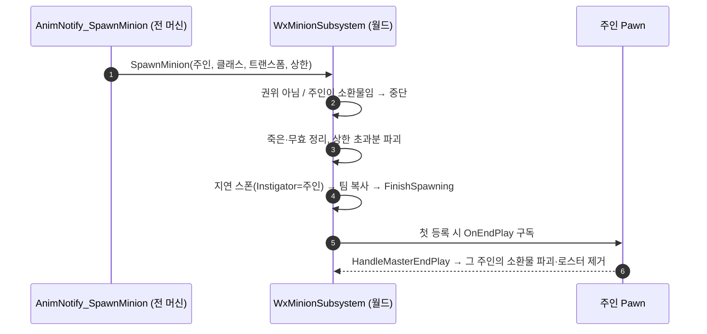

# 투사체·소환 매니저를 캐릭터 컴포넌트에서 월드 서브시스템으로 옮긴다

## 계획

### 목표
`AWxCharacterBase`가 예외 없이 붙이던 `ProjectileManagerComponent`·`MinionManagerComponent`를 없애고, 같은 일을 월드에 하나 있는 서브시스템이 맡게 한다. 두 매니저는 캐릭터별 상태가 거의 없고 서버 권위 스폰만 하므로, 발사체도 소환도 하지 않는 잡몹·NPC까지 달고 다닐 이유가 없다(모듈 리뷰 WxGame #2).

### 수정 범위
| 파일 | 수정할 내용 | 구분 |
|---|---|---|
| `Plugins/WxCombat/.../Weapon/WxProjectileSubsystem.{h,cpp}` | 월드 서브시스템. 서버 권위 투사체 스폰 | 신규 |
| `Plugins/WxCombat/.../Minion/WxMinionSubsystem.{h,cpp}` | 월드 서브시스템. 주인별 로스터·상한·소환물 명령·주인 EndPlay 정리·소환물의 소환 금지 | 신규 |
| `Plugins/WxCombat/.../Weapon/WxProjectileManagerComponent.{h,cpp}` | 삭제 | 삭제 |
| `Plugins/WxCombat/.../Minion/WxMinionManagerComponent.{h,cpp}` | 삭제 | 삭제 |
| `Plugins/WxCombat/.../AnimNotify/WxAnimNotify_SpawnProjectile.{h,cpp}` | GameplayEvent 대신 소켓 트랜스폼을 만들어 서브시스템 직접 호출. getter 제거 | 수정 |
| `Plugins/WxCombat/.../AnimNotify/WxAnimNotify_SpawnMinion.{h,cpp}` | 같은 방식 + `MaxMinionCount` 프로퍼티 이관. getter 제거 | 수정 |
| `Plugins/WxCore/.../WxGameplayTags.{h,cpp}` | `Event_SpawnProjectile`·`Event_SpawnMinion` 제거 | 수정 |
| `Source/WxGame/Character/WxCharacterBase.{h,cpp}` | 두 멤버·전방 선언·include·서브오브젝트 생성 제거 | 수정 |
| `Plugins/WxCombat/README.md`, `Source/WxGame/README.md` | 확장 포인트에 스폰 담당 기준 한 줄, 주요 타입 표에 서브시스템 2종 | 수정 |

### 접근 방식
- **전역 관리자는 엔진 순정 `UWorldSubsystem`**: 프로젝트에 월드 서브시스템 선례는 없지만 GameInstance 서브시스템(`UWxUIManagerSubsystem`)과 같은 결이다. 월드 단위라 PIE 다중 세션·서버가 각자 독립된 로스터를 갖는다.
- **노티파이가 서브시스템을 직접 부른다**: GameplayEvent 우회는 캐릭터에 붙은 구독자를 찾기 위한 장치였다. 전역 관리자는 월드에서 바로 닿으므로 이벤트·페이로드 캐스팅·`OptionalObject` 검사가 전부 사라진다. 노티파이는 값을 풀어(클래스·트랜스폼·상한) 넘기고 서브시스템은 노티파이 타입을 모른다. 권위 검사는 서브시스템이 한다. Persona 프리뷰 월드에는 서브시스템이 만들어지지 않아 프리뷰 재생 중 스폰되지 않는다.
- **주인 소멸 시 소환물 파괴는 `OnEndPlay` 구독으로**: 컴포넌트의 `EndPlay`가 하던 일을, 주인이 로스터에 처음 오를 때 주인의 `OnEndPlay`에 묶어 같은 시점에 같은 일을 한다.
- **소환 상한은 노티파이로, 증식 방지는 로스터에서 파생**: 캐릭터 BP가 상한을 선언하던 운반체(컴포넌트)가 사라진다. "이 소환이 동시에 유지할 수"는 본래 기술 단위 값이라 노티파이가 맞고, 도플갱어가 같은 몽타주를 따라해도 재소환하지 않는 것은 서브시스템이 이미 아는 사실 — 로스터에 소환물로 올라 있는 액터는 소환자가 될 수 없다 — 에서 파생한다. 새로 갖는 상태도, BP 선언도 없다. 부수 효과로 기존 소환물도 소환을 못 하게 되는데 연쇄 소환을 막는 쪽이 의도에 가깝다.

---

## 완료

### 수정한 파일
| 파일 | 수정한 내용 | 구분 |
|---|---|---|
| `Plugins/WxCombat/.../Weapon/WxProjectileSubsystem.{h,cpp}` | 서버 권위 투사체 스폰 진입점(월드 서브시스템) | 신규 |
| `Plugins/WxCombat/.../Minion/WxMinionSubsystem.{h,cpp}` | 주인별 로스터·상한·소환물 명령·주인 EndPlay 정리·소환물의 소환 금지 | 신규 |
| `Plugins/WxCombat/.../Weapon/WxProjectileManagerComponent.{h,cpp}` | 제거 | 삭제 |
| `Plugins/WxCombat/.../Minion/WxMinionManagerComponent.{h,cpp}` | 제거 | 삭제 |
| `Plugins/WxCombat/.../AnimNotify/WxAnimNotify_SpawnProjectile.{h,cpp}` | 소켓 트랜스폼을 만들어 서브시스템 직접 호출. getter 제거 | 수정 |
| `Plugins/WxCombat/.../AnimNotify/WxAnimNotify_SpawnMinion.{h,cpp}` | 같은 방식. `MaxMinionCount`(기본 1, 최소 1) 이관, getter 제거 | 수정 |
| `Plugins/WxCore/.../WxGameplayTags.{h,cpp}` | `Event_SpawnProjectile`·`Event_SpawnMinion` 제거 | 수정 |
| `Source/WxGame/Character/WxCharacterBase.{h,cpp}` | 두 매니저 멤버·include·서브오브젝트 생성 제거 | 수정 |
| `Plugins/WxCombat/README.md`, `Source/WxGame/README.md` | 핵심 타입 표에 서브시스템 2종, 확장 포인트에 "캐릭터별 상태 없는 서버 권위 스폰은 월드 서브시스템" 기준 | 수정 |

### 구현·결정과 그 이유
- **서브시스템은 노티파이 타입을 모른다**: 노티파이가 클래스·트랜스폼·상한을 풀어 넘기고, 서브시스템은 순수한 스폰 API만 가진다. 전역 관리자가 애니메이션 자산 쪽 타입에 묶이지 않아 나중에 BT 태스크나 치트가 같은 진입점을 쓸 수 있다.
- **GameplayEvent 우회를 걷어냈다**: 캐릭터에 붙은 구독자를 찾기 위한 장치였으므로 월드에서 바로 닿는 지금은 필요가 없다. 이벤트 태그 둘, 페이로드 캐스팅, `OptionalObject` 검사가 함께 사라졌다. Persona 프리뷰 월드에는 서브시스템이 생기지 않아 프리뷰 재생 중 스폰되지 않는 것도 덤이다.
- **주인 소멸 시 정리는 주인의 `OnEndPlay`에 묶었다**: 컴포넌트 `EndPlay`가 하던 일을 같은 시점에 그대로 한다. 주인이 로스터에 처음 오를 때 한 번만 구독하고, 핸들러가 로스터 항목을 통째로 빼며 소환물을 파괴한다.
- **소환물은 소환자가 될 수 없다**: 캐릭터 BP가 상한 0으로 선언하던 운반체가 사라졌으므로, 서브시스템이 이미 아는 사실(로스터)에서 파생했다. 도플갱어가 주인의 몽타주를 따라해도 재소환하지 않고, 기존 소환물의 연쇄 소환도 함께 막힌다. 상한은 "이 소환이 동시에 유지할 수"라는 본래 뜻대로 노티파이로 갔다.
- **서브시스템은 게임 월드(Game·PIE)에만 만든다**: 순정은 에디터 월드에도 생기는데, 노티파이의 에디터 발화 억제는 Persona 디버그 메시만 거르고 에디터 액터는 권위를 통과하므로 시퀀서 프리뷰에서 레벨에 스폰해 버린다. 옛 컴포넌트는 BeginPlay 구독이라 저절로 막혀 있던 경로다. 서브시스템이 없으면 노티파이의 조회가 null이라 호출부는 그대로다.

### 계획 대비 달라진 점
- 리뷰에서 에디터 월드 스폰 회귀를 찾아 `DoesSupportWorldType` 재정의를 추가했다. 재진입을 가정한 로스터 재조회는 실재하는 경로가 없어 걷어냈다.
- 컴파일 오류 1건(죽은 소환물 정리에서 상수 포인터를 ASC 조회에 넘김)을 고쳤다.

### 검증
- 이관 본체는 WxEditor(Development) 빌드 성공(`Result: Succeeded`, `.claude/skills/build-doctor/logs/build_2026-09-05_185837.log`).
- 리뷰 반영분(`DoesSupportWorldType` 재정의·로스터 추가 단순화)은 다른 세션의 에디터가 Live Coding을 켜고 있어 빌드로 확인하지 못했다. 재정의 시그니처는 엔진 선언과 같고, 추가 호출은 이미 컴파일된 것과 같은 타입이다.
- 삭제 심볼·태그·getter 잔여 참조 0건, `git diff --check` 통과.
- PIE 미실시(MCP 미연결).

### 후속 과제
- 에디터를 닫은 뒤 WxEditor(Development) 빌드로 리뷰 반영분을 확인한다.
- 캐릭터 BP 5종(`BP_Player`·`BP_Enemy`·`BP_Boss`·`BP_Minion`·`BP_Sandbag`)은 사라진 컴포넌트 클래스의 CDO export를 들고 있어 첫 로드에 경고가 난다. 한 번 열어 리세이브하면 사라진다.
- PIE 확인: 투사체 스킬(`AM_Pattern_4`·`AM_Skill_3_*`) 발사, 소환 노티파이로 소환과 상한 초과 시 교체, 주인 제거 시 소환물 파괴, 소환물이 같은 몽타주를 써도 재소환 없음.
- 소환 노티파이 에셋의 `MaxMinionCount`는 기본 1이면 현행과 같다. 도플갱어 BP에 상한 0 설정은 더 이상 필요 없다.
