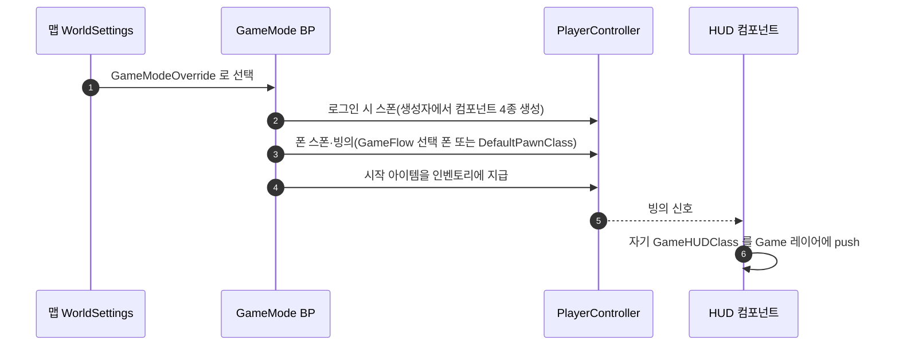

# Experience/ModularGameplay 제거, 전통 GameMode 구성으로 회귀

## 계획

### 목표
Lyra Experience 이식(07-27 축소판 → 07-29 전면 도입)의 확장 축(GameFeature 플러그인 탈부착)이 6주간 한 번도 쓰이지 않은 반면, 주입 경로가 코드 파악을 어렵게 만들고 비동기 로드가 낳은 우회 장치와 리뷰 미해결 항목이 쌓였다. 컴포넌트 부착·맵별 구성·HUD·시작 아이템을 전통 GameMode 방식으로 되돌리고 Experience·GameFeature·ModularGameplay 의존을 코드·설정·에셋에서 전부 걷어낸다.

### 수정 범위
| 파일 | 수정할 내용 | 구분 |
|---|---|---|
| `Source/WxGame/Framework/WxExperience*.h/.cpp`, `WxGameFeatureAction_AddComponents.h/.cpp`, `WxWorldSettings.h/.cpp` | Experience 파이프라인 전부 | 삭제 |
| `Plugins/WxInventory/.../WxGameFeatureAction_AddInventoryItems.h/.cpp` | 시작 아이템 지급 액션 | 삭제 |
| `Source/WxGame/Framework/WxGameMode.h/.cpp` | Experience 확정·지연 스폰 제거, 시작 아이템 프로퍼티와 지급, 폰 클래스는 GameFlow 선택 → DefaultPawnClass | 수정 |
| `Source/WxGame/Framework/WxGameState.h/.cpp` | Experience 매니저·receiver 제거, 퀘스트 컴포넌트 기본 서브오브젝트 | 수정 |
| `Source/WxGame/Controller/WxPlayerController.h/.cpp` | receiver 제거, 인벤토리·스캐너·대화 세션·HUD 기본 서브오브젝트 | 수정 |
| `Source/WxGame/Player/WxPlayerState.h/.cpp`, `Character/WxCharacterBase.h/.cpp` | receiver 등록 제거 | 수정 |
| `Source/WxGame/FrontEnd/WxGameFlowSubsystem.h/.cpp` | 도착 판정에서 Experience 검사 제거, HUD 준비는 PC의 HUD 컴포넌트 기준 | 수정 |
| `Source/WxEditor/WxEditor.h/.cpp/.Build.cs` | PIE 시작 훅 제거, WxGame 의존 제거 | 수정 |
| `Plugins/WxUI/.../WxHUDComponent.h/.cpp`, `WxUIManagerSubsystem.h/.cpp` | HUD 클래스를 컴포넌트 프로퍼티로, UI 매니저 발행 통로 삭제 | 수정 |
| 주입 컴포넌트 5종(인벤토리·스캐너·대화 세션·퀘스트·HUD) | UActorComponent 직상속, ModularGameplay 헬퍼를 오너 캐스트로 | 수정 |
| Build.cs 6곳, uplugin 6곳, `Wx.uproject`, `Config/DefaultEngine.ini`, `Config/DefaultGame.ini` | ModularGameplay·GameFeatures 의존과 스캔 설정 제거, WorldSettings 클래스 순정 복귀 + 리다이렉트 | 수정 |
| `Content/Framework/EXP_*`, `WAS_*` | Experience·액션셋 에셋 | 삭제 |
| `GM_Combat`, `BP_PlayerController`, 신규 `GM_FrontEnd`·`BP_FrontEndPlayerController`, 맵 3개 | 기본 폰·시작 아이템·HUD 클래스·GameModeOverride 지정과 재저장 | 수정·신규(에셋) |
| `.claude/CLAUDE.md`, README 6곳 | GameFeature 규약·Experience 서술 정정 | 수정 |

### 접근 방식
- **부착은 생성자 한 곳으로**: 컨트롤러가 인벤토리·스캐너·대화 세션·HUD 를, GameState 가 퀘스트를 기본 서브오브젝트로 만든다. "왜 붙는가"의 답이 생성자가 되고, 매니저·receiver·액션·에셋을 거치는 간접이 사라진다. 프론트엔드 컨트롤러에도 같은 컴포넌트가 붙지만 인벤토리는 비어 있고 스캐너·대화는 자기 가드로 무동작이라 클래스를 나누지 않는다.
- **맵별 구성은 GameMode BP 두 개**: 프론트엔드용은 스펙테이터 폰과 프론트엔드 HUD 를 가진 컨트롤러 BP 를, 전투용은 플레이어 폰과 시작 아이템을 가진다. 맵은 GameModeOverride 로 고른다. 같은 맵 다른 구성 실험은 엔진 순정 URL 옵션으로 대체된다.
- **HUD 클래스는 띄우는 컴포넌트가 소유**: GameMode 는 서버에만 있어 클라 HUD 를 못 정하므로, 양쪽에 존재하는 HUD 컴포넌트의 프로퍼티로 두고 컨트롤러 BP 에서 지정한다. UI 매니저를 거치던 발행 통로는 지운다.
- **시작 아이템은 GameMode 가 직접 지급**: 시작 플레이어 처리에서 스폰 뒤 컨트롤러의 인벤토리에 넣는다. 아이템 추가는 BeginPlay 에 기대지 않고, 복제 준비 시 기존 엔트리를 back-fill 하며, 뷰모델은 준비 신호 때 기존 엔트리를 읽으므로 월드 BeginPlay 전에 스폰되는 최초 로컬 플레이어에도 안전하다.
- **동기 전제 복원**: 비동기 로드가 없으니 폰 스폰 보류·일괄 재시작·도착 판정의 Experience 검사가 모두 사라진다. 컴포넌트는 부모 클래스만 바꾸고 이름은 유지해 BP 참조를 보존한다.

---

## 완료

### 수정한 파일
| 파일 | 수정한 내용 | 구분 |
|---|---|---|
| `Source/WxGame/Framework/WxExperience*.h/.cpp`, `WxGameFeatureAction_AddComponents.h/.cpp`, `WxWorldSettings.h/.cpp` (6쌍) | Experience 파이프라인 전부 | 삭제 |
| `Plugins/WxInventory/.../WxGameFeatureAction_AddInventoryItems.h/.cpp` | 시작 아이템 지급 액션 | 삭제 |
| `Source/WxGame/Framework/WxGameMode.h/.cpp` | 생성자 기본값(GameState·PlayerState 클래스), `StartingItems` 프로퍼티와 지급, 폰 클래스는 GameFlow 선택 → Super | 수정 |
| `Source/WxGame/Framework/WxGameState.h/.cpp` | 매니저·receiver 제거, 퀘스트 컴포넌트 기본 서브오브젝트 | 수정 |
| `Source/WxGame/Controller/WxPlayerController.h/.cpp` | receiver 제거, 인벤토리·스캐너·대화 세션·HUD 기본 서브오브젝트 | 수정 |
| `Source/WxGame/Player/WxPlayerState.h/.cpp`, `Character/WxCharacterBase.h/.cpp` | receiver 등록과 그것만 있던 오버라이드 제거 | 수정 |
| `Source/WxGame/FrontEnd/WxGameFlowSubsystem.h/.cpp` | 도착 판정에서 Experience 검사 제거, HUD 준비는 PC 의 HUD 컴포넌트 클래스 기준 | 수정 |
| `Source/WxEditor/WxEditor.h/.cpp/.Build.cs` | PIE 시작 훅 제거, WxGame 의존 제거 | 수정 |
| `Plugins/WxUI/.../WxHUDComponent.h/.cpp` | UActorComponent 상속, `GameHUDClass` 프로퍼티(비면 안 띄움)와 getter | 수정 |
| `Plugins/WxUI/.../WxUIManagerSubsystem.h/.cpp` | HUD 클래스 발행·조회 삭제 | 수정 |
| 인벤토리·스캐너·대화 세션·퀘스트 컴포넌트 h/cpp | UActorComponent 상속, GetController/IsLocalController 를 오너 캐스트로, 주석 정정 | 수정 |
| Build.cs 6곳, uplugin 6곳, `Wx.uproject` | ModularGameplay·GameFeatures 의존 제거 | 수정 |
| `Config/DefaultEngine.ini` | WorldSettingsClassName 삭제, WxWorldSettings → Engine.WorldSettings ClassRedirect | 수정 |
| `Config/DefaultGame.ini` | Experience·ActionSet 스캔 삭제(GameFeatureData 스캔은 유지, 아래 참고) | 수정 |
| `Content/Framework/EXP_Combat`, `EXP_FrontEnd`, `WAS_CombatCore`, `WAS_FrontEnd` | Experience·액션셋 에셋 | 삭제 |
| `Content/Framework/GM_FrontEnd`, `BP_FrontEndPlayerController` | 스펙테이터 폰 + WBP_FrontEnd 를 띄우는 프론트엔드 구성 | 신규(에셋) |
| `Content/Framework/GM_Combat`, `BP_PlayerController` | DefaultPawnClass=BP_Player, StartingItems=DA_Potion×1, HUD 컴포넌트=WBP_GameHUD, 재저장 | 수정(에셋) |
| `Content/Maps/LV_FrontEnd`, `LV_DevCombat`, `LV_OpenWorld` | 프론트엔드는 GameModeOverride=GM_FrontEnd, 셋 다 WorldSettings 순정 클래스로 재저장 | 수정(에셋) |
| `.claude/CLAUDE.md`, `Source/WxGame/README.md`, 플러그인 README 5곳, MVVM 헤더 주석 2곳 | GameFeature 규약 삭제, Experience 서술을 생성자 소유·GameMode 프로퍼티로 정정 | 수정 |

### 구현·결정과 그 이유
- **부착은 생성자 한 곳**: 컨트롤러가 4종, GameState 가 퀘스트를 기본 서브오브젝트로 든다. 프론트엔드 컨트롤러에도 같은 것이 붙지만 인벤토리는 비어 있고 스캐너·대화는 자기 가드로 무동작이라 클래스를 나누지 않았다. 컴포넌트 이름은 유지해 BP 참조가 보존됐다.
- **HUD 클래스는 HUD 컴포넌트 프로퍼티**: GameMode 는 서버에만 있어 클라 HUD 를 못 정하므로 양쪽에 존재하는 컴포넌트가 든다. 그래서 프론트엔드용 컨트롤러 BP 가 하나 더 생겼고, UI 매니저의 발행 통로는 지웠다. 비어 있으면 띄우지 않는다.
- **시작 아이템은 GameMode 가 직접 지급**: 시작 플레이어 처리에서 스폰 뒤 지급한다. 최초 로컬 플레이어는 월드 BeginPlay 전에 스폰되지만 아이템 추가가 BeginPlay 에 기대지 않고 복제 준비 시 back-fill 되므로 안전하며, PIE 에서 퀵슬롯 포션으로 확인했다.
- **WorldSettings 는 순정 복귀, 리다이렉트는 임시**: 맵 3개는 에디터에서 ClassRedirect 로 로드해 재저장했고, 이름표에 `/Script/WxGame` 임포트가 남아 있던 LevelDesign 맵 5개(LevelInstance 4 + NewMap)는 사용자 에디터를 건드리지 않도록 별도 ResavePackages 커맨드릿으로 재저장했다. 전 맵의 임포트에서 WxGame 이 사라진 것을 확인한 뒤 리다이렉트 줄을 지웠다. 맵 파일에 남은 "WxWorldSettings" 문자열은 액터 이름일 뿐이다.
- **GameFeatureData 스캔 한 줄은 되살렸다**: 엔진의 GameFeaturesToolset(AllToolsets)이 GameFeatures 플러그인을 끌어와, 스캔 규칙이 없으면 에디터 시작마다 Error 를 찍는다. 우리 쪽 의존은 전부 제거됐고 이 줄은 엔진 플러그인 요구다.
- **검증**: WxEditor 빌드 성공(경고 0). 소스·설정에서 Experience·GameFeature·ModularGameplay 참조 0건. PIE 로 LV_FrontEnd(GM_FrontEnd·스펙테이터 폰·WBP_FrontEnd·Menu 입력) → New Game → LV_DevCombat(GM_Combat·BP_Player 빙의·WBP_GameHUD·포션 지급·Game 입력·도착 후 점프 입력 동작), LV_OpenWorld 직접 PIE(GM_Combat·BP_Player·HUD)를 MCP Slate 클릭으로 끝까지 돌렸다. 자동화 테스트 Wx.* 16건 전부 통과. 남은 로그 경고(보스 네임플레이트 VM, AcquiredItemList 스크립트 메시지)는 이전 로그 7개에도 있는 기존 항목이다.

### 계획 대비 달라진 점
- GameFeatureData 스캔 줄은 삭제하지 않고 유지했다(엔진 툴셋 플러그인 요구).
- 에셋 작업은 사용자 체크리스트 대신 MCP 로 직접 수행했다(이 세션 시작 시 MCP 연결 실패였으나 에디터 재실행 뒤 직결로 연결됨).
- 커맨드릿의 `-PackageFolder=/Game/LevelDesign -MapsOnly` 가 맵만 고르지 않고 865개 전부를 재저장해, 맵 5개를 제외한 나머지는 git checkout 으로 되돌렸다. `-PACKAGE=A+B` 다중 지정도 동작하지 않는다.
- 사용자가 ini 의 WxViewModel_Item 관련 옛 리다이렉트 3줄도 함께 제거했다(이번 작업 범위 밖, 에셋 검증은 하지 않음).

### 후속 과제
- `Docs/Programmer/FrontEnd_게임진입_흐름분석.md`(미추적 문서)와 `module_review_WxGame*.md` 는 Experience 기준 서술이라 갱신 대상이다.
- 시작 한 프레임 카메라 튐(지연 스폰 탓으로 기록)이 사라졌는지 육안 재확인.
- 스캐너·대화 세션·인벤토리 컴포넌트는 기본 서브오브젝트라 안정된 이름을 가지므로, 복제 활성 이유 주석을 RPC 라우팅으로 정정했을 뿐 복제 설정은 유지했다. 데디 구성에서 원격 사본 동작은 재검증하지 않았다.
