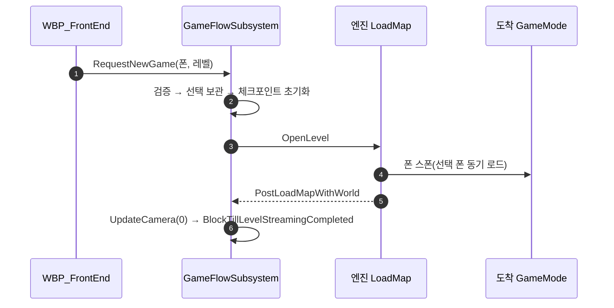

# GameFlow 축소 — 상태 기계·틱·도착 동결 제거

## 계획

### 목표
`UWxGameFlowSubsystem` 이 지고 있던 12가지 일 가운데 지킬 대상이 없어졌거나 더 싼 수단이 이미 프로젝트에 있는 일곱을 걷어낸다. 남기는 일은 요청 검증 → 맵 전환 → 도착 시 지형 확보 → 선택 폰 제공 넷뿐이며, 상태 기계·상주 CoreTicker·입력 동결이 전부 사라진다.

### 수정 범위
| 파일 | 수정할 내용 | 구분 |
|---|---|---|
| `Source/WxGame/FrontEnd/WxGameFlowSubsystem.h/.cpp` | `EWxTravelState`·`FWxRunState`·`HandleTick`·`HandleAssetsLoaded`·`ValidateArrival`·`Fail`·`BeginRecovery`·`Hold/ReleaseArrivalPawn`·`ClearPending`·`CancelPreparation`·`GetTravelState`·`GetRunState` 삭제하고 4함수·3멤버 형태로 재작성 | 수정 |
| `Source/WxGame/Framework/WxGameMode.h/.cpp` | `HandleStartingNewPlayer` 오버라이드 통째 삭제, 남은 include 정리 | 수정 |
| `Plugins/WxUI/.../Component/WxPlayerLayoutComponent.h/.cpp` | 외부 호출자가 사라지는 `GetLayoutClass()` 삭제 | 수정 |
| `Source/WxGame/README.md` | GameFlow 한 줄 설명 정정 | 수정 |

### 접근 방식
- **낙하 방지는 블로킹 스트리밍 한 줄로**: 매 프레임 PC·폰·HUD·월드파티션을 확인하고 입력·무브먼트 틱을 껐다 켜던 도착 대기를, 부활 경로가 이미 쓰는 `World->BlockTillLevelStreamingCompleted()` 로 바꾼다. 이 함수는 월드 서브시스템의 스트리밍 상태 갱신을 거쳐 월드파티션 셀까지 올린 뒤 블로킹한다. 엔진 `LoadMap` 은 플레이 액터 스폰 → 월드 BeginPlay → `PostLoadMapWithWorld` 순서라 도착 통지 시점에 폰이 이미 있고 아직 한 틱도 돌지 않았으므로, 그 자리에서 한 번 막으면 동결·폴링·타임아웃이 모두 필요 없다.
- **복구 경로 제거**: 실패 복구는 Experience 로드 실패를 겨냥해 만들고 검증했는데 그 파이프라인이 09-07 에 사라졌다. 전환 실패는 출발 맵에 그대로 서 있는 상태라 문구만 보이면 되고, 지금 코드는 도리어 출발 맵을 한 번 더 통째로 로드한다.
- **프리로드 대신 쓰는 시점 동기 로드**: 폰 클래스 비동기 프리로드(준비 상태·요청 GUID·스트리머블 핸들)를 없애고 `GetSelectedPawnClass` 에서 `LoadSynchronous()` 한다. 그 시점은 맵 로드 중이라 로딩 화면 뒤다.
- **이동 중 여부는 파생**: 플래그를 두지 않고 "목적지를 골라 뒀는데 아직 그 월드가 아니다" 로 판단한다. 목적지 아닌 맵이 열리면 선택을 버리므로 상태가 어긋날 자리가 없다.
- **잃는 것**: HUD 준비 대기(맵을 직접 여는 경로엔 원래 없던 보호), 120초 타임아웃(기다리는 단계 자체가 없어짐), 도착 폰 일치 검사, 출발 전 폰 클래스 검증. 전부 개발 중 설정 오류로 드러나는 종류다.

---

## 완료

### 수정한 파일
| 파일 | 수정한 내용 | 구분 |
|---|---|---|
| `Source/WxGame/FrontEnd/WxGameFlowSubsystem.h/.cpp` | 상태 enum·실행 상태 구조체·틱·비동기 로드·도착 검증·실패 복구·입력 동결을 걷어내고 공개 함수 4개, 멤버 3개로 재작성. 432줄 → 166줄 | 수정 |
| `Source/WxGame/Framework/WxGameMode.h/.cpp` | 시작 플레이어 처리 오버라이드와 그 안의 GameFlow 호출 2건 삭제, 남은 include 정리 | 수정 |
| `Plugins/WxUI/.../Component/WxPlayerLayoutComponent.h/.cpp` | 호출자가 사라진 레이아웃 클래스 게터 삭제 | 수정 |
| `Source/WxGame/README.md` | GameFlow 한 줄 설명 정정 | 수정 |

### 구현·결정과 그 이유
- **낙하 방지를 블로킹 스트리밍 한 줄로 바꿨다**: 매 프레임 PC·폰·HUD·월드파티션을 확인하고 입력과 무브먼트 틱을 껐다 켜던 도착 대기를, 맵 로드 통지 시점의 블로킹 스트리밍 한 번으로 대체했다. 엔진은 플레이 액터를 스폰한 뒤 월드 BeginPlay 를 거쳐 이 통지를 보내므로 폰은 있으나 아직 한 틱도 돌지 않았고, 그 자리에서 지형을 올리면 떨어질 틈이 없다. 스트리밍 소스 위치가 폰 시점으로 잡히도록 카메라를 먼저 한 번 갱신하는데, 이는 부활 경로가 같은 이유로 쓰는 순서 그대로다.
- **복구 경로를 지웠다**: 이 경로는 Experience 로드 실패를 겨냥해 만들고 검증했는데 그 파이프라인이 오늘 사라졌다. 전환 실패는 출발 맵에 그대로 서 있는 상태라 선택만 버리면 메뉴가 문구를 띄우고 버튼을 다시 연다. 기존 코드는 이 경우에도 출발 맵을 한 번 더 통째로 로드하고 있었다.
- **이동 중 여부를 파생으로 바꿨다**: 플래그 대신 "목적지를 골라 뒀는데 아직 그 월드가 아니다" 로 판단한다. 목적지 아닌 맵이 열리거나 전환이 실패하면 선택을 버리므로 상태가 어긋나 남을 자리가 없고, 상태 변수와 실제 월드가 따로 노는 경로 자체가 사라진다.
- **폰 클래스는 쓰는 시점에 동기 로드한다**: 준비 상태·요청 GUID·스트리머블 핸들이 하던 일은 출발 전 검증뿐이었다. 이제 GameMode 가 물어볼 때 로드하며, 그 시점은 맵 로드 중이라 로딩 화면 뒤다. 로드에 실패하면 맵 기본 폰으로 스폰돼 흐름이 끊기지 않는다.
- **GameFlow 가 남의 내부를 걷던 코드가 전부 없어졌다**: HUD 준비를 알아내려 UI 매니저·레이아웃·위젯 스택을 따라가던 4단 역참조와 월드파티션·에셋 매니저 의존이 사라져, 이 파일이 아는 외부 타입은 체크포인트 하나뿐이다.
- **검증**: WxEditor(Development) 빌드 성공(`Result: Succeeded`, 경고 0). 플레이 확인은 사용자가 직접 하기로 해 PIE 를 `LV_FrontEnd` 에서 띄운 상태로 넘겼다.

### 계획 대비 달라진 점
- 계획대로다. 다만 PIE 진입 확인과 자동화 테스트는 이 세션에서 돌리지 않고 사용자에게 넘겼다.

### 후속 과제
- **확인 필요**: `LV_OpenWorld` 도착 시 낙하 없음(이번 변경의 유일한 동작 위험 지점), HUD 표시, 도착 직후 조작. 낙하가 보이면 도착 동결만 되살리고 나머지 축소는 유지한다.
- 자동화 테스트 `Wx.*` 미실행.
- `Docs/Programmer/FrontEnd_게임진입_흐름분석.md` 는 이미 Experience 기준 서술이고 이번 변경으로 6~9절이 통째로 어긋난다.
