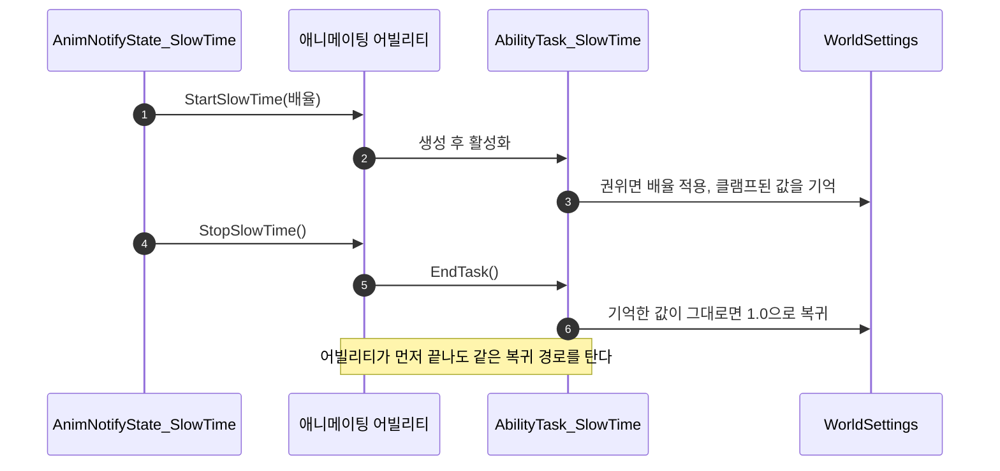

# 슬로우타임 구간을 AnimNotifyState로 옮긴다

## 계획

### 목표
퍼펙트 회피·퍼펙트 가드의 슬로우 모션 구간을 어빌리티 C++ 프로퍼티에서 몽타주 타임라인으로 옮긴다. "몽타주 어느 지점에서 얼마나 느려지는가"는 애니메이터가 타임라인을 보며 잡는 값인데, 지금은 두 어빌리티 클래스의 프로퍼티 4개에 흩어져 있다. 다만 전역 딜레이션을 되돌리는 책임은 어빌리티 수명에 묶인 채로 남겨, 노티파이 종료가 오지 않는 경로에서도 딜레이션이 새지 않게 한다.

### 수정 범위
| 파일 | 수정할 내용 | 구분 |
|---|---|---|
| `Plugins/WxCombat/.../AnimNotify/WxAnimNotifyState_SlowTime.{h,cpp}` | 구간 시작·끝을 애니메이팅 어빌리티에 알린다. 배율 프로퍼티 소유 | 신규 |
| `Plugins/WxCombat/.../AbilitySystem/Task/WxAbilityTask_SlowTime.{h,cpp}` | 자체 타이머·완료 델리게이트 제거. 걸기/걷기만 남긴다 | 수정 |
| `Plugins/WxCombat/.../AbilitySystem/Ability/WxAbilityBase.{h,cpp}` | 슬로우 시작·종료 진입점과 태스크 멤버 | 수정 |
| `Plugins/WxCombat/.../AbilitySystem/Ability/WxAbility_Dodge.{h,cpp}` | 퍼펙트 회피 슬로우 프로퍼티 2개와 태스크 생성 제거 | 수정 |
| `Plugins/WxCombat/.../AbilitySystem/Ability/WxAbility_GuardReact.{h,cpp}` | 퍼펙트 가드 슬로우 프로퍼티 2개와 태스크 생성 제거 | 수정 |
| `Content/AbilitySystem/Ability/AM_DodgeSuccess`, `AM_Parry` | 노티파이 구간 배치 | 에셋 |

### 접근 방식
- **세 층으로 역할을 가른다**: 노티파이는 구간의 시작과 끝만 알고, 태스크가 딜레이션 값의 주인이며, 어빌리티 수명이 안전망이 된다. 전역 값 하나에 주인이 둘이 되지 않도록 되돌리는 코드는 태스크 종료 한 곳에만 둔다 — 노티파이는 태스크를 끝낼 뿐 딜레이션을 직접 만지지 않는다.
- **노티파이는 콤보 창 노티파이와 같은 꼴**: 애니메이팅 어빌리티를 캐스팅해 공개 함수를 부른다. 노티파이는 태스크 타입을 모르고 어빌리티만 안다. 몽타주가 끊겨 다른 어빌리티가 재생 중이면 그쪽에는 태스크가 없어 종료 호출이 no-op이 된다.
- **프리뷰 누수가 성립하지 않는다**: Persona 프리뷰 월드에는 애니메이팅 어빌리티가 없어 노티파이가 아무 것도 하지 않는다. 노티파이가 딜레이션을 직접 걸었다면 프리뷰 재생·타임라인 스크럽이 그대로 새는 경로가 됐을 것이고, 태스크를 남기는 이유가 여기에 있다.
- **태스크는 시간을 재지 않는다**: 길이를 노티파이 구간이 정하므로 틱과 지속시간, 아무도 바인딩하지 않던 완료 델리게이트가 함께 빠진다. 권위일 때만 걸고 자기가 건 값이 그대로일 때만 되돌리는 기존 관용구는 그대로 둔다 — 다른 요청자의 연출을 끊지 않기 위한 것이다.
- **권위 검사는 태스크에 남긴다**: 노티파이와 어빌리티는 권위를 모른다. 클라이언트에서는 태스크가 만들어지되 아무 일도 하지 않고, 배율은 엔진의 월드 세팅 복제로 도착한다.

---

## 완료

### 수정한 파일
| 파일 | 수정한 내용 | 구분 |
|---|---|---|
| `Plugins/WxCombat/.../AnimNotify/WxAnimNotifyState_SlowTime.{h,cpp}` | 구간 시작에서 배율과 길이를 태스크에 넘긴다. 배율 프로퍼티 소유, 끝 처리 없음 | 신규 |
| `Plugins/WxCombat/.../AbilitySystem/Task/WxAbilityTask_SlowTime.{h,cpp}` | 시계를 실시간에서 게임 시계로 교체. 아무도 바인딩하지 않던 완료 델리게이트 제거 | 수정 |
| `Plugins/WxCombat/.../AbilitySystem/Ability/WxAbility_Dodge.{h,cpp}` | 퍼펙트 회피 슬로우 프로퍼티 2개와 태스크 생성 제거 | 수정 |
| `Plugins/WxCombat/.../AbilitySystem/Ability/WxAbility_GuardReact.{h,cpp}` | 퍼펙트 가드 슬로우 프로퍼티 2개와 분기 제거 | 수정 |

### 구현·결정과 그 이유
- **노티파이가 길이를 넘기니 끝 신호가 필요 없어졌다**: 구간의 길이를 태스크가 알고 있으면 스스로 접으므로 노티파이가 끝을 알릴 이유가 없고, 그래서 노티파이가 인스턴스를 기억할 필요도 없다. 노티파이는 애니메이션 에셋에 하나뿐인 공유 객체라 어차피 상태를 들 수 없으니, 들 상태가 아예 없는 쪽이 맞다. 어빌리티 클래스에는 한 줄도 늘지 않았다.
- **시계를 게임 시계로 바꿨다**: 딜레이션이 걸린 동안 실시간과 게임 시간이 갈리므로, 실시간으로 재면 배율이 낮을수록 애니메이션 구간보다 훨씬 일찍 끝난다. 애니메이션이 흐르는 시계로 재야 구간과 함께 끝난다.
- **노티파이 길이를 재생 속도로 나눈다**: 노티파이가 받는 길이는 애니메이션 자체의 초라, 공격 속도로 배속된 재생에서는 그 구간이 실제로 더 짧게 지나간다. 몽타주에 실제로 걸린 재생 속도를 애님 인스턴스에서 읽어 나눈다.
- **안전망은 그대로 어빌리티 수명**: 배율을 되돌리는 코드가 태스크 종료 한 곳뿐이라, 구간이 끝나기 전에 어빌리티가 끊겨도 같은 경로로 걷힌다. 애니메이팅 어빌리티가 없는 Persona 프리뷰에서는 태스크가 생기지 않아 프리뷰 재생·타임라인 스크럽이 에디터 시간을 건드리지 않는다 — 노티파이가 배율을 직접 만졌다면 그쪽이 새는 경로가 됐을 것이다.
- **권위 검사는 태스크에 남겼다**: 노티파이는 권위를 모른 채 모든 머신에서 돌고, 클라이언트에서는 태스크가 만들어지되 아무 일도 하지 않는다. 배율은 엔진의 월드 세팅 복제로 도착한다.

### 계획 대비 달라진 점
- **어빌리티 베이스에 진입점을 두지 않았다**: 계획은 베이스가 태스크를 들고 노티파이가 여닫는 구조였다. 니치한 연출 하나 때문에 모든 어빌리티가 멤버와 함수 둘을 지게 되는 것이 과해, 길이를 넘겨 태스크가 스스로 접는 쪽으로 바꿨다. 결과적으로 계획보다 파일 하나(어빌리티 베이스)와 상태 하나가 줄었다.

### 후속 과제
- `AM_DodgeSuccess`·`AM_Parry`에 노티파이 구간 배치 — 이번 세션에서는 에디터가 떠 있지 않아 MCP로 넣지 못했다. 기존 수치가 배율 0.4·0.4초였으므로 배율은 기본값 0.4를 그대로 쓰고 길이는 타임라인에서 잡으면 된다. `AM_DodgeSuccess`는 방향 섹션이 나뉘어 있어 섹션마다 하나씩 필요하다.
- 배치 전이라 PIE 검증은 하지 못했다. 빌드만 통과한 상태다.
