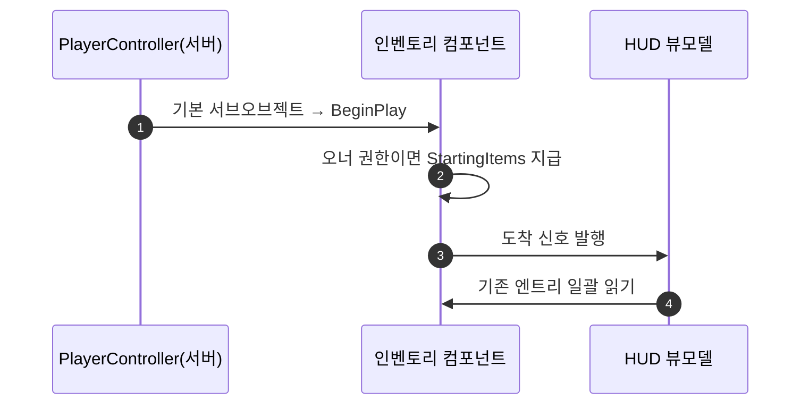

# 시작 아이템을 GameMode 에서 인벤토리 컴포넌트로 이관

## 계획

### 목표
GameMode 역할을 최소화한다. `AWxGameMode` 가 들고 접속 처리에서 지급하던 `StartingItems` 를 인벤토리 컴포넌트로 옮겨, 인벤토리의 시작 상태를 인벤토리 자신이 소유하게 한다. GameMode 에서 인벤토리 지식(프로퍼티·지급 코드·include)이 전부 사라진다.

### 수정 범위
| 파일 | 수정할 내용 | 구분 |
|---|---|---|
| `Plugins/WxInventory/.../Public/Inventory/WxInventoryComponent.h` | `StartingItems`(EditDefaultsOnly, private) 추가, 클래스 주석의 "GameMode 가 지급하며 본 클래스는 목록을 갖지 않는다" 정정 | 수정 |
| `Plugins/WxInventory/.../Private/Inventory/WxInventoryComponent.cpp` | `BeginPlay` 에서 오너 권한이면 `GrantItems(StartingItems)`, 그 뒤 도착 신호 발행 | 수정 |
| `Source/WxGame/Framework/WxGameMode.h` | `StartingItems` 와 보상 엔트리 include 제거, 클래스 주석에서 시작 아이템 줄 삭제 | 수정 |
| `Source/WxGame/Framework/WxGameMode.cpp` | 시작 플레이어 처리의 지급 블록과 인벤토리 include 제거 | 수정 |
| `Content/Framework/BP_PlayerController.uasset` | 상속된 인벤토리 컴포넌트의 `StartingItems = [DA_Potion ×1]` | 수정(에디터) |
| `Content/Framework/GM_Combat.uasset` | 사라진 네이티브 프로퍼티 잔재를 털기 위해 재저장 | 수정(에디터) |
| `Plugins/WxInventory/README.md`, `Source/WxGame/README.md` | 시작 아이템 주체 서술 정정 | 수정 |

### 접근 방식
- **인벤토리 자체 지급**: BeginPlay 에서 오너가 권한이면 목록을 지급하고 그 뒤에 도착 신호를 발행한다. 뒤에 두면 뷰모델이 도착 신호로 한 번, 슬롯 변경으로 또 한 번 읽어 초기화 경로가 둘이 된다. 클라의 복제 사본은 권한 게이트로 건너뛰고 FastArray 로 수렴하며, 복제 등록 전 지급은 `ReadyForReplication` 의 back-fill 이 받는다.
- **값은 컨트롤러 BP 에서 저작**: 09-05 에 같은 설계를 넣었다가 되돌린 유일한 이유가 "주입되는 컴포넌트에 값을 저작하려면 컴포넌트 BP 서브클래스가 하나 더 필요"였는데, 09-07 에 인벤토리가 컨트롤러 생성자의 기본 서브오브젝트가 되면서 그 제약이 사라졌다. HUD 컴포넌트의 HUD 클래스를 컨트롤러 BP 에서 지정하는 것과 같은 패턴이라 새 에셋이 필요 없다.
- **구성 축 이동**: 시작 아이템 구성이 GameMode BP → PlayerController BP 로 옮겨간다. 전투·프론트엔드가 GameMode·컨트롤러 BP 1:1 이라 표현력 손실은 없다.
- **버린 대안**: 컨트롤러 프로퍼티(컨트롤러가 인벤토리 지식을 갖게 되고 7월에 걷어낸 구조), DeveloperSettings/ini(에셋 주소 전역화 거부 이력), 초기 퀘스트 StateTree 보상(퀘스트에 종속).

---

## 완료

### 수정한 파일
| 파일 | 수정한 내용 | 구분 |
|---|---|---|
| `Plugins/WxInventory/.../Public/Inventory/WxInventoryComponent.h` | `StartingItems`(EditDefaultsOnly, private) 추가, 클래스 주석을 자체 지급으로 정정 | 수정 |
| `Plugins/WxInventory/.../Private/Inventory/WxInventoryComponent.cpp` | `BeginPlay` 에서 오너 권한이면 지급하고 그 뒤 도착 신호 발행 | 수정 |
| `Source/WxGame/Framework/WxGameMode.h` | `StartingItems` 와 보상 엔트리 include 제거, 주석 한 줄 삭제 | 수정 |
| `Source/WxGame/Framework/WxGameMode.cpp` | 지급 블록과 인벤토리 include 제거 | 수정 |
| `Plugins/WxInventory/README.md`, `Source/WxGame/README.md` | 시작 아이템 주체를 컨트롤러 BP 의 인벤토리 컴포넌트로 정정 | 수정 |
| `Content/Framework/BP_PlayerController.uasset`, `GM_Combat.uasset` | 값 저작·재저장 | 미완(아래 후속 과제) |

### 구현·결정과 그 이유
- **지급을 도착 신호 앞에**: 뒤에 두면 뷰모델이 도착 신호로 한 번, 슬롯 변경으로 또 한 번 읽어 초기화 경로가 둘로 갈린다. 09-05 에 같은 판단을 했고 그대로 유지했다.
- **오너 권한만 게이트**: 추가 경로가 이미 권한을 단언하므로 클라 사본은 게이트가 없으면 그 자리에서 터진다. 클라는 FastArray 복제로 수렴하고, 복제 등록 전 지급은 복제 준비의 back-fill 이 받는다.
- **GameMode 는 이제 인벤토리를 모른다**: 프로퍼티·지급 코드에 더해 include 까지 사라져, 남은 책임이 폰 클래스 선택과 도착 검증뿐이 됐다.
- **값 저작은 컨트롤러 BP**: HUD 컴포넌트가 띄울 HUD 클래스를 컨트롤러 BP 에서 받는 것과 같은 자리다. 09-05 에 이 설계를 접었던 이유(컴포넌트 BP 서브클래스가 하나 더 필요)는 컴포넌트가 기본 서브오브젝트가 되면서 사라졌다.

### 계획 대비 달라진 점
- **에셋 작업을 하지 못했다**: 실행 중인 에디터가 DebugGame 바이너리(21:42 빌드)라 새 프로퍼티를 모르고, 그 에디터는 병행 세션이 쓰고 있어 재시작할 수 없었다.
- **전체 타깃 빌드는 실패 상태다**: 같은 트리에서 병행 세션 둘이 각각 SlowTime 의 노티파이 이관과 HUD 컴포넌트 개명을 진행 중이라, `WxAbility_Dodge`·`WxAbility_GuardReact` 가 아직 옛 3인자 시그니처로 `CreateTask` 를 부른다. 내가 건드린 두 모듈은 같은 빌드에서 오류 없이 컴파일되고 `UnrealEditor-WxInventory.dll`·`UnrealEditor-WxGame.lib` 까지 링크됐다.

### 후속 과제
- **에셋 저작**: 병행 작업이 끝난 뒤 에디터를 새 바이너리로 재시작하고 `BP_PlayerController` 의 인벤토리 컴포넌트에 `StartingItems = [DA_Potion ×1]` 을 넣는다. 그 전까지는 시작 포션이 지급되지 않는다.
- **`GM_Combat` 재저장**: 사라진 네이티브 프로퍼티 잔재가 로드 경고로 남는다.
- **PIE 확인**: 전투 맵에서 포션 한 번만 지급되는지, 프론트엔드 컨트롤러는 비어 있는지.
