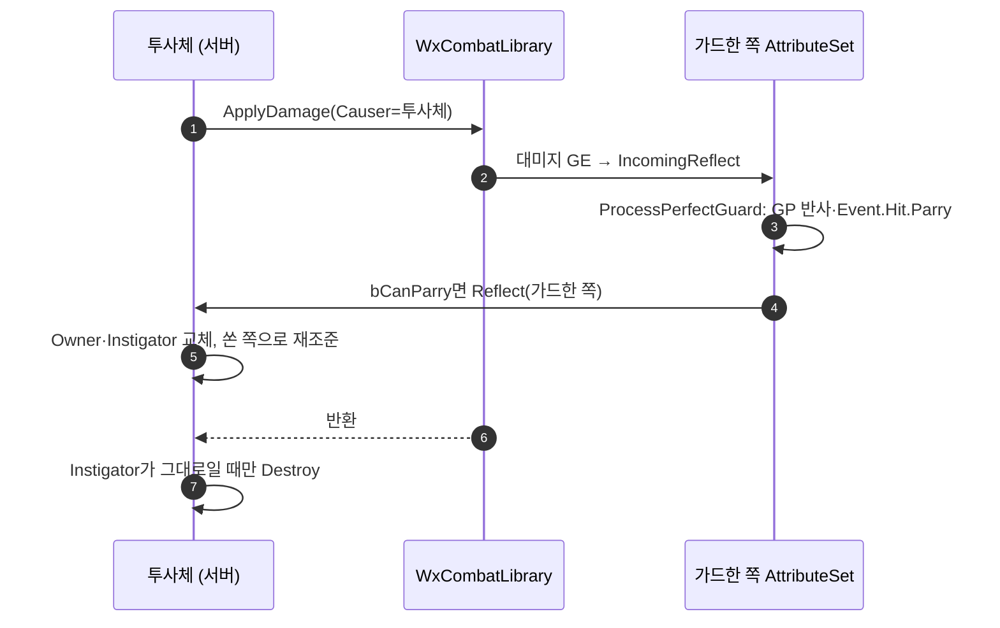

# 패리한 투사체를 쏜 쪽으로 되돌린다

## 계획

### 목표
투사체를 퍼펙트 가드로 패리하면 그 투사체가 쏜 쪽으로 되돌아가 꽂히게 한다. 지금은 대미지만 반사(GP)되고 투사체는 그 자리에서 파괴된다. 되돌아간 투사체는 팀도 대미지 출처도 패리한 쪽으로 넘어간다. 단 대미지 표에서 `bCanParry = false`인 공격은 패리가 성립하지 않으므로 되돌아가지 않고 지금처럼 막히고 사라진다.

### 수정 범위
| 파일 | 수정할 내용 | 구분 |
|---|---|---|
| `Plugins/WxCombat/.../Weapon/WxProjectileBase.{h,cpp}` | `Reflect(APawn*)` 추가, 되돌아선 투사체는 파괴 생략, `OnRep_Instigator` 재정의 | 수정 |
| `Plugins/WxCombat/.../AbilitySystem/Attribute/WxCombatAttributeSet.cpp` | `ProcessPerfectGuard`의 패리 성립 분기에서 원인 액터가 투사체면 되돌림 지시 | 수정 |

### 접근 방식
- **판정은 이미 서 있는 자리에서 쓴다**: 패리 성립 여부는 `ProcessPerfectGuard` 한 곳에서만 결정된다 — 공격자 GP 반사와 `Event.Hit.Parry` 역경직이 나가는 그 자리다. 투사체가 퍼펙트 가드 태그와 표의 플래그를 다시 읽어 같은 결론을 따로 내면 판정처가 셋으로 늘어난다. 대신 그 자리에서 컨텍스트의 원인 액터(투사체)에게 되돌림을 시킨다. `bCanParry` 게이트 안에 들어가므로 패리 불가 대미지는 자동으로 제외된다.
- **되돌림 = Owner·Instigator 교체**: Instigator를 패리한 쪽으로 바꾸면 팀이 함께 뒤집히고, Owner도 옮겨야 되돌아간 투사체가 패리한 쪽의 ATK로 대미지를 낸다. 덤으로 "자기 Owner·Instigator는 때리지 않는다"는 기존 검사가 방금 패리한 캐릭터를 그대로 걸러 준다.
- **방향은 교체 직전의 Instigator**: 쏜 쪽의 현재 위치를 바라보게 회전을 세우고 `InitialSpeed`로 속도를 다시 준다 — `BeginPlay`의 락온 조준과 같은 방식이다. 유도 투사체면 유도 대상도 그쪽으로 바꾸고, 되돌아갈 시간을 벌도록 수명을 다시 채운다.
- **파괴 생략은 교체 여부에서 파생한다**: 대미지 GE는 즉시형이라 되돌림이 `ApplyDamage` 호출 안에서 동기적으로 끝난다. 오버랩 처리기는 호출 전후의 Instigator가 달라졌으면 되돌아선 것으로 보고 `Destroy()`를 건너뛴다. 분기용 멤버 플래그를 새로 두지 않는다.
- **클라이언트는 Instigator 복제를 신호로 쓴다**: 되돌림은 서버 권위이고 Instigator는 복제 프로퍼티라 클라에 `OnRep_Instigator`로 도착한다. 클라는 그 신호에 맞춰 로컬 예측 속도를 복제된 회전 방향으로 다시 세운다. 새 유도 대상은 클라가 알 수 없으므로 비우고 복제 위치에 맡긴다.

---

## 완료

### 수정한 파일
| 파일 | 수정한 내용 | 구분 |
|---|---|---|
| `Plugins/WxCombat/.../Weapon/WxProjectileBase.h` | `Reflect(APawn*)`·`OnRep_Instigator` 선언, 클래스 주석에 되돌림 한 줄 | 수정 |
| `Plugins/WxCombat/.../Weapon/WxProjectileBase.cpp` | 되돌림 구현, 오버랩 처리기에서 패리 판정 후 되돌림·파괴 분기, 클라 속도 재조준 | 수정 |

### 구현·결정과 그 이유
- **판정을 투사체가 직접 낸다**: 처음에는 패리 성립을 이미 아는 `ProcessPerfectGuard`가 원인 액터에게 되돌림을 시키게 했는데, 그러면 어트리뷰트 층이 투사체 액터 타입을 알게 된다. 투사체는 대미지 표 행과 대상 ASC를 이미 손에 쥐고 있어 같은 조건을 스스로 읽을 수 있으므로, 층을 건너지 않고 "때린다 → 되돌아서거나 파괴한다"가 오버랩 처리기 한 곳에서 순서대로 읽히게 했다.
- **판정은 대미지보다 먼저 읽는다**: 되돌림이 Owner·Instigator를 갈아 끼우므로, 대미지를 건 뒤에 읽으면 이미 바뀐 출처를 보게 된다. 흘려낸 히트(무적)는 대미지 GE 자체가 걸리지 않아 패리도 서지 않으므로 같은 조건에 묶었다.
- **되돌림 = Owner·Instigator 교체**: 팀은 `GetGenericTeamId()`가 Instigator에서, 대미지 출처는 ASC 없는 원인 액터의 Owner에서 파생한다. 둘을 함께 옮겨야 되돌아간 히트가 패리한 쪽의 공격력으로 나가고, "자기 Owner·Instigator는 때리지 않는다"는 기존 검사가 방금 패리한 캐릭터를 그대로 걸러 준다.
- **방향·속도는 락온 조준과 같은 방식**: 교체 직전의 Instigator를 바라보게 회전을 세우고 `InitialSpeed`로 속도를 다시 준다. 남은 수명으로는 돌아가는 도중 사라질 수 있어 수명도 다시 채운다.
- **클라는 Instigator 복제를 신호로 쓴다**: 되돌림은 서버 권위인데 투사체의 로컬 이동 예측은 각 머신이 굴리므로, 클라가 옛 방향으로 날다 복제 위치에 끌려가며 튄다. `OnRep_Instigator`에서 복제된 회전으로 속도를 다시 세워 그 어긋남을 없앴다. 새 유도 대상은 클라가 알 수 없어 비운다.

### 계획 대비 달라진 점
- 패리 성립 판정을 `UWxCombatAttributeSet::ProcessPerfectGuard`가 투사체에게 지시하는 형태로 계획했으나, 어트리뷰트 층이 투사체를 아는 배치라 투사체가 직접 판정하도록 바꿨다. `WxCombatAttributeSet`은 손대지 않았다.

### 검증
- WxEditor(Development) 빌드 성공(`Result: Succeeded`, `.claude/skills/build-doctor/logs/build_2026-09-07_224620.log`).
- PIE 미실시.

### 후속 과제
- PIE 확인: 적 투사체를 퍼펙트 가드로 막아 쏜 쪽으로 돌아가 명중하는지, 그 대미지가 패리한 쪽 ATK 기준인지. 표에서 `bCanParry`를 끈 행이면 되돌아가지 않고 사라지는지.
- `ProcessPerfectGuard`·`ProcessDamageTaken`처럼 구체적인 전투 절차가 `UWxCombatAttributeSet`에 있는 배치 자체를 재검토한다(별도 작업).
