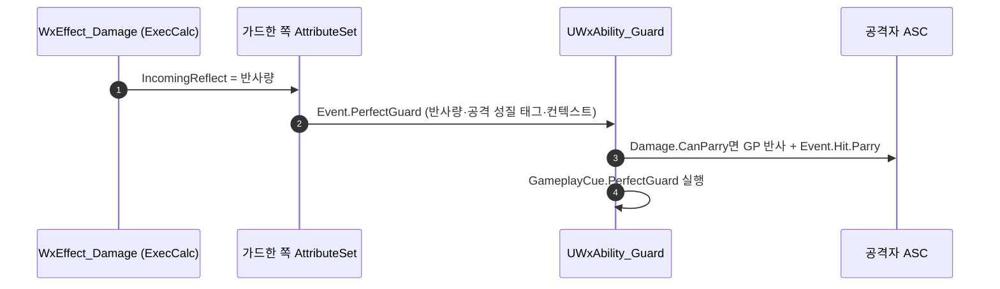

# 퍼펙트 가드 절차를 가드 어빌리티로 옮긴다

## 계획

### 목표
`UWxCombatAttributeSet::ProcessPerfectGuard`가 어트리뷰트 소비를 넘어 게임플레이 절차까지 들고 있다 — 공격자 GP 반사, 공격자 역경직 이벤트, 큐 실행. 어트리뷰트 셋이 있을 자리가 아니므로, 발행은 남기고 절차는 `UWxAbility_Guard`로 옮긴다. 회피가 `Event.DodgeSuccess`를 `WaitGameplayEvent`로 듣는 것(`WxAbility_Dodge::ListenForDodgeSuccess`)과 같은 모양이다.

### 수정 범위
| 파일 | 수정할 내용 | 구분 |
|---|---|---|
| `Plugins/WxCombat/.../Attribute/WxCombatAttributeSet.{h,cpp}` | `ProcessPerfectGuard`를 `Event.PerfectGuard` 발행 한 건으로 축소 | 수정 |
| `Plugins/WxCombat/.../Ability/WxAbility_Guard.{h,cpp}` | 그 이벤트를 구독해 GP 반사·역경직 이벤트·큐를 수행 | 수정 |

### 접근 방식
- **AttributeSet은 사실만 싣는다**: 반사량은 `EventMagnitude`, 공격의 성질(`Damage.CanParry` 등 스펙 동적 애셋 태그)은 `InstigatorTags`, 원인은 지금처럼 `ContextHandle`·`Instigator`에 실어 `Event.PerfectGuard`를 발행하고 끝낸다. 태그를 해석하지 않고 넘기므로 패리 성립 판정도 함께 소비자로 넘어간다.
- **소비는 가드 어빌리티가 한다**: 발동 때 `UAbilityTask_WaitGameplayEvent`를 걸어 둔다. 퍼펙트 가드 구간은 가드가 활성인 동안에만 존재하고 가드는 리액션이 자세를 밀어내도 끝나지 않으므로 한 번 걸면 그대로 산다(연속 퍼펙트 가드를 위해 재무장형). 콜백에서 `Damage.CanParry`를 보고 공격자 GP 반사(그로기 중이면 생략)와 `Event.Hit.Parry`를 처리한 뒤 `GameplayCue.PerfectGuard`를 실행한다.
- **실행 머신은 자연히 서버로 좁혀진다**: 이벤트는 대미지 GE가 실행된 머신에서 발행되는데, 가드한 쪽의 어빌리티 인스턴스는 서버(와 그쪽 소유 클라)에만 있다. 근접 공격이 공격자 클라에서 예측 적용될 때 발행되는 이벤트는 그 클라에 어빌리티가 없어 아무도 듣지 않는다. GP 반사 GE는 그래서 별도 권위 검사 없이 서버에서만 걸린다.
- **큐는 서버 실행·복제로 바뀐다**: 지금은 공격자 클라의 예측 적용에서도 로컬 재생되지만, 옮기면 서버가 실행해 전원에게 복제된다. 가드한 본인은 지금도 복제로 받으므로 달라지는 것은 공격자 클라의 몇 프레임뿐이고, 예측 실행과 멀티캐스트가 겹칠 여지도 사라진다.
- **이번 범위 밖**: `ProcessDamageTaken`의 가드 취소(`Damage.CanGuard` 없는 히트)는 `Event.Hit` 발행보다 먼저 서야 한다 — `UWxAbility_GuardReact`가 `Ability.Guard`를 요구하므로 이벤트 구독으로 옮기면 흡수 연출이 먼저 떠 버린다. 가드 브레이크 라우팅도 이벤트 태그를 고르는 일이라 절차가 아니다. 둘 다 그대로 둔다.

---

## 완료

### 수정한 파일
| 파일 | 수정한 내용 | 구분 |
|---|---|---|
| `Plugins/WxCombat/.../Attribute/WxCombatAttributeSet.{h,cpp}` | `ProcessPerfectGuard`를 `Event.PerfectGuard` 발행 한 건으로 축소, 쓰이지 않게 된 include 2건 제거 | 수정 |
| `Plugins/WxCombat/.../Ability/WxAbility_Guard.{h,cpp}` | 발동 때 `Event.PerfectGuard` 구독, 콜백에서 GP 반사·`Event.Hit.Parry`·큐 수행 | 수정 |

### 구현·결정과 그 이유
- **어트리뷰트 셋은 사실만 싣는다**: 반사량은 `EventMagnitude`, 공격의 성질은 스펙 동적 애셋 태그를 통째로 `InstigatorTags`에 실어 보낸다. 태그를 해석하지 않으므로 패리 성립 판정도 소비자로 함께 넘어갔고, 남은 코드는 이벤트 한 건을 만들어 보내는 것뿐이다.
- **소비자는 가드 어빌리티**: 회피가 `Event.DodgeSuccess`를 듣는 것과 같은 구조다. 퍼펙트 가드 구간은 가드가 활성인 동안에만 열리고 가드는 리액션이 자세를 밀어내도 끝나지 않으므로, 발동 때 한 번 걸어 두면 연속 성립까지 그대로 받는다(재무장형).
- **권위 검사를 따로 두지 않았다**: 이벤트는 대미지 GE가 실행된 머신에서 나가는데, 가드한 쪽의 어빌리티 인스턴스는 서버(와 그쪽 소유 클라)에만 있다. 근접 공격이 공격자 클라에서 예측 적용될 때 나가는 이벤트는 그 클라에 어빌리티가 없어 아무도 듣지 않으므로, GP 반사 GE는 자연히 서버에서만 걸린다.
- **큐가 서버 실행으로 바뀐 것을 받아들였다**: 지금까지는 공격자 클라의 예측 적용에서도 로컬 재생됐다. 가드한 본인은 원래도 복제로 받았으므로 달라지는 것은 공격자 클라의 몇 프레임이고, 예측 실행과 멀티캐스트가 겹칠 여지는 오히려 사라졌다.
- **역경직 이벤트의 Instigator를 아바타로 집었다**: 어트리뷰트 셋에서는 ASC의 오너 액터였는데, 어빌리티에서는 아바타가 같은 대상이면서 더 직접적이다(이 프로젝트는 ASC가 캐릭터에 붙어 둘이 같다).

### 계획 대비 달라진 점
- 계획대로.

### 검증
- WxEditor(Development) 빌드 성공(`Result: Succeeded`, `.claude/skills/build-doctor/logs/build_2026-09-07_225701.log`).
- PIE 미실시.

### 후속 과제
- PIE 확인: 퍼펙트 가드로 막아 ① 연출·큐가 그대로 뜨는지 ② 공격자 GP가 차오르고 패리 역경직에 걸리는지 ③ `bCanParry`를 끈 공격은 막히기만 하는지 ④ 공격자가 이미 그로기면 GP가 더 차지 않는지.
- `ProcessDamageTaken`은 그대로 남았다. 가드 취소가 `Event.Hit` 발행보다 먼저 서야 해서 이벤트 구독으로는 옮길 수 없다 — 옮기려면 가드 어빌리티가 자기 무효화 조건을 스스로 감시하는 구조가 필요하다.
