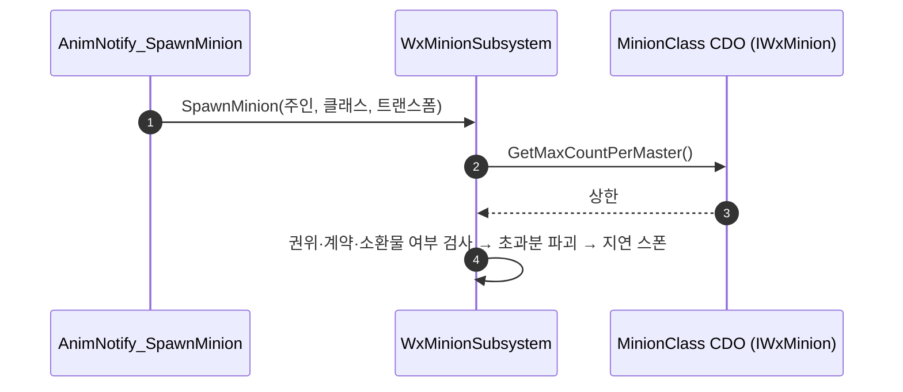

# 소환물 상한을 소환물 클래스가 선언하도록 이관

## 계획

### 목표
`UWxAnimNotify_SpawnMinion::MaxMinionCount`(TODO 표시됨)를 소환물 클래스로 옮긴다. 상한은 주인 로스터 전체에 걸리는 정책인데 저작 지점이 소환 노티파이마다 하나씩이라, 노티파이가 늘면 같은 사실이 흩어져 어긋난다. 노티파이에는 "무엇을·어디에"만 남긴다.

### 수정 범위
| 파일 | 수정할 내용 | 구분 |
|---|---|---|
| `Plugins/WxCombat/.../Public/Minion/WxMinion.h` | `IWxMinion` 인터페이스. `GetMaxCountPerMaster()` 순수 가상 하나 | 신규 |
| `Plugins/WxCombat/.../Public/AnimNotify/WxAnimNotify_SpawnMinion.h` | `MaxMinionCount`·TODO 제거, `MustImplement`를 `/Script/WxCombat.WxMinion`으로 교체 | 수정 |
| `Plugins/WxCombat/.../Private/AnimNotify/WxAnimNotify_SpawnMinion.cpp` | 상한 인자 제거 | 수정 |
| `Plugins/WxCombat/.../Public/Minion/WxMinionSubsystem.h` | `SpawnMinion` 파라미터 제거, 주석 갱신 | 수정 |
| `Plugins/WxCombat/.../Private/Minion/WxMinionSubsystem.cpp` | 소환 클래스 CDO 에서 상한을 읽어 기존 정리 계산에 사용, 미구현 클래스는 경고 후 중단 | 수정 |
| `Source/WxGame/Character/WxEnemyCharacter.{h,cpp}` | `IWxMinion` 구현, `MaxCountPerMaster`(기본 1, ClampMin 1)를 `MasterStateTag` 옆에 추가 | 수정 |

### 접근 방식
- **계약은 소비 도메인(WxCombat)에**: 값을 읽는 쪽이 WxCombat 이고 WxGame 이 이미 WxCombat 을 공개 의존하므로, `IWxSpawnable`(WxWorld) 을 `AWxEnemyCharacter` 가 구현하는 것과 같은 방향으로 둔다. WxCombat 은 여전히 WxGame 타입을 모른다.
- **읽는 시점은 스폰 직전, 대상은 CDO**: `MinionClass.GetDefaultObject()` 를 `IWxMinion` 으로 캐스트한다. 이미 손에 든 `MinionClass` 하나로 끝난다.
- **정리 계산은 그대로**: 읽어 온 값을 기존 `FMath::Clamp` 계산에 그대로 넣는다. 로스터 구조와 "가장 오래된 것부터 파괴" 는 손대지 않는다.
- **픽커 필터를 소환물 계약으로**: `MustImplement` 는 인터페이스 하나만 받으므로(엔진 `SPropertyEditorClass.cpp` 의 `GetClassMetaData`), 이제 필수가 된 `IWxMinion` 을 건다. 팀 인터페이스 요구는 서브시스템의 기존 런타임 검사·경고가 그대로 지키고, 같은 모양의 `IWxMinion` 검사를 하나 더한다.
- **`MaxMinionCount <= 0` 조기 반환 삭제**: 도플갱어가 상한 0 으로 재소환을 막던 통로였는데 지금은 "로스터에 소환물로 올라 있으면 소환자가 될 수 없다" 가 그 일을 한다. 새 프로퍼티는 `ClampMin=1` 이라 0 이 들어올 통로도 없다.

### 조사로 확인한 사실
- 호출 경로는 노티파이 → `UWxMinionSubsystem::SpawnMinion` 하나뿐이다.
- `AM_Skill_SpawnMinion`·`AM_Attack_LLLL` 두 몽타주가 이 노티파이를 들고 있고, 둘 다 `MaxMinionCount` 를 직렬화하지 않았다 = 현재 값은 기본값 1. 새 프로퍼티 기본값 1 이면 에셋 작업 없이 동작이 같다.

---

## 완료

### 수정한 파일
| 파일 | 수정한 내용 | 구분 |
|---|---|---|
| `Plugins/WxCombat/.../Public/Minion/WxMinion.h` | `IWxMinion` — `GetMaxCountPerMaster()` 하나짜리 소환물 계약 | 신규 |
| `Plugins/WxCombat/.../Public/AnimNotify/WxAnimNotify_SpawnMinion.h` | `MaxMinionCount`·TODO 제거, `MustImplement` 를 `WxMinion` 으로 교체, 클래스 주석 갱신 | 수정 |
| `Plugins/WxCombat/.../Private/AnimNotify/WxAnimNotify_SpawnMinion.cpp` | 상한 인자 제거 | 수정 |
| `Plugins/WxCombat/.../Public/Minion/WxMinionSubsystem.h` | `SpawnMinion` 파라미터 제거, 주석 갱신 | 수정 |
| `Plugins/WxCombat/.../Private/Minion/WxMinionSubsystem.cpp` | 소환 클래스 CDO 에서 상한을 읽고, `IWxMinion` 미구현 클래스는 경고 후 중단. `MaxMinionCount <= 0` 조기 반환 삭제 | 수정 |
| `Source/WxGame/Character/WxEnemyCharacter.{h,cpp}` | `IWxMinion` 구현, `MaxCountPerMaster`(EditDefaultsOnly, 기본 1) 를 `MasterStateTag` 옆에 추가 | 수정 |

### 구현·결정과 그 이유
- **계약은 소비 도메인인 WxCombat 에**: 값을 읽는 쪽이 WxCombat 이고 WxGame 이 WxCombat 을 공개 의존하므로, 계약을 WxCore 로 올릴 이유가 없다. `IWxSpawnable`(WxWorld) 을 `AWxEnemyCharacter` 가 구현하는 것과 같은 방향이고, WxCombat 은 여전히 WxGame 타입을 모른다.
- **인스턴스가 아니라 CDO 에서 읽는다**: 상한은 종류마다 고정이라 인스턴스별로 달라질 이유가 없고, 스폰 전에 이미 손에 든 `MinionClass` 하나로 끝난다.
- **픽커 필터를 소환물 계약으로 옮겼다**: `MustImplement` 는 엔진이 `GetClassMetaData` 로 클래스 하나만 읽어 인터페이스 둘을 동시에 걸 수 없다. 이제 상한 선언이 필수이므로 그쪽을 픽커에 걸고, 팀 인터페이스 요구는 서브시스템의 기존 런타임 검사·경고가 계속 지킨다. 같은 모양의 `IWxMinion` 검사를 하나 더해 두 계약 모두 런타임에서 걸러진다.
- **`MaxMinionCount <= 0` 조기 반환 삭제**: 도플갱어가 상한 0 으로 재소환을 막던 통로였는데, 지금은 "로스터에 소환물로 올라 있으면 소환자가 될 수 없다" 가 그 일을 한다. 새 프로퍼티는 `ClampMin=1` 이고 설령 0 이 와도 기존 `FMath::Clamp` 계산이 "전부 정리 후 1마리" 로 수렴한다.

### 계획 대비 달라진 점
- 계획대로.

### 검증
- UE 5.8 `WxEditor Win64 Development` 빌드 성공(`Result: Succeeded`). 로그: `.claude/skills/build-doctor/logs/build_2026-09-08_103416.log`
- `MaxMinionCount` 잔여 참조 0건, `git diff --check` 통과.
- 에셋 조사: 소환 노티파이를 쓰는 몽타주는 `AM_Skill_SpawnMinion`·`AM_Attack_LLLL` 둘이고, 둘 다 `BP_Minion`(`AWxEnemyCharacter` 파생) 을 가리키며 `MaxMinionCount` 를 직렬화하지 않았다 = 값이 기본 1 이었다. 새 프로퍼티 기본값도 1 이라 에셋 작업 없이 동작이 같다.
- PIE 미실시.

### 후속 과제
- 상한은 이관 후에도 **주인의 로스터 전체**에 걸린다. 한 주인이 두 종류를 동시에 부리게 되면 A 의 상한이 B 까지 파괴하므로, 그때는 같은 클래스만 세고 정리하도록 바꿔야 한다.
- PIE 확인: 소환 → 재소환 시 기존 소환물 교체, 주인 제거 시 소환물 파괴, 노티파이 `MinionClass` 픽커에 `BP_Minion` 이 계속 보이는지, `BP_Minion` 디테일에 `Max Count Per Master` 가 보이는지.
