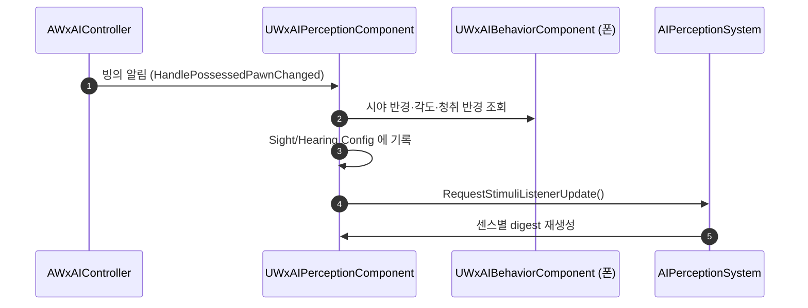

# WxAIBehaviorComponent 를 WxAI 로 이관하고 시야·청각 수치를 그 위에 노출

## 계획

### 목표
시야 반경·시야각·청취 반경이 `UWxAIPerceptionComponent` 생성자 상수라 모든 AI 가 같은 감각을 쓴다. 폰마다 다른 AI 설정을 이미 쥔 `UWxAIBehaviorComponent` 를 WxAI 로 옮기고, 그 위에 거리·각도 수치를 노출해 적 BP 별로 조정할 수 있게 한다.

### 수정 범위
| 파일 | 수정할 내용 | 구분 |
|---|---|---|
| `Plugins/WxAI/.../Public/WxAIBehaviorComponent.h`, `Private/WxAIBehaviorComponent.cpp` | WxGame 에서 이동(`git mv`), 감각 수치 3개 + Getter 추가 | 이동·수정 |
| `Source/WxGame/Character/Component/WxAIBehaviorComponent.h/.cpp` | 위로 이동 | 삭제 |
| `Plugins/WxAI/.../WxAIPerceptionComponent.h/.cpp` | 생성자 상수 제거, 폰에서 수치를 읽어 적용 | 수정 |
| `Source/WxGame/Character/WxEnemyCharacter.cpp`, `Controller/WxAIController.cpp` | include 경로 갱신 | 수정 |
| `Config/DefaultEngine.ini` | 클래스 CoreRedirect 추가 | 수정 |

### 접근 방식
- **모듈 이관**: `git mv` 로 이력 유지, `WXGAME_API` → `WXAI_API`. 부착 대상 검사는 WxGame 타입을 못 쓰므로 `APawn` 기준으로 바꾸고 로그도 `LogWxAI` 로 옮긴다.
- **에셋 참조 보존**: 5개 적 BP 와 배치 액터 1건이 이 클래스를 참조하므로 `Config/DefaultEngine.ini` 에 `[CoreRedirects]` 를 신설해 `/Script/WxGame...` → `/Script/WxAI...` 를 잇는다.
- **노출 수치 3개**: 시야 반경, 시야각(편측), 청취 반경. `LoseSightRadius` 는 시야 반경에서 파생(히스테리시스 없음 유지), 자극 수명·피아 필터는 시스템 상수로 둔다.
- **퍼셉션이 직접 읽는다(Pull)**: 컨트롤러가 밀어 넣는 대신 퍼셉션이 폰의 컴포넌트를 찾아 적용한다. 이미 있는 `HandlePossessedPawnChanged` 와 `BeginPlay` 두 지점에 얹어 새 통로를 만들지 않는다.
- **기본값 단일 출처**: 기본값은 컴포넌트 필드 초기값에만 두고, 컴포넌트가 없는 폰에는 클래스 기본값(CDO)을 적용한다.
- **런타임 반영**: 값을 쓴 뒤 `RequestStimuliListenerUpdate()` 로 리스너를 갱신해야 각 센스가 설정을 다시 읽어 내부 수치 캐시를 재생성한다.

---

## 완료

### 수정한 파일
| 파일 | 수정한 내용 | 구분 |
|---|---|---|
| `Plugins/WxAI/.../Public/WxAIBehaviorComponent.h`, `Private/WxAIBehaviorComponent.cpp` | WxGame 에서 이동, 시야 반경·시야각·청취 반경 + Getter 추가, 부착 검사를 `APawn` 기준으로 | 이동·수정 |
| `Source/WxGame/Character/Component/WxAIBehaviorComponent.h/.cpp` | 위로 이동 | 삭제 |
| `Plugins/WxAI/.../WxAIPerceptionComponent.h/.cpp` | 생성자의 거리·각도 상수 제거, `ApplySenseSettings(const APawn*)` 추가 | 수정 |
| `Source/WxGame/Character/WxEnemyCharacter.cpp`, `Controller/WxAIController.cpp` | include 경로 갱신 | 수정 |
| `Config/DefaultEngine.ini` | `[CoreRedirects]` 신설, 클래스 경로 리다이렉트 1건 | 수정 |

### 구현·결정과 그 이유
- **퍼셉션이 폰에서 읽어 간다**: 컨트롤러가 값을 밀어 넣으면 통로가 하나 더 생긴다. 퍼셉션은 이미 폰 교체를 `HandlePossessedPawnChanged` 로 듣고 있어, 그 자리와 첫 폰 따라잡기용 `BeginPlay` 두 곳에 얹는 것으로 끝났다. 컨트롤러는 include 경로만 바뀌었다.
- **기본값은 컴포넌트에만**: 퍼셉션 생성자에 같은 숫자를 남겨 두면 두 곳이 갈라진다. 컴포넌트가 없는 폰에는 CDO 값을 적용해, 기본값 출처를 하나로 두면서 이전 폰의 수치가 남는 것도 막았다.
- **`RequestStimuliListenerUpdate()` 로 반영**: 엔진은 센스 설정 변경을 스스로 알아채지 못하고, 각 센스가 리스너 갱신 때 설정을 다시 읽어 판정용 수치 캐시를 만든다. 미등록 리스너·월드 없음 상황에서도 안전하게 무시된다.
- **`LoseSightRadius` 는 노브로 만들지 않음**: 시야 반경에서 그대로 파생시켰다. 반경 경계의 흔들림은 리시 복귀가 다룬다는 기존 결정을 유지한다.
- **에셋 리다이렉트**: 모듈이 바뀌면 클래스 경로가 달라져 적 BP 5종과 배치 액터 1건의 컴포넌트 참조가 끊긴다. `[CoreRedirects]` 를 신설해 옛 경로를 이었다.

### 계획 대비 달라진 점
- 계획대로. (감각 수치를 담을 별도 구조체는 컴포넌트를 WxAI 로 옮기면서 불필요해져 필드 3개 + Getter 로 끝냈다.)

### 후속 과제
- 에디터에서 적 BP 를 열어 리다이렉트가 걸린 컴포넌트가 기존 BehaviorTree 지정을 유지하는지 확인이 필요하다(빌드까지만 검증함).
- WxAI·WxGame README 는 다음 정기 갱신에서 컴포넌트 이동을 반영하면 된다.
