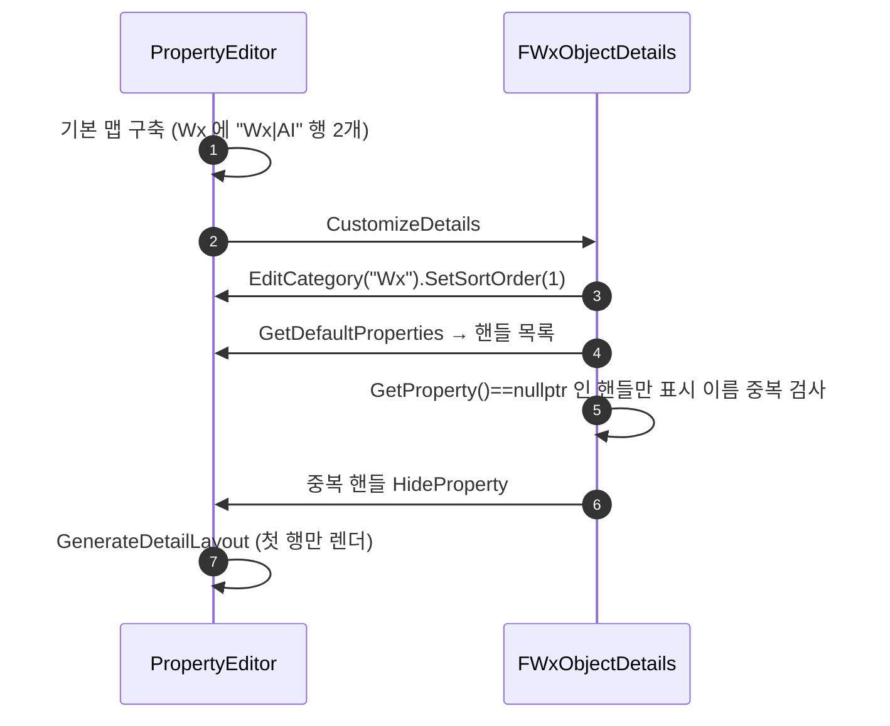

# 클래스 디폴트에서 Wx 하위 카테고리가 두 번 표시되는 문제 해결

## 계획

### 목표
적 BP 의 Class Defaults 에서 `Wx` 아래 "AI" 하위 카테고리가 두 번 나오고 둘 다 `Behavior Tree Asset`(컴포넌트 값) + `Is Boss`(액터 값) 를 똑같이 보여준다. 액터+컴포넌트 값이 한 하위 카테고리로 병합되는 표시는 유지하고, 같은 이름의 하위 카테고리 행만 하나로 줄인다. 카테고리 이름 규약이나 각 액터 수정 없이 전역 한 곳에서 해결한다.

### 원인 (UE 5.8 PropertyEditor 소스로 확인)
`FWxObjectDetails` 의 정렬 커스터마이제이션은 원인이 아니다. 엔진이 기본 레이아웃을 만드는 단계에서 이미 중복 행이 생기고, 정렬은 그 뒤에 카테고리 객체를 맵 사이로 옮기기만 한다. 커스터마이제이션 도입 커밋(3605d9cb, 09-04) 이전에도 `Wx|Visual`(MetaHumanComponent) 충돌이 존재했다.

액터의 `VisibleAnywhere` 컴포넌트 포인터가 컴포넌트 프로퍼티를 액터 패널에 인라인하는 경로에서 생긴다.
1. `UActorComponent` 는 `DefaultToInstanced` 라 UHT 가 포인터에 `EditInline` 메타를 붙이지만(`UhtObjectProperty.cs`), `VisibleAnywhere`(= `CPF_EditConst`) 라 `SPropertyEditorEditInline::Supports` 가 false → `DetailLayoutHelpers::UpdateSinglePropertyMapRecursive` 는 포인터를 EditInline 행이 아니라 재귀 대상으로 취급한다(`IsVisibleStandaloneProperty` 도 자식 1개라 false → 행으로도 안 붙음).
2. 재귀로 들어간 컴포넌트의 `FObjectPropertyNode` 는 부모에서 `ShowCategories` 를 상속받아(`FPropertyNode::InitNode`) 자기만의 카테고리 노드 트리 `Wx → Wx|AI → Wx|AI|Perception` 을 만든다(`FObjectPropertyNode::InternalInitChildNodes`).
3. `UpdateSinglePropertyMapRecursive` 의 카테고리 노드 분기는 `|` 가 있는 노드를 만날 때마다 이름 중복 검사 없이 `DefaultCategory(부모).AddPropertyNode(카테고리노드)` 로 부모에 행을 추가한다. 루트 트리의 `Wx|AI` 와 컴포넌트 트리의 `Wx|AI` 가 각각 `Wx` 에 들어가 행 2개가 된다. 리프 프로퍼티는 이름 기반 `DefaultCategory("Wx|AI")` 로 합쳐지므로 내용은 하나로 병합된다.
4. 두 행 모두 `FDetailPropertyRow::OnGenerateChildren` → `GetSubCategoryImpl("Wx|AI")` 로 같은 병합 카테고리를 그리므로 내용이 동일하게 두 번 보인다. 행 추가 순서(루트 `Wx|AI` → 컴포넌트 `Wx|AI` → 루트 `Wx|UI`)도 스크린샷의 AI, AI, UI 순서와 일치한다.

조건은 "액터 자체(또는 조상)의 `Wx|X` 와 인라인된 컴포넌트의 `Wx|X` 가 같은 X" 다. 전수 조사 결과 5개 클래스:

| 클래스 | 중복 하위 카테고리 | 출처 |
|---|---|---|
| `AWxEnemyCharacter` | `Wx\|AI`, `Wx\|Visual` | 자체 + `AIBehaviorComponent`, `MetaHumanComponent` |
| `AWxCharacterBase` / `AWxPlayerCharacter` | `Wx\|Visual` | 자체 + `MetaHumanComponent` |
| `AWxNpc` | `Wx\|Dialogue`, `Wx\|Visual` | 자체 + `DialogueComponent`, `MetaHumanComponent` |
| `AWxDialogueActor` | `Wx\|Dialogue` | 자체 + `DialogueComponent` |

### 수정 범위
| 파일 | 수정할 내용 | 구분 |
|---|---|---|
| `Source/WxEditor/WxObjectDetails.h` | 클래스 주석에 하위 카테고리 중복 행 제거 책임 추가. `MoveWxCategoryToTop` → `CustomizeWxCategory` 이름 변경(정렬 + 중복 제거 두 일) | 수정 |
| `Source/WxEditor/WxObjectDetails.cpp` | `CustomizeWxCategory`: 존재 확인 → `EditCategory(Wx)` 빌더로 `SetSortOrder` → `GetDefaultProperties` 순회, `GetProperty()==nullptr` 인 핸들의 표시 이름을 기억하고 이미 본 이름이면 `HideProperty(Handle)`. `PropertyHandle.h` include | 수정 |

### 접근 방식
- **기존 "Object" 커스터마이제이션에 같은 이름의 하위 카테고리 행 숨기기를 덧붙인다**: 커스터마이제이션은 기본 맵 구축 후, 최종 레이아웃 생성 전에 실행되므로 이 시점의 `Wx` 에는 중복 행이 모두 들어 있다.
- **하위 카테고리 행 식별**: `IDetailCategoryBuilder::GetDefaultProperties` 는 `Wx` 의 기본 행 전부를 `IPropertyHandle` 로 돌려주며, 하위 카테고리 행은 프로퍼티가 없는 핸들(`GetProperty() == nullptr`, `FPropertyHandleBase`) 로 온다. 리프·컴포넌트 인스턴스 프로퍼티는 모두 프로퍼티가 있다. 핸들의 `GetPropertyDisplayName()` 은 리프 이름("AI") 이고 같은 부모 안에서는 전체 이름을 유일하게 대표한다.
- **숨기기**: 두 번째부터 `IDetailLayoutBuilder::HideProperty(Handle)` → 카테고리 노드에 `IsCustomized` → `FDetailCategoryImpl::GenerateNodesFromCustomizations` 가 건너뛴다. 남은 첫 행이 병합 내용을 그대로 보여준다.

### 배제한 대안
- **카테고리 이름 규약**(액터 자체 프로퍼티와 컴포넌트가 같은 `Wx|X` 금지): 5곳 즉시 수정 + 누구나 어길 수 있는 규약. `Is Boss` 를 `Behavior Tree Asset` 옆에 두는 병합 표시가 바람직하므로 규약이 표시를 나쁘게 만든다.
- **컴포넌트 클래스 `CollapseCategories`**: 컴포넌트 자신의 디테일에서도 카테고리가 사라지고, `Wx|AI|Perception` 같은 3단 하위는 붙을 행이 없어 안 보인다.
- **포인터에 `ShowInnerProperties` 메타**: 행 자식 생성 중 `GetSubCategoryImpl` 이 같은 카테고리의 `GenerateLayout()` 을 재진입 호출하는 구조라 무한 재귀 위험.
- **`VisibleAnywhere` 제거**: 클래스 디폴트 인라인 표시 자체를 잃는다.

### 취약점
- 하위 카테고리 행이 프로퍼티 없는 핸들로 노출되는 것은 엔진 내부 표현에 기댄 것. 4.x 이후 유지된 구조이고 5.8 소스로 확인했으나 문서화된 계약은 아니다. 엔진 업그레이드 시 육안 재확인 항목.
- 3단 하위(`Wx|AI|Perception`) 가 두 컴포넌트에서 겹치면 못 잡는다. 하위 카테고리 빌더는 `EditCategory` 없이는 접근할 수 없고, 하면 최상위로 튀어나온다. 현재 해당 사례 없음.

---

## 완료

### 수정한 파일
| 파일 | 수정한 내용 | 구분 |
|---|---|---|
| `Source/WxEditor/WxObjectDetails.h` | 클래스 주석에 중복 행 제거 책임과 원인 한 줄 추가. `MoveWxCategoryToTop` → `CustomizeWxCategory` | 수정 |
| `Source/WxEditor/WxObjectDetails.cpp` | `CustomizeWxCategory`: 존재 확인 → `EditCategory(Wx)` 빌더로 정렬값 지정 → `GetDefaultProperties` 중 프로퍼티 없는 핸들(하위 카테고리 행)의 표시 이름을 기억해 겹치는 두 번째부터 `HideProperty`. `PropertyHandle.h` include | 수정 |

### 구현·결정과 그 이유
- **전역 한 곳에서 해결**: 원인이 엔진의 기본 레이아웃 구축(인라인된 컴포넌트의 카테고리 트리를 이름으로 합치지 않음)이라 액터마다 카테고리 이름을 피하는 규약은 누락 위험이 있고, 액터·컴포넌트 값이 한 하위 카테고리로 병합되는 바람직한 표시를 망친다. 이미 모든 오브젝트에 걸리는 "Object" 커스터마이제이션에 얹었다.
- **하위 카테고리 행 식별을 "프로퍼티 없는 핸들"로**: 카테고리 노드는 `IPropertyHandle` 에 대응되는 유일한 프로퍼티 없는 행이고, 리프·컴포넌트 인스턴스 프로퍼티는 전부 프로퍼티가 있다. 같은 부모 `Wx` 안에서는 리프 표시 이름이 전체 이름을 대표하므로 이름만 비교한다.
- **첫 행을 남기고 이후를 숨김**: 두 행 모두 같은 병합 카테고리(`GetSubCategoryImpl`)를 그리므로 어느 쪽을 남겨도 내용이 같다. 첫 행이 정렬 위치·펼침 상태·검색을 그대로 이어받는다.
- **함수 이름 변경**: 정렬과 중복 제거 두 일을 하므로 `MoveWxCategoryToTop` 이 거짓말이 되어 `CustomizeWxCategory` 로 바꿨다. 두 단계 모두 "Wx 존재 확인" 뒤에 와야 해서 한 함수에 인라인했다.

### 계획 대비 달라진 점
- 계획대로. `WxEditor` 모듈 컴파일·링크 성공(경고 없음). 다만 전체 `WxEditor` 타겟 빌드는 병행 중인 미커밋 변경(`WxAbilityBase.h` 에서 `ValidateInstantBlendIn` 제거) 을 아직 참조하는 `WxAbility_GuardReact.cpp` 때문에 `WxCombat` 에서 실패했다. 본 변경과 무관하고 남의 작업 중 파일이라 손대지 않았다.

### 후속 과제
- 에디터 육안 확인: `BP_Enemy` Class Defaults 에서 `Wx > AI` 가 한 번만 나오고 `Behavior Tree Asset`·`Perception`·`Is Boss` 가 모두 그 안에 있는지, `Wx > Visual` 과 NPC 의 `Wx > Dialogue` 도 한 번씩인지, 컴포넌트를 직접 선택했을 때 `Wx|AI|Perception` 이 여전히 보이는지.
- 3단 하위 카테고리(`Wx|AI|Perception`) 가 두 컴포넌트에서 겹치는 사례가 생기면 그 중복은 이 방식으로 못 잡는다(하위 카테고리 빌더는 `EditCategory` 없이 접근 불가). 현재 사례 없음.
- 엔진 업그레이드 시 카테고리 행이 여전히 프로퍼티 없는 핸들로 `GetDefaultProperties` 에 오는지 재확인.
