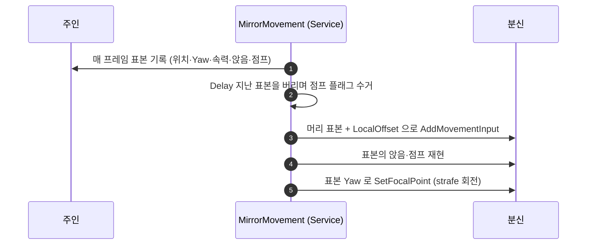

# 도플갱어 — 주인 옆에 붙어 지연 추적으로 이동을 따라한다

## 계획

### 목표
`UWxBTTask_MirrorAbility` 가 어빌리티는 따라하지만 걷기·달리기·점프·앉기는 따라하지 않는다. 이것들은 어빌리티가 아니라 `ACharacter`/CMC 의 네이티브 상태이기 때문이다.
데빌 메이 크라이의 버질 도플갱어처럼 분신이 주인 옆 정해진 자리를 지키며 같은 방향을 보고 같은 동작을 하도록, 주인의 자취를 기록해 `Delay` 초 뒤에 되밟게 한다.

### 수정 범위
| 파일 | 수정할 내용 | 구분 |
|---|---|---|
| `Plugins/WxAI/.../Public/WxBTService_MirrorMovement.h` | 서비스 선언, 표본 구조체 `FWxTrailSample`, 노드 메모리, 저작 프로퍼티 | 신규 |
| `Plugins/WxAI/.../Private/WxBTService_MirrorMovement.cpp` | 기록·재생·시선 구현 | 신규 |

### 접근 방식
- **자취를 기록하고 지연 재생한다**: 매 프레임 주인의 표본(시각·위치·Yaw·속력·앉음·이 프레임에 떴는가)을 링 버퍼에 넣고, `Delay` 보다 오래된 것은 버린다. 버퍼의 머리가 곧 지금 재생할 표본이다.
- **설 자리는 주인의 로컬 프레임에서 민다**: `목표 = 표본 위치 + FRotator(0, 표본 Yaw, 0).RotateVector(LocalOffset)`. 주인이 밟은 길을 옆으로 평행 이동한 자리라 벽·낭떠러지 위험이 낮다.
- **태스크가 아니라 서비스인 이유**: 태스크는 "지금 하는 단 하나의 배타적 행동", 서비스는 "브랜치가 사는 동안 계속 참인 것"이다. 이동을 태스크로 내리면 어빌리티 미러가 브랜치를 쥔 동안 분신이 멈추고 자취에 구멍이 난다. `UWxBTService_LockOn` 이 조준 자세를 유지하는 동안 공격은 태스크로 오가는 기존 분업과 같은 선이다.
- **질주 속도는 코드 없이 재현된다**: 입력 스케일이 `기록 속력 / 내 상한` 이므로, 분신의 속도 상한을 주인의 질주 속도까지 올려 두면 걷기·달리기·질주가 기록된 속력 그대로 나온다. `MaxWalkSpeed` 직접 대입은 하지 않는다.
- **모든 재생 규칙은 상태 캐시 없이 차이를 메운다**: 앉음은 매 틱 `Crouch()`/`UnCrouch()`, 점프는 표본의 1회성 플래그를 소비, 시선은 표본 Yaw 로 포커스를 세운다.

### 저작 프로퍼티
| 이름 | 기본값 | 뜻 |
|---|---|---|
| `MirrorTarget` | `Master` | 따라할 대상 (Object 키) |
| `LocalOffset` | `(0, -120, 0)` | 주인 로컬 기준 설 자리. X 는 앞뒤, Y 는 좌우 |
| `Delay` | `0.5` | 몇 초 전 주인을 재현하는가 |
| `ArrivalRadius` | `60.0` | 이 안이면 입력을 넣지 않는다 |
| `CatchUpDistance` | `400.0` | 이보다 벌어지면 기록 속력을 무시하고 전력으로 붙는다 |
| `bMirrorFacing` | `true` | 주인이 보던 방향을 따라 본다 |

### 조사로 확인한 사실
- 속도는 SPD 어트리뷰트가 클래스 기본 `MaxWalkSpeed` 에 곱해져 정해진다(`WxCharacterBase.cpp:208`). 질주는 SPD 에 1.5 배를 거는 어빌리티다(`WxAbility_Sprint.cpp:14`).
- 공중 여부는 `Movement.InAir` 루즈 태그로 발행되지만 점프 시작 시점은 알려주지 않아, 기록에는 CMC 를 직접 본다.
- `WxAI` 는 `WxCombat` 을 참조하지 않는다. 이 서비스는 엔진 타입만 만지므로 경계를 지킨다.
- 블랙보드 `Master` 는 `AWxAIController::OnPossess` 가 이미 채운다(`WxAIController.cpp:61`).

### 남는 취약점
- 서비스는 루트 컴포지트에 붙여야 한다. 하위 브랜치에 붙이면 그 브랜치가 쉴 때 기록이 끊긴다.
- `bMirrorFacing` 은 `Lock On` 과 컨트롤러 포커스·회전 모드를 두고 다툰다. 한 트리에 함께 쓰지 않는다.
- AI 는 `NavAgentProps.bCanCrouch` 가 꺼져 있어 앉기가 조용히 무시된다. 2단 점프와 속도 상한도 BP 저작이 필요하다.

---

## 완료

### 수정한 파일
| 파일 | 수정한 내용 | 구분 |
|---|---|---|
| `Plugins/WxAI/.../Public/WxBTService_MirrorMovement.h` | 표본 구조체 `FWxTrailSample`, 노드 메모리 `FWxMirrorMovementMemory`, 서비스 선언과 저작 프로퍼티 6개 | 신규 |
| `Plugins/WxAI/.../Private/WxBTService_MirrorMovement.cpp` | 기록·지연 재생·이동 입력·앉기·점프·시선 구현 | 신규 |

### 구현·결정과 그 이유
- **점프는 표본에 실어 한 번만 소비한다**: 맨 앞 표본은 여러 틱에 걸쳐 재생되므로 그대로 두면 매 틱 점프한다. 재생할 때 플래그를 지워 1회성으로 만들고, 한 틱에 여러 표본이 한꺼번에 버려질 때는 버리면서 플래그를 수거해 넘긴다 — 프레임이 길어져도 점프를 통째로 놓치지 않는다.
- **점프 판정에 상승 여부를 넣었다**: 공중이라는 사실만 보면 낭떠러지에서 걸어 떨어진 것도 점프가 된다. 지상에서 뜨는 순간에 Z 속도가 양수여야 스스로 뛴 것으로 본다.
- **재생 규칙에 상태 캐시를 두지 않았다**: 앉기는 매 틱 표본을 그대로 따라 `Crouch()`/`UnCrouch()` 를 부른다. 앉기 의사만 세우는 호출이라 반복이 무해하고, "직전에 앉아 있었는가" 를 들고 있을 이유가 없다. 점프만 1회성이라 예외다.
- **이동 입력 스케일을 상한 대비 비율로 잡았다**: 기록된 속력을 그대로 내는 값이 곧 그 비율이다. 덕분에 걷기·달리기·질주가 코드 없이 재현되고, 질주 어빌리티를 따라 켤 필요도 없다. 대신 폰의 속도 상한이 대상보다 낮으면 그만큼 뒤처지므로 BP 저작 항목으로 남는다.
- **속도 상한은 `GetMaxSpeed()` 로 읽는다**: `MaxWalkSpeed` 를 직접 보면 앉은 상태의 상한을 놓친다. 앉아 이동할 때도 비율이 맞아떨어진다.
- **폰 교체 처리를 포커스 설정보다 앞에 뒀다**: 뒤에 두면 `ReleaseFacing` 의 `ClearFocus` 가 같은 틱에 방금 세운 포커스를 지워, 한 프레임 시선이 풀린다.
- **회전 모드 원복은 아키타입에서 읽는다**: `UWxBTService_LockOn` 과 같은 이유로 상수를 쓰지 않는다. 평상시 회전 모드는 폰마다 다를 수 있다.
- **대상이 사라지면 자취를 비운다**: 남겨 두면 대상이 돌아왔을 때 낡은 자리로 한 번 달려간다.

### 계획 대비 달라진 점
- 계획대로.

### 검증
- UE 5.8 `WxEditor Win64 Development` 빌드 성공(`Result: Succeeded`). 로그: `.claude/skills/build-doctor/logs/build_2026-09-09_194958.log`
- PIE 미실시 — 도플갱어 BP·전용 행동트리가 아직 없다.

### 후속 과제
- 에셋 저작: `BT_Doppelganger` 루트 컴포지트에 `Mirror Movement` 부착(하위 브랜치에 붙이면 기록이 끊긴다), 추종 브랜치는 `Wait 0.05` 로 축소.
- BP 저작: `JumpMaxCount 2`, `MaxWalkSpeed 750`(주인의 질주 속도). 앉기 설정은 공용 CMC 기본값으로 내렸다(2026-09-09 크라우치 기본값 CMC 이관).
- 애니메이션: `bMirrorFacing` 이 strafe 회전을 쓰므로 옆걸음 블렌드가 없으면 이동이 어색하다.
- PIE 확인: 오프셋 자리 유지와 주인 회전 시 자리 동반 회전, 걷기·질주 속도 재현, 점프 지점 재현, 앉은 이동, 낭떠러지 낙하에서 반복 점프 없음, 어빌리티 미러가 브랜치를 쥔 동안에도 추적 지속, 주인 소실 시 정지.
